# Programmation JAVA
### Sommaire

* [Présentation](#presentation)
* [Les certifications Java](#certif)
* [Les outils de développement](#outils)
* [Votre premier programme](#hello)
* [Récupérer ce que vous tapez](#scanner)
* [Les conditions](#conditions)
* [Les boucles](#boucles)
* [Votre première classe](#classe)
* [L'héritage](#heritage)
* [Le polymorphisme](#polymorphisme)
* [Modéliser ses objets grâce à UML](#uml)
* [Les classes abstraites](#abstraites)
* [Les interfaces](#interfaces)
* [Les exceptions](#exceptions)
* [Les collections d'objets](#collections)
* [Les flux d'entrée/sortie](#flux)
* [L'objet JFrame](#jframe)

### <a name="presentation">Présentation</a>

Développé par Sun Microsystems, présenté officiellement le 23 mai 1995.
La société Sun a été ensuite rachetée en 2009 par la société Oracle qui détient et maintient désormais Java.
Une de ses plus grandes forces est son excellente portabilité : une fois votre programme créé, il fonctionnera automatiquement sous Windows, Mac, Linux, etc.

Il permet de développer :

* des applications, sous forme de fenêtre ou de console.
* des applets, qui sont des programmes Java incorporés à des pages web.
* des applications pour appareils mobiles.
* et bien d'autres ! J2EE pour les applications d'entreprise, JMF pour le traitement vidéo, J3D pour la 3D...

### <a name="certif">Les certifications Java</a>
Pour être certifié Java SE 7, vous devez passer ces 2 examens :

* 1Z0-803 Oracle Certified Associate, Java SE 7 Programmer I.
* 1Z0-804 Oracle Certified Professional , Java SE 7 Programmer II.


### Les certifications J2ee


### <a name="outils">Les outils de développement</a>
Pour commencer à utiliser Java, il suffit d'installer le JDK (Java Development Kit) disponible à l'adresse suivante : [www.oracle.com/technetwork/java/javase/downloads](http://www.oracle.com/technetwork/java/javase/downloads/index.html)


Cochez la case : « Accept License Agreement » puis cliquez sur le lien correspondant à votre système d'exploitation (x86 pour un système 32 bits et x64 pour un système 64 bits).

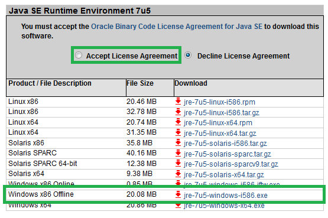

### Compilation en ligne de commande

* Mettre à jour la variable d’environnement « PATH ». C'est grâce à elle que Windows trouve des exécutables sans  qu'il soit nécessaire de lui spécifier le chemin d'accès complet.
* Allez dans le répertoire de votre premier programme et effacez le « .class ». Ensuite, faites « Démarrer > Exécuter » (ou encore touche « Windows + R » et tapez « cmd ».
* Maintenant, vous pouvez créer votre fichier « .class » en exécutant la commande suivante :

```java
javac <nomDeFichier.java>
```

* Vous pouvez lancer votre programme Java en faisant ce qui suit :

```java
java <nomFichierClassSansExtension>
```

### Eclipse IDE
Eclipse IDE est un environnement de développement libre permettant de créer des programmes dans de nombreux langages de programmation (Java, C++, PHP…). C'est l'outil que nous allons utiliser pour programmer. Eclipse IDE est disponible en téléchargement à l'adresse suivante : [http://www.eclipse.org/downloads/eclipse-packages](http://www.eclipse.org/downloads/eclipse-packages/)

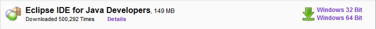

### Créer un nouveau projet Java.

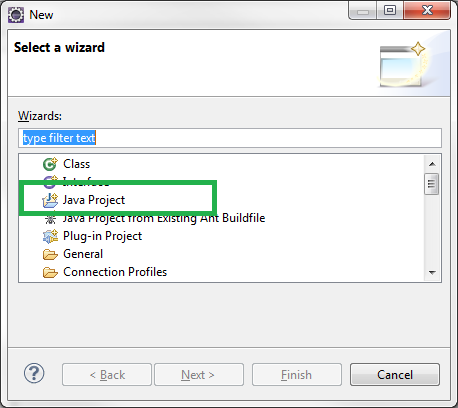

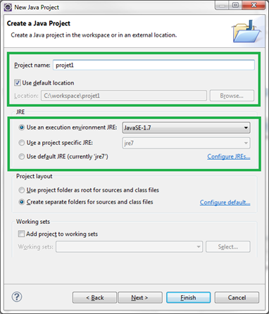

Vous devriez avoir un nouveau projet dans la fenêtre de gauche, comme à la figure suivante.

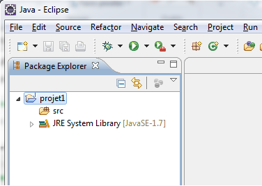

Ajoutons une nouvelle classe dans ce projet.

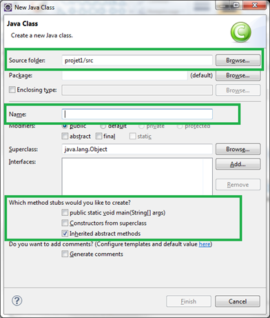

Cochez la case : « public static void main(String[] args) ».

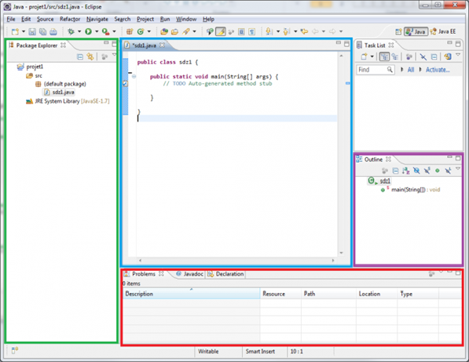

### <a name="hello">Votre premier programme</a>
Tous les programmes Java sont composés d'au moins une classe. Elle doit contenir une méthode appelée « main »: ce sera le point de démarrage de notre programme.

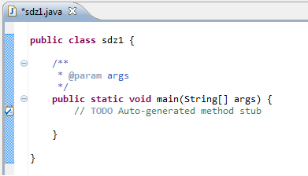

### Les commentaires

```java
public static void main(String[] args){
  //Un commentaire
  //Un autre
  //Encore un autre

  /*
  Un commentaire
  Un autre
  Encore un autre
  */

  Ceci n'est pas un commentaire !
}
```

### Hello World

```java
public static void main(String[] args){
  System.out.print("Hello World !");
}
```

Une fois que vous avez saisi cette ligne de code dans votre méthode main, il vous faut lancer le programme.


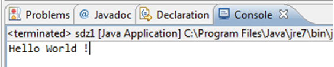

Prenons le code suivant :

```java
  System.out.print("Hello World !");
  System.out.print("My name is");
  System.out.print("Cysboy");
```

Résultat:

> Hello World !My name isCysboy

```java
  System.out.print("Hello World ! \n");
  System.out.println("My name is");
  System.out.println("\nCysboy");
```

Avec pour résultat :

> Hello World !

> My name is


> Cysboy

### Les variables et les opérateurs
En Java, nous avons deux types de variables :

* des variables de type simple ou « primitif » ;
* des variables de type complexe ou des « objets ».

### Les variables de type numérique
Le type byte (1 octet) peut contenir les entiers entre -128 et +127.

```java
  byte temperature;
  temperature = 64;
```

Le type short (2 octets) contient les entiers compris entre -32768 et +32767.

```java
  short vitesseMax;
  vitesseMax = 32000;
```

Le type int (4 octets) va de -2*10<sup>9</sup> à 2*10<sup>9</sup>.

```java
  int temperatureSoleil;
  temperatureSoleil = 15600000; //La température est exprimée en kelvins
```

Le type long (8 octets) peut aller de −9×10<sup>18</sup>  à 9×10<sup>18</sup>.

```java
  long anneeLumiere;
  anneeLumiere = 9460700000000000L;
```

Le type float (4 octets) est utilisé pour les nombres avec une virgule flottante.

```java
  float pi;
  pi = 3.141592653f;
```

Le type double (8 octets) est identique à float, si ce n'est qu'il contient plus de chiffres derrière la virgule.

```java
  double division;
  division = 0.333333333333333333333333333333333333333333334d;
```

### Des variables stockant un caractère
Le type « char » contient un caractère stocké entre apostrophes (« ' ' »), comme ceci :

```java
  char caractere;
  caractere = 'A';
```

### Des variables de type booléen
Le type « boolean » ne peut contenir que deux valeurs : true (vrai) ou false (faux).

```java
  boolean question;
  question = true;
```

### Le type String
Le type « String » permet de gérer les chaînes de caractères, c'est-à-dire le stockage de texte. Il s'agit d'une variable d'un type plus complexe que l'on appelle <b>« objet »</b>.

```java
//Première méthode de déclaration
String phrase;
phrase = "Titi et Grosminet";

//Deuxième méthode de déclaration
String str = new String();
str = "Une autre chaîne de caractères";

//Troisième méthode de déclaration
String string = "Une autre chaîne";

//Quatrième méthode de déclaration
String chaine = new String("Et une de plus !");
```

### Conventions de nommage
Tous vos noms de classes doivent commencer par une majuscule ;
Tous vos noms de variables doivent commencer par une minuscule ;
Si le nom d'une variable est composé de plusieurs mots, le premier commence par une minuscule, le ou les autres par une majuscule, et ce, sans séparation ;
Tout ceci sans accentuation !
On peut très bien compacter les phases de déclaration et d'initialisation en une seule phase ! Comme ceci :

```java
int entier = 32;
float pi = 3.1416f;
char carac = 'z';
String mot = new String("Coucou");
```

Et lorsque nous avons plusieurs variables d'un même type, nous pouvons résumer tout ceci à une déclaration :

```java
int nbre1 = 2, nbre2 = 3, nbre3 = 0;
```

### Les opérateurs arithmétiques :
* « + » : permet d'additionner deux variables numériques (mais aussi de concaténer des chaînes de caractères).
* « - » : permet de soustraire deux variables numériques.
* « * » : permet de multiplier deux variables numériques.
* « / » : permet de diviser deux variables.
* « % » : permet de renvoyer le reste de la division entière de deux variables de type numérique ; cet opérateur s'appelle le modulo.

### Quelques exemples de calcul

<pre class="code-block"><code data-claire-semantic="java" data-code="{&quot;language&quot;:&quot;java&quot;,&quot;source&quot;:&quot;int nbre1, nbre2, nbre3;  //D&amp;#xE9;claration des variables\n \nnbre1 = 1 + 3;            //nbre1 vaut 4\nnbre2 = 2 * 6;            //nbre2 vaut 12\nnbre3 = nbre2 / nbre1;    //nbre3 vaut 3\nnbre1 = 5 % 2;            //nbre1 vaut 1, car 5 = 2 * 2 + 1\nnbre2 = 99 % 8;           //nbre2 vaut 3, car 99 = 8 * 12 + 3\nnbre3 = 6 % 3;            //l&amp;#xE0;, nbre3 vaut 0, car il n&amp;#x27;y a pas de reste&quot;}" class="ace" data-widget="codeBlock"><div class="ace-openclassrooms"><div class="ace_static_highlight ace_show_gutter" style="counter-reset:ace_line 0"><div class="ace_line"><span class="ace_gutter ace_gutter-cell" unselectable="on"></span><span class="ace_keyword">int</span> <span class="ace_identifier">nbre1</span>, <span class="ace_identifier">nbre2</span>, <span class="ace_identifier">nbre3</span>;  <span class="ace_comment">//Déclaration des variables</span>
</div><div class="ace_line"><span class="ace_gutter ace_gutter-cell" unselectable="on"></span> 
</div><div class="ace_line"><span class="ace_gutter ace_gutter-cell" unselectable="on"></span><span class="ace_identifier">nbre1</span> <span class="ace_keyword ace_operator">=</span> <span class="ace_constant ace_numeric">1</span> <span class="ace_keyword ace_operator">+</span> <span class="ace_constant ace_numeric">3</span>;            <span class="ace_comment">//nbre1 vaut 4</span>
</div><div class="ace_line"><span class="ace_gutter ace_gutter-cell" unselectable="on"></span><span class="ace_identifier">nbre2</span> <span class="ace_keyword ace_operator">=</span> <span class="ace_constant ace_numeric">2</span> <span class="ace_keyword ace_operator">*</span> <span class="ace_constant ace_numeric">6</span>;            <span class="ace_comment">//nbre2 vaut 12</span>
</div><div class="ace_line"><span class="ace_gutter ace_gutter-cell" unselectable="on"></span><span class="ace_identifier">nbre3</span> <span class="ace_keyword ace_operator">=</span> <span class="ace_identifier">nbre2</span> / <span class="ace_identifier">nbre1</span>;    <span class="ace_comment">//nbre3 vaut 3</span>
</div><div class="ace_line"><span class="ace_gutter ace_gutter-cell" unselectable="on"></span><span class="ace_identifier">nbre1</span> <span class="ace_keyword ace_operator">=</span> <span class="ace_constant ace_numeric">5</span> <span class="ace_keyword ace_operator">%</span> <span class="ace_constant ace_numeric">2</span>;            <span class="ace_comment">//nbre1 vaut 1, car 5 = 2 * 2 + 1</span>
</div><div class="ace_line"><span class="ace_gutter ace_gutter-cell" unselectable="on"></span><span class="ace_identifier">nbre2</span> <span class="ace_keyword ace_operator">=</span> <span class="ace_constant ace_numeric">99</span> <span class="ace_keyword ace_operator">%</span> <span class="ace_constant ace_numeric">8</span>;           <span class="ace_comment">//nbre2 vaut 3, car 99 = 8 * 12 + 3</span>
</div><div class="ace_line"><span class="ace_gutter ace_gutter-cell" unselectable="on"></span><span class="ace_identifier">nbre3</span> <span class="ace_keyword ace_operator">=</span> <span class="ace_constant ace_numeric">6</span> <span class="ace_keyword ace_operator">%</span> <span class="ace_constant ace_numeric">3</span>;            <span class="ace_comment">//là, nbre3 vaut 0, car il n'y a pas de reste</span></div></div></div></code></pre>

<pre class="code-block"><code data-claire-semantic="java" data-code="{&quot;language&quot;:&quot;java&quot;,&quot;source&quot;:&quot;int nbre1, nbre2, nbre3;    //D&amp;#xE9;claration des variables\nnbre1 = nbre2 = nbre3 = 0;  //Initialisation\n \nnbre1 = nbre1 + 1;     //nbre1 = lui-m&amp;#xEA;me, donc 0 + 1 =&amp;#x3E; nbre1 = 1\nnbre1 = nbre1 + 1;     //nbre1 = 1 (cf. ci-dessus), maintenant, nbre1 = 1 + 1 = 2\nnbre2 = nbre1;         //nbre2 = nbre1 = 2\nnbre2 = nbre2 * 2;     //nbre2 = 2 =&amp;#x3E; nbre2 = 2 * 2 = 4\nnbre3 = nbre2;         //nbre3 = nbre2 = 4\nnbre3 = nbre3 / nbre3; //nbre3 = 4 / 4 = 1\nnbre1 = nbre3;         //nbre1 = nbre3 = 1\nnbre1 = nbre1 - 1;     //nbre1 = 1 - 1 = 0&quot;}" class="ace" data-widget="codeBlock"><div class="ace-openclassrooms"><div class="ace_static_highlight ace_show_gutter" style="counter-reset:ace_line 0"><div class="ace_line"><span class="ace_gutter ace_gutter-cell" unselectable="on"></span><span class="ace_keyword">int</span> <span class="ace_identifier">nbre1</span>, <span class="ace_identifier">nbre2</span>, <span class="ace_identifier">nbre3</span>;    <span class="ace_comment">//Déclaration des variables</span>
</div><div class="ace_line"><span class="ace_gutter ace_gutter-cell" unselectable="on"></span><span class="ace_identifier">nbre1</span> <span class="ace_keyword ace_operator">=</span> <span class="ace_identifier">nbre2</span> <span class="ace_keyword ace_operator">=</span> <span class="ace_identifier">nbre3</span> <span class="ace_keyword ace_operator">=</span> <span class="ace_constant ace_numeric">0</span>;  <span class="ace_comment">//Initialisation</span>
</div><div class="ace_line"><span class="ace_gutter ace_gutter-cell" unselectable="on"></span> 
</div><div class="ace_line"><span class="ace_gutter ace_gutter-cell" unselectable="on"></span><span class="ace_identifier">nbre1</span> <span class="ace_keyword ace_operator">=</span> <span class="ace_identifier">nbre1</span> <span class="ace_keyword ace_operator">+</span> <span class="ace_constant ace_numeric">1</span>;     <span class="ace_comment">//nbre1 = lui-même, donc 0 + 1 =&gt; nbre1 = 1</span>
</div><div class="ace_line"><span class="ace_gutter ace_gutter-cell" unselectable="on"></span><span class="ace_identifier">nbre1</span> <span class="ace_keyword ace_operator">=</span> <span class="ace_identifier">nbre1</span> <span class="ace_keyword ace_operator">+</span> <span class="ace_constant ace_numeric">1</span>;     <span class="ace_comment">//nbre1 = 1 (cf. ci-dessus), maintenant, nbre1 = 1 + 1 = 2</span>
</div><div class="ace_line"><span class="ace_gutter ace_gutter-cell" unselectable="on"></span><span class="ace_identifier">nbre2</span> <span class="ace_keyword ace_operator">=</span> <span class="ace_identifier">nbre1</span>;         <span class="ace_comment">//nbre2 = nbre1 = 2</span>
</div><div class="ace_line"><span class="ace_gutter ace_gutter-cell" unselectable="on"></span><span class="ace_identifier">nbre2</span> <span class="ace_keyword ace_operator">=</span> <span class="ace_identifier">nbre2</span> <span class="ace_keyword ace_operator">*</span> <span class="ace_constant ace_numeric">2</span>;     <span class="ace_comment">//nbre2 = 2 =&gt; nbre2 = 2 * 2 = 4</span>
</div><div class="ace_line"><span class="ace_gutter ace_gutter-cell" unselectable="on"></span><span class="ace_identifier">nbre3</span> <span class="ace_keyword ace_operator">=</span> <span class="ace_identifier">nbre2</span>;         <span class="ace_comment">//nbre3 = nbre2 = 4</span>
</div><div class="ace_line"><span class="ace_gutter ace_gutter-cell" unselectable="on"></span><span class="ace_identifier">nbre3</span> <span class="ace_keyword ace_operator">=</span> <span class="ace_identifier">nbre3</span> / <span class="ace_identifier">nbre3</span>; <span class="ace_comment">//nbre3 = 4 / 4 = 1</span>
</div><div class="ace_line"><span class="ace_gutter ace_gutter-cell" unselectable="on"></span><span class="ace_identifier">nbre1</span> <span class="ace_keyword ace_operator">=</span> <span class="ace_identifier">nbre3</span>;         <span class="ace_comment">//nbre1 = nbre3 = 1</span>
</div><div class="ace_line"><span class="ace_gutter ace_gutter-cell" unselectable="on"></span><span class="ace_identifier">nbre1</span> <span class="ace_keyword ace_operator">=</span> <span class="ace_identifier">nbre1</span> <span class="ace_keyword ace_operator">-</span> <span class="ace_constant ace_numeric">1</span>;     <span class="ace_comment">//nbre1 = 1 - 1 = 0</span></div></div></div></code></pre>

<pre class="code-block"><code data-claire-semantic="java" data-code="{&quot;language&quot;:&quot;java&quot;,&quot;source&quot;:&quot;nbre1 = nbre1 + 1;\nnbre1 += 1;\nnbre1++;\n++nbre1;&quot;}" class="ace" data-widget="codeBlock"><div class="ace-openclassrooms"><div class="ace_static_highlight ace_show_gutter" style="counter-reset:ace_line 0"><div class="ace_line"><span class="ace_gutter ace_gutter-cell" unselectable="on"></span><span class="ace_identifier">nbre1</span> <span class="ace_keyword ace_operator">=</span> <span class="ace_identifier">nbre1</span> <span class="ace_keyword ace_operator">+</span> <span class="ace_constant ace_numeric">1</span>;
</div><div class="ace_line"><span class="ace_gutter ace_gutter-cell" unselectable="on"></span><span class="ace_identifier">nbre1</span> <span class="ace_keyword ace_operator">+=</span> <span class="ace_constant ace_numeric">1</span>;
</div><div class="ace_line"><span class="ace_gutter ace_gutter-cell" unselectable="on"></span><span class="ace_identifier">nbre1</span><span class="ace_keyword ace_operator">++</span>;
</div><div class="ace_line"><span class="ace_gutter ace_gutter-cell" unselectable="on"></span><span class="ace_keyword ace_operator">++</span><span class="ace_identifier">nbre1</span>;</div></div></div></code></pre>

<pre class="code-block"><code data-claire-semantic="java" data-code="{&quot;language&quot;:&quot;java&quot;,&quot;source&quot;:&quot;nbre1 = nbre1 - 1;\nnbre1 -= 1;\nnbre1--;\n--nbre1;&quot;}" class="ace" data-widget="codeBlock"><div class="ace-openclassrooms"><div class="ace_static_highlight ace_show_gutter" style="counter-reset:ace_line 0"><div class="ace_line"><span class="ace_gutter ace_gutter-cell" unselectable="on"></span><span class="ace_identifier">nbre1</span> <span class="ace_keyword ace_operator">=</span> <span class="ace_identifier">nbre1</span> <span class="ace_keyword ace_operator">-</span> <span class="ace_constant ace_numeric">1</span>;
</div><div class="ace_line"><span class="ace_gutter ace_gutter-cell" unselectable="on"></span><span class="ace_identifier">nbre1</span> <span class="ace_keyword ace_operator">-=</span> <span class="ace_constant ace_numeric">1</span>;
</div><div class="ace_line"><span class="ace_gutter ace_gutter-cell" unselectable="on"></span><span class="ace_identifier">nbre1</span><span class="ace_keyword ace_operator">--</span>;
</div><div class="ace_line"><span class="ace_gutter ace_gutter-cell" unselectable="on"></span><span class="ace_keyword ace_operator">--</span><span class="ace_identifier">nbre1</span>;</div></div></div></code></pre>

<pre class="code-block"><code data-claire-semantic="java" data-code="{&quot;language&quot;:&quot;java&quot;,&quot;source&quot;:&quot;nbre1 = nbre1 * 2;\nnbre1 *= 2;\nnbre1 = nbre1 / 2;\nnbre1 /= 2;&quot;}" class="ace" data-widget="codeBlock"><div class="ace-openclassrooms"><div class="ace_static_highlight ace_show_gutter" style="counter-reset:ace_line 0"><div class="ace_line"><span class="ace_gutter ace_gutter-cell" unselectable="on"></span><span class="ace_identifier">nbre1</span> <span class="ace_keyword ace_operator">=</span> <span class="ace_identifier">nbre1</span> <span class="ace_keyword ace_operator">*</span> <span class="ace_constant ace_numeric">2</span>;
</div><div class="ace_line"><span class="ace_gutter ace_gutter-cell" unselectable="on"></span><span class="ace_identifier">nbre1</span> <span class="ace_keyword ace_operator">*=</span> <span class="ace_constant ace_numeric">2</span>;
</div><div class="ace_line"><span class="ace_gutter ace_gutter-cell" unselectable="on"></span><span class="ace_identifier">nbre1</span> <span class="ace_keyword ace_operator">=</span> <span class="ace_identifier">nbre1</span> / <span class="ace_constant ace_numeric">2</span>;
</div><div class="ace_line"><span class="ace_gutter ace_gutter-cell" unselectable="on"></span><span class="ace_identifier">nbre1</span> /<span class="ace_keyword ace_operator">=</span> <span class="ace_constant ace_numeric">2</span>;</div></div></div></code></pre>

<p>L'opérateur « + » sert aussi d'opérateur de concaténation, c'est-à-dire qu'il permet de mélanger du texte brut et des variables. Voici un exemple d'affichage avec une perte de précision :</p>
<pre class="code-block"><code data-claire-semantic="java" data-code="{&quot;language&quot;:&quot;java&quot;,&quot;source&quot;:&quot;double nbre1 = 10, nbre2 = 3;\nint resultat = (int)(nbre1 / nbre2);\nSystem.out.println(&amp;#x22;Le r&amp;#xE9;sultat est = &amp;#x22; + resultat);&quot;}" class="ace" data-widget="codeBlock"><div class="ace-openclassrooms"><div class="ace_static_highlight ace_show_gutter" style="counter-reset:ace_line 0"><div class="ace_line"><span class="ace_gutter ace_gutter-cell" unselectable="on"></span><span class="ace_keyword">double</span> <span class="ace_identifier">nbre1</span> <span class="ace_keyword ace_operator">=</span> <span class="ace_constant ace_numeric">10</span>, <span class="ace_identifier">nbre2</span> <span class="ace_keyword ace_operator">=</span> <span class="ace_constant ace_numeric">3</span>;
</div><div class="ace_line"><span class="ace_gutter ace_gutter-cell" unselectable="on"></span><span class="ace_keyword">int</span> <span class="ace_identifier">resultat</span> <span class="ace_keyword ace_operator">=</span> (<span class="ace_keyword">int</span>)(<span class="ace_identifier">nbre1</span> / <span class="ace_identifier">nbre2</span>);
</div><div class="ace_line"><span class="ace_gutter ace_gutter-cell" unselectable="on"></span><span class="ace_support ace_function">System</span>.<span class="ace_identifier">out</span>.<span class="ace_identifier">println</span>(<span class="ace_string">"Le résultat est = "</span> <span class="ace_keyword ace_operator">+</span> <span class="ace_identifier">resultat</span>);</div></div></div></code></pre>

<h3>Les conversions, ou « cast »</h3>
<p>D'un type « int » en type « float ».</p>
<pre class="code-block"><code data-claire-semantic="java" data-code="{&quot;language&quot;:&quot;java&quot;,&quot;source&quot;:&quot;int i = 123;\nfloat j = (float)i;&quot;}" class="ace" data-widget="codeBlock"><div class="ace-openclassrooms"><div class="ace_static_highlight ace_show_gutter" style="counter-reset:ace_line 0"><div class="ace_line"><span class="ace_gutter ace_gutter-cell" unselectable="on"></span><span class="ace_keyword">int</span> <span class="ace_identifier">i</span> <span class="ace_keyword ace_operator">=</span> <span class="ace_constant ace_numeric">123</span>;
</div><div class="ace_line"><span class="ace_gutter ace_gutter-cell" unselectable="on"></span><span class="ace_keyword">float</span> <span class="ace_identifier">j</span> <span class="ace_keyword ace_operator">=</span> (<span class="ace_keyword">float</span>)<span class="ace_identifier">i</span>;</div></div></div></code></pre>

<p>D'un type « int » en « double ».</p>
<pre class="code-block"><code data-claire-semantic="java" data-code="{&quot;language&quot;:&quot;java&quot;,&quot;source&quot;:&quot;int i = 123;\ndouble j = (double)i;&quot;}" class="ace" data-widget="codeBlock"><div class="ace-openclassrooms"><div class="ace_static_highlight ace_show_gutter" style="counter-reset:ace_line 0"><div class="ace_line"><span class="ace_gutter ace_gutter-cell" unselectable="on"></span><span class="ace_keyword">int</span> <span class="ace_identifier">i</span> <span class="ace_keyword ace_operator">=</span> <span class="ace_constant ace_numeric">123</span>;
</div><div class="ace_line"><span class="ace_gutter ace_gutter-cell" unselectable="on"></span><span class="ace_keyword">double</span> <span class="ace_identifier">j</span> <span class="ace_keyword ace_operator">=</span> (<span class="ace_keyword">double</span>)<span class="ace_identifier">i</span>;</div></div></div></code></pre>

<p>Et inversement :</p>
<pre class="code-block"><code data-claire-semantic="java" data-code="{&quot;language&quot;:&quot;java&quot;,&quot;source&quot;:&quot;double i = 1.23;\ndouble j = 2.9999999;\nint k = (int)i;        //k vaut 1\nk = (int)j;            //k vaut 2&quot;}" class="ace" data-widget="codeBlock"><div class="ace-openclassrooms"><div class="ace_static_highlight ace_show_gutter" style="counter-reset:ace_line 0"><div class="ace_line"><span class="ace_gutter ace_gutter-cell" unselectable="on"></span><span class="ace_keyword">double</span> <span class="ace_identifier">i</span> <span class="ace_keyword ace_operator">=</span> <span class="ace_constant ace_numeric">1.23</span>;
</div><div class="ace_line"><span class="ace_gutter ace_gutter-cell" unselectable="on"></span><span class="ace_keyword">double</span> <span class="ace_identifier">j</span> <span class="ace_keyword ace_operator">=</span> <span class="ace_constant ace_numeric">2.9999999</span>;
</div><div class="ace_line"><span class="ace_gutter ace_gutter-cell" unselectable="on"></span><span class="ace_keyword">int</span> <span class="ace_identifier">k</span> <span class="ace_keyword ace_operator">=</span> (<span class="ace_keyword">int</span>)<span class="ace_identifier">i</span>;        <span class="ace_comment">//k vaut 1</span>
</div><div class="ace_line"><span class="ace_gutter ace_gutter-cell" unselectable="on"></span><span class="ace_identifier">k</span> <span class="ace_keyword ace_operator">=</span> (<span class="ace_keyword">int</span>)<span class="ace_identifier">j</span>;            <span class="ace_comment">//k vaut 2</span></div></div></div></code></pre>

<h3><a name="scanner">Récupérer ce que vous tapez</a></h3>
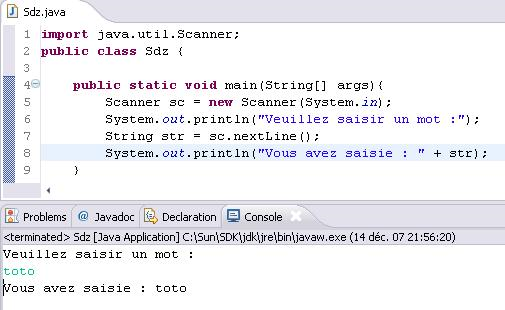

<h3><a name="conditions">La structure If… else…</a></h3>
<pre class="code-block"><code data-claire-semantic="java" data-code="{&quot;language&quot;:&quot;java&quot;,&quot;source&quot;:&quot;int i = 0;\nif (i &amp;#x3C; 0)\n  System.out.println(&amp;#x22;Ce nombre est n&amp;#xE9;gatif !&amp;#x22;);      \n  \nelse if(i &amp;#x3E; 0)\n  System.out.println(&amp;#x22;Ce nombre est positif !&amp;#x22;);           \n \nelse  \n  System.out.println(&amp;#x22;Ce nombre est nul !&amp;#x22;);&quot;}" class="ace" data-widget="codeBlock"><div class="ace-openclassrooms"><div class="ace_static_highlight ace_show_gutter" style="counter-reset:ace_line 0"><div class="ace_line"><span class="ace_gutter ace_gutter-cell" unselectable="on"></span><span class="ace_keyword">int</span> <span class="ace_identifier">i</span> <span class="ace_keyword ace_operator">=</span> <span class="ace_constant ace_numeric">0</span>;
</div><div class="ace_line"><span class="ace_gutter ace_gutter-cell" unselectable="on"></span><span class="ace_keyword">if</span> (<span class="ace_identifier">i</span> <span class="ace_keyword ace_operator">&lt;</span> <span class="ace_constant ace_numeric">0</span>)
</div><div class="ace_line"><span class="ace_gutter ace_gutter-cell" unselectable="on"></span>  <span class="ace_support ace_function">System</span>.<span class="ace_identifier">out</span>.<span class="ace_identifier">println</span>(<span class="ace_string">"Ce nombre est négatif !"</span>);      
</div><div class="ace_line"><span class="ace_gutter ace_gutter-cell" unselectable="on"></span>  
</div><div class="ace_line"><span class="ace_gutter ace_gutter-cell" unselectable="on"></span><span class="ace_keyword">else</span> <span class="ace_keyword">if</span>(<span class="ace_identifier">i</span> <span class="ace_keyword ace_operator">&gt;</span> <span class="ace_constant ace_numeric">0</span>)
</div><div class="ace_line"><span class="ace_gutter ace_gutter-cell" unselectable="on"></span>  <span class="ace_support ace_function">System</span>.<span class="ace_identifier">out</span>.<span class="ace_identifier">println</span>(<span class="ace_string">"Ce nombre est positif !"</span>);           
</div><div class="ace_line"><span class="ace_gutter ace_gutter-cell" unselectable="on"></span> 
</div><div class="ace_line"><span class="ace_gutter ace_gutter-cell" unselectable="on"></span><span class="ace_keyword">else</span>  
</div><div class="ace_line"><span class="ace_gutter ace_gutter-cell" unselectable="on"></span>  <span class="ace_support ace_function">System</span>.<span class="ace_identifier">out</span>.<span class="ace_identifier">println</span>(<span class="ace_string">"Ce nombre est nul !"</span>);</div></div></div></code></pre>

<h3>Les conditions multiples</h3>
<pre class="code-block"><code data-claire-semantic="java" data-code="{&quot;language&quot;:&quot;java&quot;,&quot;source&quot;:&quot;int i = 58;\nif(i &amp;#x3C; 100 &amp;#x26;&amp;#x26; i &amp;#x3E; 50) \n  System.out.println(&amp;#x22;Le nombre est bien dans l&amp;#x27;intervalle.&amp;#x22;);\nelse\n  System.out.println(&amp;#x22;Le nombre n&amp;#x27;est pas dans l&amp;#x27;intervalle.&amp;#x22;);&quot;}" class="ace" data-widget="codeBlock"><div class="ace-openclassrooms"><div class="ace_static_highlight ace_show_gutter" style="counter-reset:ace_line 0"><div class="ace_line"><span class="ace_gutter ace_gutter-cell" unselectable="on"></span><span class="ace_keyword">int</span> <span class="ace_identifier">i</span> <span class="ace_keyword ace_operator">=</span> <span class="ace_constant ace_numeric">58</span>;
</div><div class="ace_line"><span class="ace_gutter ace_gutter-cell" unselectable="on"></span><span class="ace_keyword">if</span>(<span class="ace_identifier">i</span> <span class="ace_keyword ace_operator">&lt;</span> <span class="ace_constant ace_numeric">100</span> <span class="ace_keyword ace_operator">&amp;&amp;</span> <span class="ace_identifier">i</span> <span class="ace_keyword ace_operator">&gt;</span> <span class="ace_constant ace_numeric">50</span>) 
</div><div class="ace_line"><span class="ace_gutter ace_gutter-cell" unselectable="on"></span>  <span class="ace_support ace_function">System</span>.<span class="ace_identifier">out</span>.<span class="ace_identifier">println</span>(<span class="ace_string">"Le nombre est bien dans l'intervalle."</span>);
</div><div class="ace_line"><span class="ace_gutter ace_gutter-cell" unselectable="on"></span><span class="ace_keyword">else</span>
</div><div class="ace_line"><span class="ace_gutter ace_gutter-cell" unselectable="on"></span>  <span class="ace_support ace_function">System</span>.<span class="ace_identifier">out</span>.<span class="ace_identifier">println</span>(<span class="ace_string">"Le nombre n'est pas dans l'intervalle."</span>);</div></div></div></code></pre>

<h3>La structure « switch »</h3>
<pre class="code-block"><code data-claire-semantic="java" data-code="{&quot;language&quot;:&quot;java&quot;,&quot;source&quot;:&quot;int note = 10; //On imagine que la note maximale est 20\n\nswitch (note)\n{\n  case 0:\n    System.out.println(&amp;#x22;Ouch !&amp;#x22;);\n    break;\n  case 10:\n    System.out.println(&amp;#x22;Vous avez juste la moyenne.&amp;#x22;);\n    break;\n  case 20:\n    System.out.println(&amp;#x22;Parfait !&amp;#x22;);\n    break;\n  default:\n    System.out.println(&amp;#x22;Il faut davantage travailler.&amp;#x22;);\n}&quot;}" class="ace" data-widget="codeBlock"><div class="ace-openclassrooms"><div class="ace_static_highlight ace_show_gutter" style="counter-reset:ace_line 0"><div class="ace_line"><span class="ace_gutter ace_gutter-cell" unselectable="on"></span><span class="ace_keyword">int</span> <span class="ace_identifier">note</span> <span class="ace_keyword ace_operator">=</span> <span class="ace_constant ace_numeric">10</span>; <span class="ace_comment">//On imagine que la note maximale est 20</span>
</div><div class="ace_line"><span class="ace_gutter ace_gutter-cell" unselectable="on"></span>
</div><div class="ace_line"><span class="ace_gutter ace_gutter-cell" unselectable="on"></span><span class="ace_keyword">switch</span> (<span class="ace_identifier">note</span>)
</div><div class="ace_line"><span class="ace_gutter ace_gutter-cell" unselectable="on"></span>{
</div><div class="ace_line"><span class="ace_gutter ace_gutter-cell" unselectable="on"></span>  <span class="ace_keyword">case</span> <span class="ace_constant ace_numeric">0</span>:
</div><div class="ace_line"><span class="ace_gutter ace_gutter-cell" unselectable="on"></span>    <span class="ace_support ace_function">System</span>.<span class="ace_identifier">out</span>.<span class="ace_identifier">println</span>(<span class="ace_string">"Ouch !"</span>);
</div><div class="ace_line"><span class="ace_gutter ace_gutter-cell" unselectable="on"></span>    <span class="ace_keyword">break</span>;
</div><div class="ace_line"><span class="ace_gutter ace_gutter-cell" unselectable="on"></span>  <span class="ace_keyword">case</span> <span class="ace_constant ace_numeric">10</span>:
</div><div class="ace_line"><span class="ace_gutter ace_gutter-cell" unselectable="on"></span>    <span class="ace_support ace_function">System</span>.<span class="ace_identifier">out</span>.<span class="ace_identifier">println</span>(<span class="ace_string">"Vous avez juste la moyenne."</span>);
</div><div class="ace_line"><span class="ace_gutter ace_gutter-cell" unselectable="on"></span>    <span class="ace_keyword">break</span>;
</div><div class="ace_line"><span class="ace_gutter ace_gutter-cell" unselectable="on"></span>  <span class="ace_keyword">case</span> <span class="ace_constant ace_numeric">20</span>:
</div><div class="ace_line"><span class="ace_gutter ace_gutter-cell" unselectable="on"></span>    <span class="ace_support ace_function">System</span>.<span class="ace_identifier">out</span>.<span class="ace_identifier">println</span>(<span class="ace_string">"Parfait !"</span>);
</div><div class="ace_line"><span class="ace_gutter ace_gutter-cell" unselectable="on"></span>    <span class="ace_keyword">break</span>;
</div><div class="ace_line"><span class="ace_gutter ace_gutter-cell" unselectable="on"></span>  <span class="ace_keyword">default</span>:
</div><div class="ace_line"><span class="ace_gutter ace_gutter-cell" unselectable="on"></span>    <span class="ace_support ace_function">System</span>.<span class="ace_identifier">out</span>.<span class="ace_identifier">println</span>(<span class="ace_string">"Il faut davantage travailler."</span>);
</div><div class="ace_line"><span class="ace_gutter ace_gutter-cell" unselectable="on"></span>}
</div></div></div></code></pre>

<pre class="code-block"><code data-claire-semantic="java" data-code="{&quot;language&quot;:&quot;java&quot;,&quot;source&quot;:&quot;String chaine = &amp;#x22;Bonjour&amp;#x22;;\n\nswitch(chaine) {\n  case &amp;#x22;Bonjour&amp;#x22;:\n    System.out.println(&amp;#x22;Bonjour monsieur !&amp;#x22;);\n    break;\n  case &amp;#x22;Bonsoir&amp;#x22;:\n    System.out.println(&amp;#x22;Bonsoir monsieur !&amp;#x22;);\n    break;\n  default:\n    System.out.println(&amp;#x22;Bonjoir ! :p&amp;#x22;);\n}&quot;}" class="ace" data-widget="codeBlock"><div class="ace-openclassrooms"><div class="ace_static_highlight ace_show_gutter" style="counter-reset:ace_line 0"><div class="ace_line"><span class="ace_gutter ace_gutter-cell" unselectable="on"></span><span class="ace_support ace_function">String</span> <span class="ace_identifier">chaine</span> <span class="ace_keyword ace_operator">=</span> <span class="ace_string">"Bonjour"</span>;
</div><div class="ace_line"><span class="ace_gutter ace_gutter-cell" unselectable="on"></span>
</div><div class="ace_line"><span class="ace_gutter ace_gutter-cell" unselectable="on"></span><span class="ace_keyword">switch</span>(<span class="ace_identifier">chaine</span>) {
</div><div class="ace_line"><span class="ace_gutter ace_gutter-cell" unselectable="on"></span>  <span class="ace_keyword">case</span> <span class="ace_string">"Bonjour"</span>:
</div><div class="ace_line"><span class="ace_gutter ace_gutter-cell" unselectable="on"></span>    <span class="ace_support ace_function">System</span>.<span class="ace_identifier">out</span>.<span class="ace_identifier">println</span>(<span class="ace_string">"Bonjour monsieur !"</span>);
</div><div class="ace_line"><span class="ace_gutter ace_gutter-cell" unselectable="on"></span>    <span class="ace_keyword">break</span>;
</div><div class="ace_line"><span class="ace_gutter ace_gutter-cell" unselectable="on"></span>  <span class="ace_keyword">case</span> <span class="ace_string">"Bonsoir"</span>:
</div><div class="ace_line"><span class="ace_gutter ace_gutter-cell" unselectable="on"></span>    <span class="ace_support ace_function">System</span>.<span class="ace_identifier">out</span>.<span class="ace_identifier">println</span>(<span class="ace_string">"Bonsoir monsieur !"</span>);
</div><div class="ace_line"><span class="ace_gutter ace_gutter-cell" unselectable="on"></span>    <span class="ace_keyword">break</span>;
</div><div class="ace_line"><span class="ace_gutter ace_gutter-cell" unselectable="on"></span>  <span class="ace_keyword">default</span>:
</div><div class="ace_line"><span class="ace_gutter ace_gutter-cell" unselectable="on"></span>    <span class="ace_support ace_function">System</span>.<span class="ace_identifier">out</span>.<span class="ace_identifier">println</span>(<span class="ace_string">"Bonjoir ! :p"</span>);
</div><div class="ace_line"><span class="ace_gutter ace_gutter-cell" unselectable="on"></span>}
</div></div></div></code></pre>

<h3>La condition ternaire</h3>
<pre class="code-block"><code data-claire-semantic="java" data-code="{&quot;language&quot;:&quot;java&quot;,&quot;source&quot;:&quot;int x = 10, y = 20;\nint max = (x &amp;#x3C; y) ? y : x ; //Maintenant, max vaut 20&quot;}" class="ace" data-widget="codeBlock"><div class="ace-openclassrooms"><div class="ace_static_highlight ace_show_gutter" style="counter-reset:ace_line 0"><div class="ace_line"><span class="ace_gutter ace_gutter-cell" unselectable="on"></span><span class="ace_keyword">int</span> <span class="ace_identifier">x</span> <span class="ace_keyword ace_operator">=</span> <span class="ace_constant ace_numeric">10</span>, <span class="ace_identifier">y</span> <span class="ace_keyword ace_operator">=</span> <span class="ace_constant ace_numeric">20</span>;
</div><div class="ace_line"><span class="ace_gutter ace_gutter-cell" unselectable="on"></span><span class="ace_keyword">int</span> <span class="ace_identifier">max</span> <span class="ace_keyword ace_operator">=</span> (<span class="ace_identifier">x</span> <span class="ace_keyword ace_operator">&lt;</span> <span class="ace_identifier">y</span>) ? <span class="ace_identifier">y</span> : <span class="ace_identifier">x</span> ; <span class="ace_comment">//Maintenant, max vaut 20</span></div></div></div></code></pre>

<pre class="code-block"><code data-claire-semantic="java" data-code="{&quot;language&quot;:&quot;java&quot;,&quot;source&quot;:&quot;int x = 10, y = 20;\n\nint max = (x &amp;#x3C; y) ? (y &amp;#x3C; 10) ? y % 10 : y * 2 : x ; //Max vaut 40\n\n//Pas tr&amp;#xE8;s facile &amp;#xE0; lire&amp;#x2026;\n//Vous pouvez entourer votre deuxi&amp;#xE8;me instruction ternaire par des parenth&amp;#xE8;ses pour mieux voir :\n\nmax = (x &amp;#x3C; y) ? ((y &amp;#x3C; 10) ? y % 10 : y * 2) : x ; //Max vaut 40&quot;}" class="ace" data-widget="codeBlock"><div class="ace-openclassrooms"><div class="ace_static_highlight ace_show_gutter" style="counter-reset:ace_line 0"><div class="ace_line"><span class="ace_gutter ace_gutter-cell" unselectable="on"></span><span class="ace_keyword">int</span> <span class="ace_identifier">x</span> <span class="ace_keyword ace_operator">=</span> <span class="ace_constant ace_numeric">10</span>, <span class="ace_identifier">y</span> <span class="ace_keyword ace_operator">=</span> <span class="ace_constant ace_numeric">20</span>;
</div><div class="ace_line"><span class="ace_gutter ace_gutter-cell" unselectable="on"></span>
</div><div class="ace_line"><span class="ace_gutter ace_gutter-cell" unselectable="on"></span><span class="ace_keyword">int</span> <span class="ace_identifier">max</span> <span class="ace_keyword ace_operator">=</span> (<span class="ace_identifier">x</span> <span class="ace_keyword ace_operator">&lt;</span> <span class="ace_identifier">y</span>) ? (<span class="ace_identifier">y</span> <span class="ace_keyword ace_operator">&lt;</span> <span class="ace_constant ace_numeric">10</span>) ? <span class="ace_identifier">y</span> <span class="ace_keyword ace_operator">%</span> <span class="ace_constant ace_numeric">10</span> : <span class="ace_identifier">y</span> <span class="ace_keyword ace_operator">*</span> <span class="ace_constant ace_numeric">2</span> : <span class="ace_identifier">x</span> ; <span class="ace_comment">//Max vaut 40</span>
</div><div class="ace_line"><span class="ace_gutter ace_gutter-cell" unselectable="on"></span>
</div><div class="ace_line"><span class="ace_gutter ace_gutter-cell" unselectable="on"></span><span class="ace_comment">//Pas très facile à lire…</span>
</div><div class="ace_line"><span class="ace_gutter ace_gutter-cell" unselectable="on"></span><span class="ace_comment">//Vous pouvez entourer votre deuxième instruction ternaire par des parenthèses pour mieux voir :</span>
</div><div class="ace_line"><span class="ace_gutter ace_gutter-cell" unselectable="on"></span>
</div><div class="ace_line"><span class="ace_gutter ace_gutter-cell" unselectable="on"></span><span class="ace_identifier">max</span> <span class="ace_keyword ace_operator">=</span> (<span class="ace_identifier">x</span> <span class="ace_keyword ace_operator">&lt;</span> <span class="ace_identifier">y</span>) ? ((<span class="ace_identifier">y</span> <span class="ace_keyword ace_operator">&lt;</span> <span class="ace_constant ace_numeric">10</span>) ? <span class="ace_identifier">y</span> <span class="ace_keyword ace_operator">%</span> <span class="ace_constant ace_numeric">10</span> : <span class="ace_identifier">y</span> <span class="ace_keyword ace_operator">*</span> <span class="ace_constant ace_numeric">2</span>) : <span class="ace_identifier">x</span> ; <span class="ace_comment">//Max vaut 40</span>
</div></div></div></code></pre>

<h3><a name="boucles">La boucle « while »</a></h3>
<pre class="code-block"><code data-claire-semantic="java" data-code="{&quot;language&quot;:&quot;java&quot;,&quot;source&quot;:&quot;//Une variable vide\nString prenom;\n//On initialise celle-ci &amp;#xE0; O pour oui\nchar reponse = &amp;#x27;O&amp;#x27;;\n//Notre objet Scanner, n&amp;#x27;oubliez pas l&amp;#x27;import de java.util.Scanner !\nScanner sc = new Scanner(System.in);\n//Tant que la r&amp;#xE9;ponse donn&amp;#xE9;e est &amp;#xE9;gale &amp;#xE0; oui&amp;#x2026;\nwhile (reponse == &amp;#x27;O&amp;#x27;)\n{\n  //On affiche une instruction\n  System.out.println(&amp;#x22;Donnez un pr&amp;#xE9;nom : &amp;#x22;);\n  //On r&amp;#xE9;cup&amp;#xE8;re le pr&amp;#xE9;nom saisi\n  prenom = sc.nextLine();\n  //On affiche notre phrase avec le pr&amp;#xE9;nom\n  System.out.println(&amp;#x22;Bonjour &amp;#x22; +prenom+ &amp;#x22;, comment vas-tu ?&amp;#x22;);\n  //On demande si la personne veut faire un autre essai\n  System.out.println(&amp;#x22;Voulez-vous r&amp;#xE9;essayer ? (O/N)&amp;#x22;);\n  //On r&amp;#xE9;cup&amp;#xE8;re la r&amp;#xE9;ponse de l&amp;#x27;utilisateur\n  reponse = sc.nextLine().charAt(0);\n}\n \nSystem.out.println(&amp;#x22;Au revoir&amp;#x2026;&amp;#x22;);\n//Fin de la boucle&quot;}" class="ace" data-widget="codeBlock"><div class="ace-openclassrooms"><div class="ace_static_highlight ace_show_gutter" style="counter-reset:ace_line 0"><div class="ace_line"><span class="ace_gutter ace_gutter-cell" unselectable="on"></span><span class="ace_comment">//Une variable vide</span>
</div><div class="ace_line"><span class="ace_gutter ace_gutter-cell" unselectable="on"></span><span class="ace_support ace_function">String</span> <span class="ace_identifier">prenom</span>;
</div><div class="ace_line"><span class="ace_gutter ace_gutter-cell" unselectable="on"></span><span class="ace_comment">//On initialise celle-ci à O pour oui</span>
</div><div class="ace_line"><span class="ace_gutter ace_gutter-cell" unselectable="on"></span><span class="ace_keyword">char</span> <span class="ace_identifier">reponse</span> <span class="ace_keyword ace_operator">=</span> <span class="ace_string">'O'</span>;
</div><div class="ace_line"><span class="ace_gutter ace_gutter-cell" unselectable="on"></span><span class="ace_comment">//Notre objet Scanner, n'oubliez pas l'import de java.util.Scanner !</span>
</div><div class="ace_line"><span class="ace_gutter ace_gutter-cell" unselectable="on"></span><span class="ace_identifier">Scanner</span> <span class="ace_identifier">sc</span> <span class="ace_keyword ace_operator">=</span> <span class="ace_keyword">new</span> <span class="ace_identifier">Scanner</span>(<span class="ace_support ace_function">System</span>.<span class="ace_identifier">in</span>);
</div><div class="ace_line"><span class="ace_gutter ace_gutter-cell" unselectable="on"></span><span class="ace_comment">//Tant que la réponse donnée est égale à oui…</span>
</div><div class="ace_line"><span class="ace_gutter ace_gutter-cell" unselectable="on"></span><span class="ace_keyword">while</span> (<span class="ace_identifier">reponse</span> <span class="ace_keyword ace_operator">==</span> <span class="ace_string">'O'</span>)
</div><div class="ace_line"><span class="ace_gutter ace_gutter-cell" unselectable="on"></span>{
</div><div class="ace_line"><span class="ace_gutter ace_gutter-cell" unselectable="on"></span>  <span class="ace_comment">//On affiche une instruction</span>
</div><div class="ace_line"><span class="ace_gutter ace_gutter-cell" unselectable="on"></span>  <span class="ace_support ace_function">System</span>.<span class="ace_identifier">out</span>.<span class="ace_identifier">println</span>(<span class="ace_string">"Donnez un prénom : "</span>);
</div><div class="ace_line"><span class="ace_gutter ace_gutter-cell" unselectable="on"></span>  <span class="ace_comment">//On récupère le prénom saisi</span>
</div><div class="ace_line"><span class="ace_gutter ace_gutter-cell" unselectable="on"></span>  <span class="ace_identifier">prenom</span> <span class="ace_keyword ace_operator">=</span> <span class="ace_identifier">sc</span>.<span class="ace_identifier">nextLine</span>();
</div><div class="ace_line"><span class="ace_gutter ace_gutter-cell" unselectable="on"></span>  <span class="ace_comment">//On affiche notre phrase avec le prénom</span>
</div><div class="ace_line"><span class="ace_gutter ace_gutter-cell" unselectable="on"></span>  <span class="ace_support ace_function">System</span>.<span class="ace_identifier">out</span>.<span class="ace_identifier">println</span>(<span class="ace_string">"Bonjour "</span> <span class="ace_keyword ace_operator">+</span><span class="ace_identifier">prenom</span><span class="ace_keyword ace_operator">+</span> <span class="ace_string">", comment vas-tu ?"</span>);
</div><div class="ace_line"><span class="ace_gutter ace_gutter-cell" unselectable="on"></span>  <span class="ace_comment">//On demande si la personne veut faire un autre essai</span>
</div><div class="ace_line"><span class="ace_gutter ace_gutter-cell" unselectable="on"></span>  <span class="ace_support ace_function">System</span>.<span class="ace_identifier">out</span>.<span class="ace_identifier">println</span>(<span class="ace_string">"Voulez-vous réessayer ? (O/N)"</span>);
</div><div class="ace_line"><span class="ace_gutter ace_gutter-cell" unselectable="on"></span>  <span class="ace_comment">//On récupère la réponse de l'utilisateur</span>
</div><div class="ace_line"><span class="ace_gutter ace_gutter-cell" unselectable="on"></span>  <span class="ace_identifier">reponse</span> <span class="ace_keyword ace_operator">=</span> <span class="ace_identifier">sc</span>.<span class="ace_identifier">nextLine</span>().<span class="ace_identifier">charAt</span>(<span class="ace_constant ace_numeric">0</span>);
</div><div class="ace_line"><span class="ace_gutter ace_gutter-cell" unselectable="on"></span>}
</div><div class="ace_line"><span class="ace_gutter ace_gutter-cell" unselectable="on"></span> 
</div><div class="ace_line"><span class="ace_gutter ace_gutter-cell" unselectable="on"></span><span class="ace_support ace_function">System</span>.<span class="ace_identifier">out</span>.<span class="ace_identifier">println</span>(<span class="ace_string">"Au revoir…"</span>);
</div><div class="ace_line"><span class="ace_gutter ace_gutter-cell" unselectable="on"></span><span class="ace_comment">//Fin de la boucle</span></div></div></div></code></pre>

<pre class="code-block"><code data-claire-semantic="java" data-code="{&quot;language&quot;:&quot;java&quot;,&quot;source&quot;:&quot;String prenom;\nchar reponse = &amp;#x27;O&amp;#x27;;\nScanner sc = new Scanner(System.in);\nwhile (reponse == &amp;#x27;O&amp;#x27;)\n{\n  System.out.println(&amp;#x22;Donnez un pr&amp;#xE9;nom : &amp;#x22;);\n  prenom = sc.nextLine();\n  System.out.println(&amp;#x22;Bonjour &amp;#x22; +prenom+ &amp;#x22;, comment vas-tu ?&amp;#x22;);                        \n  //Sans &amp;#xE7;a, nous n&amp;#x27;entrerions pas dans la deuxi&amp;#xE8;me boucle\n  reponse = &amp;#x27; &amp;#x27;;\n                        \n  //Tant que la r&amp;#xE9;ponse n&amp;#x27;est pas O ou N, on repose la question\n  while(reponse != &amp;#x27;O&amp;#x27; &amp;#x26;&amp;#x26; reponse != &amp;#x27;N&amp;#x27;)\n  {\n    //On demande si la personne veut faire un autre essai\n    System.out.println(&amp;#x22;Voulez-vous r&amp;#xE9;essayer ? (O/N)&amp;#x22;);\n    reponse = sc.nextLine().charAt(0);\n  }\n}\nSystem.out.println(&amp;#x22;Au revoir&amp;#x2026;&amp;#x22;);&quot;}" class="ace" data-widget="codeBlock"><div class="ace-openclassrooms"><div class="ace_static_highlight ace_show_gutter" style="counter-reset:ace_line 0"><div class="ace_line"><span class="ace_gutter ace_gutter-cell" unselectable="on"></span><span class="ace_support ace_function">String</span> <span class="ace_identifier">prenom</span>;
</div><div class="ace_line"><span class="ace_gutter ace_gutter-cell" unselectable="on"></span><span class="ace_keyword">char</span> <span class="ace_identifier">reponse</span> <span class="ace_keyword ace_operator">=</span> <span class="ace_string">'O'</span>;
</div><div class="ace_line"><span class="ace_gutter ace_gutter-cell" unselectable="on"></span><span class="ace_identifier">Scanner</span> <span class="ace_identifier">sc</span> <span class="ace_keyword ace_operator">=</span> <span class="ace_keyword">new</span> <span class="ace_identifier">Scanner</span>(<span class="ace_support ace_function">System</span>.<span class="ace_identifier">in</span>);
</div><div class="ace_line"><span class="ace_gutter ace_gutter-cell" unselectable="on"></span><span class="ace_keyword">while</span> (<span class="ace_identifier">reponse</span> <span class="ace_keyword ace_operator">==</span> <span class="ace_string">'O'</span>)
</div><div class="ace_line"><span class="ace_gutter ace_gutter-cell" unselectable="on"></span>{
</div><div class="ace_line"><span class="ace_gutter ace_gutter-cell" unselectable="on"></span>  <span class="ace_support ace_function">System</span>.<span class="ace_identifier">out</span>.<span class="ace_identifier">println</span>(<span class="ace_string">"Donnez un prénom : "</span>);
</div><div class="ace_line"><span class="ace_gutter ace_gutter-cell" unselectable="on"></span>  <span class="ace_identifier">prenom</span> <span class="ace_keyword ace_operator">=</span> <span class="ace_identifier">sc</span>.<span class="ace_identifier">nextLine</span>();
</div><div class="ace_line"><span class="ace_gutter ace_gutter-cell" unselectable="on"></span>  <span class="ace_support ace_function">System</span>.<span class="ace_identifier">out</span>.<span class="ace_identifier">println</span>(<span class="ace_string">"Bonjour "</span> <span class="ace_keyword ace_operator">+</span><span class="ace_identifier">prenom</span><span class="ace_keyword ace_operator">+</span> <span class="ace_string">", comment vas-tu ?"</span>);                        
</div><div class="ace_line"><span class="ace_gutter ace_gutter-cell" unselectable="on"></span>  <span class="ace_comment">//Sans ça, nous n'entrerions pas dans la deuxième boucle</span>
</div><div class="ace_line"><span class="ace_gutter ace_gutter-cell" unselectable="on"></span>  <span class="ace_identifier">reponse</span> <span class="ace_keyword ace_operator">=</span> <span class="ace_string">' '</span>;
</div><div class="ace_line"><span class="ace_gutter ace_gutter-cell" unselectable="on"></span><span class="ace_indent-guide">    </span><span class="ace_indent-guide">    </span><span class="ace_indent-guide">    </span><span class="ace_indent-guide">    </span><span class="ace_indent-guide">    </span>    
</div><div class="ace_line"><span class="ace_gutter ace_gutter-cell" unselectable="on"></span>  <span class="ace_comment">//Tant que la réponse n'est pas O ou N, on repose la question</span>
</div><div class="ace_line"><span class="ace_gutter ace_gutter-cell" unselectable="on"></span>  <span class="ace_keyword">while</span>(<span class="ace_identifier">reponse</span> <span class="ace_keyword ace_operator">!=</span> <span class="ace_string">'O'</span> <span class="ace_keyword ace_operator">&amp;&amp;</span> <span class="ace_identifier">reponse</span> <span class="ace_keyword ace_operator">!=</span> <span class="ace_string">'N'</span>)
</div><div class="ace_line"><span class="ace_gutter ace_gutter-cell" unselectable="on"></span>  {
</div><div class="ace_line"><span class="ace_gutter ace_gutter-cell" unselectable="on"></span>    <span class="ace_comment">//On demande si la personne veut faire un autre essai</span>
</div><div class="ace_line"><span class="ace_gutter ace_gutter-cell" unselectable="on"></span>    <span class="ace_support ace_function">System</span>.<span class="ace_identifier">out</span>.<span class="ace_identifier">println</span>(<span class="ace_string">"Voulez-vous réessayer ? (O/N)"</span>);
</div><div class="ace_line"><span class="ace_gutter ace_gutter-cell" unselectable="on"></span>    <span class="ace_identifier">reponse</span> <span class="ace_keyword ace_operator">=</span> <span class="ace_identifier">sc</span>.<span class="ace_identifier">nextLine</span>().<span class="ace_identifier">charAt</span>(<span class="ace_constant ace_numeric">0</span>);
</div><div class="ace_line"><span class="ace_gutter ace_gutter-cell" unselectable="on"></span>  }
</div><div class="ace_line"><span class="ace_gutter ace_gutter-cell" unselectable="on"></span>}
</div><div class="ace_line"><span class="ace_gutter ace_gutter-cell" unselectable="on"></span><span class="ace_support ace_function">System</span>.<span class="ace_identifier">out</span>.<span class="ace_identifier">println</span>(<span class="ace_string">"Au revoir…"</span>);</div></div></div></code></pre>
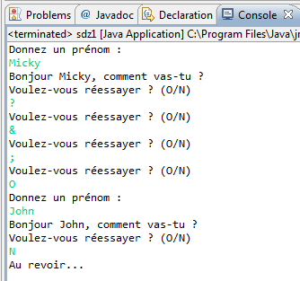

<pre class="code-block"><code data-claire-semantic="java" data-code="{&quot;language&quot;:&quot;java&quot;,&quot;source&quot;:&quot;int a = 1, b = 15;\nwhile (a &amp;#x3C; b)\n{\n  System.out.println(&amp;#x22;bonjour &amp;#x22; +a+ &amp;#x22; fois !!&amp;#x22;);\n}&quot;}" class="ace" data-widget="codeBlock"><div class="ace-openclassrooms"><div class="ace_static_highlight ace_show_gutter" style="counter-reset:ace_line 0"><div class="ace_line"><span class="ace_gutter ace_gutter-cell" unselectable="on"></span><span class="ace_keyword">int</span> <span class="ace_identifier">a</span> <span class="ace_keyword ace_operator">=</span> <span class="ace_constant ace_numeric">1</span>, <span class="ace_identifier">b</span> <span class="ace_keyword ace_operator">=</span> <span class="ace_constant ace_numeric">15</span>;
</div><div class="ace_line"><span class="ace_gutter ace_gutter-cell" unselectable="on"></span><span class="ace_keyword">while</span> (<span class="ace_identifier">a</span> <span class="ace_keyword ace_operator">&lt;</span> <span class="ace_identifier">b</span>)
</div><div class="ace_line"><span class="ace_gutter ace_gutter-cell" unselectable="on"></span>{
</div><div class="ace_line"><span class="ace_gutter ace_gutter-cell" unselectable="on"></span>  <span class="ace_support ace_function">System</span>.<span class="ace_identifier">out</span>.<span class="ace_identifier">println</span>(<span class="ace_string">"bonjour "</span> <span class="ace_keyword ace_operator">+</span><span class="ace_identifier">a</span><span class="ace_keyword ace_operator">+</span> <span class="ace_string">" fois !!"</span>);
</div><div class="ace_line"><span class="ace_gutter ace_gutter-cell" unselectable="on"></span>}
</div></div></div></code></pre>

<pre class="code-block"><code data-claire-semantic="java" data-code="{&quot;language&quot;:&quot;java&quot;,&quot;source&quot;:&quot;int a = 1, b = 15;\nwhile (a &amp;#x3C; b)\n{\n  System.out.println(&amp;#x22;bonjour &amp;#x22; +a+ &amp;#x22; fois !!&amp;#x22;);\n  a++;\n}&quot;}" class="ace" data-widget="codeBlock"><div class="ace-openclassrooms"><div class="ace_static_highlight ace_show_gutter" style="counter-reset:ace_line 0"><div class="ace_line"><span class="ace_gutter ace_gutter-cell" unselectable="on"></span><span class="ace_keyword">int</span> <span class="ace_identifier">a</span> <span class="ace_keyword ace_operator">=</span> <span class="ace_constant ace_numeric">1</span>, <span class="ace_identifier">b</span> <span class="ace_keyword ace_operator">=</span> <span class="ace_constant ace_numeric">15</span>;
</div><div class="ace_line"><span class="ace_gutter ace_gutter-cell" unselectable="on"></span><span class="ace_keyword">while</span> (<span class="ace_identifier">a</span> <span class="ace_keyword ace_operator">&lt;</span> <span class="ace_identifier">b</span>)
</div><div class="ace_line"><span class="ace_gutter ace_gutter-cell" unselectable="on"></span>{
</div><div class="ace_line"><span class="ace_gutter ace_gutter-cell" unselectable="on"></span>  <span class="ace_support ace_function">System</span>.<span class="ace_identifier">out</span>.<span class="ace_identifier">println</span>(<span class="ace_string">"bonjour "</span> <span class="ace_keyword ace_operator">+</span><span class="ace_identifier">a</span><span class="ace_keyword ace_operator">+</span> <span class="ace_string">" fois !!"</span>);
</div><div class="ace_line"><span class="ace_gutter ace_gutter-cell" unselectable="on"></span>  <span class="ace_identifier">a</span><span class="ace_keyword ace_operator">++</span>;
</div><div class="ace_line"><span class="ace_gutter ace_gutter-cell" unselectable="on"></span>}
</div></div></div></code></pre>

<pre class="code-block"><code data-claire-semantic="java" data-code="{&quot;language&quot;:&quot;java&quot;,&quot;source&quot;:&quot;int a = 1, b = 15;\nwhile (a++ &amp;#x3C; b)\n   System.out.println(&amp;#x22;bonjour &amp;#x22; +a+ &amp;#x22; fois !!&amp;#x22;);&quot;}" class="ace" data-widget="codeBlock"><div class="ace-openclassrooms"><div class="ace_static_highlight ace_show_gutter" style="counter-reset:ace_line 0"><div class="ace_line"><span class="ace_gutter ace_gutter-cell" unselectable="on"></span><span class="ace_keyword">int</span> <span class="ace_identifier">a</span> <span class="ace_keyword ace_operator">=</span> <span class="ace_constant ace_numeric">1</span>, <span class="ace_identifier">b</span> <span class="ace_keyword ace_operator">=</span> <span class="ace_constant ace_numeric">15</span>;
</div><div class="ace_line"><span class="ace_gutter ace_gutter-cell" unselectable="on"></span><span class="ace_keyword">while</span> (<span class="ace_identifier">a</span><span class="ace_keyword ace_operator">++</span> <span class="ace_keyword ace_operator">&lt;</span> <span class="ace_identifier">b</span>)
</div><div class="ace_line"><span class="ace_gutter ace_gutter-cell" unselectable="on"></span>   <span class="ace_support ace_function">System</span>.<span class="ace_identifier">out</span>.<span class="ace_identifier">println</span>(<span class="ace_string">"bonjour "</span> <span class="ace_keyword ace_operator">+</span><span class="ace_identifier">a</span><span class="ace_keyword ace_operator">+</span> <span class="ace_string">" fois !!"</span>);</div></div></div></code></pre>

<pre class="code-block"><code data-claire-semantic="java" data-code="{&quot;language&quot;:&quot;java&quot;,&quot;source&quot;:&quot;int a = 1, b = 15;\nwhile (++a &amp;#x3C; b)\n  System.out.println(&amp;#x22;bonjour &amp;#x22; +a+ &amp;#x22; fois !!&amp;#x22;);&quot;}" class="ace" data-widget="codeBlock"><div class="ace-openclassrooms"><div class="ace_static_highlight ace_show_gutter" style="counter-reset:ace_line 0"><div class="ace_line"><span class="ace_gutter ace_gutter-cell" unselectable="on"></span><span class="ace_keyword">int</span> <span class="ace_identifier">a</span> <span class="ace_keyword ace_operator">=</span> <span class="ace_constant ace_numeric">1</span>, <span class="ace_identifier">b</span> <span class="ace_keyword ace_operator">=</span> <span class="ace_constant ace_numeric">15</span>;
</div><div class="ace_line"><span class="ace_gutter ace_gutter-cell" unselectable="on"></span><span class="ace_keyword">while</span> (<span class="ace_keyword ace_operator">++</span><span class="ace_identifier">a</span> <span class="ace_keyword ace_operator">&lt;</span> <span class="ace_identifier">b</span>)
</div><div class="ace_line"><span class="ace_gutter ace_gutter-cell" unselectable="on"></span>  <span class="ace_support ace_function">System</span>.<span class="ace_identifier">out</span>.<span class="ace_identifier">println</span>(<span class="ace_string">"bonjour "</span> <span class="ace_keyword ace_operator">+</span><span class="ace_identifier">a</span><span class="ace_keyword ace_operator">+</span> <span class="ace_string">" fois !!"</span>);</div></div></div></code></pre>

<h3>La boucle « do… while »</h3>
<p>Syntaxe</p>
<pre class="code-block"><code data-claire-semantic="java" data-code="{&quot;language&quot;:&quot;java&quot;,&quot;source&quot;:&quot;do{\n  //Instructions\n}while(a &amp;#x3C; b);&quot;}" class="ace" data-widget="codeBlock"><div class="ace-openclassrooms"><div class="ace_static_highlight ace_show_gutter" style="counter-reset:ace_line 0"><div class="ace_line"><span class="ace_gutter ace_gutter-cell" unselectable="on"></span><span class="ace_keyword">do</span>{
</div><div class="ace_line"><span class="ace_gutter ace_gutter-cell" unselectable="on"></span>  <span class="ace_comment">//Instructions</span>
</div><div class="ace_line"><span class="ace_gutter ace_gutter-cell" unselectable="on"></span>}<span class="ace_keyword">while</span>(<span class="ace_identifier">a</span> <span class="ace_keyword ace_operator">&lt;</span> <span class="ace_identifier">b</span>);</div></div></div></code></pre>

<h4>Première différence</h4>
<p>La boucle « do… while » s'exécutera au moins une fois, contrairement à la boucle « while ». C'est-à-dire que la phase de test de la condition se fait à la fin, car la condition se met après le while.</p>

<h4>Deuxième différence</h4>
<p>C'est une différence de syntaxe, qui se situe après la condition du while. Il y a un «;» après le while. C'est tout ! Ne l'oubliez cependant pas, sinon le programme ne compilera pas.</p>

<pre class="code-block"><code data-claire-semantic="java" data-code="{&quot;language&quot;:&quot;java&quot;,&quot;source&quot;:&quot;String prenom = new String();\n//Pas besoin d&amp;#x27;initialiser : on entre au moins une fois dans la boucle !\nchar reponse = &amp;#x27; &amp;#x27;;\n \nScanner sc = new Scanner(System.in);\n \ndo{\n  System.out.println(&amp;#x22;Donnez un pr&amp;#xE9;nom : &amp;#x22;);\n  prenom = sc.nextLine();\n  System.out.println(&amp;#x22;Bonjour &amp;#x22; +prenom+ &amp;#x22;, comment vas-tu ?&amp;#x22;);\n       \n  do{\n    System.out.println(&amp;#x22;Voulez-vous r&amp;#xE9;essayer ? (O/N)&amp;#x22;);\n    reponse = sc.nextLine().charAt(0);\n  }while(reponse != &amp;#x27;O&amp;#x27; &amp;#x26;&amp;#x26; reponse != &amp;#x27;N&amp;#x27;);\n        \n}while (reponse == &amp;#x27;O&amp;#x27;);\n \nSystem.out.println(&amp;#x22;Au revoir&amp;#x2026;&amp;#x22;);&quot;}" class="ace" data-widget="codeBlock"><div class="ace-openclassrooms"><div class="ace_static_highlight ace_show_gutter" style="counter-reset:ace_line 0"><div class="ace_line"><span class="ace_gutter ace_gutter-cell" unselectable="on"></span><span class="ace_support ace_function">String</span> <span class="ace_identifier">prenom</span> <span class="ace_keyword ace_operator">=</span> <span class="ace_keyword">new</span> <span class="ace_support ace_function">String</span>();
</div><div class="ace_line"><span class="ace_gutter ace_gutter-cell" unselectable="on"></span><span class="ace_comment">//Pas besoin d'initialiser : on entre au moins une fois dans la boucle !</span>
</div><div class="ace_line"><span class="ace_gutter ace_gutter-cell" unselectable="on"></span><span class="ace_keyword">char</span> <span class="ace_identifier">reponse</span> <span class="ace_keyword ace_operator">=</span> <span class="ace_string">' '</span>;
</div><div class="ace_line"><span class="ace_gutter ace_gutter-cell" unselectable="on"></span> 
</div><div class="ace_line"><span class="ace_gutter ace_gutter-cell" unselectable="on"></span><span class="ace_identifier">Scanner</span> <span class="ace_identifier">sc</span> <span class="ace_keyword ace_operator">=</span> <span class="ace_keyword">new</span> <span class="ace_identifier">Scanner</span>(<span class="ace_support ace_function">System</span>.<span class="ace_identifier">in</span>);
</div><div class="ace_line"><span class="ace_gutter ace_gutter-cell" unselectable="on"></span> 
</div><div class="ace_line"><span class="ace_gutter ace_gutter-cell" unselectable="on"></span><span class="ace_keyword">do</span>{
</div><div class="ace_line"><span class="ace_gutter ace_gutter-cell" unselectable="on"></span>  <span class="ace_support ace_function">System</span>.<span class="ace_identifier">out</span>.<span class="ace_identifier">println</span>(<span class="ace_string">"Donnez un prénom : "</span>);
</div><div class="ace_line"><span class="ace_gutter ace_gutter-cell" unselectable="on"></span>  <span class="ace_identifier">prenom</span> <span class="ace_keyword ace_operator">=</span> <span class="ace_identifier">sc</span>.<span class="ace_identifier">nextLine</span>();
</div><div class="ace_line"><span class="ace_gutter ace_gutter-cell" unselectable="on"></span>  <span class="ace_support ace_function">System</span>.<span class="ace_identifier">out</span>.<span class="ace_identifier">println</span>(<span class="ace_string">"Bonjour "</span> <span class="ace_keyword ace_operator">+</span><span class="ace_identifier">prenom</span><span class="ace_keyword ace_operator">+</span> <span class="ace_string">", comment vas-tu ?"</span>);
</div><div class="ace_line"><span class="ace_gutter ace_gutter-cell" unselectable="on"></span><span class="ace_indent-guide">    </span>   
</div><div class="ace_line"><span class="ace_gutter ace_gutter-cell" unselectable="on"></span>  <span class="ace_keyword">do</span>{
</div><div class="ace_line"><span class="ace_gutter ace_gutter-cell" unselectable="on"></span>    <span class="ace_support ace_function">System</span>.<span class="ace_identifier">out</span>.<span class="ace_identifier">println</span>(<span class="ace_string">"Voulez-vous réessayer ? (O/N)"</span>);
</div><div class="ace_line"><span class="ace_gutter ace_gutter-cell" unselectable="on"></span>    <span class="ace_identifier">reponse</span> <span class="ace_keyword ace_operator">=</span> <span class="ace_identifier">sc</span>.<span class="ace_identifier">nextLine</span>().<span class="ace_identifier">charAt</span>(<span class="ace_constant ace_numeric">0</span>);
</div><div class="ace_line"><span class="ace_gutter ace_gutter-cell" unselectable="on"></span>  }<span class="ace_keyword">while</span>(<span class="ace_identifier">reponse</span> <span class="ace_keyword ace_operator">!=</span> <span class="ace_string">'O'</span> <span class="ace_keyword ace_operator">&amp;&amp;</span> <span class="ace_identifier">reponse</span> <span class="ace_keyword ace_operator">!=</span> <span class="ace_string">'N'</span>);
</div><div class="ace_line"><span class="ace_gutter ace_gutter-cell" unselectable="on"></span><span class="ace_indent-guide">    </span>    
</div><div class="ace_line"><span class="ace_gutter ace_gutter-cell" unselectable="on"></span>}<span class="ace_keyword">while</span> (<span class="ace_identifier">reponse</span> <span class="ace_keyword ace_operator">==</span> <span class="ace_string">'O'</span>);
</div><div class="ace_line"><span class="ace_gutter ace_gutter-cell" unselectable="on"></span> 
</div><div class="ace_line"><span class="ace_gutter ace_gutter-cell" unselectable="on"></span><span class="ace_support ace_function">System</span>.<span class="ace_identifier">out</span>.<span class="ace_identifier">println</span>(<span class="ace_string">"Au revoir…"</span>);</div></div></div></code></pre>

<h3>La boucle « for »</h3>
<pre class="code-block"><code data-claire-semantic="java" data-code="{&quot;language&quot;:&quot;java&quot;,&quot;source&quot;:&quot;for(int i = 1; i &amp;#x3C;= 10; i++)\n{\n  System.out.println(&amp;#x22;Voici la ligne &amp;#x22;+i);\n}&quot;}" class="ace" data-widget="codeBlock"><div class="ace-openclassrooms"><div class="ace_static_highlight ace_show_gutter" style="counter-reset:ace_line 0"><div class="ace_line"><span class="ace_gutter ace_gutter-cell" unselectable="on"></span><span class="ace_keyword">for</span>(<span class="ace_keyword">int</span> <span class="ace_identifier">i</span> <span class="ace_keyword ace_operator">=</span> <span class="ace_constant ace_numeric">1</span>; <span class="ace_identifier">i</span> <span class="ace_keyword ace_operator">&lt;=</span> <span class="ace_constant ace_numeric">10</span>; <span class="ace_identifier">i</span><span class="ace_keyword ace_operator">++</span>)
</div><div class="ace_line"><span class="ace_gutter ace_gutter-cell" unselectable="on"></span>{
</div><div class="ace_line"><span class="ace_gutter ace_gutter-cell" unselectable="on"></span>  <span class="ace_support ace_function">System</span>.<span class="ace_identifier">out</span>.<span class="ace_identifier">println</span>(<span class="ace_string">"Voici la ligne "</span><span class="ace_keyword ace_operator">+</span><span class="ace_identifier">i</span>);
</div><div class="ace_line"><span class="ace_gutter ace_gutter-cell" unselectable="on"></span>}
</div></div></div></code></pre>
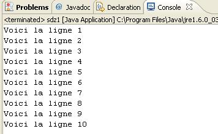

<pre class="code-block"><code data-claire-semantic="java" data-code="{&quot;language&quot;:&quot;java&quot;,&quot;source&quot;:&quot;for(int i = 10; i &amp;#x3E;= 0; i--)\n  System.out.println(&amp;#x22;Il reste &amp;#x22;+i+&amp;#x22; ligne(s) &amp;#xE0; &amp;#xE9;crire&amp;#x22;);&quot;}" class="ace" data-widget="codeBlock"><div class="ace-openclassrooms"><div class="ace_static_highlight ace_show_gutter" style="counter-reset:ace_line 0"><div class="ace_line"><span class="ace_gutter ace_gutter-cell" unselectable="on"></span><span class="ace_keyword">for</span>(<span class="ace_keyword">int</span> <span class="ace_identifier">i</span> <span class="ace_keyword ace_operator">=</span> <span class="ace_constant ace_numeric">10</span>; <span class="ace_identifier">i</span> <span class="ace_keyword ace_operator">&gt;=</span> <span class="ace_constant ace_numeric">0</span>; <span class="ace_identifier">i</span><span class="ace_keyword ace_operator">--</span>)
</div><div class="ace_line"><span class="ace_gutter ace_gutter-cell" unselectable="on"></span>  <span class="ace_support ace_function">System</span>.<span class="ace_identifier">out</span>.<span class="ace_identifier">println</span>(<span class="ace_string">"Il reste "</span><span class="ace_keyword ace_operator">+</span><span class="ace_identifier">i</span><span class="ace_keyword ace_operator">+</span><span class="ace_string">" ligne(s) à écrire"</span>);
</div></div></div></code></pre>
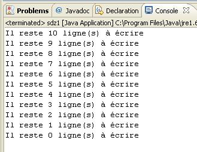

<pre class="code-block"><code data-claire-semantic="java" data-code="{&quot;language&quot;:&quot;java&quot;,&quot;source&quot;:&quot;for(int i = 0, j = 2; (i &amp;#x3C; 10 &amp;#x26;&amp;#x26; j &amp;#x3C; 6); i++, j+=2){\n  System.out.println(&amp;#x22;i = &amp;#x22; + i + &amp;#x22;, j = &amp;#x22; + j);\n}&quot;}" class="ace" data-widget="codeBlock"><div class="ace-openclassrooms"><div class="ace_static_highlight ace_show_gutter" style="counter-reset:ace_line 0"><div class="ace_line"><span class="ace_gutter ace_gutter-cell" unselectable="on"></span><span class="ace_keyword">for</span>(<span class="ace_keyword">int</span> <span class="ace_identifier">i</span> <span class="ace_keyword ace_operator">=</span> <span class="ace_constant ace_numeric">0</span>, <span class="ace_identifier">j</span> <span class="ace_keyword ace_operator">=</span> <span class="ace_constant ace_numeric">2</span>; (<span class="ace_identifier">i</span> <span class="ace_keyword ace_operator">&lt;</span> <span class="ace_constant ace_numeric">10</span> <span class="ace_keyword ace_operator">&amp;&amp;</span> <span class="ace_identifier">j</span> <span class="ace_keyword ace_operator">&lt;</span> <span class="ace_constant ace_numeric">6</span>); <span class="ace_identifier">i</span><span class="ace_keyword ace_operator">++</span>, <span class="ace_identifier">j</span><span class="ace_keyword ace_operator">+=</span><span class="ace_constant ace_numeric">2</span>){
</div><div class="ace_line"><span class="ace_gutter ace_gutter-cell" unselectable="on"></span>  <span class="ace_support ace_function">System</span>.<span class="ace_identifier">out</span>.<span class="ace_identifier">println</span>(<span class="ace_string">"i = "</span> <span class="ace_keyword ace_operator">+</span> <span class="ace_identifier">i</span> <span class="ace_keyword ace_operator">+</span> <span class="ace_string">", j = "</span> <span class="ace_keyword ace_operator">+</span> <span class="ace_identifier">j</span>);
</div><div class="ace_line"><span class="ace_gutter ace_gutter-cell" unselectable="on"></span>}
</div></div></div></code></pre>

<h3>TP : conversion Celsius - Fahrenheit</h3>
<p>Voici les caractéristiques du programme que nous allons devoir réaliser:</p>
<ul>
  <li>Le programme demande quelle conversion nous souhaitons effectuer, Celsius vers Fahrenheit ou l'inverse ;</li>
  <li>On n'autorise que les modes de conversion définis dans le programme (un simple contrôle sur la saisie fera l'affaire) ;</li>
  <li>Enfin, on demande à la fin à l'utilisateur s'il veut faire une nouvelle conversion, ce qui signifie que l'on doit pouvoir revenir au début du programme !</li>
</ul>

<p>Voici la formule de conversion pour passer des degrés Celsius en degrés Fahrenheit :</p>
<pre>				F=(9/5)×C+32</pre>
<p>Pour l'opération inverse, c'est comme ceci :</p>
<pre>				C=(F−32)×5/9</pre>
<p>La figure suivante est un aperçu de ce que je vous demande.</p>
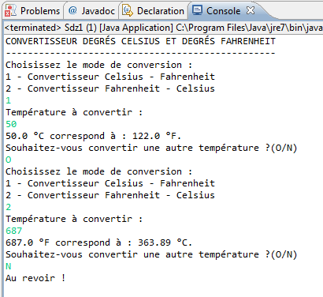

<h3><a name="tableaux">Tableaux à une dimension</a></h3>
<pre class="code-block"><code data-claire-semantic="java" data-code="{&quot;language&quot;:&quot;java&quot;,&quot;source&quot;:&quot;int tableauEntier[] = {0,1,2,3,4,5,6,7,8,9};\ndouble tableauDouble[] = {0.0,1.0,2.0,3.0,4.0,5.0,6.0,7.0,8.0,9.0};\nchar tableauCaractere[] = {&amp;#x27;a&amp;#x27;,&amp;#x27;b&amp;#x27;,&amp;#x27;c&amp;#x27;,&amp;#x27;d&amp;#x27;,&amp;#x27;e&amp;#x27;,&amp;#x27;f&amp;#x27;,&amp;#x27;g&amp;#x27;};\nString tableauChaine[] = {&amp;#x22;chaine1&amp;#x22;, &amp;#x22;chaine2&amp;#x22;, &amp;#x22;chaine3&amp;#x22; , &amp;#x22;chaine4&amp;#x22;};&quot;}" class="ace" data-widget="codeBlock"><div class="ace-openclassrooms"><div class="ace_static_highlight ace_show_gutter" style="counter-reset:ace_line 0"><div class="ace_line"><span class="ace_gutter ace_gutter-cell" unselectable="on"></span><span class="ace_keyword">int</span> <span class="ace_identifier">tableauEntier</span>[] <span class="ace_keyword ace_operator">=</span> {<span class="ace_constant ace_numeric">0</span>,<span class="ace_constant ace_numeric">1</span>,<span class="ace_constant ace_numeric">2</span>,<span class="ace_constant ace_numeric">3</span>,<span class="ace_constant ace_numeric">4</span>,<span class="ace_constant ace_numeric">5</span>,<span class="ace_constant ace_numeric">6</span>,<span class="ace_constant ace_numeric">7</span>,<span class="ace_constant ace_numeric">8</span>,<span class="ace_constant ace_numeric">9</span>};
</div><div class="ace_line"><span class="ace_gutter ace_gutter-cell" unselectable="on"></span><span class="ace_keyword">double</span> <span class="ace_identifier">tableauDouble</span>[] <span class="ace_keyword ace_operator">=</span> {<span class="ace_constant ace_numeric">0.0</span>,<span class="ace_constant ace_numeric">1.0</span>,<span class="ace_constant ace_numeric">2.0</span>,<span class="ace_constant ace_numeric">3.0</span>,<span class="ace_constant ace_numeric">4.0</span>,<span class="ace_constant ace_numeric">5.0</span>,<span class="ace_constant ace_numeric">6.0</span>,<span class="ace_constant ace_numeric">7.0</span>,<span class="ace_constant ace_numeric">8.0</span>,<span class="ace_constant ace_numeric">9.0</span>};
</div><div class="ace_line"><span class="ace_gutter ace_gutter-cell" unselectable="on"></span><span class="ace_keyword">char</span> <span class="ace_identifier">tableauCaractere</span>[] <span class="ace_keyword ace_operator">=</span> {<span class="ace_string">'a'</span>,<span class="ace_string">'b'</span>,<span class="ace_string">'c'</span>,<span class="ace_string">'d'</span>,<span class="ace_string">'e'</span>,<span class="ace_string">'f'</span>,<span class="ace_string">'g'</span>};
</div><div class="ace_line"><span class="ace_gutter ace_gutter-cell" unselectable="on"></span><span class="ace_support ace_function">String</span> <span class="ace_identifier">tableauChaine</span>[] <span class="ace_keyword ace_operator">=</span> {<span class="ace_string">"chaine1"</span>, <span class="ace_string">"chaine2"</span>, <span class="ace_string">"chaine3"</span> , <span class="ace_string">"chaine4"</span>};</div></div></div></code></pre>

<p>Vous pouvez aussi déclarer un tableau vide, mais celui-ci devra impérativement contenir un nombre de cases bien défini. Par exemple, si vous voulez un tableau vide de six entiers :</p>
<pre class="code-block"><code data-claire-semantic="java" data-code="{&quot;language&quot;:&quot;java&quot;,&quot;source&quot;:&quot;int tableauEntier[] = new int[6];\n//Ou encore\nint[] tableauEntier2 = new int[6];&quot;}" class="ace" data-widget="codeBlock"><div class="ace-openclassrooms"><div class="ace_static_highlight ace_show_gutter" style="counter-reset:ace_line 0"><div class="ace_line"><span class="ace_gutter ace_gutter-cell" unselectable="on"></span><span class="ace_keyword">int</span> <span class="ace_identifier">tableauEntier</span>[] <span class="ace_keyword ace_operator">=</span> <span class="ace_keyword">new</span> <span class="ace_keyword">int</span>[<span class="ace_constant ace_numeric">6</span>];
</div><div class="ace_line"><span class="ace_gutter ace_gutter-cell" unselectable="on"></span><span class="ace_comment">//Ou encore</span>
</div><div class="ace_line"><span class="ace_gutter ace_gutter-cell" unselectable="on"></span><span class="ace_keyword">int</span>[] <span class="ace_identifier">tableauEntier2</span> <span class="ace_keyword ace_operator">=</span> <span class="ace_keyword">new</span> <span class="ace_keyword">int</span>[<span class="ace_constant ace_numeric">6</span>];</div></div></div></code></pre>

<h3>Tableaux multidimensionnels</h3>
<pre class="code-block"><code data-claire-semantic="java" data-code="{&quot;language&quot;:&quot;java&quot;,&quot;source&quot;:&quot;int premiersNombres[][] = { {0,2,4,6,8},{1,3,5,7,9} };&quot;}" class="ace" data-widget="codeBlock"><div class="ace-openclassrooms"><div class="ace_static_highlight ace_show_gutter" style="counter-reset:ace_line 0"><div class="ace_line"><span class="ace_gutter ace_gutter-cell" unselectable="on"></span><span class="ace_keyword">int</span> <span class="ace_identifier">premiersNombres</span>[][] <span class="ace_keyword ace_operator">=</span> { {<span class="ace_constant ace_numeric">0</span>,<span class="ace_constant ace_numeric">2</span>,<span class="ace_constant ace_numeric">4</span>,<span class="ace_constant ace_numeric">6</span>,<span class="ace_constant ace_numeric">8</span>},{<span class="ace_constant ace_numeric">1</span>,<span class="ace_constant ace_numeric">3</span>,<span class="ace_constant ace_numeric">5</span>,<span class="ace_constant ace_numeric">7</span>,<span class="ace_constant ace_numeric">9</span>} };
</div></div></div></code></pre>
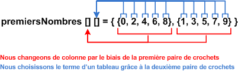

<h3>Utiliser et rechercher dans un tableau</h3>
<pre class="code-block"><code data-claire-semantic="java" data-code="{&quot;language&quot;:&quot;java&quot;,&quot;source&quot;:&quot;char tableauCaractere[] = {&amp;#x27;a&amp;#x27;, &amp;#x27;b&amp;#x27;, &amp;#x27;c&amp;#x27;, &amp;#x27;d&amp;#x27;, &amp;#x27;e&amp;#x27;, &amp;#x27;f&amp;#x27;, &amp;#x27;g&amp;#x27;};\nint i = 0;\nchar reponse = &amp;#x27; &amp;#x27;,carac = &amp;#x27; &amp;#x27;;\nScanner sc = new Scanner(System.in);\n         \ndo {//Boucle principale\n  do {//On r&amp;#xE9;p&amp;#xE8;te cette boucle tant que l&amp;#x27;utilisateur n&amp;#x27;a pas rentr&amp;#xE9; une lettre figurant dans le tableau\n    i = 0;\n    System.out.println(&amp;#x22;Rentrez une lettre en minuscule, SVP &amp;#x22;);\n                \n    carac = sc.nextLine().charAt(0);\n    //Boucle de recherche dans le tableau\n    while(i &amp;#x3C; tableauCaractere.length &amp;#x26;&amp;#x26; carac != tableauCaractere[i])\n      i++;\n         \n    //Si i &amp;#x3C; 7 c&amp;#x27;est que la boucle n&amp;#x27;a pas d&amp;#xE9;pass&amp;#xE9; le nombre de cases du tableau \n    if (i &amp;#x3C; tableauCaractere.length)\n      System.out.println(&amp;#x22; La lettre &amp;#x22; +carac+ &amp;#x22; se trouve bien dans le tableau !&amp;#x22;);\n    else //Sinon\n      System.out.println(&amp;#x22; La lettre &amp;#x22; +carac+ &amp;#x22; ne se trouve pas dans le tableau !&amp;#x22;);\n         \n  }while(i &amp;#x3E;= tableauCaractere.length);\n\n  //Tant que la lettre de l&amp;#x27;utilisateur ne correspond pas &amp;#xE0; une lettre du tableau    \n  do{\n    System.out.println(&amp;#x22;Voulez-vous essayer &amp;#xE0; nouveau ? (O/N)&amp;#x22;);\n    reponse = sc.nextLine().charAt(0);\n  }while(reponse != &amp;#x27;N&amp;#x27; &amp;#x26;&amp;#x26; reponse != &amp;#x27;O&amp;#x27;);      \n}while (reponse == &amp;#x27;O&amp;#x27;);\n                \nSystem.out.println(&amp;#x22;Au revoir !&amp;#x22;);&quot;}" class="ace" data-widget="codeBlock"><div class="ace-openclassrooms"><div class="ace_static_highlight ace_show_gutter" style="counter-reset:ace_line 0"><div class="ace_line"><span class="ace_gutter ace_gutter-cell" unselectable="on"></span><span class="ace_keyword">char</span> <span class="ace_identifier">tableauCaractere</span>[] <span class="ace_keyword ace_operator">=</span> {<span class="ace_string">'a'</span>, <span class="ace_string">'b'</span>, <span class="ace_string">'c'</span>, <span class="ace_string">'d'</span>, <span class="ace_string">'e'</span>, <span class="ace_string">'f'</span>, <span class="ace_string">'g'</span>};
</div><div class="ace_line"><span class="ace_gutter ace_gutter-cell" unselectable="on"></span><span class="ace_keyword">int</span> <span class="ace_identifier">i</span> <span class="ace_keyword ace_operator">=</span> <span class="ace_constant ace_numeric">0</span>;
</div><div class="ace_line"><span class="ace_gutter ace_gutter-cell" unselectable="on"></span><span class="ace_keyword">char</span> <span class="ace_identifier">reponse</span> <span class="ace_keyword ace_operator">=</span> <span class="ace_string">' '</span>,<span class="ace_identifier">carac</span> <span class="ace_keyword ace_operator">=</span> <span class="ace_string">' '</span>;
</div><div class="ace_line"><span class="ace_gutter ace_gutter-cell" unselectable="on"></span><span class="ace_identifier">Scanner</span> <span class="ace_identifier">sc</span> <span class="ace_keyword ace_operator">=</span> <span class="ace_keyword">new</span> <span class="ace_identifier">Scanner</span>(<span class="ace_support ace_function">System</span>.<span class="ace_identifier">in</span>);
</div><div class="ace_line"><span class="ace_gutter ace_gutter-cell" unselectable="on"></span><span class="ace_indent-guide">    </span><span class="ace_indent-guide">    </span> 
</div><div class="ace_line"><span class="ace_gutter ace_gutter-cell" unselectable="on"></span><span class="ace_keyword">do</span> {<span class="ace_comment">//Boucle principale</span>
</div><div class="ace_line"><span class="ace_gutter ace_gutter-cell" unselectable="on"></span>  <span class="ace_keyword">do</span> {<span class="ace_comment">//On répète cette boucle tant que l'utilisateur n'a pas rentré une lettre figurant dans le tableau</span>
</div><div class="ace_line"><span class="ace_gutter ace_gutter-cell" unselectable="on"></span>    <span class="ace_identifier">i</span> <span class="ace_keyword ace_operator">=</span> <span class="ace_constant ace_numeric">0</span>;
</div><div class="ace_line"><span class="ace_gutter ace_gutter-cell" unselectable="on"></span>    <span class="ace_support ace_function">System</span>.<span class="ace_identifier">out</span>.<span class="ace_identifier">println</span>(<span class="ace_string">"Rentrez une lettre en minuscule, SVP "</span>);
</div><div class="ace_line"><span class="ace_gutter ace_gutter-cell" unselectable="on"></span><span class="ace_indent-guide">    </span><span class="ace_indent-guide">    </span><span class="ace_indent-guide">    </span>    
</div><div class="ace_line"><span class="ace_gutter ace_gutter-cell" unselectable="on"></span>    <span class="ace_identifier">carac</span> <span class="ace_keyword ace_operator">=</span> <span class="ace_identifier">sc</span>.<span class="ace_identifier">nextLine</span>().<span class="ace_identifier">charAt</span>(<span class="ace_constant ace_numeric">0</span>);
</div><div class="ace_line"><span class="ace_gutter ace_gutter-cell" unselectable="on"></span>    <span class="ace_comment">//Boucle de recherche dans le tableau</span>
</div><div class="ace_line"><span class="ace_gutter ace_gutter-cell" unselectable="on"></span>    <span class="ace_keyword">while</span>(<span class="ace_identifier">i</span> <span class="ace_keyword ace_operator">&lt;</span> <span class="ace_identifier">tableauCaractere</span>.<span class="ace_identifier">length</span> <span class="ace_keyword ace_operator">&amp;&amp;</span> <span class="ace_identifier">carac</span> <span class="ace_keyword ace_operator">!=</span> <span class="ace_identifier">tableauCaractere</span>[<span class="ace_identifier">i</span>])
</div><div class="ace_line"><span class="ace_gutter ace_gutter-cell" unselectable="on"></span><span class="ace_indent-guide">    </span>  <span class="ace_identifier">i</span><span class="ace_keyword ace_operator">++</span>;
</div><div class="ace_line"><span class="ace_gutter ace_gutter-cell" unselectable="on"></span><span class="ace_indent-guide">    </span><span class="ace_indent-guide">    </span> 
</div><div class="ace_line"><span class="ace_gutter ace_gutter-cell" unselectable="on"></span>    <span class="ace_comment">//Si i &lt; 7 c'est que la boucle n'a pas dépassé le nombre de cases du tableau </span>
</div><div class="ace_line"><span class="ace_gutter ace_gutter-cell" unselectable="on"></span>    <span class="ace_keyword">if</span> (<span class="ace_identifier">i</span> <span class="ace_keyword ace_operator">&lt;</span> <span class="ace_identifier">tableauCaractere</span>.<span class="ace_identifier">length</span>)
</div><div class="ace_line"><span class="ace_gutter ace_gutter-cell" unselectable="on"></span><span class="ace_indent-guide">    </span>  <span class="ace_support ace_function">System</span>.<span class="ace_identifier">out</span>.<span class="ace_identifier">println</span>(<span class="ace_string">" La lettre "</span> <span class="ace_keyword ace_operator">+</span><span class="ace_identifier">carac</span><span class="ace_keyword ace_operator">+</span> <span class="ace_string">" se trouve bien dans le tableau !"</span>);
</div><div class="ace_line"><span class="ace_gutter ace_gutter-cell" unselectable="on"></span>    <span class="ace_keyword">else</span> <span class="ace_comment">//Sinon</span>
</div><div class="ace_line"><span class="ace_gutter ace_gutter-cell" unselectable="on"></span><span class="ace_indent-guide">    </span>  <span class="ace_support ace_function">System</span>.<span class="ace_identifier">out</span>.<span class="ace_identifier">println</span>(<span class="ace_string">" La lettre "</span> <span class="ace_keyword ace_operator">+</span><span class="ace_identifier">carac</span><span class="ace_keyword ace_operator">+</span> <span class="ace_string">" ne se trouve pas dans le tableau !"</span>);
</div><div class="ace_line"><span class="ace_gutter ace_gutter-cell" unselectable="on"></span><span class="ace_indent-guide">    </span><span class="ace_indent-guide">    </span> 
</div><div class="ace_line"><span class="ace_gutter ace_gutter-cell" unselectable="on"></span>  }<span class="ace_keyword">while</span>(<span class="ace_identifier">i</span> <span class="ace_keyword ace_operator">&gt;=</span> <span class="ace_identifier">tableauCaractere</span>.<span class="ace_identifier">length</span>);
</div><div class="ace_line"><span class="ace_gutter ace_gutter-cell" unselectable="on"></span>
</div><div class="ace_line"><span class="ace_gutter ace_gutter-cell" unselectable="on"></span>  <span class="ace_comment">//Tant que la lettre de l'utilisateur ne correspond pas à une lettre du tableau    </span>
</div><div class="ace_line"><span class="ace_gutter ace_gutter-cell" unselectable="on"></span>  <span class="ace_keyword">do</span>{
</div><div class="ace_line"><span class="ace_gutter ace_gutter-cell" unselectable="on"></span>    <span class="ace_support ace_function">System</span>.<span class="ace_identifier">out</span>.<span class="ace_identifier">println</span>(<span class="ace_string">"Voulez-vous essayer à nouveau ? (O/N)"</span>);
</div><div class="ace_line"><span class="ace_gutter ace_gutter-cell" unselectable="on"></span>    <span class="ace_identifier">reponse</span> <span class="ace_keyword ace_operator">=</span> <span class="ace_identifier">sc</span>.<span class="ace_identifier">nextLine</span>().<span class="ace_identifier">charAt</span>(<span class="ace_constant ace_numeric">0</span>);
</div><div class="ace_line"><span class="ace_gutter ace_gutter-cell" unselectable="on"></span>  }<span class="ace_keyword">while</span>(<span class="ace_identifier">reponse</span> <span class="ace_keyword ace_operator">!=</span> <span class="ace_string">'N'</span> <span class="ace_keyword ace_operator">&amp;&amp;</span> <span class="ace_identifier">reponse</span> <span class="ace_keyword ace_operator">!=</span> <span class="ace_string">'O'</span>);      
</div><div class="ace_line"><span class="ace_gutter ace_gutter-cell" unselectable="on"></span>}<span class="ace_keyword">while</span> (<span class="ace_identifier">reponse</span> <span class="ace_keyword ace_operator">==</span> <span class="ace_string">'O'</span>);
</div><div class="ace_line"><span class="ace_gutter ace_gutter-cell" unselectable="on"></span><span class="ace_indent-guide">    </span><span class="ace_indent-guide">    </span><span class="ace_indent-guide">    </span>    
</div><div class="ace_line"><span class="ace_gutter ace_gutter-cell" unselectable="on"></span><span class="ace_support ace_function">System</span>.<span class="ace_identifier">out</span>.<span class="ace_identifier">println</span>(<span class="ace_string">"Au revoir !"</span>);</div></div></div></code></pre>

<p>Le résultat de ce code se trouve à la figure suivante.</p>


<h3>Parcourir un tableau multidimensionnel</h3>
<pre class="code-block"><code data-claire-semantic="java" data-code="{&quot;language&quot;:&quot;java&quot;,&quot;source&quot;:&quot;int premiersNombres[][] = { {0,2,4,6,8},{1,3,5,7,9} }, i = 0, j = 0;\n \nwhile (i &amp;#x3C; 2)\n{\n  j = 0;\n  while(j &amp;#x3C; 5)\n  {\n    System.out.print(premiersNombres[i][j]);\n    j++;\n  }\n  System.out.println(&amp;#x22;&amp;#x22;);\n  i++;\n}&quot;}" class="ace" data-widget="codeBlock"><div class="ace-openclassrooms"><div class="ace_static_highlight ace_show_gutter" style="counter-reset:ace_line 0"><div class="ace_line"><span class="ace_gutter ace_gutter-cell" unselectable="on"></span><span class="ace_keyword">int</span> <span class="ace_identifier">premiersNombres</span>[][] <span class="ace_keyword ace_operator">=</span> { {<span class="ace_constant ace_numeric">0</span>,<span class="ace_constant ace_numeric">2</span>,<span class="ace_constant ace_numeric">4</span>,<span class="ace_constant ace_numeric">6</span>,<span class="ace_constant ace_numeric">8</span>},{<span class="ace_constant ace_numeric">1</span>,<span class="ace_constant ace_numeric">3</span>,<span class="ace_constant ace_numeric">5</span>,<span class="ace_constant ace_numeric">7</span>,<span class="ace_constant ace_numeric">9</span>} }, <span class="ace_identifier">i</span> <span class="ace_keyword ace_operator">=</span> <span class="ace_constant ace_numeric">0</span>, <span class="ace_identifier">j</span> <span class="ace_keyword ace_operator">=</span> <span class="ace_constant ace_numeric">0</span>;
</div><div class="ace_line"><span class="ace_gutter ace_gutter-cell" unselectable="on"></span> 
</div><div class="ace_line"><span class="ace_gutter ace_gutter-cell" unselectable="on"></span><span class="ace_keyword">while</span> (<span class="ace_identifier">i</span> <span class="ace_keyword ace_operator">&lt;</span> <span class="ace_constant ace_numeric">2</span>)
</div><div class="ace_line"><span class="ace_gutter ace_gutter-cell" unselectable="on"></span>{
</div><div class="ace_line"><span class="ace_gutter ace_gutter-cell" unselectable="on"></span>  <span class="ace_identifier">j</span> <span class="ace_keyword ace_operator">=</span> <span class="ace_constant ace_numeric">0</span>;
</div><div class="ace_line"><span class="ace_gutter ace_gutter-cell" unselectable="on"></span>  <span class="ace_keyword">while</span>(<span class="ace_identifier">j</span> <span class="ace_keyword ace_operator">&lt;</span> <span class="ace_constant ace_numeric">5</span>)
</div><div class="ace_line"><span class="ace_gutter ace_gutter-cell" unselectable="on"></span>  {
</div><div class="ace_line"><span class="ace_gutter ace_gutter-cell" unselectable="on"></span>    <span class="ace_support ace_function">System</span>.<span class="ace_identifier">out</span>.<span class="ace_identifier">print</span>(<span class="ace_identifier">premiersNombres</span>[<span class="ace_identifier">i</span>][<span class="ace_identifier">j</span>]);
</div><div class="ace_line"><span class="ace_gutter ace_gutter-cell" unselectable="on"></span>    <span class="ace_identifier">j</span><span class="ace_keyword ace_operator">++</span>;
</div><div class="ace_line"><span class="ace_gutter ace_gutter-cell" unselectable="on"></span>  }
</div><div class="ace_line"><span class="ace_gutter ace_gutter-cell" unselectable="on"></span>  <span class="ace_support ace_function">System</span>.<span class="ace_identifier">out</span>.<span class="ace_identifier">println</span>(<span class="ace_string">""</span>);
</div><div class="ace_line"><span class="ace_gutter ace_gutter-cell" unselectable="on"></span>  <span class="ace_identifier">i</span><span class="ace_keyword ace_operator">++</span>;
</div><div class="ace_line"><span class="ace_gutter ace_gutter-cell" unselectable="on"></span>}
</div></div></div></code></pre>

<pre class="code-block"><code data-claire-semantic="java" data-code="{&quot;language&quot;:&quot;java&quot;,&quot;source&quot;:&quot;int premiersNombres[][] = { {0,2,4,6,8},{1,3,5,7,9} };\n \nfor(int i = 0; i &amp;#x3C; 2; i++)\n{    \n  for(int j = 0; j &amp;#x3C; 5; j++)\n  {\n    System.out.print(premiersNombres[i][j]);       \n  }\n  System.out.println(&amp;#x22;&amp;#x22;);     \n}&quot;}" class="ace" data-widget="codeBlock"><div class="ace-openclassrooms"><div class="ace_static_highlight ace_show_gutter" style="counter-reset:ace_line 0"><div class="ace_line"><span class="ace_gutter ace_gutter-cell" unselectable="on"></span><span class="ace_keyword">int</span> <span class="ace_identifier">premiersNombres</span>[][] <span class="ace_keyword ace_operator">=</span> { {<span class="ace_constant ace_numeric">0</span>,<span class="ace_constant ace_numeric">2</span>,<span class="ace_constant ace_numeric">4</span>,<span class="ace_constant ace_numeric">6</span>,<span class="ace_constant ace_numeric">8</span>},{<span class="ace_constant ace_numeric">1</span>,<span class="ace_constant ace_numeric">3</span>,<span class="ace_constant ace_numeric">5</span>,<span class="ace_constant ace_numeric">7</span>,<span class="ace_constant ace_numeric">9</span>} };
</div><div class="ace_line"><span class="ace_gutter ace_gutter-cell" unselectable="on"></span> 
</div><div class="ace_line"><span class="ace_gutter ace_gutter-cell" unselectable="on"></span><span class="ace_keyword">for</span>(<span class="ace_keyword">int</span> <span class="ace_identifier">i</span> <span class="ace_keyword ace_operator">=</span> <span class="ace_constant ace_numeric">0</span>; <span class="ace_identifier">i</span> <span class="ace_keyword ace_operator">&lt;</span> <span class="ace_constant ace_numeric">2</span>; <span class="ace_identifier">i</span><span class="ace_keyword ace_operator">++</span>)
</div><div class="ace_line"><span class="ace_gutter ace_gutter-cell" unselectable="on"></span>{    
</div><div class="ace_line"><span class="ace_gutter ace_gutter-cell" unselectable="on"></span>  <span class="ace_keyword">for</span>(<span class="ace_keyword">int</span> <span class="ace_identifier">j</span> <span class="ace_keyword ace_operator">=</span> <span class="ace_constant ace_numeric">0</span>; <span class="ace_identifier">j</span> <span class="ace_keyword ace_operator">&lt;</span> <span class="ace_constant ace_numeric">5</span>; <span class="ace_identifier">j</span><span class="ace_keyword ace_operator">++</span>)
</div><div class="ace_line"><span class="ace_gutter ace_gutter-cell" unselectable="on"></span>  {
</div><div class="ace_line"><span class="ace_gutter ace_gutter-cell" unselectable="on"></span>    <span class="ace_support ace_function">System</span>.<span class="ace_identifier">out</span>.<span class="ace_identifier">print</span>(<span class="ace_identifier">premiersNombres</span>[<span class="ace_identifier">i</span>][<span class="ace_identifier">j</span>]);       
</div><div class="ace_line"><span class="ace_gutter ace_gutter-cell" unselectable="on"></span>  }
</div><div class="ace_line"><span class="ace_gutter ace_gutter-cell" unselectable="on"></span>  <span class="ace_support ace_function">System</span>.<span class="ace_identifier">out</span>.<span class="ace_identifier">println</span>(<span class="ace_string">""</span>);     
</div><div class="ace_line"><span class="ace_gutter ace_gutter-cell" unselectable="on"></span>}
</div></div></div></code></pre>

<pre class="code-block"><code data-claire-semantic="java" data-code="{&quot;language&quot;:&quot;java&quot;,&quot;source&quot;:&quot;String tab[][]={{&amp;#x22;a&amp;#x22;, &amp;#x22;b&amp;#x22;, &amp;#x22;c&amp;#x22;, &amp;#x22;d&amp;#x22;, &amp;#x22;e&amp;#x22;}, {&amp;#x22;1&amp;#x22;, &amp;#x22;2&amp;#x22;, &amp;#x22;3&amp;#x22;, &amp;#x22;4&amp;#x22;}};\nint i = 0, j = 0;\n \nfor(String sousTab[] : tab)\n{\n  i = 0;\n  for(String str : sousTab)\n  {     \n    System.out.println(&amp;#x22;La valeur de la nouvelle boucle est  : &amp;#x22; + str);\n    System.out.println(&amp;#x22;La valeur du tableau &amp;#xE0; l&amp;#x27;indice [&amp;#x22;+j+&amp;#x22;][&amp;#x22;+i+&amp;#x22;] est : &amp;#x22; + tab[j][i]);\n    i++;\n  }\n  j++;\n}&quot;}" class="ace" data-widget="codeBlock"><div class="ace-openclassrooms"><div class="ace_static_highlight ace_show_gutter" style="counter-reset:ace_line 0"><div class="ace_line"><span class="ace_gutter ace_gutter-cell" unselectable="on"></span><span class="ace_support ace_function">String</span> <span class="ace_identifier">tab</span>[][]<span class="ace_keyword ace_operator">=</span>{{<span class="ace_string">"a"</span>, <span class="ace_string">"b"</span>, <span class="ace_string">"c"</span>, <span class="ace_string">"d"</span>, <span class="ace_string">"e"</span>}, {<span class="ace_string">"1"</span>, <span class="ace_string">"2"</span>, <span class="ace_string">"3"</span>, <span class="ace_string">"4"</span>}};
</div><div class="ace_line"><span class="ace_gutter ace_gutter-cell" unselectable="on"></span><span class="ace_keyword">int</span> <span class="ace_identifier">i</span> <span class="ace_keyword ace_operator">=</span> <span class="ace_constant ace_numeric">0</span>, <span class="ace_identifier">j</span> <span class="ace_keyword ace_operator">=</span> <span class="ace_constant ace_numeric">0</span>;
</div><div class="ace_line"><span class="ace_gutter ace_gutter-cell" unselectable="on"></span> 
</div><div class="ace_line"><span class="ace_gutter ace_gutter-cell" unselectable="on"></span><span class="ace_keyword">for</span>(<span class="ace_support ace_function">String</span> <span class="ace_identifier">sousTab</span>[] : <span class="ace_identifier">tab</span>)
</div><div class="ace_line"><span class="ace_gutter ace_gutter-cell" unselectable="on"></span>{
</div><div class="ace_line"><span class="ace_gutter ace_gutter-cell" unselectable="on"></span>  <span class="ace_identifier">i</span> <span class="ace_keyword ace_operator">=</span> <span class="ace_constant ace_numeric">0</span>;
</div><div class="ace_line"><span class="ace_gutter ace_gutter-cell" unselectable="on"></span>  <span class="ace_keyword">for</span>(<span class="ace_support ace_function">String</span> <span class="ace_identifier">str</span> : <span class="ace_identifier">sousTab</span>)
</div><div class="ace_line"><span class="ace_gutter ace_gutter-cell" unselectable="on"></span>  {     
</div><div class="ace_line"><span class="ace_gutter ace_gutter-cell" unselectable="on"></span>    <span class="ace_support ace_function">System</span>.<span class="ace_identifier">out</span>.<span class="ace_identifier">println</span>(<span class="ace_string">"La valeur de la nouvelle boucle est  : "</span> <span class="ace_keyword ace_operator">+</span> <span class="ace_identifier">str</span>);
</div><div class="ace_line"><span class="ace_gutter ace_gutter-cell" unselectable="on"></span>    <span class="ace_support ace_function">System</span>.<span class="ace_identifier">out</span>.<span class="ace_identifier">println</span>(<span class="ace_string">"La valeur du tableau à l'indice ["</span><span class="ace_keyword ace_operator">+</span><span class="ace_identifier">j</span><span class="ace_keyword ace_operator">+</span><span class="ace_string">"]["</span><span class="ace_keyword ace_operator">+</span><span class="ace_identifier">i</span><span class="ace_keyword ace_operator">+</span><span class="ace_string">"] est : "</span> <span class="ace_keyword ace_operator">+</span> <span class="ace_identifier">tab</span>[<span class="ace_identifier">j</span>][<span class="ace_identifier">i</span>]);
</div><div class="ace_line"><span class="ace_gutter ace_gutter-cell" unselectable="on"></span>    <span class="ace_identifier">i</span><span class="ace_keyword ace_operator">++</span>;
</div><div class="ace_line"><span class="ace_gutter ace_gutter-cell" unselectable="on"></span>  }
</div><div class="ace_line"><span class="ace_gutter ace_gutter-cell" unselectable="on"></span>  <span class="ace_identifier">j</span><span class="ace_keyword ace_operator">++</span>;
</div><div class="ace_line"><span class="ace_gutter ace_gutter-cell" unselectable="on"></span>}
</div></div></div></code></pre>

<h3>Des méthodes concernant les chaînes de caractères</h3>
<pre class="code-block"><code data-claire-semantic="java" data-code="{&quot;language&quot;:&quot;java&quot;,&quot;source&quot;:&quot;String chaine = new String(&amp;#x22;BONJOUR TOUT LE MONDE !&amp;#x22;), chaine2 = new String();\nchaine2 = chaine.toLowerCase();   //Donne &amp;#x22;bonjour tout le monde !&amp;#x22;&quot;}" class="ace" data-widget="codeBlock"><div class="ace-openclassrooms"><div class="ace_static_highlight ace_show_gutter" style="counter-reset:ace_line 0"><div class="ace_line"><span class="ace_gutter ace_gutter-cell" unselectable="on"></span><span class="ace_support ace_function">String</span> <span class="ace_identifier">chaine</span> <span class="ace_keyword ace_operator">=</span> <span class="ace_keyword">new</span> <span class="ace_support ace_function">String</span>(<span class="ace_string">"BONJOUR TOUT LE MONDE !"</span>), <span class="ace_identifier">chaine2</span> <span class="ace_keyword ace_operator">=</span> <span class="ace_keyword">new</span> <span class="ace_support ace_function">String</span>();
</div><div class="ace_line"><span class="ace_gutter ace_gutter-cell" unselectable="on"></span><span class="ace_identifier">chaine2</span> <span class="ace_keyword ace_operator">=</span> <span class="ace_identifier">chaine</span>.<span class="ace_identifier">toLowerCase</span>();   <span class="ace_comment">//Donne "bonjour tout le monde !"</span></div></div></div></code></pre>

<pre class="code-block"><code data-claire-semantic="java" data-code="{&quot;language&quot;:&quot;java&quot;,&quot;source&quot;:&quot;String chaine = new String(&amp;#x22;bonjour bonjour&amp;#x22;), chaine2 = new String();\nchaine2 = chaine.toUpperCase();   //Donne &amp;#x22;BONJOUR BONJOUR&amp;#x22;&quot;}" class="ace" data-widget="codeBlock"><div class="ace-openclassrooms"><div class="ace_static_highlight ace_show_gutter" style="counter-reset:ace_line 0"><div class="ace_line"><span class="ace_gutter ace_gutter-cell" unselectable="on"></span><span class="ace_support ace_function">String</span> <span class="ace_identifier">chaine</span> <span class="ace_keyword ace_operator">=</span> <span class="ace_keyword">new</span> <span class="ace_support ace_function">String</span>(<span class="ace_string">"bonjour bonjour"</span>), <span class="ace_identifier">chaine2</span> <span class="ace_keyword ace_operator">=</span> <span class="ace_keyword">new</span> <span class="ace_support ace_function">String</span>();
</div><div class="ace_line"><span class="ace_gutter ace_gutter-cell" unselectable="on"></span><span class="ace_identifier">chaine2</span> <span class="ace_keyword ace_operator">=</span> <span class="ace_identifier">chaine</span>.<span class="ace_identifier">toUpperCase</span>();   <span class="ace_comment">//Donne "BONJOUR BONJOUR"</span></div></div></div></code></pre>

<pre class="code-block"><code data-claire-semantic="java" data-code="{&quot;language&quot;:&quot;java&quot;,&quot;source&quot;:&quot;String chaine = new String(&amp;#x22;bonjour ! &amp;#x22;); \nint longueur = 0;\nlongueur = chaine.length();   //Renvoie 9&quot;}" class="ace" data-widget="codeBlock"><div class="ace-openclassrooms"><div class="ace_static_highlight ace_show_gutter" style="counter-reset:ace_line 0"><div class="ace_line"><span class="ace_gutter ace_gutter-cell" unselectable="on"></span><span class="ace_support ace_function">String</span> <span class="ace_identifier">chaine</span> <span class="ace_keyword ace_operator">=</span> <span class="ace_keyword">new</span> <span class="ace_support ace_function">String</span>(<span class="ace_string">"bonjour ! "</span>); 
</div><div class="ace_line"><span class="ace_gutter ace_gutter-cell" unselectable="on"></span><span class="ace_keyword">int</span> <span class="ace_identifier">longueur</span> <span class="ace_keyword ace_operator">=</span> <span class="ace_constant ace_numeric">0</span>;
</div><div class="ace_line"><span class="ace_gutter ace_gutter-cell" unselectable="on"></span><span class="ace_identifier">longueur</span> <span class="ace_keyword ace_operator">=</span> <span class="ace_identifier">chaine</span>.<span class="ace_identifier">length</span>();   <span class="ace_comment">//Renvoie 9</span></div></div></div></code></pre>

<pre class="code-block"><code data-claire-semantic="java" data-code="{&quot;language&quot;:&quot;java&quot;,&quot;source&quot;:&quot;String str1 = new String(&amp;#x22;bonjour&amp;#x22;), str2 = new String(&amp;#x22;bonsoir&amp;#x22;);\n \nif (str1.equals(str2))\n  System.out.println(&amp;#x22;Les deux cha&amp;#xEE;nes sont identiques !&amp;#x22;);\n \nelse\n  System.out.println(&amp;#x22;Les deux cha&amp;#xEE;nes sont diff&amp;#xE9;rentes !&amp;#x22;);&quot;}" class="ace" data-widget="codeBlock"><div class="ace-openclassrooms"><div class="ace_static_highlight ace_show_gutter" style="counter-reset:ace_line 0"><div class="ace_line"><span class="ace_gutter ace_gutter-cell" unselectable="on"></span><span class="ace_support ace_function">String</span> <span class="ace_identifier">str1</span> <span class="ace_keyword ace_operator">=</span> <span class="ace_keyword">new</span> <span class="ace_support ace_function">String</span>(<span class="ace_string">"bonjour"</span>), <span class="ace_identifier">str2</span> <span class="ace_keyword ace_operator">=</span> <span class="ace_keyword">new</span> <span class="ace_support ace_function">String</span>(<span class="ace_string">"bonsoir"</span>);
</div><div class="ace_line"><span class="ace_gutter ace_gutter-cell" unselectable="on"></span> 
</div><div class="ace_line"><span class="ace_gutter ace_gutter-cell" unselectable="on"></span><span class="ace_keyword">if</span> (<span class="ace_identifier">str1</span>.<span class="ace_identifier">equals</span>(<span class="ace_identifier">str2</span>))
</div><div class="ace_line"><span class="ace_gutter ace_gutter-cell" unselectable="on"></span>  <span class="ace_support ace_function">System</span>.<span class="ace_identifier">out</span>.<span class="ace_identifier">println</span>(<span class="ace_string">"Les deux chaînes sont identiques !"</span>);
</div><div class="ace_line"><span class="ace_gutter ace_gutter-cell" unselectable="on"></span> 
</div><div class="ace_line"><span class="ace_gutter ace_gutter-cell" unselectable="on"></span><span class="ace_keyword">else</span>
</div><div class="ace_line"><span class="ace_gutter ace_gutter-cell" unselectable="on"></span>  <span class="ace_support ace_function">System</span>.<span class="ace_identifier">out</span>.<span class="ace_identifier">println</span>(<span class="ace_string">"Les deux chaînes sont différentes !"</span>);
</div></div></div></code></pre>

<pre class="code-block"><code data-claire-semantic="java" data-code="{&quot;language&quot;:&quot;java&quot;,&quot;source&quot;:&quot;String nbre = new String(&amp;#x22;1234567&amp;#x22;);\nchar carac = nbre.charAt(4);   //Renverra ici le caract&amp;#xE8;re 5&quot;}" class="ace" data-widget="codeBlock"><div class="ace-openclassrooms"><div class="ace_static_highlight ace_show_gutter" style="counter-reset:ace_line 0"><div class="ace_line"><span class="ace_gutter ace_gutter-cell" unselectable="on"></span><span class="ace_support ace_function">String</span> <span class="ace_identifier">nbre</span> <span class="ace_keyword ace_operator">=</span> <span class="ace_keyword">new</span> <span class="ace_support ace_function">String</span>(<span class="ace_string">"1234567"</span>);
</div><div class="ace_line"><span class="ace_gutter ace_gutter-cell" unselectable="on"></span><span class="ace_keyword">char</span> <span class="ace_identifier">carac</span> <span class="ace_keyword ace_operator">=</span> <span class="ace_identifier">nbre</span>.<span class="ace_identifier">charAt</span>(<span class="ace_constant ace_numeric">4</span>);   <span class="ace_comment">//Renverra ici le caractère 5</span></div></div></div></code></pre>

<pre class="code-block"><code data-claire-semantic="java" data-code="{&quot;language&quot;:&quot;java&quot;,&quot;source&quot;:&quot;String chaine = new String(&amp;#x22;la paix niche&amp;#x22;), chaine2 = new String();\nchaine2 = chaine.substring(3,13);   //Permet d&amp;#x27;extraire &amp;#x22;paix niche&amp;#x22;&quot;}" class="ace" data-widget="codeBlock"><div class="ace-openclassrooms"><div class="ace_static_highlight ace_show_gutter" style="counter-reset:ace_line 0"><div class="ace_line"><span class="ace_gutter ace_gutter-cell" unselectable="on"></span><span class="ace_support ace_function">String</span> <span class="ace_identifier">chaine</span> <span class="ace_keyword ace_operator">=</span> <span class="ace_keyword">new</span> <span class="ace_support ace_function">String</span>(<span class="ace_string">"la paix niche"</span>), <span class="ace_identifier">chaine2</span> <span class="ace_keyword ace_operator">=</span> <span class="ace_keyword">new</span> <span class="ace_support ace_function">String</span>();
</div><div class="ace_line"><span class="ace_gutter ace_gutter-cell" unselectable="on"></span><span class="ace_identifier">chaine2</span> <span class="ace_keyword ace_operator">=</span> <span class="ace_identifier">chaine</span>.<span class="ace_identifier">substring</span>(<span class="ace_constant ace_numeric">3</span>,<span class="ace_constant ace_numeric">13</span>);   <span class="ace_comment">//Permet d'extraire "paix niche"</span></div></div></div></code></pre>

<pre class="code-block"><code data-claire-semantic="java" data-code="{&quot;language&quot;:&quot;java&quot;,&quot;source&quot;:&quot;String mot = new String(&amp;#x22;anticonstitutionnellement&amp;#x22;);\nint n = 0;\n \nn = mot.indexOf(&amp;#x27;t&amp;#x27;);           //n vaut 2\nn = mot.lastIndexOf(&amp;#x27;t&amp;#x27;);       //n vaut 24\nn = mot.indexOf(&amp;#x22;ti&amp;#x22;);          //n vaut 2\nn = mot.lastIndexOf(&amp;#x22;ti&amp;#x22;);      //n vaut 12\nn = mot.indexOf(&amp;#x27;x&amp;#x27;);           //n vaut -1&quot;}" class="ace" data-widget="codeBlock"><div class="ace-openclassrooms"><div class="ace_static_highlight ace_show_gutter" style="counter-reset:ace_line 0"><div class="ace_line"><span class="ace_gutter ace_gutter-cell" unselectable="on"></span><span class="ace_support ace_function">String</span> <span class="ace_identifier">mot</span> <span class="ace_keyword ace_operator">=</span> <span class="ace_keyword">new</span> <span class="ace_support ace_function">String</span>(<span class="ace_string">"anticonstitutionnellement"</span>);
</div><div class="ace_line"><span class="ace_gutter ace_gutter-cell" unselectable="on"></span><span class="ace_keyword">int</span> <span class="ace_identifier">n</span> <span class="ace_keyword ace_operator">=</span> <span class="ace_constant ace_numeric">0</span>;
</div><div class="ace_line"><span class="ace_gutter ace_gutter-cell" unselectable="on"></span> 
</div><div class="ace_line"><span class="ace_gutter ace_gutter-cell" unselectable="on"></span><span class="ace_identifier">n</span> <span class="ace_keyword ace_operator">=</span> <span class="ace_identifier">mot</span>.<span class="ace_identifier">indexOf</span>(<span class="ace_string">'t'</span>);           <span class="ace_comment">//n vaut 2</span>
</div><div class="ace_line"><span class="ace_gutter ace_gutter-cell" unselectable="on"></span><span class="ace_identifier">n</span> <span class="ace_keyword ace_operator">=</span> <span class="ace_identifier">mot</span>.<span class="ace_identifier">lastIndexOf</span>(<span class="ace_string">'t'</span>);       <span class="ace_comment">//n vaut 24</span>
</div><div class="ace_line"><span class="ace_gutter ace_gutter-cell" unselectable="on"></span><span class="ace_identifier">n</span> <span class="ace_keyword ace_operator">=</span> <span class="ace_identifier">mot</span>.<span class="ace_identifier">indexOf</span>(<span class="ace_string">"ti"</span>);          <span class="ace_comment">//n vaut 2</span>
</div><div class="ace_line"><span class="ace_gutter ace_gutter-cell" unselectable="on"></span><span class="ace_identifier">n</span> <span class="ace_keyword ace_operator">=</span> <span class="ace_identifier">mot</span>.<span class="ace_identifier">lastIndexOf</span>(<span class="ace_string">"ti"</span>);      <span class="ace_comment">//n vaut 12</span>
</div><div class="ace_line"><span class="ace_gutter ace_gutter-cell" unselectable="on"></span><span class="ace_identifier">n</span> <span class="ace_keyword ace_operator">=</span> <span class="ace_identifier">mot</span>.<span class="ace_identifier">indexOf</span>(<span class="ace_string">'x'</span>);           <span class="ace_comment">//n vaut -1</span></div></div></div></code></pre>

<pre class="code-block"><code data-claire-semantic="java" data-code="{&quot;language&quot;:&quot;java&quot;,&quot;source&quot;:&quot;double X = 0.0;\nX = Math.random();\n//Retourne un nombre al&amp;#xE9;atoire \n//compris entre 0 et 1, comme 0.0001385746329371058\n\ndouble sin = Math.sin(120);     //La fonction sinus\ndouble cos = Math.cos(120);     //La fonction cosinus\ndouble tan = Math.tan(120);     //La fonction tangente\ndouble abs = Math.abs(-120.25); //La fonction valeur absolue (retourne le nombre sans le signe)\ndouble d = 2;\ndouble exp = Math.pow(d, 2);    //La fonction exposant\n//Ici, on initialise la variable exp avec la valeur de d &amp;#xE9;lev&amp;#xE9;e au carr&amp;#xE9;\n//La m&amp;#xE9;thode pow() prend donc une valeur en premier param&amp;#xE8;tre, et un exposant en second&quot;}" class="ace" data-widget="codeBlock"><div class="ace-openclassrooms"><div class="ace_static_highlight ace_show_gutter" style="counter-reset:ace_line 0"><div class="ace_line"><span class="ace_gutter ace_gutter-cell" unselectable="on"></span><span class="ace_keyword">double</span> <span class="ace_identifier">X</span> <span class="ace_keyword ace_operator">=</span> <span class="ace_constant ace_numeric">0.0</span>;
</div><div class="ace_line"><span class="ace_gutter ace_gutter-cell" unselectable="on"></span><span class="ace_identifier">X</span> <span class="ace_keyword ace_operator">=</span> <span class="ace_support ace_function">Math</span>.<span class="ace_identifier">random</span>();
</div><div class="ace_line"><span class="ace_gutter ace_gutter-cell" unselectable="on"></span><span class="ace_comment">//Retourne un nombre aléatoire </span>
</div><div class="ace_line"><span class="ace_gutter ace_gutter-cell" unselectable="on"></span><span class="ace_comment">//compris entre 0 et 1, comme 0.0001385746329371058</span>
</div><div class="ace_line"><span class="ace_gutter ace_gutter-cell" unselectable="on"></span>
</div><div class="ace_line"><span class="ace_gutter ace_gutter-cell" unselectable="on"></span><span class="ace_keyword">double</span> <span class="ace_identifier">sin</span> <span class="ace_keyword ace_operator">=</span> <span class="ace_support ace_function">Math</span>.<span class="ace_identifier">sin</span>(<span class="ace_constant ace_numeric">120</span>);     <span class="ace_comment">//La fonction sinus</span>
</div><div class="ace_line"><span class="ace_gutter ace_gutter-cell" unselectable="on"></span><span class="ace_keyword">double</span> <span class="ace_identifier">cos</span> <span class="ace_keyword ace_operator">=</span> <span class="ace_support ace_function">Math</span>.<span class="ace_identifier">cos</span>(<span class="ace_constant ace_numeric">120</span>);     <span class="ace_comment">//La fonction cosinus</span>
</div><div class="ace_line"><span class="ace_gutter ace_gutter-cell" unselectable="on"></span><span class="ace_keyword">double</span> <span class="ace_identifier">tan</span> <span class="ace_keyword ace_operator">=</span> <span class="ace_support ace_function">Math</span>.<span class="ace_identifier">tan</span>(<span class="ace_constant ace_numeric">120</span>);     <span class="ace_comment">//La fonction tangente</span>
</div><div class="ace_line"><span class="ace_gutter ace_gutter-cell" unselectable="on"></span><span class="ace_keyword">double</span> <span class="ace_identifier">abs</span> <span class="ace_keyword ace_operator">=</span> <span class="ace_support ace_function">Math</span>.<span class="ace_identifier">abs</span>(<span class="ace_constant ace_numeric">-120.25</span>); <span class="ace_comment">//La fonction valeur absolue (retourne le nombre sans le signe)</span>
</div><div class="ace_line"><span class="ace_gutter ace_gutter-cell" unselectable="on"></span><span class="ace_keyword">double</span> <span class="ace_identifier">d</span> <span class="ace_keyword ace_operator">=</span> <span class="ace_constant ace_numeric">2</span>;
</div><div class="ace_line"><span class="ace_gutter ace_gutter-cell" unselectable="on"></span><span class="ace_keyword">double</span> <span class="ace_identifier">exp</span> <span class="ace_keyword ace_operator">=</span> <span class="ace_support ace_function">Math</span>.<span class="ace_identifier">pow</span>(<span class="ace_identifier">d</span>, <span class="ace_constant ace_numeric">2</span>);    <span class="ace_comment">//La fonction exposant</span>
</div><div class="ace_line"><span class="ace_gutter ace_gutter-cell" unselectable="on"></span><span class="ace_comment">//Ici, on initialise la variable exp avec la valeur de d élevée au carré</span>
</div><div class="ace_line"><span class="ace_gutter ace_gutter-cell" unselectable="on"></span><span class="ace_comment">//La méthode pow() prend donc une valeur en premier paramètre, et un exposant en second</span>
</div></div></div></code></pre>

<h3>Créer sa propre méthode</h3>
<pre class="code-block"><code data-claire-semantic="java" data-code="{&quot;language&quot;:&quot;java&quot;,&quot;source&quot;:&quot;public class Test1\n{\n  public static void main(String[] args)\n  {\n    String[] tab = {&amp;#x22;a&amp;#x22;, &amp;#x22;b&amp;#x22;, &amp;#x22;c&amp;#x22;, &amp;#x22;d&amp;#x22;};\n    parcourirTableau(tab); \n  }\n \n  static void parcourirTableau(String[] tabBis)\n  {\n    for(String str : tabBis)\n      System.out.println(str);\n  }\n}&quot;}" class="ace" data-widget="codeBlock"><div class="ace-openclassrooms"><div class="ace_static_highlight ace_show_gutter" style="counter-reset:ace_line 0"><div class="ace_line"><span class="ace_gutter ace_gutter-cell" unselectable="on"></span><span class="ace_keyword">public</span> <span class="ace_keyword">class</span> <span class="ace_identifier">Test1</span>
</div><div class="ace_line"><span class="ace_gutter ace_gutter-cell" unselectable="on"></span>{
</div><div class="ace_line"><span class="ace_gutter ace_gutter-cell" unselectable="on"></span>  <span class="ace_keyword">public</span> <span class="ace_keyword">static</span> <span class="ace_keyword">void</span> <span class="ace_identifier">main</span>(<span class="ace_support ace_function">String</span>[] <span class="ace_identifier">args</span>)
</div><div class="ace_line"><span class="ace_gutter ace_gutter-cell" unselectable="on"></span>  {
</div><div class="ace_line"><span class="ace_gutter ace_gutter-cell" unselectable="on"></span>    <span class="ace_support ace_function">String</span>[] <span class="ace_identifier">tab</span> <span class="ace_keyword ace_operator">=</span> {<span class="ace_string">"a"</span>, <span class="ace_string">"b"</span>, <span class="ace_string">"c"</span>, <span class="ace_string">"d"</span>};
</div><div class="ace_line"><span class="ace_gutter ace_gutter-cell" unselectable="on"></span>    <span class="ace_identifier">parcourirTableau</span>(<span class="ace_identifier">tab</span>); 
</div><div class="ace_line"><span class="ace_gutter ace_gutter-cell" unselectable="on"></span>  }
</div><div class="ace_line"><span class="ace_gutter ace_gutter-cell" unselectable="on"></span> 
</div><div class="ace_line"><span class="ace_gutter ace_gutter-cell" unselectable="on"></span>  <span class="ace_keyword">static</span> <span class="ace_keyword">void</span> <span class="ace_identifier">parcourirTableau</span>(<span class="ace_support ace_function">String</span>[] <span class="ace_identifier">tabBis</span>)
</div><div class="ace_line"><span class="ace_gutter ace_gutter-cell" unselectable="on"></span>  {
</div><div class="ace_line"><span class="ace_gutter ace_gutter-cell" unselectable="on"></span>    <span class="ace_keyword">for</span>(<span class="ace_support ace_function">String</span> <span class="ace_identifier">str</span> : <span class="ace_identifier">tabBis</span>)
</div><div class="ace_line"><span class="ace_gutter ace_gutter-cell" unselectable="on"></span><span class="ace_indent-guide">    </span>  <span class="ace_support ace_function">System</span>.<span class="ace_identifier">out</span>.<span class="ace_identifier">println</span>(<span class="ace_identifier">str</span>);
</div><div class="ace_line"><span class="ace_gutter ace_gutter-cell" unselectable="on"></span>  }
</div><div class="ace_line"><span class="ace_gutter ace_gutter-cell" unselectable="on"></span>}
</div></div></div></code></pre>

<pre class="code-block"><code data-claire-semantic="java" data-code="{&quot;language&quot;:&quot;java&quot;,&quot;source&quot;:&quot;public class Test1 {\n \n  public static void main(String[] args)\n  {\n    String[] tab = {&amp;#x22;a&amp;#x22;, &amp;#x22;b&amp;#x22;, &amp;#x22;c&amp;#x22;, &amp;#x22;d&amp;#x22;};\n    parcourirTableau(tab);\n    System.out.println(toString(tab));   \n  }\n\n  static void parcourirTableau(String[] tab)\n  {\n    for(String str : tab)\n    System.out.println(str);\n  }\n           \n  static String toString(String[] tab)\n  {\n    System.out.println(&amp;#x22;M&amp;#xE9;thode toString() !\\n----------&amp;#x22;);\n    String retour = &amp;#x22;&amp;#x22;;\n                   \n    for(String str : tab)\n      retour += str + &amp;#x22;\\n&amp;#x22;; \n                   \n    return retour;\n  }         \n}&quot;}" class="ace" data-widget="codeBlock"><div class="ace-openclassrooms"><div class="ace_static_highlight ace_show_gutter" style="counter-reset:ace_line 0"><div class="ace_line"><span class="ace_gutter ace_gutter-cell" unselectable="on"></span><span class="ace_keyword">public</span> <span class="ace_keyword">class</span> <span class="ace_identifier">Test1</span> {
</div><div class="ace_line"><span class="ace_gutter ace_gutter-cell" unselectable="on"></span> 
</div><div class="ace_line"><span class="ace_gutter ace_gutter-cell" unselectable="on"></span>  <span class="ace_keyword">public</span> <span class="ace_keyword">static</span> <span class="ace_keyword">void</span> <span class="ace_identifier">main</span>(<span class="ace_support ace_function">String</span>[] <span class="ace_identifier">args</span>)
</div><div class="ace_line"><span class="ace_gutter ace_gutter-cell" unselectable="on"></span>  {
</div><div class="ace_line"><span class="ace_gutter ace_gutter-cell" unselectable="on"></span>    <span class="ace_support ace_function">String</span>[] <span class="ace_identifier">tab</span> <span class="ace_keyword ace_operator">=</span> {<span class="ace_string">"a"</span>, <span class="ace_string">"b"</span>, <span class="ace_string">"c"</span>, <span class="ace_string">"d"</span>};
</div><div class="ace_line"><span class="ace_gutter ace_gutter-cell" unselectable="on"></span>    <span class="ace_identifier">parcourirTableau</span>(<span class="ace_identifier">tab</span>);
</div><div class="ace_line"><span class="ace_gutter ace_gutter-cell" unselectable="on"></span>    <span class="ace_support ace_function">System</span>.<span class="ace_identifier">out</span>.<span class="ace_identifier">println</span>(<span class="ace_identifier">toString</span>(<span class="ace_identifier">tab</span>));   
</div><div class="ace_line"><span class="ace_gutter ace_gutter-cell" unselectable="on"></span>  }
</div><div class="ace_line"><span class="ace_gutter ace_gutter-cell" unselectable="on"></span>
</div><div class="ace_line"><span class="ace_gutter ace_gutter-cell" unselectable="on"></span>  <span class="ace_keyword">static</span> <span class="ace_keyword">void</span> <span class="ace_identifier">parcourirTableau</span>(<span class="ace_support ace_function">String</span>[] <span class="ace_identifier">tab</span>)
</div><div class="ace_line"><span class="ace_gutter ace_gutter-cell" unselectable="on"></span>  {
</div><div class="ace_line"><span class="ace_gutter ace_gutter-cell" unselectable="on"></span>    <span class="ace_keyword">for</span>(<span class="ace_support ace_function">String</span> <span class="ace_identifier">str</span> : <span class="ace_identifier">tab</span>)
</div><div class="ace_line"><span class="ace_gutter ace_gutter-cell" unselectable="on"></span>    <span class="ace_support ace_function">System</span>.<span class="ace_identifier">out</span>.<span class="ace_identifier">println</span>(<span class="ace_identifier">str</span>);
</div><div class="ace_line"><span class="ace_gutter ace_gutter-cell" unselectable="on"></span>  }
</div><div class="ace_line"><span class="ace_gutter ace_gutter-cell" unselectable="on"></span><span class="ace_indent-guide">    </span><span class="ace_indent-guide">    </span>   
</div><div class="ace_line"><span class="ace_gutter ace_gutter-cell" unselectable="on"></span>  <span class="ace_keyword">static</span> <span class="ace_support ace_function">String</span> <span class="ace_identifier">toString</span>(<span class="ace_support ace_function">String</span>[] <span class="ace_identifier">tab</span>)
</div><div class="ace_line"><span class="ace_gutter ace_gutter-cell" unselectable="on"></span>  {
</div><div class="ace_line"><span class="ace_gutter ace_gutter-cell" unselectable="on"></span>    <span class="ace_support ace_function">System</span>.<span class="ace_identifier">out</span>.<span class="ace_identifier">println</span>(<span class="ace_string">"Méthode toString() !\n----------"</span>);
</div><div class="ace_line"><span class="ace_gutter ace_gutter-cell" unselectable="on"></span>    <span class="ace_support ace_function">String</span> <span class="ace_identifier">retour</span> <span class="ace_keyword ace_operator">=</span> <span class="ace_string">""</span>;
</div><div class="ace_line"><span class="ace_gutter ace_gutter-cell" unselectable="on"></span><span class="ace_indent-guide">    </span><span class="ace_indent-guide">    </span><span class="ace_indent-guide">    </span><span class="ace_indent-guide">    </span>   
</div><div class="ace_line"><span class="ace_gutter ace_gutter-cell" unselectable="on"></span>    <span class="ace_keyword">for</span>(<span class="ace_support ace_function">String</span> <span class="ace_identifier">str</span> : <span class="ace_identifier">tab</span>)
</div><div class="ace_line"><span class="ace_gutter ace_gutter-cell" unselectable="on"></span><span class="ace_indent-guide">    </span>  <span class="ace_identifier">retour</span> <span class="ace_keyword ace_operator">+=</span> <span class="ace_identifier">str</span> <span class="ace_keyword ace_operator">+</span> <span class="ace_string">"\n"</span>; 
</div><div class="ace_line"><span class="ace_gutter ace_gutter-cell" unselectable="on"></span><span class="ace_indent-guide">    </span><span class="ace_indent-guide">    </span><span class="ace_indent-guide">    </span><span class="ace_indent-guide">    </span>   
</div><div class="ace_line"><span class="ace_gutter ace_gutter-cell" unselectable="on"></span>    <span class="ace_keyword">return</span> <span class="ace_identifier">retour</span>;
</div><div class="ace_line"><span class="ace_gutter ace_gutter-cell" unselectable="on"></span>  }         
</div><div class="ace_line"><span class="ace_gutter ace_gutter-cell" unselectable="on"></span>}
</div></div></div></code></pre>

<h3>La surcharge de méthode</h3>
<p>La surcharge de méthode consiste à garder le nom d'une méthode et à changer la liste ou le type de ses paramètres. Dans le cas qui nous intéresse, nous voulons que notre méthode <strong>parcourirTableau</strong> puisse parcourir n'importe quel type de tableau. Nous allons donc surcharger notre méthode afin qu'elle puisse aussi travailler avec des int, comme le montre cet exemple :</p>

<pre class="code-block"><code data-claire-semantic="java" data-code="{&quot;language&quot;:&quot;java&quot;,&quot;source&quot;:&quot;static void parcourirTableau(String[] tab)\n{\n  for(String str : tab)\n    System.out.println(str);\n}\n        \nstatic void parcourirTableau(int[] tab)\n{\n  for(int str : tab)\n    System.out.println(str);\n}&quot;}" class="ace" data-widget="codeBlock"><div class="ace-openclassrooms"><div class="ace_static_highlight ace_show_gutter" style="counter-reset:ace_line 0"><div class="ace_line"><span class="ace_gutter ace_gutter-cell" unselectable="on"></span><span class="ace_keyword">static</span> <span class="ace_keyword">void</span> <span class="ace_identifier">parcourirTableau</span>(<span class="ace_support ace_function">String</span>[] <span class="ace_identifier">tab</span>)
</div><div class="ace_line"><span class="ace_gutter ace_gutter-cell" unselectable="on"></span>{
</div><div class="ace_line"><span class="ace_gutter ace_gutter-cell" unselectable="on"></span>  <span class="ace_keyword">for</span>(<span class="ace_support ace_function">String</span> <span class="ace_identifier">str</span> : <span class="ace_identifier">tab</span>)
</div><div class="ace_line"><span class="ace_gutter ace_gutter-cell" unselectable="on"></span>    <span class="ace_support ace_function">System</span>.<span class="ace_identifier">out</span>.<span class="ace_identifier">println</span>(<span class="ace_identifier">str</span>);
</div><div class="ace_line"><span class="ace_gutter ace_gutter-cell" unselectable="on"></span>}
</div><div class="ace_line"><span class="ace_gutter ace_gutter-cell" unselectable="on"></span><span class="ace_indent-guide">    </span>    
</div><div class="ace_line"><span class="ace_gutter ace_gutter-cell" unselectable="on"></span><span class="ace_keyword">static</span> <span class="ace_keyword">void</span> <span class="ace_identifier">parcourirTableau</span>(<span class="ace_keyword">int</span>[] <span class="ace_identifier">tab</span>)
</div><div class="ace_line"><span class="ace_gutter ace_gutter-cell" unselectable="on"></span>{
</div><div class="ace_line"><span class="ace_gutter ace_gutter-cell" unselectable="on"></span>  <span class="ace_keyword">for</span>(<span class="ace_keyword">int</span> <span class="ace_identifier">str</span> : <span class="ace_identifier">tab</span>)
</div><div class="ace_line"><span class="ace_gutter ace_gutter-cell" unselectable="on"></span>    <span class="ace_support ace_function">System</span>.<span class="ace_identifier">out</span>.<span class="ace_identifier">println</span>(<span class="ace_identifier">str</span>);
</div><div class="ace_line"><span class="ace_gutter ace_gutter-cell" unselectable="on"></span>}
</div></div></div></code></pre>

<p>Avec ces méthodes, vous pourrez parcourir de la même manière :</p>
<ul>
  <li>Les tableaux d'entiers ;</li>
  <li>Les tableaux de chaînes de caractères.</li>
</ul>

<pre class="code-block"><code data-claire-semantic="java" data-code="{&quot;language&quot;:&quot;java&quot;,&quot;source&quot;:&quot;static void parcourirTableau(String[][] tab)\n{\n  for(String tab2[] : tab)\n  {\n    for(String str : tab2)\n      System.out.println(str);\n  }\n}&quot;}" class="ace" data-widget="codeBlock"><div class="ace-openclassrooms"><div class="ace_static_highlight ace_show_gutter" style="counter-reset:ace_line 0"><div class="ace_line"><span class="ace_gutter ace_gutter-cell" unselectable="on"></span><span class="ace_keyword">static</span> <span class="ace_keyword">void</span> <span class="ace_identifier">parcourirTableau</span>(<span class="ace_support ace_function">String</span>[][] <span class="ace_identifier">tab</span>)
</div><div class="ace_line"><span class="ace_gutter ace_gutter-cell" unselectable="on"></span>{
</div><div class="ace_line"><span class="ace_gutter ace_gutter-cell" unselectable="on"></span>  <span class="ace_keyword">for</span>(<span class="ace_support ace_function">String</span> <span class="ace_identifier">tab2</span>[] : <span class="ace_identifier">tab</span>)
</div><div class="ace_line"><span class="ace_gutter ace_gutter-cell" unselectable="on"></span>  {
</div><div class="ace_line"><span class="ace_gutter ace_gutter-cell" unselectable="on"></span>    <span class="ace_keyword">for</span>(<span class="ace_support ace_function">String</span> <span class="ace_identifier">str</span> : <span class="ace_identifier">tab2</span>)
</div><div class="ace_line"><span class="ace_gutter ace_gutter-cell" unselectable="on"></span><span class="ace_indent-guide">    </span>  <span class="ace_support ace_function">System</span>.<span class="ace_identifier">out</span>.<span class="ace_identifier">println</span>(<span class="ace_identifier">str</span>);
</div><div class="ace_line"><span class="ace_gutter ace_gutter-cell" unselectable="on"></span>  }
</div><div class="ace_line"><span class="ace_gutter ace_gutter-cell" unselectable="on"></span>}
</div></div></div></code></pre>

<pre class="code-block"><code data-claire-semantic="java" data-code="{&quot;language&quot;:&quot;java&quot;,&quot;source&quot;:&quot;static void parcourirTableau(String[][] tab, int i)\n{\n  for(String tab2[] : tab)\n  {\n    for(String str : tab2)\n      System.out.println(str);\n  }\n}&quot;}" class="ace" data-widget="codeBlock"><div class="ace-openclassrooms"><div class="ace_static_highlight ace_show_gutter" style="counter-reset:ace_line 0"><div class="ace_line"><span class="ace_gutter ace_gutter-cell" unselectable="on"></span><span class="ace_keyword">static</span> <span class="ace_keyword">void</span> <span class="ace_identifier">parcourirTableau</span>(<span class="ace_support ace_function">String</span>[][] <span class="ace_identifier">tab</span>, <span class="ace_keyword">int</span> <span class="ace_identifier">i</span>)
</div><div class="ace_line"><span class="ace_gutter ace_gutter-cell" unselectable="on"></span>{
</div><div class="ace_line"><span class="ace_gutter ace_gutter-cell" unselectable="on"></span>  <span class="ace_keyword">for</span>(<span class="ace_support ace_function">String</span> <span class="ace_identifier">tab2</span>[] : <span class="ace_identifier">tab</span>)
</div><div class="ace_line"><span class="ace_gutter ace_gutter-cell" unselectable="on"></span>  {
</div><div class="ace_line"><span class="ace_gutter ace_gutter-cell" unselectable="on"></span>    <span class="ace_keyword">for</span>(<span class="ace_support ace_function">String</span> <span class="ace_identifier">str</span> : <span class="ace_identifier">tab2</span>)
</div><div class="ace_line"><span class="ace_gutter ace_gutter-cell" unselectable="on"></span><span class="ace_indent-guide">    </span>  <span class="ace_support ace_function">System</span>.<span class="ace_identifier">out</span>.<span class="ace_identifier">println</span>(<span class="ace_identifier">str</span>);
</div><div class="ace_line"><span class="ace_gutter ace_gutter-cell" unselectable="on"></span>  }
</div><div class="ace_line"><span class="ace_gutter ace_gutter-cell" unselectable="on"></span>}
</div></div></div></code></pre>

<pre class="code-block"><code data-claire-semantic="java" data-code="{&quot;language&quot;:&quot;java&quot;,&quot;source&quot;:&quot;String[] tabStr = {&amp;#x22;a&amp;#x22;, &amp;#x22;b&amp;#x22;, &amp;#x22;c&amp;#x22;};\nint[] tabInt = {1, 2, 3, 4};\nString[][] tabStr2 = {{&amp;#x22;1&amp;#x22;, &amp;#x22;2&amp;#x22;, &amp;#x22;3&amp;#x22;, &amp;#x22;4&amp;#x22;}, {&amp;#x22;a&amp;#x22;, &amp;#x22;b&amp;#x22;, &amp;#x22;c&amp;#x22;}};\n\n//La m&amp;#xE9;thode avec un tableau de String sera invoqu&amp;#xE9;e\nparcourirTableau(tabStr);\n//La m&amp;#xE9;thode avec un tableau d&amp;#x27;int sera invoqu&amp;#xE9;e\nparcourirTableau(tabInt);\n//La m&amp;#xE9;thode avec un tableau de String &amp;#xE0; deux dimensions sera invoqu&amp;#xE9;e\nparcourirTableau(tabStr2);&quot;}" class="ace" data-widget="codeBlock"><div class="ace-openclassrooms"><div class="ace_static_highlight ace_show_gutter" style="counter-reset:ace_line 0"><div class="ace_line"><span class="ace_gutter ace_gutter-cell" unselectable="on"></span><span class="ace_support ace_function">String</span>[] <span class="ace_identifier">tabStr</span> <span class="ace_keyword ace_operator">=</span> {<span class="ace_string">"a"</span>, <span class="ace_string">"b"</span>, <span class="ace_string">"c"</span>};
</div><div class="ace_line"><span class="ace_gutter ace_gutter-cell" unselectable="on"></span><span class="ace_keyword">int</span>[] <span class="ace_identifier">tabInt</span> <span class="ace_keyword ace_operator">=</span> {<span class="ace_constant ace_numeric">1</span>, <span class="ace_constant ace_numeric">2</span>, <span class="ace_constant ace_numeric">3</span>, <span class="ace_constant ace_numeric">4</span>};
</div><div class="ace_line"><span class="ace_gutter ace_gutter-cell" unselectable="on"></span><span class="ace_support ace_function">String</span>[][] <span class="ace_identifier">tabStr2</span> <span class="ace_keyword ace_operator">=</span> {{<span class="ace_string">"1"</span>, <span class="ace_string">"2"</span>, <span class="ace_string">"3"</span>, <span class="ace_string">"4"</span>}, {<span class="ace_string">"a"</span>, <span class="ace_string">"b"</span>, <span class="ace_string">"c"</span>}};
</div><div class="ace_line"><span class="ace_gutter ace_gutter-cell" unselectable="on"></span>
</div><div class="ace_line"><span class="ace_gutter ace_gutter-cell" unselectable="on"></span><span class="ace_comment">//La méthode avec un tableau de String sera invoquée</span>
</div><div class="ace_line"><span class="ace_gutter ace_gutter-cell" unselectable="on"></span><span class="ace_identifier">parcourirTableau</span>(<span class="ace_identifier">tabStr</span>);
</div><div class="ace_line"><span class="ace_gutter ace_gutter-cell" unselectable="on"></span><span class="ace_comment">//La méthode avec un tableau d'int sera invoquée</span>
</div><div class="ace_line"><span class="ace_gutter ace_gutter-cell" unselectable="on"></span><span class="ace_identifier">parcourirTableau</span>(<span class="ace_identifier">tabInt</span>);
</div><div class="ace_line"><span class="ace_gutter ace_gutter-cell" unselectable="on"></span><span class="ace_comment">//La méthode avec un tableau de String à deux dimensions sera invoquée</span>
</div><div class="ace_line"><span class="ace_gutter ace_gutter-cell" unselectable="on"></span><span class="ace_identifier">parcourirTableau</span>(<span class="ace_identifier">tabStr2</span>);
</div></div></div></code></pre>

<h3><a name="classe">Votre première classe</a></h3>
<p>Créons une classe « Ville ». Allez dans File > New > Class.</p>


<h3>Les constructeurs</h3>
<p>L'objectif est de construire un objet <strong><i>Ville</i></strong>, Un objet <strong><i>Ville</i></strong> possède :
<ul>
  <li>un nom, sous la forme d'une chaîne de caractères ;</li>
  <li>un nombre d'habitants, sous la forme d'un entier ;</li>
  <li>un pays apparenté, sous la forme d'une chaîne de caractères.</li>
</ul>

<pre class="code-block"><code data-claire-semantic="java" data-code="{&quot;language&quot;:&quot;java&quot;,&quot;source&quot;:&quot;public class Ville{\n  String nomVille;\n  String nomPays;\n  int nbreHabitants; \n}&quot;}" class="ace" data-widget="codeBlock"><div class="ace-openclassrooms"><div class="ace_static_highlight ace_show_gutter" style="counter-reset:ace_line 0"><div class="ace_line"><span class="ace_gutter ace_gutter-cell" unselectable="on"></span><span class="ace_keyword">public</span> <span class="ace_keyword">class</span> <span class="ace_identifier">Ville</span>{
</div><div class="ace_line"><span class="ace_gutter ace_gutter-cell" unselectable="on"></span>  <span class="ace_support ace_function">String</span> <span class="ace_identifier">nomVille</span>;
</div><div class="ace_line"><span class="ace_gutter ace_gutter-cell" unselectable="on"></span>  <span class="ace_support ace_function">String</span> <span class="ace_identifier">nomPays</span>;
</div><div class="ace_line"><span class="ace_gutter ace_gutter-cell" unselectable="on"></span>  <span class="ace_keyword">int</span> <span class="ace_identifier">nbreHabitants</span>; 
</div><div class="ace_line"><span class="ace_gutter ace_gutter-cell" unselectable="on"></span>}
</div></div></div></code></pre>

<p>Un constructeur est une méthode d'instance qui va se charger de créer un objet et, le cas échéant, d'initialiser ses variables de classe ! Cette méthode a pour rôle de signaler à la JVM (Java Virtual Machine) qu'il faut réserver de la mémoire pour notre futur objet et donc, par extension, d'en réserver pour toutes ses variables.</p>

<pre class="code-block"><code data-claire-semantic="java" data-code="{&quot;language&quot;:&quot;java&quot;,&quot;source&quot;:&quot;public class Ville{   \n  //Stocke le nom de notre ville\n  String nomVille;\n  //Stocke le nom du pays de notre ville\n  String nomPays;\n  //Stocke le nombre d&amp;#x27;habitants de notre ville\n  int nbreHabitants;\n     \n  //Constructeur par d&amp;#xE9;faut\n  public Ville(){\n    System.out.println(&amp;#x22;Cr&amp;#xE9;ation d&amp;#x27;une ville !&amp;#x22;);      \n    nomVille = &amp;#x22;Inconnu&amp;#x22;;\n    nomPays = &amp;#x22;Inconnu&amp;#x22;;\n    nbreHabitants = 0;\n  } \n}&quot;}" class="ace" data-widget="codeBlock"><div class="ace-openclassrooms"><div class="ace_static_highlight ace_show_gutter" style="counter-reset:ace_line 0"><div class="ace_line"><span class="ace_gutter ace_gutter-cell" unselectable="on"></span><span class="ace_keyword">public</span> <span class="ace_keyword">class</span> <span class="ace_identifier">Ville</span>{   
</div><div class="ace_line"><span class="ace_gutter ace_gutter-cell" unselectable="on"></span>  <span class="ace_comment">//Stocke le nom de notre ville</span>
</div><div class="ace_line"><span class="ace_gutter ace_gutter-cell" unselectable="on"></span>  <span class="ace_support ace_function">String</span> <span class="ace_identifier">nomVille</span>;
</div><div class="ace_line"><span class="ace_gutter ace_gutter-cell" unselectable="on"></span>  <span class="ace_comment">//Stocke le nom du pays de notre ville</span>
</div><div class="ace_line"><span class="ace_gutter ace_gutter-cell" unselectable="on"></span>  <span class="ace_support ace_function">String</span> <span class="ace_identifier">nomPays</span>;
</div><div class="ace_line"><span class="ace_gutter ace_gutter-cell" unselectable="on"></span>  <span class="ace_comment">//Stocke le nombre d'habitants de notre ville</span>
</div><div class="ace_line"><span class="ace_gutter ace_gutter-cell" unselectable="on"></span>  <span class="ace_keyword">int</span> <span class="ace_identifier">nbreHabitants</span>;
</div><div class="ace_line"><span class="ace_gutter ace_gutter-cell" unselectable="on"></span><span class="ace_indent-guide">    </span> 
</div><div class="ace_line"><span class="ace_gutter ace_gutter-cell" unselectable="on"></span>  <span class="ace_comment">//Constructeur par défaut</span>
</div><div class="ace_line"><span class="ace_gutter ace_gutter-cell" unselectable="on"></span>  <span class="ace_keyword">public</span> <span class="ace_identifier">Ville</span>(){
</div><div class="ace_line"><span class="ace_gutter ace_gutter-cell" unselectable="on"></span>    <span class="ace_support ace_function">System</span>.<span class="ace_identifier">out</span>.<span class="ace_identifier">println</span>(<span class="ace_string">"Création d'une ville !"</span>);      
</div><div class="ace_line"><span class="ace_gutter ace_gutter-cell" unselectable="on"></span>    <span class="ace_identifier">nomVille</span> <span class="ace_keyword ace_operator">=</span> <span class="ace_string">"Inconnu"</span>;
</div><div class="ace_line"><span class="ace_gutter ace_gutter-cell" unselectable="on"></span>    <span class="ace_identifier">nomPays</span> <span class="ace_keyword ace_operator">=</span> <span class="ace_string">"Inconnu"</span>;
</div><div class="ace_line"><span class="ace_gutter ace_gutter-cell" unselectable="on"></span>    <span class="ace_identifier">nbreHabitants</span> <span class="ace_keyword ace_operator">=</span> <span class="ace_constant ace_numeric">0</span>;
</div><div class="ace_line"><span class="ace_gutter ace_gutter-cell" unselectable="on"></span>  } 
</div><div class="ace_line"><span class="ace_gutter ace_gutter-cell" unselectable="on"></span>}
</div></div></div></code></pre>

<p>Allons dans notre classe contenant la méthode <strong><i>main</i></strong> et instancions un objet <strong><i>Ville</i></strong>.</p>

<pre class="code-block"><code data-claire-semantic="java" data-code="{&quot;language&quot;:&quot;java&quot;,&quot;source&quot;:&quot;public class Test1{ \n  public static void main(String[] args){   \n    Ville ville = new Ville(); \n  } \n}&quot;}" class="ace" data-widget="codeBlock"><div class="ace-openclassrooms"><div class="ace_static_highlight ace_show_gutter" style="counter-reset:ace_line 0"><div class="ace_line"><span class="ace_gutter ace_gutter-cell" unselectable="on"></span><span class="ace_keyword">public</span> <span class="ace_keyword">class</span> <span class="ace_identifier">Test1</span>{ 
</div><div class="ace_line"><span class="ace_gutter ace_gutter-cell" unselectable="on"></span>  <span class="ace_keyword">public</span> <span class="ace_keyword">static</span> <span class="ace_keyword">void</span> <span class="ace_identifier">main</span>(<span class="ace_support ace_function">String</span>[] <span class="ace_identifier">args</span>){   
</div><div class="ace_line"><span class="ace_gutter ace_gutter-cell" unselectable="on"></span>    <span class="ace_identifier">Ville</span> <span class="ace_identifier">ville</span> <span class="ace_keyword ace_operator">=</span> <span class="ace_keyword">new</span> <span class="ace_identifier">Ville</span>(); 
</div><div class="ace_line"><span class="ace_gutter ace_gutter-cell" unselectable="on"></span>  } 
</div><div class="ace_line"><span class="ace_gutter ace_gutter-cell" unselectable="on"></span>}
</div></div></div></code></pre>

<p>Exécutez ce code, vous devriez avoir l'équivalent de la figure suivante.</p>


<pre class="code-block"><code data-claire-semantic="java" data-code="{&quot;language&quot;:&quot;java&quot;,&quot;source&quot;:&quot;public class Ville {\n \n  //Stocke le nom de notre ville\n  String nomVille;\n  //Stocke le nom du pays de notre ville\n  String nomPays;\n  //Stocke le nombre d&amp;#x27;habitants de notre ville\n  int nbreHabitants;\n \n  //Constructeur par d&amp;#xE9;faut\n  public Ville(){\n    System.out.println(&amp;#x22;Cr&amp;#xE9;ation d&amp;#x27;une ville !&amp;#x22;);          \n    nomVille = &amp;#x22;Inconnu&amp;#x22;;\n    nomPays = &amp;#x22;Inconnu&amp;#x22;;\n    nbreHabitants = 0;\n  }\n \n  //Constructeur avec param&amp;#xE8;tres\n  //J&amp;#x27;ai ajout&amp;#xE9; un &amp;#xAB; p &amp;#xBB; en premi&amp;#xE8;re lettre des param&amp;#xE8;tres.\n  //Ce n&amp;#x27;est pas une convention, mais &amp;#xE7;a peut &amp;#xEA;tre un bon moyen de les rep&amp;#xE9;rer.\n  public Ville(String pNom, int pNbre, String pPays)\n  {\n    System.out.println(&amp;#x22;Cr&amp;#xE9;ation d&amp;#x27;une ville avec des param&amp;#xE8;tres !&amp;#x22;);\n    nomVille = pNom;\n    nomPays = pPays;\n    nbreHabitants = pNbre;\n  }        \n}&quot;}" class="ace" data-widget="codeBlock"><div class="ace-openclassrooms"><div class="ace_static_highlight ace_show_gutter" style="counter-reset:ace_line 0"><div class="ace_line"><span class="ace_gutter ace_gutter-cell" unselectable="on"></span><span class="ace_keyword">public</span> <span class="ace_keyword">class</span> <span class="ace_identifier">Ville</span> {
</div><div class="ace_line"><span class="ace_gutter ace_gutter-cell" unselectable="on"></span> 
</div><div class="ace_line"><span class="ace_gutter ace_gutter-cell" unselectable="on"></span>  <span class="ace_comment">//Stocke le nom de notre ville</span>
</div><div class="ace_line"><span class="ace_gutter ace_gutter-cell" unselectable="on"></span>  <span class="ace_support ace_function">String</span> <span class="ace_identifier">nomVille</span>;
</div><div class="ace_line"><span class="ace_gutter ace_gutter-cell" unselectable="on"></span>  <span class="ace_comment">//Stocke le nom du pays de notre ville</span>
</div><div class="ace_line"><span class="ace_gutter ace_gutter-cell" unselectable="on"></span>  <span class="ace_support ace_function">String</span> <span class="ace_identifier">nomPays</span>;
</div><div class="ace_line"><span class="ace_gutter ace_gutter-cell" unselectable="on"></span>  <span class="ace_comment">//Stocke le nombre d'habitants de notre ville</span>
</div><div class="ace_line"><span class="ace_gutter ace_gutter-cell" unselectable="on"></span>  <span class="ace_keyword">int</span> <span class="ace_identifier">nbreHabitants</span>;
</div><div class="ace_line"><span class="ace_gutter ace_gutter-cell" unselectable="on"></span> 
</div><div class="ace_line"><span class="ace_gutter ace_gutter-cell" unselectable="on"></span>  <span class="ace_comment">//Constructeur par défaut</span>
</div><div class="ace_line"><span class="ace_gutter ace_gutter-cell" unselectable="on"></span>  <span class="ace_keyword">public</span> <span class="ace_identifier">Ville</span>(){
</div><div class="ace_line"><span class="ace_gutter ace_gutter-cell" unselectable="on"></span>    <span class="ace_support ace_function">System</span>.<span class="ace_identifier">out</span>.<span class="ace_identifier">println</span>(<span class="ace_string">"Création d'une ville !"</span>);          
</div><div class="ace_line"><span class="ace_gutter ace_gutter-cell" unselectable="on"></span>    <span class="ace_identifier">nomVille</span> <span class="ace_keyword ace_operator">=</span> <span class="ace_string">"Inconnu"</span>;
</div><div class="ace_line"><span class="ace_gutter ace_gutter-cell" unselectable="on"></span>    <span class="ace_identifier">nomPays</span> <span class="ace_keyword ace_operator">=</span> <span class="ace_string">"Inconnu"</span>;
</div><div class="ace_line"><span class="ace_gutter ace_gutter-cell" unselectable="on"></span>    <span class="ace_identifier">nbreHabitants</span> <span class="ace_keyword ace_operator">=</span> <span class="ace_constant ace_numeric">0</span>;
</div><div class="ace_line"><span class="ace_gutter ace_gutter-cell" unselectable="on"></span>  }
</div><div class="ace_line"><span class="ace_gutter ace_gutter-cell" unselectable="on"></span> 
</div><div class="ace_line"><span class="ace_gutter ace_gutter-cell" unselectable="on"></span>  <span class="ace_comment">//Constructeur avec paramètres</span>
</div><div class="ace_line"><span class="ace_gutter ace_gutter-cell" unselectable="on"></span>  <span class="ace_comment">//J'ai ajouté un « p » en première lettre des paramètres.</span>
</div><div class="ace_line"><span class="ace_gutter ace_gutter-cell" unselectable="on"></span>  <span class="ace_comment">//Ce n'est pas une convention, mais ça peut être un bon moyen de les repérer.</span>
</div><div class="ace_line"><span class="ace_gutter ace_gutter-cell" unselectable="on"></span>  <span class="ace_keyword">public</span> <span class="ace_identifier">Ville</span>(<span class="ace_support ace_function">String</span> <span class="ace_identifier">pNom</span>, <span class="ace_keyword">int</span> <span class="ace_identifier">pNbre</span>, <span class="ace_support ace_function">String</span> <span class="ace_identifier">pPays</span>)
</div><div class="ace_line"><span class="ace_gutter ace_gutter-cell" unselectable="on"></span>  {
</div><div class="ace_line"><span class="ace_gutter ace_gutter-cell" unselectable="on"></span>    <span class="ace_support ace_function">System</span>.<span class="ace_identifier">out</span>.<span class="ace_identifier">println</span>(<span class="ace_string">"Création d'une ville avec des paramètres !"</span>);
</div><div class="ace_line"><span class="ace_gutter ace_gutter-cell" unselectable="on"></span>    <span class="ace_identifier">nomVille</span> <span class="ace_keyword ace_operator">=</span> <span class="ace_identifier">pNom</span>;
</div><div class="ace_line"><span class="ace_gutter ace_gutter-cell" unselectable="on"></span>    <span class="ace_identifier">nomPays</span> <span class="ace_keyword ace_operator">=</span> <span class="ace_identifier">pPays</span>;
</div><div class="ace_line"><span class="ace_gutter ace_gutter-cell" unselectable="on"></span>    <span class="ace_identifier">nbreHabitants</span> <span class="ace_keyword ace_operator">=</span> <span class="ace_identifier">pNbre</span>;
</div><div class="ace_line"><span class="ace_gutter ace_gutter-cell" unselectable="on"></span>  }        
</div><div class="ace_line"><span class="ace_gutter ace_gutter-cell" unselectable="on"></span>}
</div></div></div></code></pre>

<pre class="code-block"><code data-claire-semantic="java" data-code="{&quot;language&quot;:&quot;java&quot;,&quot;source&quot;:&quot;//L&amp;#x27;ordre est respect&amp;#xE9; -&amp;#x3E; aucun souci\nVille ville1 = new Ville(&amp;#x22;Marseille&amp;#x22;, 123456789, &amp;#x22;France&amp;#x22;);\n//Erreur dans l&amp;#x27;ordre des param&amp;#xE8;tres -&amp;#x3E; erreur de compilation au final\nVille ville2 = new Ville(12456, &amp;#x22;France&amp;#x22;, &amp;#x22;Lille&amp;#x22;);&quot;}" class="ace" data-widget="codeBlock"><div class="ace-openclassrooms"><div class="ace_static_highlight ace_show_gutter" style="counter-reset:ace_line 0"><div class="ace_line"><span class="ace_gutter ace_gutter-cell" unselectable="on"></span><span class="ace_comment">//L'ordre est respecté -&gt; aucun souci</span>
</div><div class="ace_line"><span class="ace_gutter ace_gutter-cell" unselectable="on"></span><span class="ace_identifier">Ville</span> <span class="ace_identifier">ville1</span> <span class="ace_keyword ace_operator">=</span> <span class="ace_keyword">new</span> <span class="ace_identifier">Ville</span>(<span class="ace_string">"Marseille"</span>, <span class="ace_constant ace_numeric">123456789</span>, <span class="ace_string">"France"</span>);
</div><div class="ace_line"><span class="ace_gutter ace_gutter-cell" unselectable="on"></span><span class="ace_comment">//Erreur dans l'ordre des paramètres -&gt; erreur de compilation au final</span>
</div><div class="ace_line"><span class="ace_gutter ace_gutter-cell" unselectable="on"></span><span class="ace_identifier">Ville</span> <span class="ace_identifier">ville2</span> <span class="ace_keyword ace_operator">=</span> <span class="ace_keyword">new</span> <span class="ace_identifier">Ville</span>(<span class="ace_constant ace_numeric">12456</span>, <span class="ace_string">"France"</span>, <span class="ace_string">"Lille"</span>);
</div></div></div></code></pre>

<p>Dans la majorité des cas, nous allons contrôler les modifications des variables de classe, de manière à ce qu'un code extérieur ne fasse pas n'importe quoi avec nos objets. C'est pour cela que nous protégeons nos variables d'instance en les déclarant <strong><i>private</i></strong>, comme ceci :</p>

<pre class="code-block"><code data-claire-semantic="java" data-code="{&quot;language&quot;:&quot;java&quot;,&quot;source&quot;:&quot;public class Ville {\n\n  private String nomVille;\n  private String nomPays;\n  private int nbreHabitants;\n   \n  //&amp;#x2026;     \n}&quot;}" class="ace" data-widget="codeBlock"><div class="ace-openclassrooms"><div class="ace_static_highlight ace_show_gutter" style="counter-reset:ace_line 0"><div class="ace_line"><span class="ace_gutter ace_gutter-cell" unselectable="on"></span><span class="ace_keyword">public</span> <span class="ace_keyword">class</span> <span class="ace_identifier">Ville</span> {
</div><div class="ace_line"><span class="ace_gutter ace_gutter-cell" unselectable="on"></span>
</div><div class="ace_line"><span class="ace_gutter ace_gutter-cell" unselectable="on"></span>  <span class="ace_keyword">private</span> <span class="ace_support ace_function">String</span> <span class="ace_identifier">nomVille</span>;
</div><div class="ace_line"><span class="ace_gutter ace_gutter-cell" unselectable="on"></span>  <span class="ace_keyword">private</span> <span class="ace_support ace_function">String</span> <span class="ace_identifier">nomPays</span>;
</div><div class="ace_line"><span class="ace_gutter ace_gutter-cell" unselectable="on"></span>  <span class="ace_keyword">private</span> <span class="ace_keyword">int</span> <span class="ace_identifier">nbreHabitants</span>;
</div><div class="ace_line"><span class="ace_gutter ace_gutter-cell" unselectable="on"></span>   
</div><div class="ace_line"><span class="ace_gutter ace_gutter-cell" unselectable="on"></span>  <span class="ace_comment">//…     </span>
</div><div class="ace_line"><span class="ace_gutter ace_gutter-cell" unselectable="on"></span>}
</div></div></div></code></pre>

<h3>Les getters et les setters</h3>
<p>Un accesseur (getter) est une méthode qui va nous permettre d'accéder aux variables de nos objets en lecture, et un mutateur (setter) nous permettra d'en faire de même en écriture ! Grâce aux accesseurs, vous pourrez afficher les variables de vos objets, et grâce aux mutateurs, vous pourrez les modifier.</p>

<pre class="code-block"><code data-claire-semantic="java" data-code="{&quot;language&quot;:&quot;java&quot;,&quot;source&quot;:&quot;public class Ville {\n\n  //Les variables et les constructeurs n&amp;#x27;ont pas chang&amp;#xE9;&amp;#x2026;\n          \n  //*************   ACCESSEURS *************\n    \n  //Retourne le nom de la ville\n  public String getNom()  {  \n    return nomVille;\n  }\n\n  //Retourne le nom du pays\n  public String getNomPays()\n  {\n    return nomPays;\n  }\n\n  // Retourne le nombre d&amp;#x27;habitants\n  public int getNombreHabitants()\n  {\n    return nbreHabitants;\n  } \n \n  //*************   MUTATEURS   *************\n\n  //D&amp;#xE9;finit le nom de la ville\n  public void setNom(String pNom)\n  {\n    nomVille = pNom;\n  }\n\n  //D&amp;#xE9;finit le nom du pays\n  public void setNomPays(String pPays)\n  {\n    nomPays = pPays;\n  }\n\n  //D&amp;#xE9;finit le nombre d&amp;#x27;habitants\n  public void setNombreHabitants(int nbre)\n  {\n    nbreHabitants = nbre;\n  }  \n}&quot;}" class="ace" data-widget="codeBlock"><div class="ace-openclassrooms"><div class="ace_static_highlight ace_show_gutter" style="counter-reset:ace_line 0"><div class="ace_line"><span class="ace_gutter ace_gutter-cell" unselectable="on"></span><span class="ace_keyword">public</span> <span class="ace_keyword">class</span> <span class="ace_identifier">Ville</span> {
</div><div class="ace_line"><span class="ace_gutter ace_gutter-cell" unselectable="on"></span>
</div><div class="ace_line"><span class="ace_gutter ace_gutter-cell" unselectable="on"></span>  <span class="ace_comment">//Les variables et les constructeurs n'ont pas changé…</span>
</div><div class="ace_line"><span class="ace_gutter ace_gutter-cell" unselectable="on"></span><span class="ace_indent-guide">    </span><span class="ace_indent-guide">    </span>  
</div><div class="ace_line"><span class="ace_gutter ace_gutter-cell" unselectable="on"></span>  <span class="ace_comment">//*************   ACCESSEURS *************</span>
</div><div class="ace_line"><span class="ace_gutter ace_gutter-cell" unselectable="on"></span>    
</div><div class="ace_line"><span class="ace_gutter ace_gutter-cell" unselectable="on"></span>  <span class="ace_comment">//Retourne le nom de la ville</span>
</div><div class="ace_line"><span class="ace_gutter ace_gutter-cell" unselectable="on"></span>  <span class="ace_keyword">public</span> <span class="ace_support ace_function">String</span> <span class="ace_identifier">getNom</span>()  {  
</div><div class="ace_line"><span class="ace_gutter ace_gutter-cell" unselectable="on"></span>    <span class="ace_keyword">return</span> <span class="ace_identifier">nomVille</span>;
</div><div class="ace_line"><span class="ace_gutter ace_gutter-cell" unselectable="on"></span>  }
</div><div class="ace_line"><span class="ace_gutter ace_gutter-cell" unselectable="on"></span>
</div><div class="ace_line"><span class="ace_gutter ace_gutter-cell" unselectable="on"></span>  <span class="ace_comment">//Retourne le nom du pays</span>
</div><div class="ace_line"><span class="ace_gutter ace_gutter-cell" unselectable="on"></span>  <span class="ace_keyword">public</span> <span class="ace_support ace_function">String</span> <span class="ace_identifier">getNomPays</span>()
</div><div class="ace_line"><span class="ace_gutter ace_gutter-cell" unselectable="on"></span>  {
</div><div class="ace_line"><span class="ace_gutter ace_gutter-cell" unselectable="on"></span>    <span class="ace_keyword">return</span> <span class="ace_identifier">nomPays</span>;
</div><div class="ace_line"><span class="ace_gutter ace_gutter-cell" unselectable="on"></span>  }
</div><div class="ace_line"><span class="ace_gutter ace_gutter-cell" unselectable="on"></span>
</div><div class="ace_line"><span class="ace_gutter ace_gutter-cell" unselectable="on"></span>  <span class="ace_comment">// Retourne le nombre d'habitants</span>
</div><div class="ace_line"><span class="ace_gutter ace_gutter-cell" unselectable="on"></span>  <span class="ace_keyword">public</span> <span class="ace_keyword">int</span> <span class="ace_identifier">getNombreHabitants</span>()
</div><div class="ace_line"><span class="ace_gutter ace_gutter-cell" unselectable="on"></span>  {
</div><div class="ace_line"><span class="ace_gutter ace_gutter-cell" unselectable="on"></span>    <span class="ace_keyword">return</span> <span class="ace_identifier">nbreHabitants</span>;
</div><div class="ace_line"><span class="ace_gutter ace_gutter-cell" unselectable="on"></span>  } 
</div><div class="ace_line"><span class="ace_gutter ace_gutter-cell" unselectable="on"></span> 
</div><div class="ace_line"><span class="ace_gutter ace_gutter-cell" unselectable="on"></span>  <span class="ace_comment">//*************   MUTATEURS   *************</span>
</div><div class="ace_line"><span class="ace_gutter ace_gutter-cell" unselectable="on"></span>
</div><div class="ace_line"><span class="ace_gutter ace_gutter-cell" unselectable="on"></span>  <span class="ace_comment">//Définit le nom de la ville</span>
</div><div class="ace_line"><span class="ace_gutter ace_gutter-cell" unselectable="on"></span>  <span class="ace_keyword">public</span> <span class="ace_keyword">void</span> <span class="ace_identifier">setNom</span>(<span class="ace_support ace_function">String</span> <span class="ace_identifier">pNom</span>)
</div><div class="ace_line"><span class="ace_gutter ace_gutter-cell" unselectable="on"></span>  {
</div><div class="ace_line"><span class="ace_gutter ace_gutter-cell" unselectable="on"></span>    <span class="ace_identifier">nomVille</span> <span class="ace_keyword ace_operator">=</span> <span class="ace_identifier">pNom</span>;
</div><div class="ace_line"><span class="ace_gutter ace_gutter-cell" unselectable="on"></span>  }
</div><div class="ace_line"><span class="ace_gutter ace_gutter-cell" unselectable="on"></span>
</div><div class="ace_line"><span class="ace_gutter ace_gutter-cell" unselectable="on"></span>  <span class="ace_comment">//Définit le nom du pays</span>
</div><div class="ace_line"><span class="ace_gutter ace_gutter-cell" unselectable="on"></span>  <span class="ace_keyword">public</span> <span class="ace_keyword">void</span> <span class="ace_identifier">setNomPays</span>(<span class="ace_support ace_function">String</span> <span class="ace_identifier">pPays</span>)
</div><div class="ace_line"><span class="ace_gutter ace_gutter-cell" unselectable="on"></span>  {
</div><div class="ace_line"><span class="ace_gutter ace_gutter-cell" unselectable="on"></span>    <span class="ace_identifier">nomPays</span> <span class="ace_keyword ace_operator">=</span> <span class="ace_identifier">pPays</span>;
</div><div class="ace_line"><span class="ace_gutter ace_gutter-cell" unselectable="on"></span>  }
</div><div class="ace_line"><span class="ace_gutter ace_gutter-cell" unselectable="on"></span>
</div><div class="ace_line"><span class="ace_gutter ace_gutter-cell" unselectable="on"></span>  <span class="ace_comment">//Définit le nombre d'habitants</span>
</div><div class="ace_line"><span class="ace_gutter ace_gutter-cell" unselectable="on"></span>  <span class="ace_keyword">public</span> <span class="ace_keyword">void</span> <span class="ace_identifier">setNombreHabitants</span>(<span class="ace_keyword">int</span> <span class="ace_identifier">nbre</span>)
</div><div class="ace_line"><span class="ace_gutter ace_gutter-cell" unselectable="on"></span>  {
</div><div class="ace_line"><span class="ace_gutter ace_gutter-cell" unselectable="on"></span>    <span class="ace_identifier">nbreHabitants</span> <span class="ace_keyword ace_operator">=</span> <span class="ace_identifier">nbre</span>;
</div><div class="ace_line"><span class="ace_gutter ace_gutter-cell" unselectable="on"></span>  }  
</div><div class="ace_line"><span class="ace_gutter ace_gutter-cell" unselectable="on"></span>}
</div></div></div></code></pre>

<p>À présent, essayez ce code dans votre méthode <strong><i>main</i></strong> :</p>
<pre class="code-block"><code data-claire-semantic="java" data-code="{&quot;language&quot;:&quot;java&quot;,&quot;source&quot;:&quot;Ville v = new Ville();\nVille v1 = new Ville(&amp;#x22;Marseille&amp;#x22;, 123456, &amp;#x22;France&amp;#x22;);       \nVille v2 = new Ville(&amp;#x22;Rio&amp;#x22;, 321654, &amp;#x22;Br&amp;#xE9;sil&amp;#x22;);\n\nSystem.out.println(&amp;#x22;\\n v = &amp;#x22;+v.getNom()+&amp;#x22; ville de  &amp;#x22;+v.getNombreHabitants()+ &amp;#x22; habitants se situant en &amp;#x22;+v.getNomPays());\nSystem.out.println(&amp;#x22; v1 = &amp;#x22;+v1.getNom()+&amp;#x22; ville de  &amp;#x22;+v1.getNombreHabitants()+ &amp;#x22; habitants se situant en &amp;#x22;+v1.getNomPays());\nSystem.out.println(&amp;#x22; v2 = &amp;#x22;+v2.getNom()+&amp;#x22; ville de  &amp;#x22;+v2.getNombreHabitants()+ &amp;#x22; habitants se situant en &amp;#x22;+v2.getNomPays()+&amp;#x22;\\n\\n&amp;#x22;);\n        \n/*\n  Nous allons interchanger les Villes v1 et v2\n  tout &amp;#xE7;a par l&amp;#x27;interm&amp;#xE9;diaire d&amp;#x27;un autre objet Ville.        \n*/       \nVille temp = new Ville();\ntemp = v1;\nv1 = v2;\nv2 = temp;\n       \nSystem.out.println(&amp;#x22; v1 = &amp;#x22;+v1.getNom()+&amp;#x22; ville de  &amp;#x22;+v1.getNombreHabitants()+ &amp;#x22; habitants se situant en &amp;#x22;+v1.getNomPays());\nSystem.out.println(&amp;#x22; v2 = &amp;#x22;+v2.getNom()+&amp;#x22; ville de  &amp;#x22;+v2.getNombreHabitants()+ &amp;#x22; habitants se situant en &amp;#x22;+v2.getNomPays()+&amp;#x22;\\n\\n&amp;#x22;);\n\n/*       \n  Nous allons maintenant interchanger leurs noms\n  cette fois par le biais de leurs mutateurs.\n*/   \nv1.setNom(&amp;#x22;Hong Kong&amp;#x22;);\nv2.setNom(&amp;#x22;Djibouti&amp;#x22;);\n      \nSystem.out.println(&amp;#x22; v1 = &amp;#x22;+v1.getNom()+&amp;#x22; ville de  &amp;#x22;+v1.getNombreHabitants()+ &amp;#x22; habitants se situant en &amp;#x22;+v1.getNomPays());\nSystem.out.println(&amp;#x22; v2 = &amp;#x22;+v2.getNom()+&amp;#x22; ville de  &amp;#x22;+v2.getNombreHabitants()+ &amp;#x22; habitants se situant en &amp;#x22;+v2.getNomPays()+&amp;#x22;\\n\\n&amp;#x22;);&quot;}" class="ace" data-widget="codeBlock"><div class="ace-openclassrooms"><div class="ace_static_highlight ace_show_gutter" style="counter-reset:ace_line 0"><div class="ace_line"><span class="ace_gutter ace_gutter-cell" unselectable="on"></span><span class="ace_identifier">Ville</span> <span class="ace_identifier">v</span> <span class="ace_keyword ace_operator">=</span> <span class="ace_keyword">new</span> <span class="ace_identifier">Ville</span>();
</div><div class="ace_line"><span class="ace_gutter ace_gutter-cell" unselectable="on"></span><span class="ace_identifier">Ville</span> <span class="ace_identifier">v1</span> <span class="ace_keyword ace_operator">=</span> <span class="ace_keyword">new</span> <span class="ace_identifier">Ville</span>(<span class="ace_string">"Marseille"</span>, <span class="ace_constant ace_numeric">123456</span>, <span class="ace_string">"France"</span>);       
</div><div class="ace_line"><span class="ace_gutter ace_gutter-cell" unselectable="on"></span><span class="ace_identifier">Ville</span> <span class="ace_identifier">v2</span> <span class="ace_keyword ace_operator">=</span> <span class="ace_keyword">new</span> <span class="ace_identifier">Ville</span>(<span class="ace_string">"Rio"</span>, <span class="ace_constant ace_numeric">321654</span>, <span class="ace_string">"Brésil"</span>);
</div><div class="ace_line"><span class="ace_gutter ace_gutter-cell" unselectable="on"></span>
</div><div class="ace_line"><span class="ace_gutter ace_gutter-cell" unselectable="on"></span><span class="ace_support ace_function">System</span>.<span class="ace_identifier">out</span>.<span class="ace_identifier">println</span>(<span class="ace_string">"\n v = "</span><span class="ace_keyword ace_operator">+</span><span class="ace_identifier">v</span>.<span class="ace_identifier">getNom</span>()<span class="ace_keyword ace_operator">+</span><span class="ace_string">" ville de  "</span><span class="ace_keyword ace_operator">+</span><span class="ace_identifier">v</span>.<span class="ace_identifier">getNombreHabitants</span>()<span class="ace_keyword ace_operator">+</span> <span class="ace_string">" habitants se situant en "</span><span class="ace_keyword ace_operator">+</span><span class="ace_identifier">v</span>.<span class="ace_identifier">getNomPays</span>());
</div><div class="ace_line"><span class="ace_gutter ace_gutter-cell" unselectable="on"></span><span class="ace_support ace_function">System</span>.<span class="ace_identifier">out</span>.<span class="ace_identifier">println</span>(<span class="ace_string">" v1 = "</span><span class="ace_keyword ace_operator">+</span><span class="ace_identifier">v1</span>.<span class="ace_identifier">getNom</span>()<span class="ace_keyword ace_operator">+</span><span class="ace_string">" ville de  "</span><span class="ace_keyword ace_operator">+</span><span class="ace_identifier">v1</span>.<span class="ace_identifier">getNombreHabitants</span>()<span class="ace_keyword ace_operator">+</span> <span class="ace_string">" habitants se situant en "</span><span class="ace_keyword ace_operator">+</span><span class="ace_identifier">v1</span>.<span class="ace_identifier">getNomPays</span>());
</div><div class="ace_line"><span class="ace_gutter ace_gutter-cell" unselectable="on"></span><span class="ace_support ace_function">System</span>.<span class="ace_identifier">out</span>.<span class="ace_identifier">println</span>(<span class="ace_string">" v2 = "</span><span class="ace_keyword ace_operator">+</span><span class="ace_identifier">v2</span>.<span class="ace_identifier">getNom</span>()<span class="ace_keyword ace_operator">+</span><span class="ace_string">" ville de  "</span><span class="ace_keyword ace_operator">+</span><span class="ace_identifier">v2</span>.<span class="ace_identifier">getNombreHabitants</span>()<span class="ace_keyword ace_operator">+</span> <span class="ace_string">" habitants se situant en "</span><span class="ace_keyword ace_operator">+</span><span class="ace_identifier">v2</span>.<span class="ace_identifier">getNomPays</span>()<span class="ace_keyword ace_operator">+</span><span class="ace_string">"\n\n"</span>);
</div><div class="ace_line"><span class="ace_gutter ace_gutter-cell" unselectable="on"></span><span class="ace_indent-guide">    </span>    
</div><div class="ace_line"><span class="ace_gutter ace_gutter-cell" unselectable="on"></span><span class="ace_comment">/*</span>
</div><div class="ace_line"><span class="ace_gutter ace_gutter-cell" unselectable="on"></span><span class="ace_comment">  Nous allons interchanger les Villes v1 et v2</span>
</div><div class="ace_line"><span class="ace_gutter ace_gutter-cell" unselectable="on"></span><span class="ace_comment">  tout ça par l'intermédiaire d'un autre objet Ville.        </span>
</div><div class="ace_line"><span class="ace_gutter ace_gutter-cell" unselectable="on"></span><span class="ace_comment">*/</span>       
</div><div class="ace_line"><span class="ace_gutter ace_gutter-cell" unselectable="on"></span><span class="ace_identifier">Ville</span> <span class="ace_identifier">temp</span> <span class="ace_keyword ace_operator">=</span> <span class="ace_keyword">new</span> <span class="ace_identifier">Ville</span>();
</div><div class="ace_line"><span class="ace_gutter ace_gutter-cell" unselectable="on"></span><span class="ace_identifier">temp</span> <span class="ace_keyword ace_operator">=</span> <span class="ace_identifier">v1</span>;
</div><div class="ace_line"><span class="ace_gutter ace_gutter-cell" unselectable="on"></span><span class="ace_identifier">v1</span> <span class="ace_keyword ace_operator">=</span> <span class="ace_identifier">v2</span>;
</div><div class="ace_line"><span class="ace_gutter ace_gutter-cell" unselectable="on"></span><span class="ace_identifier">v2</span> <span class="ace_keyword ace_operator">=</span> <span class="ace_identifier">temp</span>;
</div><div class="ace_line"><span class="ace_gutter ace_gutter-cell" unselectable="on"></span><span class="ace_indent-guide">    </span>   
</div><div class="ace_line"><span class="ace_gutter ace_gutter-cell" unselectable="on"></span><span class="ace_support ace_function">System</span>.<span class="ace_identifier">out</span>.<span class="ace_identifier">println</span>(<span class="ace_string">" v1 = "</span><span class="ace_keyword ace_operator">+</span><span class="ace_identifier">v1</span>.<span class="ace_identifier">getNom</span>()<span class="ace_keyword ace_operator">+</span><span class="ace_string">" ville de  "</span><span class="ace_keyword ace_operator">+</span><span class="ace_identifier">v1</span>.<span class="ace_identifier">getNombreHabitants</span>()<span class="ace_keyword ace_operator">+</span> <span class="ace_string">" habitants se situant en "</span><span class="ace_keyword ace_operator">+</span><span class="ace_identifier">v1</span>.<span class="ace_identifier">getNomPays</span>());
</div><div class="ace_line"><span class="ace_gutter ace_gutter-cell" unselectable="on"></span><span class="ace_support ace_function">System</span>.<span class="ace_identifier">out</span>.<span class="ace_identifier">println</span>(<span class="ace_string">" v2 = "</span><span class="ace_keyword ace_operator">+</span><span class="ace_identifier">v2</span>.<span class="ace_identifier">getNom</span>()<span class="ace_keyword ace_operator">+</span><span class="ace_string">" ville de  "</span><span class="ace_keyword ace_operator">+</span><span class="ace_identifier">v2</span>.<span class="ace_identifier">getNombreHabitants</span>()<span class="ace_keyword ace_operator">+</span> <span class="ace_string">" habitants se situant en "</span><span class="ace_keyword ace_operator">+</span><span class="ace_identifier">v2</span>.<span class="ace_identifier">getNomPays</span>()<span class="ace_keyword ace_operator">+</span><span class="ace_string">"\n\n"</span>);
</div><div class="ace_line"><span class="ace_gutter ace_gutter-cell" unselectable="on"></span>
</div><div class="ace_line"><span class="ace_gutter ace_gutter-cell" unselectable="on"></span><span class="ace_comment">/*       </span>
</div><div class="ace_line"><span class="ace_gutter ace_gutter-cell" unselectable="on"></span><span class="ace_comment">  Nous allons maintenant interchanger leurs noms</span>
</div><div class="ace_line"><span class="ace_gutter ace_gutter-cell" unselectable="on"></span><span class="ace_comment">  cette fois par le biais de leurs mutateurs.</span>
</div><div class="ace_line"><span class="ace_gutter ace_gutter-cell" unselectable="on"></span><span class="ace_comment">*/</span>   
</div><div class="ace_line"><span class="ace_gutter ace_gutter-cell" unselectable="on"></span><span class="ace_identifier">v1</span>.<span class="ace_identifier">setNom</span>(<span class="ace_string">"Hong Kong"</span>);
</div><div class="ace_line"><span class="ace_gutter ace_gutter-cell" unselectable="on"></span><span class="ace_identifier">v2</span>.<span class="ace_identifier">setNom</span>(<span class="ace_string">"Djibouti"</span>);
</div><div class="ace_line"><span class="ace_gutter ace_gutter-cell" unselectable="on"></span><span class="ace_indent-guide">    </span>  
</div><div class="ace_line"><span class="ace_gutter ace_gutter-cell" unselectable="on"></span><span class="ace_support ace_function">System</span>.<span class="ace_identifier">out</span>.<span class="ace_identifier">println</span>(<span class="ace_string">" v1 = "</span><span class="ace_keyword ace_operator">+</span><span class="ace_identifier">v1</span>.<span class="ace_identifier">getNom</span>()<span class="ace_keyword ace_operator">+</span><span class="ace_string">" ville de  "</span><span class="ace_keyword ace_operator">+</span><span class="ace_identifier">v1</span>.<span class="ace_identifier">getNombreHabitants</span>()<span class="ace_keyword ace_operator">+</span> <span class="ace_string">" habitants se situant en "</span><span class="ace_keyword ace_operator">+</span><span class="ace_identifier">v1</span>.<span class="ace_identifier">getNomPays</span>());
</div><div class="ace_line"><span class="ace_gutter ace_gutter-cell" unselectable="on"></span><span class="ace_support ace_function">System</span>.<span class="ace_identifier">out</span>.<span class="ace_identifier">println</span>(<span class="ace_string">" v2 = "</span><span class="ace_keyword ace_operator">+</span><span class="ace_identifier">v2</span>.<span class="ace_identifier">getNom</span>()<span class="ace_keyword ace_operator">+</span><span class="ace_string">" ville de  "</span><span class="ace_keyword ace_operator">+</span><span class="ace_identifier">v2</span>.<span class="ace_identifier">getNombreHabitants</span>()<span class="ace_keyword ace_operator">+</span> <span class="ace_string">" habitants se situant en "</span><span class="ace_keyword ace_operator">+</span><span class="ace_identifier">v2</span>.<span class="ace_identifier">getNomPays</span>()<span class="ace_keyword ace_operator">+</span><span class="ace_string">"\n\n"</span>);</div></div></div></code></pre>

<p>À la compilation, vous devriez obtenir la figure suivante.</p>


<p>Avec nos objets Ville, nous voulons :</p>
<ul>
   <li>faire un système de catégories de villes par rapport à leur nombre d'habitants ( <1000 -> A, <10 000 -> B…) ;</li>
   <li>faire une méthode de description de notre objet Ville ;</li>
   <li>une méthode pour comparer deux objets par rapport à leur nombre d'habitants.</li>
</ul>

<pre class="code-block"><code data-claire-semantic="java" data-code="{&quot;language&quot;:&quot;java&quot;,&quot;source&quot;:&quot;public class Ville {\n \n  private String nomVille;\n  private String nomPays;\n  private int nbreHabitants;\n  private char categorie;\n   \n  public Ville(){\n    System.out.println(&amp;#x22;Cr&amp;#xE9;ation d&amp;#x27;une ville !&amp;#x22;);          \n    nomVille = &amp;#x22;Inconnu&amp;#x22;;\n    nomPays = &amp;#x22;Inconnu&amp;#x22;;\n    nbreHabitants = 0;\n    this.setCategorie();\n  }\n \n  public Ville(String pNom, int pNbre, String pPays)\n  {\n    System.out.println(&amp;#x22;Cr&amp;#xE9;ation d&amp;#x27;une ville avec des param&amp;#xE8;tres !&amp;#x22;);\n    nomVille = pNom;\n    nomPays = pPays;\n    nbreHabitants = pNbre;\n    this.setCategorie();\n  }  \n    \n  //Retourne le nom de la ville\n  public String getNom()  {  \n    return nomVille;\n  }\n\n  //Retourne le nom du pays\n  public String getNomPays()\n  {\n    return nomPays;\n  }\n\n  // Retourne le nombre d&amp;#x27;habitants\n  public int getNombreHabitants()\n  {\n    return nbreHabitants;\n  } \n\n  //Retourne la cat&amp;#xE9;gorie de la ville\n  public char getCategorie()\n  {\n    return categorie;\n  } \n \n  //D&amp;#xE9;finit le nom de la ville\n  public void setNom(String pNom)\n  {\n    nomVille = pNom;\n  }\n\n  //D&amp;#xE9;finit le nom du pays\n  public void setNomPays(String pPays)\n  {\n    nomPays = pPays;\n  }\n\n  //D&amp;#xE9;finit le nombre d&amp;#x27;habitants\n  public void setNombreHabitants(int nbre)\n  {\n    nbreHabitants = nbre;\n    this.setCategorie();\n  }  \n \n  //D&amp;#xE9;finit la cat&amp;#xE9;gorie de la ville\n  private void setCategorie() {\n \n    int bornesSuperieures[] = {0, 1000, 10000, 100000, 500000, 1000000, 5000000, 10000000};\n    char categories[] = {&amp;#x27;?&amp;#x27;, &amp;#x27;A&amp;#x27;, &amp;#x27;B&amp;#x27;, &amp;#x27;C&amp;#x27;, &amp;#x27;D&amp;#x27;, &amp;#x27;E&amp;#x27;, &amp;#x27;F&amp;#x27;, &amp;#x27;G&amp;#x27;, &amp;#x27;H&amp;#x27;};\n\n    int i = 0;\n    while (i &amp;#x3C; bornesSuperieures.length &amp;#x26;&amp;#x26; this.nbreHabitants &amp;#x3E; bornesSuperieures[i])\n      i++;\n\n    this.categorie = categories[i];\n  }\n\n  //Retourne la description de la ville\n  public String decrisToi(){\n    return &amp;#x22;\\t&amp;#x22;+this.nomVille+&amp;#x22; est une ville de &amp;#x22;+this.nomPays+ &amp;#x22;, elle comporte : &amp;#x22;+this.nbreHabitants+&amp;#x22; habitant(s) =&amp;#x3E; elle est donc de cat&amp;#xE9;gorie : &amp;#x22;+this.categorie;\n  }\n\n  //Retourne une cha&amp;#xEE;ne de caract&amp;#xE8;res selon le r&amp;#xE9;sultat de la comparaison\n  public String comparer(Ville v1){\n    String str = new String();\n\n    if (v1.getNombreHabitants() &amp;#x3E; this.nbreHabitants)\n      str = v1.getNom()+&amp;#x22; est une ville plus peupl&amp;#xE9;e que &amp;#x22;+this.nomVille;\n     \n    else\n      str = this.nomVille+&amp;#x22; est une ville plus peupl&amp;#xE9;e que &amp;#x22;+v1.getNom();\n     \n    return str;\n  }\n}&quot;}" class="ace" data-widget="codeBlock"><div class="ace-openclassrooms"><div class="ace_static_highlight ace_show_gutter" style="counter-reset:ace_line 0"><div class="ace_line"><span class="ace_gutter ace_gutter-cell" unselectable="on"></span><span class="ace_keyword">public</span> <span class="ace_keyword">class</span> <span class="ace_identifier">Ville</span> {
</div><div class="ace_line"><span class="ace_gutter ace_gutter-cell" unselectable="on"></span> 
</div><div class="ace_line"><span class="ace_gutter ace_gutter-cell" unselectable="on"></span>  <span class="ace_keyword">private</span> <span class="ace_support ace_function">String</span> <span class="ace_identifier">nomVille</span>;
</div><div class="ace_line"><span class="ace_gutter ace_gutter-cell" unselectable="on"></span>  <span class="ace_keyword">private</span> <span class="ace_support ace_function">String</span> <span class="ace_identifier">nomPays</span>;
</div><div class="ace_line"><span class="ace_gutter ace_gutter-cell" unselectable="on"></span>  <span class="ace_keyword">private</span> <span class="ace_keyword">int</span> <span class="ace_identifier">nbreHabitants</span>;
</div><div class="ace_line"><span class="ace_gutter ace_gutter-cell" unselectable="on"></span>  <span class="ace_keyword">private</span> <span class="ace_keyword">char</span> <span class="ace_identifier">categorie</span>;
</div><div class="ace_line"><span class="ace_gutter ace_gutter-cell" unselectable="on"></span>   
</div><div class="ace_line"><span class="ace_gutter ace_gutter-cell" unselectable="on"></span>  <span class="ace_keyword">public</span> <span class="ace_identifier">Ville</span>(){
</div><div class="ace_line"><span class="ace_gutter ace_gutter-cell" unselectable="on"></span>    <span class="ace_support ace_function">System</span>.<span class="ace_identifier">out</span>.<span class="ace_identifier">println</span>(<span class="ace_string">"Création d'une ville !"</span>);          
</div><div class="ace_line"><span class="ace_gutter ace_gutter-cell" unselectable="on"></span>    <span class="ace_identifier">nomVille</span> <span class="ace_keyword ace_operator">=</span> <span class="ace_string">"Inconnu"</span>;
</div><div class="ace_line"><span class="ace_gutter ace_gutter-cell" unselectable="on"></span>    <span class="ace_identifier">nomPays</span> <span class="ace_keyword ace_operator">=</span> <span class="ace_string">"Inconnu"</span>;
</div><div class="ace_line"><span class="ace_gutter ace_gutter-cell" unselectable="on"></span>    <span class="ace_identifier">nbreHabitants</span> <span class="ace_keyword ace_operator">=</span> <span class="ace_constant ace_numeric">0</span>;
</div><div class="ace_line"><span class="ace_gutter ace_gutter-cell" unselectable="on"></span>    <span class="ace_keyword">this</span>.<span class="ace_identifier">setCategorie</span>();
</div><div class="ace_line"><span class="ace_gutter ace_gutter-cell" unselectable="on"></span>  }
</div><div class="ace_line"><span class="ace_gutter ace_gutter-cell" unselectable="on"></span> 
</div><div class="ace_line"><span class="ace_gutter ace_gutter-cell" unselectable="on"></span>  <span class="ace_keyword">public</span> <span class="ace_identifier">Ville</span>(<span class="ace_support ace_function">String</span> <span class="ace_identifier">pNom</span>, <span class="ace_keyword">int</span> <span class="ace_identifier">pNbre</span>, <span class="ace_support ace_function">String</span> <span class="ace_identifier">pPays</span>)
</div><div class="ace_line"><span class="ace_gutter ace_gutter-cell" unselectable="on"></span>  {
</div><div class="ace_line"><span class="ace_gutter ace_gutter-cell" unselectable="on"></span>    <span class="ace_support ace_function">System</span>.<span class="ace_identifier">out</span>.<span class="ace_identifier">println</span>(<span class="ace_string">"Création d'une ville avec des paramètres !"</span>);
</div><div class="ace_line"><span class="ace_gutter ace_gutter-cell" unselectable="on"></span>    <span class="ace_identifier">nomVille</span> <span class="ace_keyword ace_operator">=</span> <span class="ace_identifier">pNom</span>;
</div><div class="ace_line"><span class="ace_gutter ace_gutter-cell" unselectable="on"></span>    <span class="ace_identifier">nomPays</span> <span class="ace_keyword ace_operator">=</span> <span class="ace_identifier">pPays</span>;
</div><div class="ace_line"><span class="ace_gutter ace_gutter-cell" unselectable="on"></span>    <span class="ace_identifier">nbreHabitants</span> <span class="ace_keyword ace_operator">=</span> <span class="ace_identifier">pNbre</span>;
</div><div class="ace_line"><span class="ace_gutter ace_gutter-cell" unselectable="on"></span>    <span class="ace_keyword">this</span>.<span class="ace_identifier">setCategorie</span>();
</div><div class="ace_line"><span class="ace_gutter ace_gutter-cell" unselectable="on"></span>  }  
</div><div class="ace_line"><span class="ace_gutter ace_gutter-cell" unselectable="on"></span>    
</div><div class="ace_line"><span class="ace_gutter ace_gutter-cell" unselectable="on"></span>  <span class="ace_comment">//Retourne le nom de la ville</span>
</div><div class="ace_line"><span class="ace_gutter ace_gutter-cell" unselectable="on"></span>  <span class="ace_keyword">public</span> <span class="ace_support ace_function">String</span> <span class="ace_identifier">getNom</span>()  {  
</div><div class="ace_line"><span class="ace_gutter ace_gutter-cell" unselectable="on"></span>    <span class="ace_keyword">return</span> <span class="ace_identifier">nomVille</span>;
</div><div class="ace_line"><span class="ace_gutter ace_gutter-cell" unselectable="on"></span>  }
</div><div class="ace_line"><span class="ace_gutter ace_gutter-cell" unselectable="on"></span>
</div><div class="ace_line"><span class="ace_gutter ace_gutter-cell" unselectable="on"></span>  <span class="ace_comment">//Retourne le nom du pays</span>
</div><div class="ace_line"><span class="ace_gutter ace_gutter-cell" unselectable="on"></span>  <span class="ace_keyword">public</span> <span class="ace_support ace_function">String</span> <span class="ace_identifier">getNomPays</span>()
</div><div class="ace_line"><span class="ace_gutter ace_gutter-cell" unselectable="on"></span>  {
</div><div class="ace_line"><span class="ace_gutter ace_gutter-cell" unselectable="on"></span>    <span class="ace_keyword">return</span> <span class="ace_identifier">nomPays</span>;
</div><div class="ace_line"><span class="ace_gutter ace_gutter-cell" unselectable="on"></span>  }
</div><div class="ace_line"><span class="ace_gutter ace_gutter-cell" unselectable="on"></span>
</div><div class="ace_line"><span class="ace_gutter ace_gutter-cell" unselectable="on"></span>  <span class="ace_comment">// Retourne le nombre d'habitants</span>
</div><div class="ace_line"><span class="ace_gutter ace_gutter-cell" unselectable="on"></span>  <span class="ace_keyword">public</span> <span class="ace_keyword">int</span> <span class="ace_identifier">getNombreHabitants</span>()
</div><div class="ace_line"><span class="ace_gutter ace_gutter-cell" unselectable="on"></span>  {
</div><div class="ace_line"><span class="ace_gutter ace_gutter-cell" unselectable="on"></span>    <span class="ace_keyword">return</span> <span class="ace_identifier">nbreHabitants</span>;
</div><div class="ace_line"><span class="ace_gutter ace_gutter-cell" unselectable="on"></span>  } 
</div><div class="ace_line"><span class="ace_gutter ace_gutter-cell" unselectable="on"></span>
</div><div class="ace_line"><span class="ace_gutter ace_gutter-cell" unselectable="on"></span>  <span class="ace_comment">//Retourne la catégorie de la ville</span>
</div><div class="ace_line"><span class="ace_gutter ace_gutter-cell" unselectable="on"></span>  <span class="ace_keyword">public</span> <span class="ace_keyword">char</span> <span class="ace_identifier">getCategorie</span>()
</div><div class="ace_line"><span class="ace_gutter ace_gutter-cell" unselectable="on"></span>  {
</div><div class="ace_line"><span class="ace_gutter ace_gutter-cell" unselectable="on"></span>    <span class="ace_keyword">return</span> <span class="ace_identifier">categorie</span>;
</div><div class="ace_line"><span class="ace_gutter ace_gutter-cell" unselectable="on"></span>  } 
</div><div class="ace_line"><span class="ace_gutter ace_gutter-cell" unselectable="on"></span> 
</div><div class="ace_line"><span class="ace_gutter ace_gutter-cell" unselectable="on"></span>  <span class="ace_comment">//Définit le nom de la ville</span>
</div><div class="ace_line"><span class="ace_gutter ace_gutter-cell" unselectable="on"></span>  <span class="ace_keyword">public</span> <span class="ace_keyword">void</span> <span class="ace_identifier">setNom</span>(<span class="ace_support ace_function">String</span> <span class="ace_identifier">pNom</span>)
</div><div class="ace_line"><span class="ace_gutter ace_gutter-cell" unselectable="on"></span>  {
</div><div class="ace_line"><span class="ace_gutter ace_gutter-cell" unselectable="on"></span>    <span class="ace_identifier">nomVille</span> <span class="ace_keyword ace_operator">=</span> <span class="ace_identifier">pNom</span>;
</div><div class="ace_line"><span class="ace_gutter ace_gutter-cell" unselectable="on"></span>  }
</div><div class="ace_line"><span class="ace_gutter ace_gutter-cell" unselectable="on"></span>
</div><div class="ace_line"><span class="ace_gutter ace_gutter-cell" unselectable="on"></span>  <span class="ace_comment">//Définit le nom du pays</span>
</div><div class="ace_line"><span class="ace_gutter ace_gutter-cell" unselectable="on"></span>  <span class="ace_keyword">public</span> <span class="ace_keyword">void</span> <span class="ace_identifier">setNomPays</span>(<span class="ace_support ace_function">String</span> <span class="ace_identifier">pPays</span>)
</div><div class="ace_line"><span class="ace_gutter ace_gutter-cell" unselectable="on"></span>  {
</div><div class="ace_line"><span class="ace_gutter ace_gutter-cell" unselectable="on"></span>    <span class="ace_identifier">nomPays</span> <span class="ace_keyword ace_operator">=</span> <span class="ace_identifier">pPays</span>;
</div><div class="ace_line"><span class="ace_gutter ace_gutter-cell" unselectable="on"></span>  }
</div><div class="ace_line"><span class="ace_gutter ace_gutter-cell" unselectable="on"></span>
</div><div class="ace_line"><span class="ace_gutter ace_gutter-cell" unselectable="on"></span>  <span class="ace_comment">//Définit le nombre d'habitants</span>
</div><div class="ace_line"><span class="ace_gutter ace_gutter-cell" unselectable="on"></span>  <span class="ace_keyword">public</span> <span class="ace_keyword">void</span> <span class="ace_identifier">setNombreHabitants</span>(<span class="ace_keyword">int</span> <span class="ace_identifier">nbre</span>)
</div><div class="ace_line"><span class="ace_gutter ace_gutter-cell" unselectable="on"></span>  {
</div><div class="ace_line"><span class="ace_gutter ace_gutter-cell" unselectable="on"></span>    <span class="ace_identifier">nbreHabitants</span> <span class="ace_keyword ace_operator">=</span> <span class="ace_identifier">nbre</span>;
</div><div class="ace_line"><span class="ace_gutter ace_gutter-cell" unselectable="on"></span>    <span class="ace_keyword">this</span>.<span class="ace_identifier">setCategorie</span>();
</div><div class="ace_line"><span class="ace_gutter ace_gutter-cell" unselectable="on"></span>  }  
</div><div class="ace_line"><span class="ace_gutter ace_gutter-cell" unselectable="on"></span> 
</div><div class="ace_line"><span class="ace_gutter ace_gutter-cell" unselectable="on"></span>  <span class="ace_comment">//Définit la catégorie de la ville</span>
</div><div class="ace_line"><span class="ace_gutter ace_gutter-cell" unselectable="on"></span>  <span class="ace_keyword">private</span> <span class="ace_keyword">void</span> <span class="ace_identifier">setCategorie</span>() {
</div><div class="ace_line"><span class="ace_gutter ace_gutter-cell" unselectable="on"></span> 
</div><div class="ace_line"><span class="ace_gutter ace_gutter-cell" unselectable="on"></span>    <span class="ace_keyword">int</span> <span class="ace_identifier">bornesSuperieures</span>[] <span class="ace_keyword ace_operator">=</span> {<span class="ace_constant ace_numeric">0</span>, <span class="ace_constant ace_numeric">1000</span>, <span class="ace_constant ace_numeric">10000</span>, <span class="ace_constant ace_numeric">100000</span>, <span class="ace_constant ace_numeric">500000</span>, <span class="ace_constant ace_numeric">1000000</span>, <span class="ace_constant ace_numeric">5000000</span>, <span class="ace_constant ace_numeric">10000000</span>};
</div><div class="ace_line"><span class="ace_gutter ace_gutter-cell" unselectable="on"></span>    <span class="ace_keyword">char</span> <span class="ace_identifier">categories</span>[] <span class="ace_keyword ace_operator">=</span> {<span class="ace_string">'?'</span>, <span class="ace_string">'A'</span>, <span class="ace_string">'B'</span>, <span class="ace_string">'C'</span>, <span class="ace_string">'D'</span>, <span class="ace_string">'E'</span>, <span class="ace_string">'F'</span>, <span class="ace_string">'G'</span>, <span class="ace_string">'H'</span>};
</div><div class="ace_line"><span class="ace_gutter ace_gutter-cell" unselectable="on"></span>
</div><div class="ace_line"><span class="ace_gutter ace_gutter-cell" unselectable="on"></span>    <span class="ace_keyword">int</span> <span class="ace_identifier">i</span> <span class="ace_keyword ace_operator">=</span> <span class="ace_constant ace_numeric">0</span>;
</div><div class="ace_line"><span class="ace_gutter ace_gutter-cell" unselectable="on"></span>    <span class="ace_keyword">while</span> (<span class="ace_identifier">i</span> <span class="ace_keyword ace_operator">&lt;</span> <span class="ace_identifier">bornesSuperieures</span>.<span class="ace_identifier">length</span> <span class="ace_keyword ace_operator">&amp;&amp;</span> <span class="ace_keyword">this</span>.<span class="ace_identifier">nbreHabitants</span> <span class="ace_keyword ace_operator">&gt;</span> <span class="ace_identifier">bornesSuperieures</span>[<span class="ace_identifier">i</span>])
</div><div class="ace_line"><span class="ace_gutter ace_gutter-cell" unselectable="on"></span><span class="ace_indent-guide">    </span>  <span class="ace_identifier">i</span><span class="ace_keyword ace_operator">++</span>;
</div><div class="ace_line"><span class="ace_gutter ace_gutter-cell" unselectable="on"></span>
</div><div class="ace_line"><span class="ace_gutter ace_gutter-cell" unselectable="on"></span>    <span class="ace_keyword">this</span>.<span class="ace_identifier">categorie</span> <span class="ace_keyword ace_operator">=</span> <span class="ace_identifier">categories</span>[<span class="ace_identifier">i</span>];
</div><div class="ace_line"><span class="ace_gutter ace_gutter-cell" unselectable="on"></span>  }
</div><div class="ace_line"><span class="ace_gutter ace_gutter-cell" unselectable="on"></span>
</div><div class="ace_line"><span class="ace_gutter ace_gutter-cell" unselectable="on"></span>  <span class="ace_comment">//Retourne la description de la ville</span>
</div><div class="ace_line"><span class="ace_gutter ace_gutter-cell" unselectable="on"></span>  <span class="ace_keyword">public</span> <span class="ace_support ace_function">String</span> <span class="ace_identifier">decrisToi</span>(){
</div><div class="ace_line"><span class="ace_gutter ace_gutter-cell" unselectable="on"></span>    <span class="ace_keyword">return</span> <span class="ace_string">"\t"</span><span class="ace_keyword ace_operator">+</span><span class="ace_keyword">this</span>.<span class="ace_identifier">nomVille</span><span class="ace_keyword ace_operator">+</span><span class="ace_string">" est une ville de "</span><span class="ace_keyword ace_operator">+</span><span class="ace_keyword">this</span>.<span class="ace_identifier">nomPays</span><span class="ace_keyword ace_operator">+</span> <span class="ace_string">", elle comporte : "</span><span class="ace_keyword ace_operator">+</span><span class="ace_keyword">this</span>.<span class="ace_identifier">nbreHabitants</span><span class="ace_keyword ace_operator">+</span><span class="ace_string">" habitant(s) =&gt; elle est donc de catégorie : "</span><span class="ace_keyword ace_operator">+</span><span class="ace_keyword">this</span>.<span class="ace_identifier">categorie</span>;
</div><div class="ace_line"><span class="ace_gutter ace_gutter-cell" unselectable="on"></span>  }
</div><div class="ace_line"><span class="ace_gutter ace_gutter-cell" unselectable="on"></span>
</div><div class="ace_line"><span class="ace_gutter ace_gutter-cell" unselectable="on"></span>  <span class="ace_comment">//Retourne une chaîne de caractères selon le résultat de la comparaison</span>
</div><div class="ace_line"><span class="ace_gutter ace_gutter-cell" unselectable="on"></span>  <span class="ace_keyword">public</span> <span class="ace_support ace_function">String</span> <span class="ace_identifier">comparer</span>(<span class="ace_identifier">Ville</span> <span class="ace_identifier">v1</span>){
</div><div class="ace_line"><span class="ace_gutter ace_gutter-cell" unselectable="on"></span>    <span class="ace_support ace_function">String</span> <span class="ace_identifier">str</span> <span class="ace_keyword ace_operator">=</span> <span class="ace_keyword">new</span> <span class="ace_support ace_function">String</span>();
</div><div class="ace_line"><span class="ace_gutter ace_gutter-cell" unselectable="on"></span>
</div><div class="ace_line"><span class="ace_gutter ace_gutter-cell" unselectable="on"></span>    <span class="ace_keyword">if</span> (<span class="ace_identifier">v1</span>.<span class="ace_identifier">getNombreHabitants</span>() <span class="ace_keyword ace_operator">&gt;</span> <span class="ace_keyword">this</span>.<span class="ace_identifier">nbreHabitants</span>)
</div><div class="ace_line"><span class="ace_gutter ace_gutter-cell" unselectable="on"></span><span class="ace_indent-guide">    </span>  <span class="ace_identifier">str</span> <span class="ace_keyword ace_operator">=</span> <span class="ace_identifier">v1</span>.<span class="ace_identifier">getNom</span>()<span class="ace_keyword ace_operator">+</span><span class="ace_string">" est une ville plus peuplée que "</span><span class="ace_keyword ace_operator">+</span><span class="ace_keyword">this</span>.<span class="ace_identifier">nomVille</span>;
</div><div class="ace_line"><span class="ace_gutter ace_gutter-cell" unselectable="on"></span><span class="ace_indent-guide">    </span> 
</div><div class="ace_line"><span class="ace_gutter ace_gutter-cell" unselectable="on"></span>    <span class="ace_keyword">else</span>
</div><div class="ace_line"><span class="ace_gutter ace_gutter-cell" unselectable="on"></span><span class="ace_indent-guide">    </span>  <span class="ace_identifier">str</span> <span class="ace_keyword ace_operator">=</span> <span class="ace_keyword">this</span>.<span class="ace_identifier">nomVille</span><span class="ace_keyword ace_operator">+</span><span class="ace_string">" est une ville plus peuplée que "</span><span class="ace_keyword ace_operator">+</span><span class="ace_identifier">v1</span>.<span class="ace_identifier">getNom</span>();
</div><div class="ace_line"><span class="ace_gutter ace_gutter-cell" unselectable="on"></span><span class="ace_indent-guide">    </span> 
</div><div class="ace_line"><span class="ace_gutter ace_gutter-cell" unselectable="on"></span>    <span class="ace_keyword">return</span> <span class="ace_identifier">str</span>;
</div><div class="ace_line"><span class="ace_gutter ace_gutter-cell" unselectable="on"></span>  }
</div><div class="ace_line"><span class="ace_gutter ace_gutter-cell" unselectable="on"></span>}
</div></div></div></code></pre>

<p>Le mot <strong><i>this</i></strong> fait référence à l'objet courant. À l'intérieur d'un objet, ce mot clé permet de désigner une de ses variables ou une de ses méthodes.</p>

<pre class="code-block"><code data-claire-semantic="java" data-code="{&quot;language&quot;:&quot;java&quot;,&quot;source&quot;:&quot;Ville v = new Ville();\nVille v1 = new Ville(&amp;#x22;Marseille&amp;#x22;, 1236, &amp;#x22;France&amp;#x22;);       \nVille v2 = new Ville(&amp;#x22;Rio&amp;#x22;, 321654, &amp;#x22;Br&amp;#xE9;sil&amp;#x22;);\n        \nSystem.out.println(&amp;#x22;\\n\\n&amp;#x22;+v1.decrisToi());\nSystem.out.println(v.decrisToi());\nSystem.out.println(v2.decrisToi()+&amp;#x22;\\n\\n&amp;#x22;);\nSystem.out.println(v1.comparer(v2));&quot;}" class="ace" data-widget="codeBlock"><div class="ace-openclassrooms"><div class="ace_static_highlight ace_show_gutter" style="counter-reset:ace_line 0"><div class="ace_line"><span class="ace_gutter ace_gutter-cell" unselectable="on"></span><span class="ace_identifier">Ville</span> <span class="ace_identifier">v</span> <span class="ace_keyword ace_operator">=</span> <span class="ace_keyword">new</span> <span class="ace_identifier">Ville</span>();
</div><div class="ace_line"><span class="ace_gutter ace_gutter-cell" unselectable="on"></span><span class="ace_identifier">Ville</span> <span class="ace_identifier">v1</span> <span class="ace_keyword ace_operator">=</span> <span class="ace_keyword">new</span> <span class="ace_identifier">Ville</span>(<span class="ace_string">"Marseille"</span>, <span class="ace_constant ace_numeric">1236</span>, <span class="ace_string">"France"</span>);       
</div><div class="ace_line"><span class="ace_gutter ace_gutter-cell" unselectable="on"></span><span class="ace_identifier">Ville</span> <span class="ace_identifier">v2</span> <span class="ace_keyword ace_operator">=</span> <span class="ace_keyword">new</span> <span class="ace_identifier">Ville</span>(<span class="ace_string">"Rio"</span>, <span class="ace_constant ace_numeric">321654</span>, <span class="ace_string">"Brésil"</span>);
</div><div class="ace_line"><span class="ace_gutter ace_gutter-cell" unselectable="on"></span><span class="ace_indent-guide">    </span>    
</div><div class="ace_line"><span class="ace_gutter ace_gutter-cell" unselectable="on"></span><span class="ace_support ace_function">System</span>.<span class="ace_identifier">out</span>.<span class="ace_identifier">println</span>(<span class="ace_string">"\n\n"</span><span class="ace_keyword ace_operator">+</span><span class="ace_identifier">v1</span>.<span class="ace_identifier">decrisToi</span>());
</div><div class="ace_line"><span class="ace_gutter ace_gutter-cell" unselectable="on"></span><span class="ace_support ace_function">System</span>.<span class="ace_identifier">out</span>.<span class="ace_identifier">println</span>(<span class="ace_identifier">v</span>.<span class="ace_identifier">decrisToi</span>());
</div><div class="ace_line"><span class="ace_gutter ace_gutter-cell" unselectable="on"></span><span class="ace_support ace_function">System</span>.<span class="ace_identifier">out</span>.<span class="ace_identifier">println</span>(<span class="ace_identifier">v2</span>.<span class="ace_identifier">decrisToi</span>()<span class="ace_keyword ace_operator">+</span><span class="ace_string">"\n\n"</span>);
</div><div class="ace_line"><span class="ace_gutter ace_gutter-cell" unselectable="on"></span><span class="ace_support ace_function">System</span>.<span class="ace_identifier">out</span>.<span class="ace_identifier">println</span>(<span class="ace_identifier">v1</span>.<span class="ace_identifier">comparer</span>(<span class="ace_identifier">v2</span>));
</div></div></div></code></pre>

<p>Ce qui devrait donner le résultat de la figure suivante.</p>


<h3>Les variables de classe</h3>
<p>La particularité de ce type de variables, c'est qu'elles seront communes à toutes les instances de la classe. Afin qu'une variable soit une variable de classe, elle doit être précédée du mot clé <strong><i>static</i></strong>. Cela donnerait dans notre classe Ville:</p>

<pre class="code-block"><code data-claire-semantic="java" data-code="{&quot;language&quot;:&quot;java&quot;,&quot;source&quot;:&quot;public class Ville {\n   \n  //Variables publiques qui comptent les instances\n  public static int nbreInstances = 0;\n\n  //Variable priv&amp;#xE9;e qui comptera aussi les instances\n  private static int nbreInstancesBis = 0;        \n  \n  //Les autres variables n&amp;#x27;ont pas chang&amp;#xE9;\n\n  public Ville(){\n    //On incr&amp;#xE9;mente nos variables &amp;#xE0; chaque appel aux constructeurs\n    nbreInstances++;\n    nbreInstancesBis++;          \n    //Le reste ne change pas.\n  }\n\n  public Ville(String pNom, int pNbre, String pPays)\n  {  \n    //On incr&amp;#xE9;mente nos variables &amp;#xE0; chaque appel aux constructeurs\n    nbreInstances++;\n    nbreInstancesBis++;          \n    //Le reste ne change pas\n  }\n  public static int getNombreInstancesBis()\n  {\n    return nbreInstancesBis;\n  }  \n  //Le reste du code est le m&amp;#xEA;me qu&amp;#x27;avant\n}&quot;}" class="ace" data-widget="codeBlock"><div class="ace-openclassrooms"><div class="ace_static_highlight ace_show_gutter" style="counter-reset:ace_line 0"><div class="ace_line"><span class="ace_gutter ace_gutter-cell" unselectable="on"></span><span class="ace_keyword">public</span> <span class="ace_keyword">class</span> <span class="ace_identifier">Ville</span> {
</div><div class="ace_line"><span class="ace_gutter ace_gutter-cell" unselectable="on"></span>   
</div><div class="ace_line"><span class="ace_gutter ace_gutter-cell" unselectable="on"></span>  <span class="ace_comment">//Variables publiques qui comptent les instances</span>
</div><div class="ace_line"><span class="ace_gutter ace_gutter-cell" unselectable="on"></span>  <span class="ace_keyword">public</span> <span class="ace_keyword">static</span> <span class="ace_keyword">int</span> <span class="ace_identifier">nbreInstances</span> <span class="ace_keyword ace_operator">=</span> <span class="ace_constant ace_numeric">0</span>;
</div><div class="ace_line"><span class="ace_gutter ace_gutter-cell" unselectable="on"></span>
</div><div class="ace_line"><span class="ace_gutter ace_gutter-cell" unselectable="on"></span>  <span class="ace_comment">//Variable privée qui comptera aussi les instances</span>
</div><div class="ace_line"><span class="ace_gutter ace_gutter-cell" unselectable="on"></span>  <span class="ace_keyword">private</span> <span class="ace_keyword">static</span> <span class="ace_keyword">int</span> <span class="ace_identifier">nbreInstancesBis</span> <span class="ace_keyword ace_operator">=</span> <span class="ace_constant ace_numeric">0</span>;        
</div><div class="ace_line"><span class="ace_gutter ace_gutter-cell" unselectable="on"></span>  
</div><div class="ace_line"><span class="ace_gutter ace_gutter-cell" unselectable="on"></span>  <span class="ace_comment">//Les autres variables n'ont pas changé</span>
</div><div class="ace_line"><span class="ace_gutter ace_gutter-cell" unselectable="on"></span>
</div><div class="ace_line"><span class="ace_gutter ace_gutter-cell" unselectable="on"></span>  <span class="ace_keyword">public</span> <span class="ace_identifier">Ville</span>(){
</div><div class="ace_line"><span class="ace_gutter ace_gutter-cell" unselectable="on"></span>    <span class="ace_comment">//On incrémente nos variables à chaque appel aux constructeurs</span>
</div><div class="ace_line"><span class="ace_gutter ace_gutter-cell" unselectable="on"></span>    <span class="ace_identifier">nbreInstances</span><span class="ace_keyword ace_operator">++</span>;
</div><div class="ace_line"><span class="ace_gutter ace_gutter-cell" unselectable="on"></span>    <span class="ace_identifier">nbreInstancesBis</span><span class="ace_keyword ace_operator">++</span>;          
</div><div class="ace_line"><span class="ace_gutter ace_gutter-cell" unselectable="on"></span>    <span class="ace_comment">//Le reste ne change pas.</span>
</div><div class="ace_line"><span class="ace_gutter ace_gutter-cell" unselectable="on"></span>  }
</div><div class="ace_line"><span class="ace_gutter ace_gutter-cell" unselectable="on"></span>
</div><div class="ace_line"><span class="ace_gutter ace_gutter-cell" unselectable="on"></span>  <span class="ace_keyword">public</span> <span class="ace_identifier">Ville</span>(<span class="ace_support ace_function">String</span> <span class="ace_identifier">pNom</span>, <span class="ace_keyword">int</span> <span class="ace_identifier">pNbre</span>, <span class="ace_support ace_function">String</span> <span class="ace_identifier">pPays</span>)
</div><div class="ace_line"><span class="ace_gutter ace_gutter-cell" unselectable="on"></span>  {  
</div><div class="ace_line"><span class="ace_gutter ace_gutter-cell" unselectable="on"></span>    <span class="ace_comment">//On incrémente nos variables à chaque appel aux constructeurs</span>
</div><div class="ace_line"><span class="ace_gutter ace_gutter-cell" unselectable="on"></span>    <span class="ace_identifier">nbreInstances</span><span class="ace_keyword ace_operator">++</span>;
</div><div class="ace_line"><span class="ace_gutter ace_gutter-cell" unselectable="on"></span>    <span class="ace_identifier">nbreInstancesBis</span><span class="ace_keyword ace_operator">++</span>;          
</div><div class="ace_line"><span class="ace_gutter ace_gutter-cell" unselectable="on"></span>    <span class="ace_comment">//Le reste ne change pas</span>
</div><div class="ace_line"><span class="ace_gutter ace_gutter-cell" unselectable="on"></span>  }
</div><div class="ace_line"><span class="ace_gutter ace_gutter-cell" unselectable="on"></span>  <span class="ace_keyword">public</span> <span class="ace_keyword">static</span> <span class="ace_keyword">int</span> <span class="ace_identifier">getNombreInstancesBis</span>()
</div><div class="ace_line"><span class="ace_gutter ace_gutter-cell" unselectable="on"></span>  {
</div><div class="ace_line"><span class="ace_gutter ace_gutter-cell" unselectable="on"></span>    <span class="ace_keyword">return</span> <span class="ace_identifier">nbreInstancesBis</span>;
</div><div class="ace_line"><span class="ace_gutter ace_gutter-cell" unselectable="on"></span>  }  
</div><div class="ace_line"><span class="ace_gutter ace_gutter-cell" unselectable="on"></span>  <span class="ace_comment">//Le reste du code est le même qu'avant</span>
</div><div class="ace_line"><span class="ace_gutter ace_gutter-cell" unselectable="on"></span>}
</div></div></div></code></pre>

<p>À présent, testez le code suivant :</p>
<pre class="code-block"><code data-claire-semantic="java" data-code="{&quot;language&quot;:&quot;java&quot;,&quot;source&quot;:&quot;Ville v = new Ville();                \nSystem.out.println(&amp;#x22;Le nombre d&amp;#x27;instances de la classe Ville est : &amp;#x22; + Ville.nbreInstances);\nSystem.out.println(&amp;#x22;Le nombre d&amp;#x27;instances de la classe Ville est : &amp;#x22; + Ville.getNombreInstancesBis());\n&amp;#x9;                        \nVille v1 = new Ville(&amp;#x22;Marseille&amp;#x22;, 1236, &amp;#x22;France&amp;#x22;);        \nSystem.out.println(&amp;#x22;Le nombre d&amp;#x27;instances de la classe Ville est : &amp;#x22; + Ville.nbreInstances);\nSystem.out.println(&amp;#x22;Le nombre d&amp;#x27;instances de la classe Ville est : &amp;#x22; + Ville.getNombreInstancesBis());\n                \nVille v2 = new Ville(&amp;#x22;Rio&amp;#x22;, 321654, &amp;#x22;Br&amp;#xE9;sil&amp;#x22;);        \nSystem.out.println(&amp;#x22;Le nombre d&amp;#x27;instances de la classe Ville est : &amp;#x22; + Ville.nbreInstances);\nSystem.out.println(&amp;#x22;Le nombre d&amp;#x27;instances de la classe Ville est : &amp;#x22; + Ville.getNombreInstancesBis());&quot;}" class="ace" data-widget="codeBlock"><div class="ace-openclassrooms"><div class="ace_static_highlight ace_show_gutter" style="counter-reset:ace_line 0"><div class="ace_line"><span class="ace_gutter ace_gutter-cell" unselectable="on"></span><span class="ace_identifier">Ville</span> <span class="ace_identifier">v</span> <span class="ace_keyword ace_operator">=</span> <span class="ace_keyword">new</span> <span class="ace_identifier">Ville</span>();                
</div><div class="ace_line"><span class="ace_gutter ace_gutter-cell" unselectable="on"></span><span class="ace_support ace_function">System</span>.<span class="ace_identifier">out</span>.<span class="ace_identifier">println</span>(<span class="ace_string">"Le nombre d'instances de la classe Ville est : "</span> <span class="ace_keyword ace_operator">+</span> <span class="ace_identifier">Ville</span>.<span class="ace_identifier">nbreInstances</span>);
</div><div class="ace_line"><span class="ace_gutter ace_gutter-cell" unselectable="on"></span><span class="ace_support ace_function">System</span>.<span class="ace_identifier">out</span>.<span class="ace_identifier">println</span>(<span class="ace_string">"Le nombre d'instances de la classe Ville est : "</span> <span class="ace_keyword ace_operator">+</span> <span class="ace_identifier">Ville</span>.<span class="ace_identifier">getNombreInstancesBis</span>());
</div><div class="ace_line"><span class="ace_gutter ace_gutter-cell" unselectable="on"></span>                            
</div><div class="ace_line"><span class="ace_gutter ace_gutter-cell" unselectable="on"></span><span class="ace_identifier">Ville</span> <span class="ace_identifier">v1</span> <span class="ace_keyword ace_operator">=</span> <span class="ace_keyword">new</span> <span class="ace_identifier">Ville</span>(<span class="ace_string">"Marseille"</span>, <span class="ace_constant ace_numeric">1236</span>, <span class="ace_string">"France"</span>);        
</div><div class="ace_line"><span class="ace_gutter ace_gutter-cell" unselectable="on"></span><span class="ace_support ace_function">System</span>.<span class="ace_identifier">out</span>.<span class="ace_identifier">println</span>(<span class="ace_string">"Le nombre d'instances de la classe Ville est : "</span> <span class="ace_keyword ace_operator">+</span> <span class="ace_identifier">Ville</span>.<span class="ace_identifier">nbreInstances</span>);
</div><div class="ace_line"><span class="ace_gutter ace_gutter-cell" unselectable="on"></span><span class="ace_support ace_function">System</span>.<span class="ace_identifier">out</span>.<span class="ace_identifier">println</span>(<span class="ace_string">"Le nombre d'instances de la classe Ville est : "</span> <span class="ace_keyword ace_operator">+</span> <span class="ace_identifier">Ville</span>.<span class="ace_identifier">getNombreInstancesBis</span>());
</div><div class="ace_line"><span class="ace_gutter ace_gutter-cell" unselectable="on"></span><span class="ace_indent-guide">    </span><span class="ace_indent-guide">    </span><span class="ace_indent-guide">    </span>    
</div><div class="ace_line"><span class="ace_gutter ace_gutter-cell" unselectable="on"></span><span class="ace_identifier">Ville</span> <span class="ace_identifier">v2</span> <span class="ace_keyword ace_operator">=</span> <span class="ace_keyword">new</span> <span class="ace_identifier">Ville</span>(<span class="ace_string">"Rio"</span>, <span class="ace_constant ace_numeric">321654</span>, <span class="ace_string">"Brésil"</span>);        
</div><div class="ace_line"><span class="ace_gutter ace_gutter-cell" unselectable="on"></span><span class="ace_support ace_function">System</span>.<span class="ace_identifier">out</span>.<span class="ace_identifier">println</span>(<span class="ace_string">"Le nombre d'instances de la classe Ville est : "</span> <span class="ace_keyword ace_operator">+</span> <span class="ace_identifier">Ville</span>.<span class="ace_identifier">nbreInstances</span>);
</div><div class="ace_line"><span class="ace_gutter ace_gutter-cell" unselectable="on"></span><span class="ace_support ace_function">System</span>.<span class="ace_identifier">out</span>.<span class="ace_identifier">println</span>(<span class="ace_string">"Le nombre d'instances de la classe Ville est : "</span> <span class="ace_keyword ace_operator">+</span> <span class="ace_identifier">Ville</span>.<span class="ace_identifier">getNombreInstancesBis</span>());
</div></div></div></code></pre>

<p>Le résultat, visible à la figure suivante, montre que le nombre augmente à chaque instanciation.</p>


<h3>Le principe d’encapsulation</h3>
<p>Vous venez de créer un objet dont les variables sont protégées de l'extérieur. En effet, depuis l'extérieur de la classe, elles ne sont accessibles que via les accesseurs et mutateurs que nous avons défini. C'est le principe d'encapsulation !</p>

<p>En fait, lorsqu'on procède de la sorte, on s'assure que le fonctionnement interne à l'objet est intègre, car toute modification d'une donnée de l'objet est maîtrisée. Nous avons développé des méthodes qui s'assurent qu'on ne modifie pas n'importe comment les variables.</p>

<h3><a name="heritage">L'héritage</a></h3>
<p>Nous allons créer une nouvelle classe, nommée « Capitale », héritée de « Ville ». Les objets « Capitale » auront tous les attributs et toutes les méthodes associés aux objets « Ville » !</p>

<pre class="code-block"><code data-claire-semantic="java" data-code="{&quot;language&quot;:&quot;java&quot;,&quot;source&quot;:&quot;class Capitale extends Ville {\n\n}&quot;}" class="ace" data-widget="codeBlock"><div class="ace-openclassrooms"><div class="ace_static_highlight ace_show_gutter" style="counter-reset:ace_line 0"><div class="ace_line"><span class="ace_gutter ace_gutter-cell" unselectable="on"></span><span class="ace_keyword">class</span> <span class="ace_identifier">Capitale</span> <span class="ace_keyword">extends</span> <span class="ace_identifier">Ville</span> {
</div><div class="ace_line"><span class="ace_gutter ace_gutter-cell" unselectable="on"></span>
</div><div class="ace_line"><span class="ace_gutter ace_gutter-cell" unselectable="on"></span>}
</div></div></div></code></pre>

<pre class="code-block"><code data-claire-semantic="java" data-code="{&quot;language&quot;:&quot;java&quot;,&quot;source&quot;:&quot;Capitale cap = new Capitale();\nSystem.out.println(cap.decrisToi());&quot;}" class="ace" data-widget="codeBlock"><div class="ace-openclassrooms"><div class="ace_static_highlight ace_show_gutter" style="counter-reset:ace_line 0"><div class="ace_line"><span class="ace_gutter ace_gutter-cell" unselectable="on"></span><span class="ace_identifier">Capitale</span> <span class="ace_identifier">cap</span> <span class="ace_keyword ace_operator">=</span> <span class="ace_keyword">new</span> <span class="ace_identifier">Capitale</span>();
</div><div class="ace_line"><span class="ace_gutter ace_gutter-cell" unselectable="on"></span><span class="ace_support ace_function">System</span>.<span class="ace_identifier">out</span>.<span class="ace_identifier">println</span>(<span class="ace_identifier">cap</span>.<span class="ace_identifier">decrisToi</span>());</div></div></div></code></pre>


<p>Notre classe « Capitale » hérite de la classe « Ville », par conséquent, le constructeur de notre objet appelle, de façon tacite, le constructeur de la classe mère. C'est pour cela que les variables d'instance ont pu être initialisées ! Par contre, essayez ceci dans votre classe :</p>

<pre class="code-block"><code data-claire-semantic="java" data-code="{&quot;language&quot;:&quot;java&quot;,&quot;source&quot;:&quot;public class Capitale extends Ville{ \n  public Capitale(){\n    this.nomVille = &amp;#x22;Tunis&amp;#x22;;\n  } \n}&quot;}" class="ace" data-widget="codeBlock"><div class="ace-openclassrooms"><div class="ace_static_highlight ace_show_gutter" style="counter-reset:ace_line 0"><div class="ace_line"><span class="ace_gutter ace_gutter-cell" unselectable="on"></span><span class="ace_keyword">public</span> <span class="ace_keyword">class</span> <span class="ace_identifier">Capitale</span> <span class="ace_keyword">extends</span> <span class="ace_identifier">Ville</span>{ 
</div><div class="ace_line"><span class="ace_gutter ace_gutter-cell" unselectable="on"></span>  <span class="ace_keyword">public</span> <span class="ace_identifier">Capitale</span>(){
</div><div class="ace_line"><span class="ace_gutter ace_gutter-cell" unselectable="on"></span>    <span class="ace_keyword">this</span>.<span class="ace_identifier">nomVille</span> <span class="ace_keyword ace_operator">=</span> <span class="ace_string">"Tunis"</span>;
</div><div class="ace_line"><span class="ace_gutter ace_gutter-cell" unselectable="on"></span>  } 
</div><div class="ace_line"><span class="ace_gutter ace_gutter-cell" unselectable="on"></span>}
</div></div></div></code></pre>

<p>Vous allez avoir une erreur de compilation ! Dans notre classe <strong>« Capitale »</strong>, nous ne pouvons pas utiliser directement les attributs de la classe <strong>« Ville »</strong> qui sont déclarées <strong>« private »</strong>. C'est ici que le nouveau mot clé <strong>« protected »</strong> fait son entrée. Seules les méthodes et les variables déclarées <strong>« public »</strong> ou <strong>« protected »</strong> peuvent être utilisées dans une classe héritée.</p>

<pre class="code-block"><code data-claire-semantic="java" data-code="{&quot;language&quot;:&quot;java&quot;,&quot;source&quot;:&quot;public class Ville {\n \n  public static int nbreInstances = 0;\n  protected static int nbreInstancesBis = 0;\n  protected String nomVille;\n  protected String nomPays;\n  protected int nbreHabitants;\n  protected char categorie;\n  \n  //Tout le reste est identique. \n}&quot;}" class="ace" data-widget="codeBlock"><div class="ace-openclassrooms"><div class="ace_static_highlight ace_show_gutter" style="counter-reset:ace_line 0"><div class="ace_line"><span class="ace_gutter ace_gutter-cell" unselectable="on"></span><span class="ace_keyword">public</span> <span class="ace_keyword">class</span> <span class="ace_identifier">Ville</span> {
</div><div class="ace_line"><span class="ace_gutter ace_gutter-cell" unselectable="on"></span> 
</div><div class="ace_line"><span class="ace_gutter ace_gutter-cell" unselectable="on"></span>  <span class="ace_keyword">public</span> <span class="ace_keyword">static</span> <span class="ace_keyword">int</span> <span class="ace_identifier">nbreInstances</span> <span class="ace_keyword ace_operator">=</span> <span class="ace_constant ace_numeric">0</span>;
</div><div class="ace_line"><span class="ace_gutter ace_gutter-cell" unselectable="on"></span>  <span class="ace_keyword">protected</span> <span class="ace_keyword">static</span> <span class="ace_keyword">int</span> <span class="ace_identifier">nbreInstancesBis</span> <span class="ace_keyword ace_operator">=</span> <span class="ace_constant ace_numeric">0</span>;
</div><div class="ace_line"><span class="ace_gutter ace_gutter-cell" unselectable="on"></span>  <span class="ace_keyword">protected</span> <span class="ace_support ace_function">String</span> <span class="ace_identifier">nomVille</span>;
</div><div class="ace_line"><span class="ace_gutter ace_gutter-cell" unselectable="on"></span>  <span class="ace_keyword">protected</span> <span class="ace_support ace_function">String</span> <span class="ace_identifier">nomPays</span>;
</div><div class="ace_line"><span class="ace_gutter ace_gutter-cell" unselectable="on"></span>  <span class="ace_keyword">protected</span> <span class="ace_keyword">int</span> <span class="ace_identifier">nbreHabitants</span>;
</div><div class="ace_line"><span class="ace_gutter ace_gutter-cell" unselectable="on"></span>  <span class="ace_keyword">protected</span> <span class="ace_keyword">char</span> <span class="ace_identifier">categorie</span>;
</div><div class="ace_line"><span class="ace_gutter ace_gutter-cell" unselectable="on"></span>  
</div><div class="ace_line"><span class="ace_gutter ace_gutter-cell" unselectable="on"></span>  <span class="ace_comment">//Tout le reste est identique. </span>
</div><div class="ace_line"><span class="ace_gutter ace_gutter-cell" unselectable="on"></span>}
</div></div></div></code></pre>

<p>Ce qui va différencier nos objets <strong><i>Capitale</i></strong> de nos objets <strong><i>Ville</i></strong> sera la présence d'un nouveau champ : le nom d'un monument. Cela implique que nous devons créer un constructeur par défaut et un constructeur d'initialisation pour notre objet <strong><i>Capitale</i></strong>.</p>

<pre class="code-block"><code data-claire-semantic="java" data-code="{&quot;language&quot;:&quot;java&quot;,&quot;source&quot;:&quot;public class Capitale extends Ville {\n     \n  private String monument;\n    \n  //Constructeur par d&amp;#xE9;faut\n  public Capitale(){\n    //Ce mot cl&amp;#xE9; appelle le constructeur de la classe m&amp;#xE8;re\n    super();\n    monument = &amp;#x22;aucun&amp;#x22;;\n  }    \n      \n  //Constructeur d&amp;#x27;initialisation de capitale\n  public Capitale(String nom, int hab, String pays, String monument){\n    super(nom, hab, pays);\n    this.monument = monument;\n  }    \n     \n  /**\n    * Description d&amp;#x27;une capitale\n    * @return String retourne la description de l&amp;#x27;objet\n  */\n  public String decrisToi(){\n    String str = super.decrisToi() + &amp;#x22;\\n \\t ==&amp;#x3E;&amp;#x3E;&amp;#x22; + this.monument + &amp;#x22;en est un monument&amp;#x22;;\n\n    return str;\n    } \n\n  /**\n    * @return le nom du monument\n  */\n  public String getMonument() {\n    return monument;\n  } \n\n  //D&amp;#xE9;finit le nom du monument\n  public void setMonument(String monument) {\n    this.monument = monument;\n  }   \n}&quot;}" class="ace" data-widget="codeBlock"><div class="ace-openclassrooms"><div class="ace_static_highlight ace_show_gutter" style="counter-reset:ace_line 0"><div class="ace_line"><span class="ace_gutter ace_gutter-cell" unselectable="on"></span><span class="ace_keyword">public</span> <span class="ace_keyword">class</span> <span class="ace_identifier">Capitale</span> <span class="ace_keyword">extends</span> <span class="ace_identifier">Ville</span> {
</div><div class="ace_line"><span class="ace_gutter ace_gutter-cell" unselectable="on"></span><span class="ace_indent-guide">    </span> 
</div><div class="ace_line"><span class="ace_gutter ace_gutter-cell" unselectable="on"></span>  <span class="ace_keyword">private</span> <span class="ace_support ace_function">String</span> <span class="ace_identifier">monument</span>;
</div><div class="ace_line"><span class="ace_gutter ace_gutter-cell" unselectable="on"></span>    
</div><div class="ace_line"><span class="ace_gutter ace_gutter-cell" unselectable="on"></span>  <span class="ace_comment">//Constructeur par défaut</span>
</div><div class="ace_line"><span class="ace_gutter ace_gutter-cell" unselectable="on"></span>  <span class="ace_keyword">public</span> <span class="ace_identifier">Capitale</span>(){
</div><div class="ace_line"><span class="ace_gutter ace_gutter-cell" unselectable="on"></span>    <span class="ace_comment">//Ce mot clé appelle le constructeur de la classe mère</span>
</div><div class="ace_line"><span class="ace_gutter ace_gutter-cell" unselectable="on"></span>    <span class="ace_keyword">super</span>();
</div><div class="ace_line"><span class="ace_gutter ace_gutter-cell" unselectable="on"></span>    <span class="ace_identifier">monument</span> <span class="ace_keyword ace_operator">=</span> <span class="ace_string">"aucun"</span>;
</div><div class="ace_line"><span class="ace_gutter ace_gutter-cell" unselectable="on"></span>  }    
</div><div class="ace_line"><span class="ace_gutter ace_gutter-cell" unselectable="on"></span><span class="ace_indent-guide">    </span>  
</div><div class="ace_line"><span class="ace_gutter ace_gutter-cell" unselectable="on"></span>  <span class="ace_comment">//Constructeur d'initialisation de capitale</span>
</div><div class="ace_line"><span class="ace_gutter ace_gutter-cell" unselectable="on"></span>  <span class="ace_keyword">public</span> <span class="ace_identifier">Capitale</span>(<span class="ace_support ace_function">String</span> <span class="ace_identifier">nom</span>, <span class="ace_keyword">int</span> <span class="ace_identifier">hab</span>, <span class="ace_support ace_function">String</span> <span class="ace_identifier">pays</span>, <span class="ace_support ace_function">String</span> <span class="ace_identifier">monument</span>){
</div><div class="ace_line"><span class="ace_gutter ace_gutter-cell" unselectable="on"></span>    <span class="ace_keyword">super</span>(<span class="ace_identifier">nom</span>, <span class="ace_identifier">hab</span>, <span class="ace_identifier">pays</span>);
</div><div class="ace_line"><span class="ace_gutter ace_gutter-cell" unselectable="on"></span>    <span class="ace_keyword">this</span>.<span class="ace_identifier">monument</span> <span class="ace_keyword ace_operator">=</span> <span class="ace_identifier">monument</span>;
</div><div class="ace_line"><span class="ace_gutter ace_gutter-cell" unselectable="on"></span>  }    
</div><div class="ace_line"><span class="ace_gutter ace_gutter-cell" unselectable="on"></span><span class="ace_indent-guide">    </span> 
</div><div class="ace_line"><span class="ace_gutter ace_gutter-cell" unselectable="on"></span>  <span class="ace_comment ace_doc">/**</span>
</div><div class="ace_line"><span class="ace_gutter ace_gutter-cell" unselectable="on"></span><span class="ace_comment ace_doc">    * Description d'une capitale</span>
</div><div class="ace_line"><span class="ace_gutter ace_gutter-cell" unselectable="on"></span><span class="ace_comment ace_doc">    * </span><span class="ace_comment ace_doc ace_tag">@return</span><span class="ace_comment ace_doc"> String retourne la description de l'objet</span>
</div><div class="ace_line"><span class="ace_gutter ace_gutter-cell" unselectable="on"></span><span class="ace_comment ace_doc">  */</span>
</div><div class="ace_line"><span class="ace_gutter ace_gutter-cell" unselectable="on"></span>  <span class="ace_keyword">public</span> <span class="ace_support ace_function">String</span> <span class="ace_identifier">decrisToi</span>(){
</div><div class="ace_line"><span class="ace_gutter ace_gutter-cell" unselectable="on"></span>    <span class="ace_support ace_function">String</span> <span class="ace_identifier">str</span> <span class="ace_keyword ace_operator">=</span> <span class="ace_keyword">super</span>.<span class="ace_identifier">decrisToi</span>() <span class="ace_keyword ace_operator">+</span> <span class="ace_string">"\n \t ==&gt;&gt;"</span> <span class="ace_keyword ace_operator">+</span> <span class="ace_keyword">this</span>.<span class="ace_identifier">monument</span> <span class="ace_keyword ace_operator">+</span> <span class="ace_string">"en est un monument"</span>;
</div><div class="ace_line"><span class="ace_gutter ace_gutter-cell" unselectable="on"></span>
</div><div class="ace_line"><span class="ace_gutter ace_gutter-cell" unselectable="on"></span>    <span class="ace_keyword">return</span> <span class="ace_identifier">str</span>;
</div><div class="ace_line"><span class="ace_gutter ace_gutter-cell" unselectable="on"></span>    } 
</div><div class="ace_line"><span class="ace_gutter ace_gutter-cell" unselectable="on"></span>
</div><div class="ace_line"><span class="ace_gutter ace_gutter-cell" unselectable="on"></span>  <span class="ace_comment ace_doc">/**</span>
</div><div class="ace_line"><span class="ace_gutter ace_gutter-cell" unselectable="on"></span><span class="ace_comment ace_doc">    * </span><span class="ace_comment ace_doc ace_tag">@return</span><span class="ace_comment ace_doc"> le nom du monument</span>
</div><div class="ace_line"><span class="ace_gutter ace_gutter-cell" unselectable="on"></span><span class="ace_comment ace_doc">  */</span>
</div><div class="ace_line"><span class="ace_gutter ace_gutter-cell" unselectable="on"></span>  <span class="ace_keyword">public</span> <span class="ace_support ace_function">String</span> <span class="ace_identifier">getMonument</span>() {
</div><div class="ace_line"><span class="ace_gutter ace_gutter-cell" unselectable="on"></span>    <span class="ace_keyword">return</span> <span class="ace_identifier">monument</span>;
</div><div class="ace_line"><span class="ace_gutter ace_gutter-cell" unselectable="on"></span>  } 
</div><div class="ace_line"><span class="ace_gutter ace_gutter-cell" unselectable="on"></span>
</div><div class="ace_line"><span class="ace_gutter ace_gutter-cell" unselectable="on"></span>  <span class="ace_comment">//Définit le nom du monument</span>
</div><div class="ace_line"><span class="ace_gutter ace_gutter-cell" unselectable="on"></span>  <span class="ace_keyword">public</span> <span class="ace_keyword">void</span> <span class="ace_identifier">setMonument</span>(<span class="ace_support ace_function">String</span> <span class="ace_identifier">monument</span>) {
</div><div class="ace_line"><span class="ace_gutter ace_gutter-cell" unselectable="on"></span>    <span class="ace_keyword">this</span>.<span class="ace_identifier">monument</span> <span class="ace_keyword ace_operator">=</span> <span class="ace_identifier">monument</span>;
</div><div class="ace_line"><span class="ace_gutter ace_gutter-cell" unselectable="on"></span>  }   
</div><div class="ace_line"><span class="ace_gutter ace_gutter-cell" unselectable="on"></span>}
</div></div></div></code></pre>

<p>Testez le code ci-dessous, il aura pour résultat la figure suivante.</p>

<pre class="code-block"><code data-claire-semantic="java" data-code="{&quot;language&quot;:&quot;java&quot;,&quot;source&quot;:&quot;Capitale cap = new Capitale(&amp;#x22;Paris&amp;#x22;, 654987, &amp;#x22;France&amp;#x22;, &amp;#x22;la tour Eiffel&amp;#x22;);\n  System.out.println(&amp;#x22;\\n&amp;#x22;+cap.decrisToi());&quot;}" class="ace" data-widget="codeBlock"><div class="ace-openclassrooms"><div class="ace_static_highlight ace_show_gutter" style="counter-reset:ace_line 0"><div class="ace_line"><span class="ace_gutter ace_gutter-cell" unselectable="on"></span><span class="ace_identifier">Capitale</span> <span class="ace_identifier">cap</span> <span class="ace_keyword ace_operator">=</span> <span class="ace_keyword">new</span> <span class="ace_identifier">Capitale</span>(<span class="ace_string">"Paris"</span>, <span class="ace_constant ace_numeric">654987</span>, <span class="ace_string">"France"</span>, <span class="ace_string">"la tour Eiffel"</span>);
</div><div class="ace_line"><span class="ace_gutter ace_gutter-cell" unselectable="on"></span>  <span class="ace_support ace_function">System</span>.<span class="ace_identifier">out</span>.<span class="ace_identifier">println</span>(<span class="ace_string">"\n"</span><span class="ace_keyword ace_operator">+</span><span class="ace_identifier">cap</span>.<span class="ace_identifier">decrisToi</span>());</div></div></div></code></pre>


<h3><a name="polymorphisme">Le polymorphisme</a></h3>
<p>Ce concept complète parfaitement celui de l'héritage. Nous pouvons le définir en disant qu'il permet de manipuler des objets sans vraiment connaître leur type.</p>

<p>Dans notre exemple, vous avez vu qu'il suffisait d'utiliser la méthode <strong><i>« decrisToi() »</i></strong> sur un objet <strong><i>« Ville »</i></strong> ou sur un objet <strong><i>« Capitale »</i></strong>. On pourrait construire un tableau d'objets et appeler <strong><i>« decrisToi() »</i></strong> sans se soucier de son contenu : villes, capitales, ou les deux.</p>

<pre class="code-block"><code data-claire-semantic="java" data-code="{&quot;language&quot;:&quot;java&quot;,&quot;source&quot;:&quot;//D&amp;#xE9;finition d&amp;#x27;un tableau de villes null\nVille[] tableau = new Ville[6];\n        \n//D&amp;#xE9;finition d&amp;#x27;un tableau de noms de villes et un autre de nombres d&amp;#x27;habitants\nString[] tab = {&amp;#x22;Marseille&amp;#x22;, &amp;#x22;lille&amp;#x22;, &amp;#x22;caen&amp;#x22;, &amp;#x22;lyon&amp;#x22;, &amp;#x22;paris&amp;#x22;, &amp;#x22;nantes&amp;#x22;};\nint[] tab2 = {123456, 78456, 654987, 75832165, 1594, 213};\n         \n//Les trois premiers &amp;#xE9;l&amp;#xE9;ments du tableau seront des villes,\n//et le reste, des capitales\nfor(int i = 0; i &amp;#x3C; 6; i++){\n  if (i &amp;#x3C;3){\n    Ville V = new Ville(tab[i], tab2[i], &amp;#x22;france&amp;#x22;);\n    tableau[i] = V;\n  }\n         \n  else{\n    Capitale C = new Capitale(tab[i], tab2[i], &amp;#x22;france&amp;#x22;, &amp;#x22;la tour Eiffel&amp;#x22;);\n    tableau[i] = C;\n  }\n}\n                 \n//Il ne nous reste plus qu&amp;#x27;&amp;#xE0; d&amp;#xE9;crire tout notre tableau !\nfor(Ville V : tableau){\n  System.out.println(V.decrisToi()+&amp;#x22;\\n&amp;#x22;);\n}&quot;}" class="ace" data-widget="codeBlock"><div class="ace-openclassrooms"><div class="ace_static_highlight ace_show_gutter" style="counter-reset:ace_line 0"><div class="ace_line"><span class="ace_gutter ace_gutter-cell" unselectable="on"></span><span class="ace_comment">//Définition d'un tableau de villes null</span>
</div><div class="ace_line"><span class="ace_gutter ace_gutter-cell" unselectable="on"></span><span class="ace_identifier">Ville</span>[] <span class="ace_identifier">tableau</span> <span class="ace_keyword ace_operator">=</span> <span class="ace_keyword">new</span> <span class="ace_identifier">Ville</span>[<span class="ace_constant ace_numeric">6</span>];
</div><div class="ace_line"><span class="ace_gutter ace_gutter-cell" unselectable="on"></span><span class="ace_indent-guide">    </span>    
</div><div class="ace_line"><span class="ace_gutter ace_gutter-cell" unselectable="on"></span><span class="ace_comment">//Définition d'un tableau de noms de villes et un autre de nombres d'habitants</span>
</div><div class="ace_line"><span class="ace_gutter ace_gutter-cell" unselectable="on"></span><span class="ace_support ace_function">String</span>[] <span class="ace_identifier">tab</span> <span class="ace_keyword ace_operator">=</span> {<span class="ace_string">"Marseille"</span>, <span class="ace_string">"lille"</span>, <span class="ace_string">"caen"</span>, <span class="ace_string">"lyon"</span>, <span class="ace_string">"paris"</span>, <span class="ace_string">"nantes"</span>};
</div><div class="ace_line"><span class="ace_gutter ace_gutter-cell" unselectable="on"></span><span class="ace_keyword">int</span>[] <span class="ace_identifier">tab2</span> <span class="ace_keyword ace_operator">=</span> {<span class="ace_constant ace_numeric">123456</span>, <span class="ace_constant ace_numeric">78456</span>, <span class="ace_constant ace_numeric">654987</span>, <span class="ace_constant ace_numeric">75832165</span>, <span class="ace_constant ace_numeric">1594</span>, <span class="ace_constant ace_numeric">213</span>};
</div><div class="ace_line"><span class="ace_gutter ace_gutter-cell" unselectable="on"></span><span class="ace_indent-guide">    </span><span class="ace_indent-guide">    </span> 
</div><div class="ace_line"><span class="ace_gutter ace_gutter-cell" unselectable="on"></span><span class="ace_comment">//Les trois premiers éléments du tableau seront des villes,</span>
</div><div class="ace_line"><span class="ace_gutter ace_gutter-cell" unselectable="on"></span><span class="ace_comment">//et le reste, des capitales</span>
</div><div class="ace_line"><span class="ace_gutter ace_gutter-cell" unselectable="on"></span><span class="ace_keyword">for</span>(<span class="ace_keyword">int</span> <span class="ace_identifier">i</span> <span class="ace_keyword ace_operator">=</span> <span class="ace_constant ace_numeric">0</span>; <span class="ace_identifier">i</span> <span class="ace_keyword ace_operator">&lt;</span> <span class="ace_constant ace_numeric">6</span>; <span class="ace_identifier">i</span><span class="ace_keyword ace_operator">++</span>){
</div><div class="ace_line"><span class="ace_gutter ace_gutter-cell" unselectable="on"></span>  <span class="ace_keyword">if</span> (<span class="ace_identifier">i</span> <span class="ace_keyword ace_operator">&lt;</span><span class="ace_constant ace_numeric">3</span>){
</div><div class="ace_line"><span class="ace_gutter ace_gutter-cell" unselectable="on"></span>    <span class="ace_identifier">Ville</span> <span class="ace_identifier">V</span> <span class="ace_keyword ace_operator">=</span> <span class="ace_keyword">new</span> <span class="ace_identifier">Ville</span>(<span class="ace_identifier">tab</span>[<span class="ace_identifier">i</span>], <span class="ace_identifier">tab2</span>[<span class="ace_identifier">i</span>], <span class="ace_string">"france"</span>);
</div><div class="ace_line"><span class="ace_gutter ace_gutter-cell" unselectable="on"></span>    <span class="ace_identifier">tableau</span>[<span class="ace_identifier">i</span>] <span class="ace_keyword ace_operator">=</span> <span class="ace_identifier">V</span>;
</div><div class="ace_line"><span class="ace_gutter ace_gutter-cell" unselectable="on"></span>  }
</div><div class="ace_line"><span class="ace_gutter ace_gutter-cell" unselectable="on"></span><span class="ace_indent-guide">    </span><span class="ace_indent-guide">    </span> 
</div><div class="ace_line"><span class="ace_gutter ace_gutter-cell" unselectable="on"></span>  <span class="ace_keyword">else</span>{
</div><div class="ace_line"><span class="ace_gutter ace_gutter-cell" unselectable="on"></span>    <span class="ace_identifier">Capitale</span> <span class="ace_identifier">C</span> <span class="ace_keyword ace_operator">=</span> <span class="ace_keyword">new</span> <span class="ace_identifier">Capitale</span>(<span class="ace_identifier">tab</span>[<span class="ace_identifier">i</span>], <span class="ace_identifier">tab2</span>[<span class="ace_identifier">i</span>], <span class="ace_string">"france"</span>, <span class="ace_string">"la tour Eiffel"</span>);
</div><div class="ace_line"><span class="ace_gutter ace_gutter-cell" unselectable="on"></span>    <span class="ace_identifier">tableau</span>[<span class="ace_identifier">i</span>] <span class="ace_keyword ace_operator">=</span> <span class="ace_identifier">C</span>;
</div><div class="ace_line"><span class="ace_gutter ace_gutter-cell" unselectable="on"></span>  }
</div><div class="ace_line"><span class="ace_gutter ace_gutter-cell" unselectable="on"></span>}
</div><div class="ace_line"><span class="ace_gutter ace_gutter-cell" unselectable="on"></span><span class="ace_indent-guide">    </span><span class="ace_indent-guide">    </span><span class="ace_indent-guide">    </span><span class="ace_indent-guide">    </span> 
</div><div class="ace_line"><span class="ace_gutter ace_gutter-cell" unselectable="on"></span><span class="ace_comment">//Il ne nous reste plus qu'à décrire tout notre tableau !</span>
</div><div class="ace_line"><span class="ace_gutter ace_gutter-cell" unselectable="on"></span><span class="ace_keyword">for</span>(<span class="ace_identifier">Ville</span> <span class="ace_identifier">V</span> : <span class="ace_identifier">tableau</span>){
</div><div class="ace_line"><span class="ace_gutter ace_gutter-cell" unselectable="on"></span>  <span class="ace_support ace_function">System</span>.<span class="ace_identifier">out</span>.<span class="ace_identifier">println</span>(<span class="ace_identifier">V</span>.<span class="ace_identifier">decrisToi</span>()<span class="ace_keyword ace_operator">+</span><span class="ace_string">"\n"</span>);
</div><div class="ace_line"><span class="ace_gutter ace_gutter-cell" unselectable="on"></span>}
</div></div></div></code></pre>

<p>La figure suivante vous montre le résultat.</p>


<p>Je n'ai utilisé que des objets <strong>Ville</strong> dans ma boucle : on appelle ceci la <strong>covariance des variables !</strong> Cela signifie qu'une variable objet peut contenir un objet qui hérite du type de cette variable. Dans notre cas, un objet de type <strong>Ville</strong> peut contenir un objet de type <strong>Capitale</strong>. Dans ce cas, on dit que Ville est la superclasse de Capitale. La covariance est efficace dans le cas où la classe héritant redéfinit certaines méthodes de sa superclasse.</p>

<p>Lorsque vous créez une classe (Ville, par exemple), celle-ci hérite, de façon tacite, de la classe <strong>« Object »</strong> présente dans Java.</p>

<p>La méthode de la classe <strong>« Object »</strong> la plus souvent redéfinie est <strong><i>toString()</i></strong> : elle retourne un String décrivant l'objet en question. Nous allons donc copier la procédure de la méthode <strong><i>decrisToi()</i></strong> dans une nouvelle méthode de la classe Ville : <strong><i>toString()</i></strong>. Voici son code :</p>

<pre class="code-block"><code data-claire-semantic="java" data-code="{&quot;language&quot;:&quot;java&quot;,&quot;source&quot;:&quot;public String toString(){\n  return &amp;#x22;\\t&amp;#x22;+this.nomVille+&amp;#x22; est une ville de &amp;#x22;+this.nomPays+&amp;#x22;, elle comporte : &amp;#x22;+this.nbreHabitants+&amp;#x22; =&amp;#x3E; elle est donc de cat&amp;#xE9;gorie : &amp;#x22;+this.categorie;\n  }&quot;}" class="ace" data-widget="codeBlock"><div class="ace-openclassrooms"><div class="ace_static_highlight ace_show_gutter" style="counter-reset:ace_line 0"><div class="ace_line"><span class="ace_gutter ace_gutter-cell" unselectable="on"></span><span class="ace_keyword">public</span> <span class="ace_support ace_function">String</span> <span class="ace_identifier">toString</span>(){
</div><div class="ace_line"><span class="ace_gutter ace_gutter-cell" unselectable="on"></span>  <span class="ace_keyword">return</span> <span class="ace_string">"\t"</span><span class="ace_keyword ace_operator">+</span><span class="ace_keyword">this</span>.<span class="ace_identifier">nomVille</span><span class="ace_keyword ace_operator">+</span><span class="ace_string">" est une ville de "</span><span class="ace_keyword ace_operator">+</span><span class="ace_keyword">this</span>.<span class="ace_identifier">nomPays</span><span class="ace_keyword ace_operator">+</span><span class="ace_string">", elle comporte : "</span><span class="ace_keyword ace_operator">+</span><span class="ace_keyword">this</span>.<span class="ace_identifier">nbreHabitants</span><span class="ace_keyword ace_operator">+</span><span class="ace_string">" =&gt; elle est donc de catégorie : "</span><span class="ace_keyword ace_operator">+</span><span class="ace_keyword">this</span>.<span class="ace_identifier">categorie</span>;
</div><div class="ace_line"><span class="ace_gutter ace_gutter-cell" unselectable="on"></span>  }
</div></div></div></code></pre>

<p>Nous faisons de même dans la classe Capitale:</p>
<pre class="code-block"><code data-claire-semantic="java" data-code="{&quot;language&quot;:&quot;java&quot;,&quot;source&quot;:&quot;public String toString(){\n  String str = super.toString() + &amp;#x22;\\n \\t ==&amp;#x3E;&amp;#x3E;&amp;#x22; + this.monument + &amp;#x22; en est un monument&amp;#x22;;\n  return str;\n  }&quot;}" class="ace" data-widget="codeBlock"><div class="ace-openclassrooms"><div class="ace_static_highlight ace_show_gutter" style="counter-reset:ace_line 0"><div class="ace_line"><span class="ace_gutter ace_gutter-cell" unselectable="on"></span><span class="ace_keyword">public</span> <span class="ace_support ace_function">String</span> <span class="ace_identifier">toString</span>(){
</div><div class="ace_line"><span class="ace_gutter ace_gutter-cell" unselectable="on"></span>  <span class="ace_support ace_function">String</span> <span class="ace_identifier">str</span> <span class="ace_keyword ace_operator">=</span> <span class="ace_keyword">super</span>.<span class="ace_identifier">toString</span>() <span class="ace_keyword ace_operator">+</span> <span class="ace_string">"\n \t ==&gt;&gt;"</span> <span class="ace_keyword ace_operator">+</span> <span class="ace_keyword">this</span>.<span class="ace_identifier">monument</span> <span class="ace_keyword ace_operator">+</span> <span class="ace_string">" en est un monument"</span>;
</div><div class="ace_line"><span class="ace_gutter ace_gutter-cell" unselectable="on"></span>  <span class="ace_keyword">return</span> <span class="ace_identifier">str</span>;
</div><div class="ace_line"><span class="ace_gutter ace_gutter-cell" unselectable="on"></span>  }
</div></div></div></code></pre>

<p>Maintenant, testez ce code :</p>
<pre class="code-block"><code data-claire-semantic="java" data-code="{&quot;language&quot;:&quot;java&quot;,&quot;source&quot;:&quot;//D&amp;#xE9;finition d&amp;#x27;un tableau de villes null\nVille[] tableau = new Ville[6];\n        \n//D&amp;#xE9;finition d&amp;#x27;un tableau de noms de Villes et un autre de nombres d&amp;#x27;habitants\nString[] tab = {&amp;#x22;Marseille&amp;#x22;, &amp;#x22;lille&amp;#x22;, &amp;#x22;caen&amp;#x22;, &amp;#x22;lyon&amp;#x22;, &amp;#x22;paris&amp;#x22;, &amp;#x22;nantes&amp;#x22;};\nint[] tab2 = {123456, 78456, 654987, 75832165, 1594, 213};\n         \n//Les trois premiers &amp;#xE9;l&amp;#xE9;ments du tableau seront des Villes\n//et le reste des capitales\nfor(int i = 0; i &amp;#x3C; 6; i++){\n  if (i &amp;#x3C;3){\n    Ville V = new Ville(tab[i], tab2[i], &amp;#x22;france&amp;#x22;);\n    tableau[i] = V;\n  }\n         \n  else{\n    Capitale C = new Capitale(tab[i], tab2[i], &amp;#x22;france&amp;#x22;, &amp;#x22;la tour Eiffel&amp;#x22;);\n    tableau[i] = C;\n  }\n}\n                 \n//Il ne nous reste plus qu&amp;#x27;&amp;#xE0; d&amp;#xE9;crire tout notre tableau !\nfor(Object obj : tableau){\n  System.out.println(obj.toString()+&amp;#x22;\\n&amp;#x22;);\n}&quot;}" class="ace" data-widget="codeBlock"><div class="ace-openclassrooms"><div class="ace_static_highlight ace_show_gutter" style="counter-reset:ace_line 0"><div class="ace_line"><span class="ace_gutter ace_gutter-cell" unselectable="on"></span><span class="ace_comment">//Définition d'un tableau de villes null</span>
</div><div class="ace_line"><span class="ace_gutter ace_gutter-cell" unselectable="on"></span><span class="ace_identifier">Ville</span>[] <span class="ace_identifier">tableau</span> <span class="ace_keyword ace_operator">=</span> <span class="ace_keyword">new</span> <span class="ace_identifier">Ville</span>[<span class="ace_constant ace_numeric">6</span>];
</div><div class="ace_line"><span class="ace_gutter ace_gutter-cell" unselectable="on"></span><span class="ace_indent-guide">    </span>    
</div><div class="ace_line"><span class="ace_gutter ace_gutter-cell" unselectable="on"></span><span class="ace_comment">//Définition d'un tableau de noms de Villes et un autre de nombres d'habitants</span>
</div><div class="ace_line"><span class="ace_gutter ace_gutter-cell" unselectable="on"></span><span class="ace_support ace_function">String</span>[] <span class="ace_identifier">tab</span> <span class="ace_keyword ace_operator">=</span> {<span class="ace_string">"Marseille"</span>, <span class="ace_string">"lille"</span>, <span class="ace_string">"caen"</span>, <span class="ace_string">"lyon"</span>, <span class="ace_string">"paris"</span>, <span class="ace_string">"nantes"</span>};
</div><div class="ace_line"><span class="ace_gutter ace_gutter-cell" unselectable="on"></span><span class="ace_keyword">int</span>[] <span class="ace_identifier">tab2</span> <span class="ace_keyword ace_operator">=</span> {<span class="ace_constant ace_numeric">123456</span>, <span class="ace_constant ace_numeric">78456</span>, <span class="ace_constant ace_numeric">654987</span>, <span class="ace_constant ace_numeric">75832165</span>, <span class="ace_constant ace_numeric">1594</span>, <span class="ace_constant ace_numeric">213</span>};
</div><div class="ace_line"><span class="ace_gutter ace_gutter-cell" unselectable="on"></span><span class="ace_indent-guide">    </span><span class="ace_indent-guide">    </span> 
</div><div class="ace_line"><span class="ace_gutter ace_gutter-cell" unselectable="on"></span><span class="ace_comment">//Les trois premiers éléments du tableau seront des Villes</span>
</div><div class="ace_line"><span class="ace_gutter ace_gutter-cell" unselectable="on"></span><span class="ace_comment">//et le reste des capitales</span>
</div><div class="ace_line"><span class="ace_gutter ace_gutter-cell" unselectable="on"></span><span class="ace_keyword">for</span>(<span class="ace_keyword">int</span> <span class="ace_identifier">i</span> <span class="ace_keyword ace_operator">=</span> <span class="ace_constant ace_numeric">0</span>; <span class="ace_identifier">i</span> <span class="ace_keyword ace_operator">&lt;</span> <span class="ace_constant ace_numeric">6</span>; <span class="ace_identifier">i</span><span class="ace_keyword ace_operator">++</span>){
</div><div class="ace_line"><span class="ace_gutter ace_gutter-cell" unselectable="on"></span>  <span class="ace_keyword">if</span> (<span class="ace_identifier">i</span> <span class="ace_keyword ace_operator">&lt;</span><span class="ace_constant ace_numeric">3</span>){
</div><div class="ace_line"><span class="ace_gutter ace_gutter-cell" unselectable="on"></span>    <span class="ace_identifier">Ville</span> <span class="ace_identifier">V</span> <span class="ace_keyword ace_operator">=</span> <span class="ace_keyword">new</span> <span class="ace_identifier">Ville</span>(<span class="ace_identifier">tab</span>[<span class="ace_identifier">i</span>], <span class="ace_identifier">tab2</span>[<span class="ace_identifier">i</span>], <span class="ace_string">"france"</span>);
</div><div class="ace_line"><span class="ace_gutter ace_gutter-cell" unselectable="on"></span>    <span class="ace_identifier">tableau</span>[<span class="ace_identifier">i</span>] <span class="ace_keyword ace_operator">=</span> <span class="ace_identifier">V</span>;
</div><div class="ace_line"><span class="ace_gutter ace_gutter-cell" unselectable="on"></span>  }
</div><div class="ace_line"><span class="ace_gutter ace_gutter-cell" unselectable="on"></span><span class="ace_indent-guide">    </span><span class="ace_indent-guide">    </span> 
</div><div class="ace_line"><span class="ace_gutter ace_gutter-cell" unselectable="on"></span>  <span class="ace_keyword">else</span>{
</div><div class="ace_line"><span class="ace_gutter ace_gutter-cell" unselectable="on"></span>    <span class="ace_identifier">Capitale</span> <span class="ace_identifier">C</span> <span class="ace_keyword ace_operator">=</span> <span class="ace_keyword">new</span> <span class="ace_identifier">Capitale</span>(<span class="ace_identifier">tab</span>[<span class="ace_identifier">i</span>], <span class="ace_identifier">tab2</span>[<span class="ace_identifier">i</span>], <span class="ace_string">"france"</span>, <span class="ace_string">"la tour Eiffel"</span>);
</div><div class="ace_line"><span class="ace_gutter ace_gutter-cell" unselectable="on"></span>    <span class="ace_identifier">tableau</span>[<span class="ace_identifier">i</span>] <span class="ace_keyword ace_operator">=</span> <span class="ace_identifier">C</span>;
</div><div class="ace_line"><span class="ace_gutter ace_gutter-cell" unselectable="on"></span>  }
</div><div class="ace_line"><span class="ace_gutter ace_gutter-cell" unselectable="on"></span>}
</div><div class="ace_line"><span class="ace_gutter ace_gutter-cell" unselectable="on"></span><span class="ace_indent-guide">    </span><span class="ace_indent-guide">    </span><span class="ace_indent-guide">    </span><span class="ace_indent-guide">    </span> 
</div><div class="ace_line"><span class="ace_gutter ace_gutter-cell" unselectable="on"></span><span class="ace_comment">//Il ne nous reste plus qu'à décrire tout notre tableau !</span>
</div><div class="ace_line"><span class="ace_gutter ace_gutter-cell" unselectable="on"></span><span class="ace_keyword">for</span>(<span class="ace_support ace_function">Object</span> <span class="ace_identifier">obj</span> : <span class="ace_identifier">tableau</span>){
</div><div class="ace_line"><span class="ace_gutter ace_gutter-cell" unselectable="on"></span>  <span class="ace_support ace_function">System</span>.<span class="ace_identifier">out</span>.<span class="ace_identifier">println</span>(<span class="ace_identifier">obj</span>.<span class="ace_identifier">toString</span>()<span class="ace_keyword ace_operator">+</span><span class="ace_string">"\n"</span>);
</div><div class="ace_line"><span class="ace_gutter ace_gutter-cell" unselectable="on"></span>}
</div></div></div></code></pre>

<p><strong>Attention :</strong> si vous ne redéfinissez pas ou ne «&nbsp;polymorphez&nbsp;» pas la méthode d'une classe mère dans une classe fille (exemple de<code data-claire-semantic="text">toString()</code>), à l'appel de celle-ci avec un objet fille, c'est la méthode de la classe mère qui sera invoquée !</p>

<p>Il existe encore un type de méthodes : le type <strong>« final »</strong>. Une méthode signée <strong>final</strong> est figée, vous ne pourrez jamais la redéfinir (la méthode <strong>getClass()</strong> de la classe <strong>Object</strong> est un exemple de ce type de méthode : vous ne pourrez pas la redéfinir).</p>

<pre class="code-block"><code data-claire-semantic="java" data-code="{&quot;language&quot;:&quot;java&quot;,&quot;source&quot;:&quot;public final int maMethode(){\n  //M&amp;#xE9;thode ne pouvant pas &amp;#xEA;tre surcharg&amp;#xE9;e\n}&quot;}" class="ace" data-widget="codeBlock"><div class="ace-openclassrooms"><div class="ace_static_highlight ace_show_gutter" style="counter-reset:ace_line 0"><div class="ace_line"><span class="ace_gutter ace_gutter-cell" unselectable="on"></span><span class="ace_keyword">public</span> <span class="ace_keyword">final</span> <span class="ace_keyword">int</span> <span class="ace_identifier">maMethode</span>(){
</div><div class="ace_line"><span class="ace_gutter ace_gutter-cell" unselectable="on"></span>  <span class="ace_comment">//Méthode ne pouvant pas être surchargée</span>
</div><div class="ace_line"><span class="ace_gutter ace_gutter-cell" unselectable="on"></span>}
</div></div></div></code></pre>

<p>Il existe aussi des classes déclarées <strong>final</strong>. Ces classes sont immuables, et vous ne pouvez donc pas faire hériter un objet d'une classe déclarée <strong>final</strong>.</p>

<h3><a name="uml">Modéliser ses objets grâce à UML</a></h3>
<p>Avec UML, vous pouvez modéliser toutes les étapes du développement d'une application informatique, de sa conception à la mise en route, grâce à des diagrammes.</p>

<p>Il existe plusieurs outils de modélisation pour créer de tels diagrammes (PowerDesigner, ArgoUML, ...).</p>

<p>Avec ces outils, vous pouvez réaliser les différents diagrammes qu'UML vous propose :</p>
<ul>
  <li>Le diagramme de use case (cas d'utilisation) permet de déterminer les différents cas d'utilisation d'un programme informatique ;</li>
  <li>Le diagramme de classes ; c'est de celui-là que nous allons nous servir. Il permet de modéliser des classes ainsi que les interactions entre elles ;</li>
  <li>Les diagrammes de séquences, eux, permettent de visualiser le déroulement d'une application dans un contexte donné ;</li>
  <li>et d'autres encore…</li>
</ul>

<p>Voici un exemple de diagramme de use case décrivant le fonctionnement d'un guichet automatique de banque :</p>


<p>Ainsi que son diagramme de séquences :</p>


<p>Voici une classe nommée <strong>ObjetA</strong> qui a comme attributs :</p>
<ul>
  <li>numero de type int ;</li>
  <li>nom de type String ;</li>
  <li>bool de type boolean.</li>
</ul>
<p>Ses méthodes sont :</p>
<ul>
  <li>getNom() qui retourne une chaîne de caractères ;</li>
  <li>setNom() qui ne renvoie rien ;</li>
  <li>afficher() qui renvoie également une chaîne de caractères.</li>
</ul>


<h3>Modéliser les liens entre les objets</h3>
<p>Sur le diagramme représenté à la figure suivante, vous remarquez un deuxième objet qui dispose, lui aussi, de paramètres. <strong>ObjetB</strong> possède également les attributs et les méthodes de la classe <strong>ObjetA</strong>. C'est parce que la flèche qui relie nos deux objets signifie « extends ». En gros, vous pouvez lire ce diagramme comme suit : l'ObjetB hérite de l'ObjetA.</p>


<p>Dans l'exemple suivant, nous avons toujours notre héritage entre un objet A et un objet B, mais dans ce cas, l'ObjetA (et donc l'ObjetB) possède une variable de classe de type <strong>ObjetC</strong>, ainsi qu'une méthode dont le type de retour est <strong>ObjetC</strong>. Vous pouvez lire ce diagramme comme suit : l'ObjetA a un ObjetC.</p>


<p>Voici le code Java correspondant à ce diagramme.</p>

<pre class="code-block"><code data-claire-semantic="java" data-code="{&quot;language&quot;:&quot;java&quot;,&quot;source&quot;:&quot;public class ObjetA{\n  protected ObjetC obj = new ObjetC();\n   \n  public ObjetC getObject(){      \n    return obj;    \n  }\n}&quot;}" class="ace" data-widget="codeBlock"><div class="ace-openclassrooms"><div class="ace_static_highlight ace_show_gutter" style="counter-reset:ace_line 0"><div class="ace_line"><span class="ace_gutter ace_gutter-cell" unselectable="on"></span><span class="ace_keyword">public</span> <span class="ace_keyword">class</span> <span class="ace_identifier">ObjetA</span>{
</div><div class="ace_line"><span class="ace_gutter ace_gutter-cell" unselectable="on"></span>  <span class="ace_keyword">protected</span> <span class="ace_identifier">ObjetC</span> <span class="ace_identifier">obj</span> <span class="ace_keyword ace_operator">=</span> <span class="ace_keyword">new</span> <span class="ace_identifier">ObjetC</span>();
</div><div class="ace_line"><span class="ace_gutter ace_gutter-cell" unselectable="on"></span>   
</div><div class="ace_line"><span class="ace_gutter ace_gutter-cell" unselectable="on"></span>  <span class="ace_keyword">public</span> <span class="ace_identifier">ObjetC</span> <span class="ace_identifier">getObject</span>(){      
</div><div class="ace_line"><span class="ace_gutter ace_gutter-cell" unselectable="on"></span>    <span class="ace_keyword">return</span> <span class="ace_identifier">obj</span>;    
</div><div class="ace_line"><span class="ace_gutter ace_gutter-cell" unselectable="on"></span>  }
</div><div class="ace_line"><span class="ace_gutter ace_gutter-cell" unselectable="on"></span>}
</div></div></div></code></pre>

<pre class="code-block"><code data-claire-semantic="java" data-code="{&quot;language&quot;:&quot;java&quot;,&quot;source&quot;:&quot;public class ObjetB extends ObjetA{ \n\n}&quot;}" class="ace" data-widget="codeBlock"><div class="ace-openclassrooms"><div class="ace_static_highlight ace_show_gutter" style="counter-reset:ace_line 0"><div class="ace_line"><span class="ace_gutter ace_gutter-cell" unselectable="on"></span><span class="ace_keyword">public</span> <span class="ace_keyword">class</span> <span class="ace_identifier">ObjetB</span> <span class="ace_keyword">extends</span> <span class="ace_identifier">ObjetA</span>{ 
</div><div class="ace_line"><span class="ace_gutter ace_gutter-cell" unselectable="on"></span>
</div><div class="ace_line"><span class="ace_gutter ace_gutter-cell" unselectable="on"></span>}
</div></div></div></code></pre>

<pre class="code-block"><code data-claire-semantic="java" data-code="{&quot;language&quot;:&quot;java&quot;,&quot;source&quot;:&quot;public class ObjetC{ \n\n}&quot;}" class="ace" data-widget="codeBlock"><div class="ace-openclassrooms"><div class="ace_static_highlight ace_show_gutter" style="counter-reset:ace_line 0"><div class="ace_line"><span class="ace_gutter ace_gutter-cell" unselectable="on"></span><span class="ace_keyword">public</span> <span class="ace_keyword">class</span> <span class="ace_identifier">ObjetC</span>{ 
</div><div class="ace_line"><span class="ace_gutter ace_gutter-cell" unselectable="on"></span>
</div><div class="ace_line"><span class="ace_gutter ace_gutter-cell" unselectable="on"></span>}
</div></div></div></code></pre>


<p>Ce diagramme est identique au précédent, à l'exception de l'ObjetD. Nous devons le lire comme ceci : l'ObjetA est composé de plusieurs instances d'ObjetD. Vous pouvez d'ailleurs remarquer que la variable d'instance correspondante est de type tableau.</p>

<p>Voici le code Java correspondant :</p>

<pre class="code-block"><code data-claire-semantic="java" data-code="{&quot;language&quot;:&quot;java&quot;,&quot;source&quot;:&quot;public class ObjetA{\n  protected ObjetC obj = new ObjetC();\n  protected ObjetD[] objD = new ObjetD[10];\n \n  public ObjetC getObject(){\n    return obj;\n  } \n  public ObjetD[] getObjectD(){\n    return objD;\n  }\n}&quot;}" class="ace" data-widget="codeBlock"><div class="ace-openclassrooms"><div class="ace_static_highlight ace_show_gutter" style="counter-reset:ace_line 0"><div class="ace_line"><span class="ace_gutter ace_gutter-cell" unselectable="on"></span><span class="ace_keyword">public</span> <span class="ace_keyword">class</span> <span class="ace_identifier">ObjetA</span>{
</div><div class="ace_line"><span class="ace_gutter ace_gutter-cell" unselectable="on"></span>  <span class="ace_keyword">protected</span> <span class="ace_identifier">ObjetC</span> <span class="ace_identifier">obj</span> <span class="ace_keyword ace_operator">=</span> <span class="ace_keyword">new</span> <span class="ace_identifier">ObjetC</span>();
</div><div class="ace_line"><span class="ace_gutter ace_gutter-cell" unselectable="on"></span>  <span class="ace_keyword">protected</span> <span class="ace_identifier">ObjetD</span>[] <span class="ace_identifier">objD</span> <span class="ace_keyword ace_operator">=</span> <span class="ace_keyword">new</span> <span class="ace_identifier">ObjetD</span>[<span class="ace_constant ace_numeric">10</span>];
</div><div class="ace_line"><span class="ace_gutter ace_gutter-cell" unselectable="on"></span> 
</div><div class="ace_line"><span class="ace_gutter ace_gutter-cell" unselectable="on"></span>  <span class="ace_keyword">public</span> <span class="ace_identifier">ObjetC</span> <span class="ace_identifier">getObject</span>(){
</div><div class="ace_line"><span class="ace_gutter ace_gutter-cell" unselectable="on"></span>    <span class="ace_keyword">return</span> <span class="ace_identifier">obj</span>;
</div><div class="ace_line"><span class="ace_gutter ace_gutter-cell" unselectable="on"></span>  } 
</div><div class="ace_line"><span class="ace_gutter ace_gutter-cell" unselectable="on"></span>  <span class="ace_keyword">public</span> <span class="ace_identifier">ObjetD</span>[] <span class="ace_identifier">getObjectD</span>(){
</div><div class="ace_line"><span class="ace_gutter ace_gutter-cell" unselectable="on"></span>    <span class="ace_keyword">return</span> <span class="ace_identifier">objD</span>;
</div><div class="ace_line"><span class="ace_gutter ace_gutter-cell" unselectable="on"></span>  }
</div><div class="ace_line"><span class="ace_gutter ace_gutter-cell" unselectable="on"></span>}
</div></div></div></code></pre>

<pre class="code-block"><code data-claire-semantic="java" data-code="{&quot;language&quot;:&quot;java&quot;,&quot;source&quot;:&quot;public class ObjetB extends ObjetA{\n\n}&quot;}" class="ace" data-widget="codeBlock"><div class="ace-openclassrooms"><div class="ace_static_highlight ace_show_gutter" style="counter-reset:ace_line 0"><div class="ace_line"><span class="ace_gutter ace_gutter-cell" unselectable="on"></span><span class="ace_keyword">public</span> <span class="ace_keyword">class</span> <span class="ace_identifier">ObjetB</span> <span class="ace_keyword">extends</span> <span class="ace_identifier">ObjetA</span>{
</div><div class="ace_line"><span class="ace_gutter ace_gutter-cell" unselectable="on"></span>
</div><div class="ace_line"><span class="ace_gutter ace_gutter-cell" unselectable="on"></span>}
</div></div></div></code></pre>

<pre class="code-block"><code data-claire-semantic="java" data-code="{&quot;language&quot;:&quot;java&quot;,&quot;source&quot;:&quot;public class ObjetC{\n\n}&quot;}" class="ace" data-widget="codeBlock"><div class="ace-openclassrooms"><div class="ace_static_highlight ace_show_gutter" style="counter-reset:ace_line 0"><div class="ace_line"><span class="ace_gutter ace_gutter-cell" unselectable="on"></span><span class="ace_keyword">public</span> <span class="ace_keyword">class</span> <span class="ace_identifier">ObjetC</span>{
</div><div class="ace_line"><span class="ace_gutter ace_gutter-cell" unselectable="on"></span>
</div><div class="ace_line"><span class="ace_gutter ace_gutter-cell" unselectable="on"></span>}
</div></div></div></code></pre>

<pre class="code-block"><code data-claire-semantic="java" data-code="{&quot;language&quot;:&quot;java&quot;,&quot;source&quot;:&quot;public class ObjetD{\n\n}&quot;}" class="ace" data-widget="codeBlock"><div class="ace-openclassrooms"><div class="ace_static_highlight ace_show_gutter" style="counter-reset:ace_line 0"><div class="ace_line"><span class="ace_gutter ace_gutter-cell" unselectable="on"></span><span class="ace_keyword">public</span> <span class="ace_keyword">class</span> <span class="ace_identifier">ObjetD</span>{
</div><div class="ace_line"><span class="ace_gutter ace_gutter-cell" unselectable="on"></span>
</div><div class="ace_line"><span class="ace_gutter ace_gutter-cell" unselectable="on"></span>}
</div></div></div></code></pre>

<h3>Les packages</h3>
<p>Le fonctionnement des packages est simple à comprendre : ce sont comme des dossiers permettant de ranger nos classes. Charger un package nous permet d'utiliser les classes qu'il contient. Pour créer un nouveau package, cliquez simplement sur cette icône comme à la figure suivante (vous pouvez aussi effectuer un clic droit puis <strong><i>New > Package</i></strong>).</p>


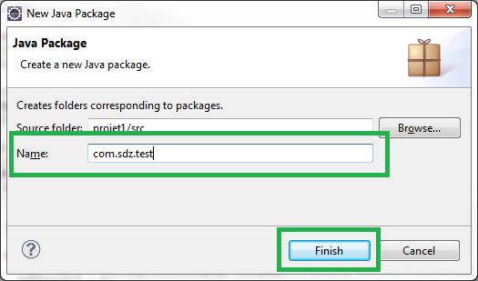

<h3><a name="abstraites">Les classes abstraites</a></h3>
<p>Une classe abstraite est une classe que vous ne pouvez pas instancier. Imaginons que nous ayons une classe A déclarée abstraite. Voici un code qui ne compilera pas :</p>

<pre class="code-block"><code data-claire-semantic="java" data-code="{&quot;language&quot;:&quot;java&quot;,&quot;source&quot;:&quot;public class Test{\n  public static void main(String[] args){\n    A obj = new A(); //Erreur de compilation !  \n  }\n}&quot;}" class="ace" data-widget="codeBlock"><div class="ace-openclassrooms"><div class="ace_static_highlight ace_show_gutter" style="counter-reset:ace_line 0"><div class="ace_line"><span class="ace_gutter ace_gutter-cell" unselectable="on"></span><span class="ace_keyword">public</span> <span class="ace_keyword">class</span> <span class="ace_identifier">Test</span>{
</div><div class="ace_line"><span class="ace_gutter ace_gutter-cell" unselectable="on"></span>  <span class="ace_keyword">public</span> <span class="ace_keyword">static</span> <span class="ace_keyword">void</span> <span class="ace_identifier">main</span>(<span class="ace_support ace_function">String</span>[] <span class="ace_identifier">args</span>){
</div><div class="ace_line"><span class="ace_gutter ace_gutter-cell" unselectable="on"></span>    <span class="ace_identifier">A</span> <span class="ace_identifier">obj</span> <span class="ace_keyword ace_operator">=</span> <span class="ace_keyword">new</span> <span class="ace_identifier">A</span>(); <span class="ace_comment">//Erreur de compilation !  </span>
</div><div class="ace_line"><span class="ace_gutter ace_gutter-cell" unselectable="on"></span>  }
</div><div class="ace_line"><span class="ace_gutter ace_gutter-cell" unselectable="on"></span>}
</div></div></div></code></pre>

<h4>exemple</h4>
<p>Imaginez que vous êtes en train de réaliser un programme qui gère différents types d'animaux.</p>
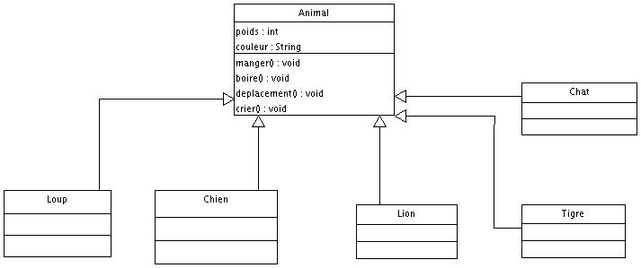
<p>Ce type de classe permet de définir des méthodes abstraites qui présentent une particularité : elle n'ont pas de corps ! En voici un exemple :</p>

<pre class="code-block"><code data-claire-semantic="java" data-code="{&quot;language&quot;:&quot;java&quot;,&quot;source&quot;:&quot;abstract class Animal{\n  abstract void manger(); //Une m&amp;#xE9;thode abstraite\n}&quot;}" class="ace" data-widget="codeBlock"><div class="ace-openclassrooms"><div class="ace_static_highlight ace_show_gutter" style="counter-reset:ace_line 0"><div class="ace_line"><span class="ace_gutter ace_gutter-cell" unselectable="on"></span><span class="ace_keyword">abstract</span> <span class="ace_keyword">class</span> <span class="ace_identifier">Animal</span>{
</div><div class="ace_line"><span class="ace_gutter ace_gutter-cell" unselectable="on"></span>  <span class="ace_keyword">abstract</span> <span class="ace_keyword">void</span> <span class="ace_identifier">manger</span>(); <span class="ace_comment">//Une méthode abstraite</span>
</div><div class="ace_line"><span class="ace_gutter ace_gutter-cell" unselectable="on"></span>}
</div></div></div></code></pre>

<p>Une méthode abstraite ne peut exister que dans une classe abstraite. Si, dans une classe, vous avez une méthode déclarée abstraite, vous devez déclarer cette classe comme étant abstraite.</p>

<pre class="code-block"><code data-claire-semantic="java" data-code="{&quot;language&quot;:&quot;java&quot;,&quot;source&quot;:&quot;public class Test{\n  public static void main(String args[]){\n    Animal loup = new Loup();\n    Animal chien = new Chien();\n    loup.manger();\n    chien.crier(); \n  }\n}&quot;}" class="ace" data-widget="codeBlock"><div class="ace-openclassrooms"><div class="ace_static_highlight ace_show_gutter" style="counter-reset:ace_line 0"><div class="ace_line"><span class="ace_gutter ace_gutter-cell" unselectable="on"></span><span class="ace_keyword">public</span> <span class="ace_keyword">class</span> <span class="ace_identifier">Test</span>{
</div><div class="ace_line"><span class="ace_gutter ace_gutter-cell" unselectable="on"></span>  <span class="ace_keyword">public</span> <span class="ace_keyword">static</span> <span class="ace_keyword">void</span> <span class="ace_identifier">main</span>(<span class="ace_support ace_function">String</span> <span class="ace_identifier">args</span>[]){
</div><div class="ace_line"><span class="ace_gutter ace_gutter-cell" unselectable="on"></span>    <span class="ace_identifier">Animal</span> <span class="ace_identifier">loup</span> <span class="ace_keyword ace_operator">=</span> <span class="ace_keyword">new</span> <span class="ace_identifier">Loup</span>();
</div><div class="ace_line"><span class="ace_gutter ace_gutter-cell" unselectable="on"></span>    <span class="ace_identifier">Animal</span> <span class="ace_identifier">chien</span> <span class="ace_keyword ace_operator">=</span> <span class="ace_keyword">new</span> <span class="ace_identifier">Chien</span>();
</div><div class="ace_line"><span class="ace_gutter ace_gutter-cell" unselectable="on"></span>    <span class="ace_identifier">loup</span>.<span class="ace_identifier">manger</span>();
</div><div class="ace_line"><span class="ace_gutter ace_gutter-cell" unselectable="on"></span>    <span class="ace_identifier">chien</span>.<span class="ace_identifier">crier</span>(); 
</div><div class="ace_line"><span class="ace_gutter ace_gutter-cell" unselectable="on"></span>  }
</div><div class="ace_line"><span class="ace_gutter ace_gutter-cell" unselectable="on"></span>}
</div></div></div></code></pre>

<p>Nous allons ajouter des morceaux de code à nos classes.</p>

<ul>
  <li>Nos objets seront tous de couleur et de poids différents. Nos classes auront donc le droit de modifier ceux-ci.</li>
  <li>Nous partons du principe que tous nos animaux mangent de la viande. La méthode manger() sera donc définie dans la classe Animal.</li>
  <li>Idem pour la méthode boire(). Ils boiront tous de l'eau.</li>
  <li>Ils ne crieront pas et ne se déplaceront pas de la même manière. Nous emploierons donc des méthodes polymorphes et déclarerons les méthodes deplacement() et crier() abstraites dans la classe Animal.</li>
</ul>

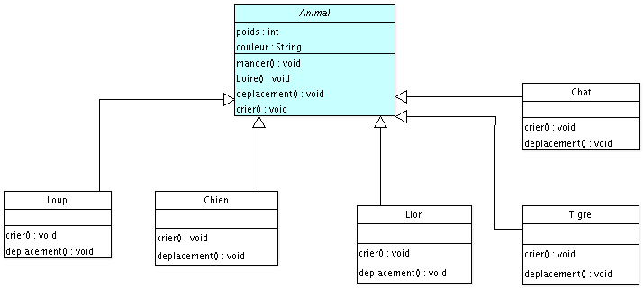
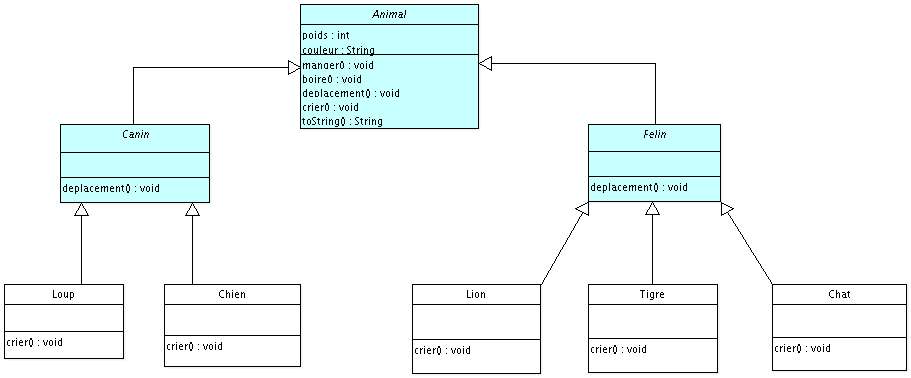

<h5>Animal.java</h5>
<pre class="code-block"><code data-claire-semantic="java" data-code="{&quot;language&quot;:&quot;java&quot;,&quot;source&quot;:&quot;abstract class Animal {\n\n  protected String couleur;\n  protected int poids;\n\n  protected void manger(){\n    System.out.println(&amp;#x22;Je mange de la viande.&amp;#x22;);\n  }\n        \n  protected void boire(){\n    System.out.println(&amp;#x22;Je bois de l&amp;#x27;eau !&amp;#x22;);\n  }\n        \n  abstract void deplacement();\n        \n  abstract void crier();\n        \n  public String toString(){\n    String str = &amp;#x22;Je suis un objet de la &amp;#x22; + this.getClass() + &amp;#x22;, je suis &amp;#x22; + this.couleur + &amp;#x22;, je p&amp;#xE8;se &amp;#x22; + this.poids;\n    return str;\n  }        \n}&quot;}" class="ace" data-widget="codeBlock"><div class="ace-openclassrooms"><div class="ace_static_highlight ace_show_gutter" style="counter-reset:ace_line 0"><div class="ace_line"><span class="ace_gutter ace_gutter-cell" unselectable="on"></span><span class="ace_keyword">abstract</span> <span class="ace_keyword">class</span> <span class="ace_identifier">Animal</span> {
</div><div class="ace_line"><span class="ace_gutter ace_gutter-cell" unselectable="on"></span>
</div><div class="ace_line"><span class="ace_gutter ace_gutter-cell" unselectable="on"></span>  <span class="ace_keyword">protected</span> <span class="ace_support ace_function">String</span> <span class="ace_identifier">couleur</span>;
</div><div class="ace_line"><span class="ace_gutter ace_gutter-cell" unselectable="on"></span>  <span class="ace_keyword">protected</span> <span class="ace_keyword">int</span> <span class="ace_identifier">poids</span>;
</div><div class="ace_line"><span class="ace_gutter ace_gutter-cell" unselectable="on"></span>
</div><div class="ace_line"><span class="ace_gutter ace_gutter-cell" unselectable="on"></span>  <span class="ace_keyword">protected</span> <span class="ace_keyword">void</span> <span class="ace_identifier">manger</span>(){
</div><div class="ace_line"><span class="ace_gutter ace_gutter-cell" unselectable="on"></span>    <span class="ace_support ace_function">System</span>.<span class="ace_identifier">out</span>.<span class="ace_identifier">println</span>(<span class="ace_string">"Je mange de la viande."</span>);
</div><div class="ace_line"><span class="ace_gutter ace_gutter-cell" unselectable="on"></span>  }
</div><div class="ace_line"><span class="ace_gutter ace_gutter-cell" unselectable="on"></span><span class="ace_indent-guide">    </span>    
</div><div class="ace_line"><span class="ace_gutter ace_gutter-cell" unselectable="on"></span>  <span class="ace_keyword">protected</span> <span class="ace_keyword">void</span> <span class="ace_identifier">boire</span>(){
</div><div class="ace_line"><span class="ace_gutter ace_gutter-cell" unselectable="on"></span>    <span class="ace_support ace_function">System</span>.<span class="ace_identifier">out</span>.<span class="ace_identifier">println</span>(<span class="ace_string">"Je bois de l'eau !"</span>);
</div><div class="ace_line"><span class="ace_gutter ace_gutter-cell" unselectable="on"></span>  }
</div><div class="ace_line"><span class="ace_gutter ace_gutter-cell" unselectable="on"></span><span class="ace_indent-guide">    </span>    
</div><div class="ace_line"><span class="ace_gutter ace_gutter-cell" unselectable="on"></span>  <span class="ace_keyword">abstract</span> <span class="ace_keyword">void</span> <span class="ace_identifier">deplacement</span>();
</div><div class="ace_line"><span class="ace_gutter ace_gutter-cell" unselectable="on"></span><span class="ace_indent-guide">    </span>    
</div><div class="ace_line"><span class="ace_gutter ace_gutter-cell" unselectable="on"></span>  <span class="ace_keyword">abstract</span> <span class="ace_keyword">void</span> <span class="ace_identifier">crier</span>();
</div><div class="ace_line"><span class="ace_gutter ace_gutter-cell" unselectable="on"></span><span class="ace_indent-guide">    </span>    
</div><div class="ace_line"><span class="ace_gutter ace_gutter-cell" unselectable="on"></span>  <span class="ace_keyword">public</span> <span class="ace_support ace_function">String</span> <span class="ace_identifier">toString</span>(){
</div><div class="ace_line"><span class="ace_gutter ace_gutter-cell" unselectable="on"></span>    <span class="ace_support ace_function">String</span> <span class="ace_identifier">str</span> <span class="ace_keyword ace_operator">=</span> <span class="ace_string">"Je suis un objet de la "</span> <span class="ace_keyword ace_operator">+</span> <span class="ace_keyword">this</span>.<span class="ace_identifier">getClass</span>() <span class="ace_keyword ace_operator">+</span> <span class="ace_string">", je suis "</span> <span class="ace_keyword ace_operator">+</span> <span class="ace_keyword">this</span>.<span class="ace_identifier">couleur</span> <span class="ace_keyword ace_operator">+</span> <span class="ace_string">", je pèse "</span> <span class="ace_keyword ace_operator">+</span> <span class="ace_keyword">this</span>.<span class="ace_identifier">poids</span>;
</div><div class="ace_line"><span class="ace_gutter ace_gutter-cell" unselectable="on"></span>    <span class="ace_keyword">return</span> <span class="ace_identifier">str</span>;
</div><div class="ace_line"><span class="ace_gutter ace_gutter-cell" unselectable="on"></span>  }        
</div><div class="ace_line"><span class="ace_gutter ace_gutter-cell" unselectable="on"></span>}
</div></div></div></code></pre>

<h5>Felin.java</h5>
<pre class="code-block"><code data-claire-semantic="java" data-code="{&quot;language&quot;:&quot;java&quot;,&quot;source&quot;:&quot;public abstract class Felin extends Animal {\n  void deplacement() {\n    System.out.println(&amp;#x22;Je me d&amp;#xE9;place seul !&amp;#x22;);\n  } \n}&quot;}" class="ace" data-widget="codeBlock"><div class="ace-openclassrooms"><div class="ace_static_highlight ace_show_gutter" style="counter-reset:ace_line 0"><div class="ace_line"><span class="ace_gutter ace_gutter-cell" unselectable="on"></span><span class="ace_keyword">public</span> <span class="ace_keyword">abstract</span> <span class="ace_keyword">class</span> <span class="ace_identifier">Felin</span> <span class="ace_keyword">extends</span> <span class="ace_identifier">Animal</span> {
</div><div class="ace_line"><span class="ace_gutter ace_gutter-cell" unselectable="on"></span>  <span class="ace_keyword">void</span> <span class="ace_identifier">deplacement</span>() {
</div><div class="ace_line"><span class="ace_gutter ace_gutter-cell" unselectable="on"></span>    <span class="ace_support ace_function">System</span>.<span class="ace_identifier">out</span>.<span class="ace_identifier">println</span>(<span class="ace_string">"Je me déplace seul !"</span>);
</div><div class="ace_line"><span class="ace_gutter ace_gutter-cell" unselectable="on"></span>  } 
</div><div class="ace_line"><span class="ace_gutter ace_gutter-cell" unselectable="on"></span>}
</div></div></div></code></pre>

<h5>Canin.java</h5>
<pre class="code-block"><code data-claire-semantic="java" data-code="{&quot;language&quot;:&quot;java&quot;,&quot;source&quot;:&quot;public abstract class Canin extends Animal {\n  void deplacement() {\n    System.out.println(&amp;#x22;Je me d&amp;#xE9;place en meute !&amp;#x22;);\n  }\n}&quot;}" class="ace" data-widget="codeBlock"><div class="ace-openclassrooms"><div class="ace_static_highlight ace_show_gutter" style="counter-reset:ace_line 0"><div class="ace_line"><span class="ace_gutter ace_gutter-cell" unselectable="on"></span><span class="ace_keyword">public</span> <span class="ace_keyword">abstract</span> <span class="ace_keyword">class</span> <span class="ace_identifier">Canin</span> <span class="ace_keyword">extends</span> <span class="ace_identifier">Animal</span> {
</div><div class="ace_line"><span class="ace_gutter ace_gutter-cell" unselectable="on"></span>  <span class="ace_keyword">void</span> <span class="ace_identifier">deplacement</span>() {
</div><div class="ace_line"><span class="ace_gutter ace_gutter-cell" unselectable="on"></span>    <span class="ace_support ace_function">System</span>.<span class="ace_identifier">out</span>.<span class="ace_identifier">println</span>(<span class="ace_string">"Je me déplace en meute !"</span>);
</div><div class="ace_line"><span class="ace_gutter ace_gutter-cell" unselectable="on"></span>  }
</div><div class="ace_line"><span class="ace_gutter ace_gutter-cell" unselectable="on"></span>}
</div></div></div></code></pre>

<h5>Chien.java</h5>
<pre class="code-block"><code data-claire-semantic="java" data-code="{&quot;language&quot;:&quot;java&quot;,&quot;source&quot;:&quot;public class Chien extends Canin {\n \n  public Chien(){\n\n  }\n\n  public Chien(String couleur, int poids){\n    this.couleur = couleur;\n    this.poids = poids;\n  }       \n\n  void crier() {\n    System.out.println(&amp;#x22;J&amp;#x27;aboie sans raison !&amp;#x22;);\n  } \n}&quot;}" class="ace" data-widget="codeBlock"><div class="ace-openclassrooms"><div class="ace_static_highlight ace_show_gutter" style="counter-reset:ace_line 0"><div class="ace_line"><span class="ace_gutter ace_gutter-cell" unselectable="on"></span><span class="ace_keyword">public</span> <span class="ace_keyword">class</span> <span class="ace_identifier">Chien</span> <span class="ace_keyword">extends</span> <span class="ace_identifier">Canin</span> {
</div><div class="ace_line"><span class="ace_gutter ace_gutter-cell" unselectable="on"></span> 
</div><div class="ace_line"><span class="ace_gutter ace_gutter-cell" unselectable="on"></span>  <span class="ace_keyword">public</span> <span class="ace_identifier">Chien</span>(){
</div><div class="ace_line"><span class="ace_gutter ace_gutter-cell" unselectable="on"></span>
</div><div class="ace_line"><span class="ace_gutter ace_gutter-cell" unselectable="on"></span>  }
</div><div class="ace_line"><span class="ace_gutter ace_gutter-cell" unselectable="on"></span>
</div><div class="ace_line"><span class="ace_gutter ace_gutter-cell" unselectable="on"></span>  <span class="ace_keyword">public</span> <span class="ace_identifier">Chien</span>(<span class="ace_support ace_function">String</span> <span class="ace_identifier">couleur</span>, <span class="ace_keyword">int</span> <span class="ace_identifier">poids</span>){
</div><div class="ace_line"><span class="ace_gutter ace_gutter-cell" unselectable="on"></span>    <span class="ace_keyword">this</span>.<span class="ace_identifier">couleur</span> <span class="ace_keyword ace_operator">=</span> <span class="ace_identifier">couleur</span>;
</div><div class="ace_line"><span class="ace_gutter ace_gutter-cell" unselectable="on"></span>    <span class="ace_keyword">this</span>.<span class="ace_identifier">poids</span> <span class="ace_keyword ace_operator">=</span> <span class="ace_identifier">poids</span>;
</div><div class="ace_line"><span class="ace_gutter ace_gutter-cell" unselectable="on"></span>  }       
</div><div class="ace_line"><span class="ace_gutter ace_gutter-cell" unselectable="on"></span>
</div><div class="ace_line"><span class="ace_gutter ace_gutter-cell" unselectable="on"></span>  <span class="ace_keyword">void</span> <span class="ace_identifier">crier</span>() {
</div><div class="ace_line"><span class="ace_gutter ace_gutter-cell" unselectable="on"></span>    <span class="ace_support ace_function">System</span>.<span class="ace_identifier">out</span>.<span class="ace_identifier">println</span>(<span class="ace_string">"J'aboie sans raison !"</span>);
</div><div class="ace_line"><span class="ace_gutter ace_gutter-cell" unselectable="on"></span>  } 
</div><div class="ace_line"><span class="ace_gutter ace_gutter-cell" unselectable="on"></span>}
</div></div></div></code></pre>

<h5>Loup.java</h5>
<pre class="code-block"><code data-claire-semantic="java" data-code="{&quot;language&quot;:&quot;java&quot;,&quot;source&quot;:&quot;public class Loup extends Canin {\n \n  public Loup(){\n                \n  }\n\n  public Loup(String couleur, int poids){\n    this.couleur = couleur;\n    this.poids = poids;\n  }       \n \n  void crier() {\n    System.out.println(&amp;#x22;Je hurle &amp;#xE0; la Lune en faisant ouhouh !&amp;#x22;); \n  }\n}&quot;}" class="ace" data-widget="codeBlock"><div class="ace-openclassrooms"><div class="ace_static_highlight ace_show_gutter" style="counter-reset:ace_line 0"><div class="ace_line"><span class="ace_gutter ace_gutter-cell" unselectable="on"></span><span class="ace_keyword">public</span> <span class="ace_keyword">class</span> <span class="ace_identifier">Loup</span> <span class="ace_keyword">extends</span> <span class="ace_identifier">Canin</span> {
</div><div class="ace_line"><span class="ace_gutter ace_gutter-cell" unselectable="on"></span> 
</div><div class="ace_line"><span class="ace_gutter ace_gutter-cell" unselectable="on"></span>  <span class="ace_keyword">public</span> <span class="ace_identifier">Loup</span>(){
</div><div class="ace_line"><span class="ace_gutter ace_gutter-cell" unselectable="on"></span><span class="ace_indent-guide">    </span><span class="ace_indent-guide">    </span><span class="ace_indent-guide">    </span>    
</div><div class="ace_line"><span class="ace_gutter ace_gutter-cell" unselectable="on"></span>  }
</div><div class="ace_line"><span class="ace_gutter ace_gutter-cell" unselectable="on"></span>
</div><div class="ace_line"><span class="ace_gutter ace_gutter-cell" unselectable="on"></span>  <span class="ace_keyword">public</span> <span class="ace_identifier">Loup</span>(<span class="ace_support ace_function">String</span> <span class="ace_identifier">couleur</span>, <span class="ace_keyword">int</span> <span class="ace_identifier">poids</span>){
</div><div class="ace_line"><span class="ace_gutter ace_gutter-cell" unselectable="on"></span>    <span class="ace_keyword">this</span>.<span class="ace_identifier">couleur</span> <span class="ace_keyword ace_operator">=</span> <span class="ace_identifier">couleur</span>;
</div><div class="ace_line"><span class="ace_gutter ace_gutter-cell" unselectable="on"></span>    <span class="ace_keyword">this</span>.<span class="ace_identifier">poids</span> <span class="ace_keyword ace_operator">=</span> <span class="ace_identifier">poids</span>;
</div><div class="ace_line"><span class="ace_gutter ace_gutter-cell" unselectable="on"></span>  }       
</div><div class="ace_line"><span class="ace_gutter ace_gutter-cell" unselectable="on"></span> 
</div><div class="ace_line"><span class="ace_gutter ace_gutter-cell" unselectable="on"></span>  <span class="ace_keyword">void</span> <span class="ace_identifier">crier</span>() {
</div><div class="ace_line"><span class="ace_gutter ace_gutter-cell" unselectable="on"></span>    <span class="ace_support ace_function">System</span>.<span class="ace_identifier">out</span>.<span class="ace_identifier">println</span>(<span class="ace_string">"Je hurle à la Lune en faisant ouhouh !"</span>); 
</div><div class="ace_line"><span class="ace_gutter ace_gutter-cell" unselectable="on"></span>  }
</div><div class="ace_line"><span class="ace_gutter ace_gutter-cell" unselectable="on"></span>}
</div></div></div></code></pre>

<h5>Lion.java</h5>
<pre class="code-block"><code data-claire-semantic="java" data-code="{&quot;language&quot;:&quot;java&quot;,&quot;source&quot;:&quot;public class Lion extends Felin {\n \n  public Lion(){\n\n  }\n\n  public Lion(String couleur, int poids){\n    this.couleur = couleur;\n    this.poids = poids;\n  }       \n \n  void crier() {\n    System.out.println(&amp;#x22;Je rugis dans la savane !&amp;#x22;);\n  } \n}&quot;}" class="ace" data-widget="codeBlock"><div class="ace-openclassrooms"><div class="ace_static_highlight ace_show_gutter" style="counter-reset:ace_line 0"><div class="ace_line"><span class="ace_gutter ace_gutter-cell" unselectable="on"></span><span class="ace_keyword">public</span> <span class="ace_keyword">class</span> <span class="ace_identifier">Lion</span> <span class="ace_keyword">extends</span> <span class="ace_identifier">Felin</span> {
</div><div class="ace_line"><span class="ace_gutter ace_gutter-cell" unselectable="on"></span> 
</div><div class="ace_line"><span class="ace_gutter ace_gutter-cell" unselectable="on"></span>  <span class="ace_keyword">public</span> <span class="ace_identifier">Lion</span>(){
</div><div class="ace_line"><span class="ace_gutter ace_gutter-cell" unselectable="on"></span>
</div><div class="ace_line"><span class="ace_gutter ace_gutter-cell" unselectable="on"></span>  }
</div><div class="ace_line"><span class="ace_gutter ace_gutter-cell" unselectable="on"></span>
</div><div class="ace_line"><span class="ace_gutter ace_gutter-cell" unselectable="on"></span>  <span class="ace_keyword">public</span> <span class="ace_identifier">Lion</span>(<span class="ace_support ace_function">String</span> <span class="ace_identifier">couleur</span>, <span class="ace_keyword">int</span> <span class="ace_identifier">poids</span>){
</div><div class="ace_line"><span class="ace_gutter ace_gutter-cell" unselectable="on"></span>    <span class="ace_keyword">this</span>.<span class="ace_identifier">couleur</span> <span class="ace_keyword ace_operator">=</span> <span class="ace_identifier">couleur</span>;
</div><div class="ace_line"><span class="ace_gutter ace_gutter-cell" unselectable="on"></span>    <span class="ace_keyword">this</span>.<span class="ace_identifier">poids</span> <span class="ace_keyword ace_operator">=</span> <span class="ace_identifier">poids</span>;
</div><div class="ace_line"><span class="ace_gutter ace_gutter-cell" unselectable="on"></span>  }       
</div><div class="ace_line"><span class="ace_gutter ace_gutter-cell" unselectable="on"></span> 
</div><div class="ace_line"><span class="ace_gutter ace_gutter-cell" unselectable="on"></span>  <span class="ace_keyword">void</span> <span class="ace_identifier">crier</span>() {
</div><div class="ace_line"><span class="ace_gutter ace_gutter-cell" unselectable="on"></span>    <span class="ace_support ace_function">System</span>.<span class="ace_identifier">out</span>.<span class="ace_identifier">println</span>(<span class="ace_string">"Je rugis dans la savane !"</span>);
</div><div class="ace_line"><span class="ace_gutter ace_gutter-cell" unselectable="on"></span>  } 
</div><div class="ace_line"><span class="ace_gutter ace_gutter-cell" unselectable="on"></span>}
</div></div></div></code></pre>

<h5>Tigre.java</h5>
<pre class="code-block"><code data-claire-semantic="java" data-code="{&quot;language&quot;:&quot;java&quot;,&quot;source&quot;:&quot;public class Tigre extends Felin {\n \n  public Tigre(){\n\n  }\n  public Tigre(String couleur, int poids){\n    this.couleur = couleur;\n    this.poids = poids;\n  }\n        \n  void crier() {\n    System.out.println(&amp;#x22;Je grogne tr&amp;#xE8;s fort !&amp;#x22;);\n  } \n}&quot;}" class="ace" data-widget="codeBlock"><div class="ace-openclassrooms"><div class="ace_static_highlight ace_show_gutter" style="counter-reset:ace_line 0"><div class="ace_line"><span class="ace_gutter ace_gutter-cell" unselectable="on"></span><span class="ace_keyword">public</span> <span class="ace_keyword">class</span> <span class="ace_identifier">Tigre</span> <span class="ace_keyword">extends</span> <span class="ace_identifier">Felin</span> {
</div><div class="ace_line"><span class="ace_gutter ace_gutter-cell" unselectable="on"></span> 
</div><div class="ace_line"><span class="ace_gutter ace_gutter-cell" unselectable="on"></span>  <span class="ace_keyword">public</span> <span class="ace_identifier">Tigre</span>(){
</div><div class="ace_line"><span class="ace_gutter ace_gutter-cell" unselectable="on"></span>
</div><div class="ace_line"><span class="ace_gutter ace_gutter-cell" unselectable="on"></span>  }
</div><div class="ace_line"><span class="ace_gutter ace_gutter-cell" unselectable="on"></span>  <span class="ace_keyword">public</span> <span class="ace_identifier">Tigre</span>(<span class="ace_support ace_function">String</span> <span class="ace_identifier">couleur</span>, <span class="ace_keyword">int</span> <span class="ace_identifier">poids</span>){
</div><div class="ace_line"><span class="ace_gutter ace_gutter-cell" unselectable="on"></span>    <span class="ace_keyword">this</span>.<span class="ace_identifier">couleur</span> <span class="ace_keyword ace_operator">=</span> <span class="ace_identifier">couleur</span>;
</div><div class="ace_line"><span class="ace_gutter ace_gutter-cell" unselectable="on"></span>    <span class="ace_keyword">this</span>.<span class="ace_identifier">poids</span> <span class="ace_keyword ace_operator">=</span> <span class="ace_identifier">poids</span>;
</div><div class="ace_line"><span class="ace_gutter ace_gutter-cell" unselectable="on"></span>  }
</div><div class="ace_line"><span class="ace_gutter ace_gutter-cell" unselectable="on"></span><span class="ace_indent-guide">    </span>    
</div><div class="ace_line"><span class="ace_gutter ace_gutter-cell" unselectable="on"></span>  <span class="ace_keyword">void</span> <span class="ace_identifier">crier</span>() {
</div><div class="ace_line"><span class="ace_gutter ace_gutter-cell" unselectable="on"></span>    <span class="ace_support ace_function">System</span>.<span class="ace_identifier">out</span>.<span class="ace_identifier">println</span>(<span class="ace_string">"Je grogne très fort !"</span>);
</div><div class="ace_line"><span class="ace_gutter ace_gutter-cell" unselectable="on"></span>  } 
</div><div class="ace_line"><span class="ace_gutter ace_gutter-cell" unselectable="on"></span>}
</div></div></div></code></pre>

<h5>Chat.java</h5>
<pre class="code-block"><code data-claire-semantic="java" data-code="{&quot;language&quot;:&quot;java&quot;,&quot;source&quot;:&quot;public class Chat extends Felin {\n \n  public Chat(){\n\n  }\n  public Chat(String couleur, int poids){\n    this.couleur = couleur;\n    this.poids = poids;\n  }\n        \n  void crier() {\n    System.out.println(&amp;#x22;Je miaule sur les toits !&amp;#x22;);\n  } \n}&quot;}" class="ace" data-widget="codeBlock"><div class="ace-openclassrooms"><div class="ace_static_highlight ace_show_gutter" style="counter-reset:ace_line 0"><div class="ace_line"><span class="ace_gutter ace_gutter-cell" unselectable="on"></span><span class="ace_keyword">public</span> <span class="ace_keyword">class</span> <span class="ace_identifier">Chat</span> <span class="ace_keyword">extends</span> <span class="ace_identifier">Felin</span> {
</div><div class="ace_line"><span class="ace_gutter ace_gutter-cell" unselectable="on"></span> 
</div><div class="ace_line"><span class="ace_gutter ace_gutter-cell" unselectable="on"></span>  <span class="ace_keyword">public</span> <span class="ace_identifier">Chat</span>(){
</div><div class="ace_line"><span class="ace_gutter ace_gutter-cell" unselectable="on"></span>
</div><div class="ace_line"><span class="ace_gutter ace_gutter-cell" unselectable="on"></span>  }
</div><div class="ace_line"><span class="ace_gutter ace_gutter-cell" unselectable="on"></span>  <span class="ace_keyword">public</span> <span class="ace_identifier">Chat</span>(<span class="ace_support ace_function">String</span> <span class="ace_identifier">couleur</span>, <span class="ace_keyword">int</span> <span class="ace_identifier">poids</span>){
</div><div class="ace_line"><span class="ace_gutter ace_gutter-cell" unselectable="on"></span>    <span class="ace_keyword">this</span>.<span class="ace_identifier">couleur</span> <span class="ace_keyword ace_operator">=</span> <span class="ace_identifier">couleur</span>;
</div><div class="ace_line"><span class="ace_gutter ace_gutter-cell" unselectable="on"></span>    <span class="ace_keyword">this</span>.<span class="ace_identifier">poids</span> <span class="ace_keyword ace_operator">=</span> <span class="ace_identifier">poids</span>;
</div><div class="ace_line"><span class="ace_gutter ace_gutter-cell" unselectable="on"></span>  }
</div><div class="ace_line"><span class="ace_gutter ace_gutter-cell" unselectable="on"></span><span class="ace_indent-guide">    </span>    
</div><div class="ace_line"><span class="ace_gutter ace_gutter-cell" unselectable="on"></span>  <span class="ace_keyword">void</span> <span class="ace_identifier">crier</span>() {
</div><div class="ace_line"><span class="ace_gutter ace_gutter-cell" unselectable="on"></span>    <span class="ace_support ace_function">System</span>.<span class="ace_identifier">out</span>.<span class="ace_identifier">println</span>(<span class="ace_string">"Je miaule sur les toits !"</span>);
</div><div class="ace_line"><span class="ace_gutter ace_gutter-cell" unselectable="on"></span>  } 
</div><div class="ace_line"><span class="ace_gutter ace_gutter-cell" unselectable="on"></span>}
</div></div></div></code></pre>

<pre class="code-block"><code data-claire-semantic="java" data-code="{&quot;language&quot;:&quot;java&quot;,&quot;source&quot;:&quot;public class Test { \n  public static void main(String[] args) {\n    Loup l = new Loup(&amp;#x22;Gris bleut&amp;#xE9;&amp;#x22;, 20);\n    l.boire();\n    l.manger();\n    l.deplacement();\n    l.crier();\n    System.out.println(l.toString());\n  } \n}&quot;}" class="ace" data-widget="codeBlock"><div class="ace-openclassrooms"><div class="ace_static_highlight ace_show_gutter" style="counter-reset:ace_line 0"><div class="ace_line"><span class="ace_gutter ace_gutter-cell" unselectable="on"></span><span class="ace_keyword">public</span> <span class="ace_keyword">class</span> <span class="ace_identifier">Test</span> { 
</div><div class="ace_line"><span class="ace_gutter ace_gutter-cell" unselectable="on"></span>  <span class="ace_keyword">public</span> <span class="ace_keyword">static</span> <span class="ace_keyword">void</span> <span class="ace_identifier">main</span>(<span class="ace_support ace_function">String</span>[] <span class="ace_identifier">args</span>) {
</div><div class="ace_line"><span class="ace_gutter ace_gutter-cell" unselectable="on"></span>    <span class="ace_identifier">Loup</span> <span class="ace_identifier">l</span> <span class="ace_keyword ace_operator">=</span> <span class="ace_keyword">new</span> <span class="ace_identifier">Loup</span>(<span class="ace_string">"Gris bleuté"</span>, <span class="ace_constant ace_numeric">20</span>);
</div><div class="ace_line"><span class="ace_gutter ace_gutter-cell" unselectable="on"></span>    <span class="ace_identifier">l</span>.<span class="ace_identifier">boire</span>();
</div><div class="ace_line"><span class="ace_gutter ace_gutter-cell" unselectable="on"></span>    <span class="ace_identifier">l</span>.<span class="ace_identifier">manger</span>();
</div><div class="ace_line"><span class="ace_gutter ace_gutter-cell" unselectable="on"></span>    <span class="ace_identifier">l</span>.<span class="ace_identifier">deplacement</span>();
</div><div class="ace_line"><span class="ace_gutter ace_gutter-cell" unselectable="on"></span>    <span class="ace_identifier">l</span>.<span class="ace_identifier">crier</span>();
</div><div class="ace_line"><span class="ace_gutter ace_gutter-cell" unselectable="on"></span>    <span class="ace_support ace_function">System</span>.<span class="ace_identifier">out</span>.<span class="ace_identifier">println</span>(<span class="ace_identifier">l</span>.<span class="ace_identifier">toString</span>());
</div><div class="ace_line"><span class="ace_gutter ace_gutter-cell" unselectable="on"></span>  } 
</div><div class="ace_line"><span class="ace_gutter ace_gutter-cell" unselectable="on"></span>}
</div></div></div></code></pre>

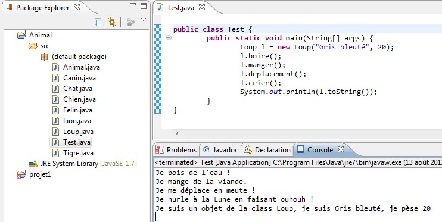

<p>Dans cet exemple, nous avons un objet Loup :</p>
<ul>
  <li>À l'appel de la méthode boire() : l'objet appelle la méthode de la classe Animal.</li>
  <li>À l'appel de la méthode manger() : idem.</li>
  <li>À l'appel de la méthode toString() : idem.</li>
  <li>À l'appel de la méthode deplacement() : c'est la méthode de la classe Canin qui est invoquée ici.</li>
  <li>À l'appel de la méthode crier() : c'est la méthode de la classe Loup qui est appelée.</li>
</ul>

<h3><a name="interfaces">Les interfaces</a></h3>

<p>L'héritage multiple étant interdit en Java, pour y remédier nous faisons appel aux interfaces. Ces dernières permettent de créer un nouveau supertype ; on peut même en ajouter autant que l'on le veut dans une seule classe. Une interface n'est rien d'autre qu'une classe 100 % abstraite.</p>

<pre class="code-block"><code data-claire-semantic="java" data-code="{&quot;language&quot;:&quot;java&quot;,&quot;source&quot;:&quot;public interface I{ \n  public void A();\n  public String B(); \n}&quot;}" class="ace" data-widget="codeBlock"><div class="ace-openclassrooms"><div class="ace_static_highlight ace_show_gutter" style="counter-reset:ace_line 0"><div class="ace_line"><span class="ace_gutter ace_gutter-cell" unselectable="on"></span><span class="ace_keyword">public</span> <span class="ace_keyword">interface</span> <span class="ace_identifier">I</span>{ 
</div><div class="ace_line"><span class="ace_gutter ace_gutter-cell" unselectable="on"></span>  <span class="ace_keyword">public</span> <span class="ace_keyword">void</span> <span class="ace_identifier">A</span>();
</div><div class="ace_line"><span class="ace_gutter ace_gutter-cell" unselectable="on"></span>  <span class="ace_keyword">public</span> <span class="ace_support ace_function">String</span> <span class="ace_identifier">B</span>(); 
</div><div class="ace_line"><span class="ace_gutter ace_gutter-cell" unselectable="on"></span>}
</div></div></div></code></pre>

<pre class="code-block"><code data-claire-semantic="java" data-code="{&quot;language&quot;:&quot;java&quot;,&quot;source&quot;:&quot;public interface I2{ \n  public void C();\n  public String D(); \n}&quot;}" class="ace" data-widget="codeBlock"><div class="ace-openclassrooms"><div class="ace_static_highlight ace_show_gutter" style="counter-reset:ace_line 0"><div class="ace_line"><span class="ace_gutter ace_gutter-cell" unselectable="on"></span><span class="ace_keyword">public</span> <span class="ace_keyword">interface</span> <span class="ace_identifier">I2</span>{ 
</div><div class="ace_line"><span class="ace_gutter ace_gutter-cell" unselectable="on"></span>  <span class="ace_keyword">public</span> <span class="ace_keyword">void</span> <span class="ace_identifier">C</span>();
</div><div class="ace_line"><span class="ace_gutter ace_gutter-cell" unselectable="on"></span>  <span class="ace_keyword">public</span> <span class="ace_support ace_function">String</span> <span class="ace_identifier">D</span>(); 
</div><div class="ace_line"><span class="ace_gutter ace_gutter-cell" unselectable="on"></span>}
</div></div></div></code></pre>

<pre class="code-block"><code data-claire-semantic="java" data-code="{&quot;language&quot;:&quot;java&quot;,&quot;source&quot;:&quot;public class X implements I{\n  public void A(){\n    //&amp;#x2026;\n  } \n  public String B(){\n    //&amp;#x2026;\n  }\n}&quot;}" class="ace" data-widget="codeBlock"><div class="ace-openclassrooms"><div class="ace_static_highlight ace_show_gutter" style="counter-reset:ace_line 0"><div class="ace_line"><span class="ace_gutter ace_gutter-cell" unselectable="on"></span><span class="ace_keyword">public</span> <span class="ace_keyword">class</span> <span class="ace_identifier">X</span> <span class="ace_keyword">implements</span> <span class="ace_identifier">I</span>{
</div><div class="ace_line"><span class="ace_gutter ace_gutter-cell" unselectable="on"></span>  <span class="ace_keyword">public</span> <span class="ace_keyword">void</span> <span class="ace_identifier">A</span>(){
</div><div class="ace_line"><span class="ace_gutter ace_gutter-cell" unselectable="on"></span>    <span class="ace_comment">//…</span>
</div><div class="ace_line"><span class="ace_gutter ace_gutter-cell" unselectable="on"></span>  } 
</div><div class="ace_line"><span class="ace_gutter ace_gutter-cell" unselectable="on"></span>  <span class="ace_keyword">public</span> <span class="ace_support ace_function">String</span> <span class="ace_identifier">B</span>(){
</div><div class="ace_line"><span class="ace_gutter ace_gutter-cell" unselectable="on"></span>    <span class="ace_comment">//…</span>
</div><div class="ace_line"><span class="ace_gutter ace_gutter-cell" unselectable="on"></span>  }
</div><div class="ace_line"><span class="ace_gutter ace_gutter-cell" unselectable="on"></span>}
</div></div></div></code></pre>

<pre class="code-block"><code data-claire-semantic="java" data-code="{&quot;language&quot;:&quot;java&quot;,&quot;source&quot;:&quot;public class X implements I, I2{\n  public void A(){\n    //&amp;#x2026;\n  } \n  public String B(){\n    //&amp;#x2026;\n  } \n  public void C(){\n    //&amp;#x2026;\n  } \n  public String D(){\n    //&amp;#x2026;\n  }\n}&quot;}" class="ace" data-widget="codeBlock"><div class="ace-openclassrooms"><div class="ace_static_highlight ace_show_gutter" style="counter-reset:ace_line 0"><div class="ace_line"><span class="ace_gutter ace_gutter-cell" unselectable="on"></span><span class="ace_keyword">public</span> <span class="ace_keyword">class</span> <span class="ace_identifier">X</span> <span class="ace_keyword">implements</span> <span class="ace_identifier">I</span>, <span class="ace_identifier">I2</span>{
</div><div class="ace_line"><span class="ace_gutter ace_gutter-cell" unselectable="on"></span>  <span class="ace_keyword">public</span> <span class="ace_keyword">void</span> <span class="ace_identifier">A</span>(){
</div><div class="ace_line"><span class="ace_gutter ace_gutter-cell" unselectable="on"></span>    <span class="ace_comment">//…</span>
</div><div class="ace_line"><span class="ace_gutter ace_gutter-cell" unselectable="on"></span>  } 
</div><div class="ace_line"><span class="ace_gutter ace_gutter-cell" unselectable="on"></span>  <span class="ace_keyword">public</span> <span class="ace_support ace_function">String</span> <span class="ace_identifier">B</span>(){
</div><div class="ace_line"><span class="ace_gutter ace_gutter-cell" unselectable="on"></span>    <span class="ace_comment">//…</span>
</div><div class="ace_line"><span class="ace_gutter ace_gutter-cell" unselectable="on"></span>  } 
</div><div class="ace_line"><span class="ace_gutter ace_gutter-cell" unselectable="on"></span>  <span class="ace_keyword">public</span> <span class="ace_keyword">void</span> <span class="ace_identifier">C</span>(){
</div><div class="ace_line"><span class="ace_gutter ace_gutter-cell" unselectable="on"></span>    <span class="ace_comment">//…</span>
</div><div class="ace_line"><span class="ace_gutter ace_gutter-cell" unselectable="on"></span>  } 
</div><div class="ace_line"><span class="ace_gutter ace_gutter-cell" unselectable="on"></span>  <span class="ace_keyword">public</span> <span class="ace_support ace_function">String</span> <span class="ace_identifier">D</span>(){
</div><div class="ace_line"><span class="ace_gutter ace_gutter-cell" unselectable="on"></span>    <span class="ace_comment">//…</span>
</div><div class="ace_line"><span class="ace_gutter ace_gutter-cell" unselectable="on"></span>  }
</div><div class="ace_line"><span class="ace_gutter ace_gutter-cell" unselectable="on"></span>}
</div></div></div></code></pre>

<p>Le polymorphisme vous permet de faire ceci :</p>
<pre class="code-block"><code data-claire-semantic="java" data-code="{&quot;language&quot;:&quot;java&quot;,&quot;source&quot;:&quot;public static void main(String[] args){\n  //Avec cette r&amp;#xE9;f&amp;#xE9;rence, vous pouvez utiliser les m&amp;#xE9;thodes de l&amp;#x27;interface I\n  I var = new X();\n  //Avec cette r&amp;#xE9;f&amp;#xE9;rence, vous pouvez utiliser les m&amp;#xE9;thodes de l&amp;#x27;interface I2\n  I2 var2 = new X();\n  var.A();\n  var2.C();   \n}&quot;}" class="ace" data-widget="codeBlock"><div class="ace-openclassrooms"><div class="ace_static_highlight ace_show_gutter" style="counter-reset:ace_line 0"><div class="ace_line"><span class="ace_gutter ace_gutter-cell" unselectable="on"></span><span class="ace_keyword">public</span> <span class="ace_keyword">static</span> <span class="ace_keyword">void</span> <span class="ace_identifier">main</span>(<span class="ace_support ace_function">String</span>[] <span class="ace_identifier">args</span>){
</div><div class="ace_line"><span class="ace_gutter ace_gutter-cell" unselectable="on"></span>  <span class="ace_comment">//Avec cette référence, vous pouvez utiliser les méthodes de l'interface I</span>
</div><div class="ace_line"><span class="ace_gutter ace_gutter-cell" unselectable="on"></span>  <span class="ace_identifier">I</span> <span class="ace_identifier">var</span> <span class="ace_keyword ace_operator">=</span> <span class="ace_keyword">new</span> <span class="ace_identifier">X</span>();
</div><div class="ace_line"><span class="ace_gutter ace_gutter-cell" unselectable="on"></span>  <span class="ace_comment">//Avec cette référence, vous pouvez utiliser les méthodes de l'interface I2</span>
</div><div class="ace_line"><span class="ace_gutter ace_gutter-cell" unselectable="on"></span>  <span class="ace_identifier">I2</span> <span class="ace_identifier">var2</span> <span class="ace_keyword ace_operator">=</span> <span class="ace_keyword">new</span> <span class="ace_identifier">X</span>();
</div><div class="ace_line"><span class="ace_gutter ace_gutter-cell" unselectable="on"></span>  <span class="ace_identifier">var</span>.<span class="ace_identifier">A</span>();
</div><div class="ace_line"><span class="ace_gutter ace_gutter-cell" unselectable="on"></span>  <span class="ace_identifier">var2</span>.<span class="ace_identifier">C</span>();   
</div><div class="ace_line"><span class="ace_gutter ace_gutter-cell" unselectable="on"></span>}
</div></div></div></code></pre>

<h4>Implémentation de l'interface SuperChien</h4>
<ul>
  <li>Nous voulons que nos chiens puissent être amicaux ;</li>
  <li>Nous voulons définir un supertype pour utiliser le polymorphisme ;</li>
  <li>Nous voulons pouvoir continuer à utiliser nos objets comme avant.</li>
</ul>
<p>Nous allons donc créer l'interface SuperChien pour ensuite l'implémenter dans notre objet Chien.</p>

<pre class="code-block"><code data-claire-semantic="java" data-code="{&quot;language&quot;:&quot;java&quot;,&quot;source&quot;:&quot;public interface SuperChien{\n  public void saluer();\n  public void sauter();\n  public void faireLeBeau();\n \n}&quot;}" class="ace" data-widget="codeBlock"><div class="ace-openclassrooms"><div class="ace_static_highlight ace_show_gutter" style="counter-reset:ace_line 0"><div class="ace_line"><span class="ace_gutter ace_gutter-cell" unselectable="on"></span><span class="ace_keyword">public</span> <span class="ace_keyword">interface</span> <span class="ace_identifier">SuperChien</span>{
</div><div class="ace_line"><span class="ace_gutter ace_gutter-cell" unselectable="on"></span>  <span class="ace_keyword">public</span> <span class="ace_keyword">void</span> <span class="ace_identifier">saluer</span>();
</div><div class="ace_line"><span class="ace_gutter ace_gutter-cell" unselectable="on"></span>  <span class="ace_keyword">public</span> <span class="ace_keyword">void</span> <span class="ace_identifier">sauter</span>();
</div><div class="ace_line"><span class="ace_gutter ace_gutter-cell" unselectable="on"></span>  <span class="ace_keyword">public</span> <span class="ace_keyword">void</span> <span class="ace_identifier">faireLeBeau</span>();
</div><div class="ace_line"><span class="ace_gutter ace_gutter-cell" unselectable="on"></span> 
</div><div class="ace_line"><span class="ace_gutter ace_gutter-cell" unselectable="on"></span>}
</div></div></div></code></pre>

<pre class="code-block"><code data-claire-semantic="java" data-code="{&quot;language&quot;:&quot;java&quot;,&quot;source&quot;:&quot;public class Chien extends Canin implements SuperChien {\n \n  public Chien(){\n\n  }\n  public Chien(String couleur, int poids){\n    this.couleur = couleur;\n    this.poids = poids;\n  }                \n\n  void crier() {\n    System.out.println(&amp;#x22;J&amp;#x27;aboie sans raison !&amp;#x22;);\n  }        \n\n  public void saluer() {\n    System.out.println(&amp;#x22;Je salue comme un homme !&amp;#x22;);               \n  }\n\n  public void faireLeBeau() {\n    System.out.println(&amp;#x22;Je fais le beau !&amp;#x22;);\n  }\n\n  public void sauter() {\n    System.out.println(&amp;#x22;Je peux sauter tres haut !&amp;#x22;);\n  } \n}&quot;}" class="ace" data-widget="codeBlock"><div class="ace-openclassrooms"><div class="ace_static_highlight ace_show_gutter" style="counter-reset:ace_line 0"><div class="ace_line"><span class="ace_gutter ace_gutter-cell" unselectable="on"></span><span class="ace_keyword">public</span> <span class="ace_keyword">class</span> <span class="ace_identifier">Chien</span> <span class="ace_keyword">extends</span> <span class="ace_identifier">Canin</span> <span class="ace_keyword">implements</span> <span class="ace_identifier">SuperChien</span> {
</div><div class="ace_line"><span class="ace_gutter ace_gutter-cell" unselectable="on"></span> 
</div><div class="ace_line"><span class="ace_gutter ace_gutter-cell" unselectable="on"></span>  <span class="ace_keyword">public</span> <span class="ace_identifier">Chien</span>(){
</div><div class="ace_line"><span class="ace_gutter ace_gutter-cell" unselectable="on"></span>
</div><div class="ace_line"><span class="ace_gutter ace_gutter-cell" unselectable="on"></span>  }
</div><div class="ace_line"><span class="ace_gutter ace_gutter-cell" unselectable="on"></span>  <span class="ace_keyword">public</span> <span class="ace_identifier">Chien</span>(<span class="ace_support ace_function">String</span> <span class="ace_identifier">couleur</span>, <span class="ace_keyword">int</span> <span class="ace_identifier">poids</span>){
</div><div class="ace_line"><span class="ace_gutter ace_gutter-cell" unselectable="on"></span>    <span class="ace_keyword">this</span>.<span class="ace_identifier">couleur</span> <span class="ace_keyword ace_operator">=</span> <span class="ace_identifier">couleur</span>;
</div><div class="ace_line"><span class="ace_gutter ace_gutter-cell" unselectable="on"></span>    <span class="ace_keyword">this</span>.<span class="ace_identifier">poids</span> <span class="ace_keyword ace_operator">=</span> <span class="ace_identifier">poids</span>;
</div><div class="ace_line"><span class="ace_gutter ace_gutter-cell" unselectable="on"></span>  }                
</div><div class="ace_line"><span class="ace_gutter ace_gutter-cell" unselectable="on"></span>
</div><div class="ace_line"><span class="ace_gutter ace_gutter-cell" unselectable="on"></span>  <span class="ace_keyword">void</span> <span class="ace_identifier">crier</span>() {
</div><div class="ace_line"><span class="ace_gutter ace_gutter-cell" unselectable="on"></span>    <span class="ace_support ace_function">System</span>.<span class="ace_identifier">out</span>.<span class="ace_identifier">println</span>(<span class="ace_string">"J'aboie sans raison !"</span>);
</div><div class="ace_line"><span class="ace_gutter ace_gutter-cell" unselectable="on"></span>  }        
</div><div class="ace_line"><span class="ace_gutter ace_gutter-cell" unselectable="on"></span>
</div><div class="ace_line"><span class="ace_gutter ace_gutter-cell" unselectable="on"></span>  <span class="ace_keyword">public</span> <span class="ace_keyword">void</span> <span class="ace_identifier">saluer</span>() {
</div><div class="ace_line"><span class="ace_gutter ace_gutter-cell" unselectable="on"></span>    <span class="ace_support ace_function">System</span>.<span class="ace_identifier">out</span>.<span class="ace_identifier">println</span>(<span class="ace_string">"Je salue comme un homme !"</span>);               
</div><div class="ace_line"><span class="ace_gutter ace_gutter-cell" unselectable="on"></span>  }
</div><div class="ace_line"><span class="ace_gutter ace_gutter-cell" unselectable="on"></span>
</div><div class="ace_line"><span class="ace_gutter ace_gutter-cell" unselectable="on"></span>  <span class="ace_keyword">public</span> <span class="ace_keyword">void</span> <span class="ace_identifier">faireLeBeau</span>() {
</div><div class="ace_line"><span class="ace_gutter ace_gutter-cell" unselectable="on"></span>    <span class="ace_support ace_function">System</span>.<span class="ace_identifier">out</span>.<span class="ace_identifier">println</span>(<span class="ace_string">"Je fais le beau !"</span>);
</div><div class="ace_line"><span class="ace_gutter ace_gutter-cell" unselectable="on"></span>  }
</div><div class="ace_line"><span class="ace_gutter ace_gutter-cell" unselectable="on"></span>
</div><div class="ace_line"><span class="ace_gutter ace_gutter-cell" unselectable="on"></span>  <span class="ace_keyword">public</span> <span class="ace_keyword">void</span> <span class="ace_identifier">sauter</span>() {
</div><div class="ace_line"><span class="ace_gutter ace_gutter-cell" unselectable="on"></span>    <span class="ace_support ace_function">System</span>.<span class="ace_identifier">out</span>.<span class="ace_identifier">println</span>(<span class="ace_string">"Je peux sauter tres haut !"</span>);
</div><div class="ace_line"><span class="ace_gutter ace_gutter-cell" unselectable="on"></span>  } 
</div><div class="ace_line"><span class="ace_gutter ace_gutter-cell" unselectable="on"></span>}
</div></div></div></code></pre>

<p>Voici un code que vous pouvez utiliser pour tester le polymorphisme de notre implémentation :</p>

<pre class="code-block"><code data-claire-semantic="java" data-code="{&quot;language&quot;:&quot;java&quot;,&quot;source&quot;:&quot;public class Test {\n \n  public static void main(String[] args) {\n\n    //Les m&amp;#xE9;thodes d&amp;#x27;un chien \n    Chien c = new Chien(&amp;#x22;Gris bleut&amp;#xE9;&amp;#x22;, 20);\n    c.boire();\n    c.manger();\n    c.deplacement();\n    c.crier();\n    System.out.println(c.toString());\n&amp;#x9;&amp;#x9;&amp;#x9;\n    System.out.println(&amp;#x22;--------------------------------------------&amp;#x22;);\n    //Les m&amp;#xE9;thodes de l&amp;#x27;interface\n    c.saluer();\n    c.faireLeBeau();\n    c.sauter();\n&amp;#x9;&amp;#x9;\n    System.out.println(&amp;#x22;--------------------------------------------&amp;#x22;);\n    //Utilisons le polymorphisme de notre interface\n    SuperChien r = new Chien();\n    r.faireLeBeau();\n    r.saluer();\n    r.sauter();\n  } \n}&quot;}" class="ace" data-widget="codeBlock"><div class="ace-openclassrooms"><div class="ace_static_highlight ace_show_gutter" style="counter-reset:ace_line 0"><div class="ace_line"><span class="ace_gutter ace_gutter-cell" unselectable="on"></span><span class="ace_keyword">public</span> <span class="ace_keyword">class</span> <span class="ace_identifier">Test</span> {
</div><div class="ace_line"><span class="ace_gutter ace_gutter-cell" unselectable="on"></span> 
</div><div class="ace_line"><span class="ace_gutter ace_gutter-cell" unselectable="on"></span>  <span class="ace_keyword">public</span> <span class="ace_keyword">static</span> <span class="ace_keyword">void</span> <span class="ace_identifier">main</span>(<span class="ace_support ace_function">String</span>[] <span class="ace_identifier">args</span>) {
</div><div class="ace_line"><span class="ace_gutter ace_gutter-cell" unselectable="on"></span>
</div><div class="ace_line"><span class="ace_gutter ace_gutter-cell" unselectable="on"></span>    <span class="ace_comment">//Les méthodes d'un chien </span>
</div><div class="ace_line"><span class="ace_gutter ace_gutter-cell" unselectable="on"></span>    <span class="ace_identifier">Chien</span> <span class="ace_identifier">c</span> <span class="ace_keyword ace_operator">=</span> <span class="ace_keyword">new</span> <span class="ace_identifier">Chien</span>(<span class="ace_string">"Gris bleuté"</span>, <span class="ace_constant ace_numeric">20</span>);
</div><div class="ace_line"><span class="ace_gutter ace_gutter-cell" unselectable="on"></span>    <span class="ace_identifier">c</span>.<span class="ace_identifier">boire</span>();
</div><div class="ace_line"><span class="ace_gutter ace_gutter-cell" unselectable="on"></span>    <span class="ace_identifier">c</span>.<span class="ace_identifier">manger</span>();
</div><div class="ace_line"><span class="ace_gutter ace_gutter-cell" unselectable="on"></span>    <span class="ace_identifier">c</span>.<span class="ace_identifier">deplacement</span>();
</div><div class="ace_line"><span class="ace_gutter ace_gutter-cell" unselectable="on"></span>    <span class="ace_identifier">c</span>.<span class="ace_identifier">crier</span>();
</div><div class="ace_line"><span class="ace_gutter ace_gutter-cell" unselectable="on"></span>    <span class="ace_support ace_function">System</span>.<span class="ace_identifier">out</span>.<span class="ace_identifier">println</span>(<span class="ace_identifier">c</span>.<span class="ace_identifier">toString</span>());
</div><div class="ace_line"><span class="ace_gutter ace_gutter-cell" unselectable="on"></span><span class="ace_indent-guide">    </span><span class="ace_indent-guide">    </span>    
</div><div class="ace_line"><span class="ace_gutter ace_gutter-cell" unselectable="on"></span>    <span class="ace_support ace_function">System</span>.<span class="ace_identifier">out</span>.<span class="ace_identifier">println</span>(<span class="ace_string">"--------------------------------------------"</span>);
</div><div class="ace_line"><span class="ace_gutter ace_gutter-cell" unselectable="on"></span>    <span class="ace_comment">//Les méthodes de l'interface</span>
</div><div class="ace_line"><span class="ace_gutter ace_gutter-cell" unselectable="on"></span>    <span class="ace_identifier">c</span>.<span class="ace_identifier">saluer</span>();
</div><div class="ace_line"><span class="ace_gutter ace_gutter-cell" unselectable="on"></span>    <span class="ace_identifier">c</span>.<span class="ace_identifier">faireLeBeau</span>();
</div><div class="ace_line"><span class="ace_gutter ace_gutter-cell" unselectable="on"></span>    <span class="ace_identifier">c</span>.<span class="ace_identifier">sauter</span>();
</div><div class="ace_line"><span class="ace_gutter ace_gutter-cell" unselectable="on"></span><span class="ace_indent-guide">    </span>    
</div><div class="ace_line"><span class="ace_gutter ace_gutter-cell" unselectable="on"></span>    <span class="ace_support ace_function">System</span>.<span class="ace_identifier">out</span>.<span class="ace_identifier">println</span>(<span class="ace_string">"--------------------------------------------"</span>);
</div><div class="ace_line"><span class="ace_gutter ace_gutter-cell" unselectable="on"></span>    <span class="ace_comment">//Utilisons le polymorphisme de notre interface</span>
</div><div class="ace_line"><span class="ace_gutter ace_gutter-cell" unselectable="on"></span>    <span class="ace_identifier">SuperChien</span> <span class="ace_identifier">r</span> <span class="ace_keyword ace_operator">=</span> <span class="ace_keyword">new</span> <span class="ace_identifier">Chien</span>();
</div><div class="ace_line"><span class="ace_gutter ace_gutter-cell" unselectable="on"></span>    <span class="ace_identifier">r</span>.<span class="ace_identifier">faireLeBeau</span>();
</div><div class="ace_line"><span class="ace_gutter ace_gutter-cell" unselectable="on"></span>    <span class="ace_identifier">r</span>.<span class="ace_identifier">saluer</span>();
</div><div class="ace_line"><span class="ace_gutter ace_gutter-cell" unselectable="on"></span>    <span class="ace_identifier">r</span>.<span class="ace_identifier">sauter</span>();
</div><div class="ace_line"><span class="ace_gutter ace_gutter-cell" unselectable="on"></span>  } 
</div><div class="ace_line"><span class="ace_gutter ace_gutter-cell" unselectable="on"></span>}
</div></div></div></code></pre>

<h3><a name="exceptions">Les exceptions</a></h3>

<p>Java contient une classe nommée <stromg><i>Exception</i></strong> dans laquelle sont répertoriés différents cas d'erreur. La division par zéro en fait partie ! Si vous créez un nouveau projet avec seulement la classe main et y mettez le code suivant :</p>

<pre class="code-block"><code data-claire-semantic="java" data-code="{&quot;language&quot;:&quot;java&quot;,&quot;source&quot;:&quot;int j = 20, i = 0;\nSystem.out.println(j/i);\nSystem.out.println(&amp;#x22;bonjour tout le monde !&amp;#x22;);&quot;}" class="ace" data-widget="codeBlock"><div class="ace-openclassrooms"><div class="ace_static_highlight ace_show_gutter" style="counter-reset:ace_line 0"><div class="ace_line"><span class="ace_gutter ace_gutter-cell" unselectable="on"></span><span class="ace_keyword">int</span> <span class="ace_identifier">j</span> <span class="ace_keyword ace_operator">=</span> <span class="ace_constant ace_numeric">20</span>, <span class="ace_identifier">i</span> <span class="ace_keyword ace_operator">=</span> <span class="ace_constant ace_numeric">0</span>;
</div><div class="ace_line"><span class="ace_gutter ace_gutter-cell" unselectable="on"></span><span class="ace_support ace_function">System</span>.<span class="ace_identifier">out</span>.<span class="ace_identifier">println</span>(<span class="ace_identifier">j</span>/<span class="ace_identifier">i</span>);
</div><div class="ace_line"><span class="ace_gutter ace_gutter-cell" unselectable="on"></span><span class="ace_support ace_function">System</span>.<span class="ace_identifier">out</span>.<span class="ace_identifier">println</span>(<span class="ace_string">"bonjour tout le monde !"</span>);</div></div></div></code></pre>

<p>Vous verrez apparaître un message d'erreur Java comme celui de la figure suivante.</p>
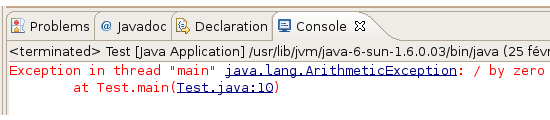
<p>Nous savons donc maintenant qu'une division par zéro est une ArithmeticException. Nous allons pouvoir la capturer, avec un bloc <stromg><i>try{…}catch{…}</i></stromg>, puis réaliser un traitement en conséquence.</p>

<pre class="code-block"><code data-claire-semantic="java" data-code="{&quot;language&quot;:&quot;java&quot;,&quot;source&quot;:&quot;public static void main(String[] args) {\n                \n  int j = 20, i = 0;\n  try {\n    System.out.println(j/i);\n  } catch (ArithmeticException e) {\n    System.out.println(&amp;#x22;Division par z&amp;#xE9;ro !&amp;#x22;);\n  }\n  System.out.println(&amp;#x22;bonjour tout le monde !&amp;#x22;);\n}&quot;}" class="ace" data-widget="codeBlock"><div class="ace-openclassrooms"><div class="ace_static_highlight ace_show_gutter" style="counter-reset:ace_line 0"><div class="ace_line"><span class="ace_gutter ace_gutter-cell" unselectable="on"></span><span class="ace_keyword">public</span> <span class="ace_keyword">static</span> <span class="ace_keyword">void</span> <span class="ace_identifier">main</span>(<span class="ace_support ace_function">String</span>[] <span class="ace_identifier">args</span>) {
</div><div class="ace_line"><span class="ace_gutter ace_gutter-cell" unselectable="on"></span><span class="ace_indent-guide">    </span><span class="ace_indent-guide">    </span><span class="ace_indent-guide">    </span>    
</div><div class="ace_line"><span class="ace_gutter ace_gutter-cell" unselectable="on"></span>  <span class="ace_keyword">int</span> <span class="ace_identifier">j</span> <span class="ace_keyword ace_operator">=</span> <span class="ace_constant ace_numeric">20</span>, <span class="ace_identifier">i</span> <span class="ace_keyword ace_operator">=</span> <span class="ace_constant ace_numeric">0</span>;
</div><div class="ace_line"><span class="ace_gutter ace_gutter-cell" unselectable="on"></span>  <span class="ace_keyword">try</span> {
</div><div class="ace_line"><span class="ace_gutter ace_gutter-cell" unselectable="on"></span>    <span class="ace_support ace_function">System</span>.<span class="ace_identifier">out</span>.<span class="ace_identifier">println</span>(<span class="ace_identifier">j</span>/<span class="ace_identifier">i</span>);
</div><div class="ace_line"><span class="ace_gutter ace_gutter-cell" unselectable="on"></span>  } <span class="ace_keyword">catch</span> (<span class="ace_support ace_function">ArithmeticException</span> <span class="ace_identifier">e</span>) {
</div><div class="ace_line"><span class="ace_gutter ace_gutter-cell" unselectable="on"></span>    <span class="ace_support ace_function">System</span>.<span class="ace_identifier">out</span>.<span class="ace_identifier">println</span>(<span class="ace_string">"Division par zéro !"</span>);
</div><div class="ace_line"><span class="ace_gutter ace_gutter-cell" unselectable="on"></span>  }
</div><div class="ace_line"><span class="ace_gutter ace_gutter-cell" unselectable="on"></span>  <span class="ace_support ace_function">System</span>.<span class="ace_identifier">out</span>.<span class="ace_identifier">println</span>(<span class="ace_string">"bonjour tout le monde !"</span>);
</div><div class="ace_line"><span class="ace_gutter ace_gutter-cell" unselectable="on"></span>}
</div></div></div></code></pre>

<h3>Les exceptions personnalisées</h3>
<p>Nous allons perfectionner un peu la gestion de nos objets Ville et Capitale. On se propose de mettre en œuvre une exception personnalisée afin d'interdire l'instanciation d'un objet Ville ou Capitale présentant un nombre négatif d'habitants.</p>

<pre class="code-block"><code data-claire-semantic="java" data-code="{&quot;language&quot;:&quot;java&quot;,&quot;source&quot;:&quot;class NombreHabitantException extends Exception{ \n  public NombreHabitantException(){\n    System.out.println(&amp;#x22;Vous essayez d&amp;#x27;instancier une classe Ville avec un nombre d&amp;#x27;habitants n&amp;#xE9;gatif !&amp;#x22;);\n  }  \n}&quot;}" class="ace" data-widget="codeBlock"><div class="ace-openclassrooms"><div class="ace_static_highlight ace_show_gutter" style="counter-reset:ace_line 0"><div class="ace_line"><span class="ace_gutter ace_gutter-cell" unselectable="on"></span><span class="ace_keyword">class</span> <span class="ace_identifier">NombreHabitantException</span> <span class="ace_keyword">extends</span> <span class="ace_support ace_function">Exception</span>{ 
</div><div class="ace_line"><span class="ace_gutter ace_gutter-cell" unselectable="on"></span>  <span class="ace_keyword">public</span> <span class="ace_identifier">NombreHabitantException</span>(){
</div><div class="ace_line"><span class="ace_gutter ace_gutter-cell" unselectable="on"></span>    <span class="ace_support ace_function">System</span>.<span class="ace_identifier">out</span>.<span class="ace_identifier">println</span>(<span class="ace_string">"Vous essayez d'instancier une classe Ville avec un nombre d'habitants négatif !"</span>);
</div><div class="ace_line"><span class="ace_gutter ace_gutter-cell" unselectable="on"></span>  }  
</div><div class="ace_line"><span class="ace_gutter ace_gutter-cell" unselectable="on"></span>}
</div></div></div></code></pre>

<pre class="code-block"><code data-claire-semantic="java" data-code="{&quot;language&quot;:&quot;java&quot;,&quot;source&quot;:&quot;public Ville(String pNom, int pNbre, String pPays) \n  throws  NombreHabitantException\n  {  \n    if(pNbre &amp;#x3C; 0)\n      throw new NombreHabitantException();\n    else\n    {\n      nbreInstance++;  \n      nbreInstanceBis++;\n\n      nomVille = pNom;\n      nomPays = pPays;\n      nbreHabitant = pNbre;\n      this.setCategorie();\n    }\n  }&quot;}" class="ace" data-widget="codeBlock"><div class="ace-openclassrooms"><div class="ace_static_highlight ace_show_gutter" style="counter-reset:ace_line 0"><div class="ace_line"><span class="ace_gutter ace_gutter-cell" unselectable="on"></span><span class="ace_keyword">public</span> <span class="ace_identifier">Ville</span>(<span class="ace_support ace_function">String</span> <span class="ace_identifier">pNom</span>, <span class="ace_keyword">int</span> <span class="ace_identifier">pNbre</span>, <span class="ace_support ace_function">String</span> <span class="ace_identifier">pPays</span>) 
</div><div class="ace_line"><span class="ace_gutter ace_gutter-cell" unselectable="on"></span>  <span class="ace_keyword">throws</span>  <span class="ace_identifier">NombreHabitantException</span>
</div><div class="ace_line"><span class="ace_gutter ace_gutter-cell" unselectable="on"></span>  {  
</div><div class="ace_line"><span class="ace_gutter ace_gutter-cell" unselectable="on"></span>    <span class="ace_keyword">if</span>(<span class="ace_identifier">pNbre</span> <span class="ace_keyword ace_operator">&lt;</span> <span class="ace_constant ace_numeric">0</span>)
</div><div class="ace_line"><span class="ace_gutter ace_gutter-cell" unselectable="on"></span><span class="ace_indent-guide">    </span>  <span class="ace_keyword">throw</span> <span class="ace_keyword">new</span> <span class="ace_identifier">NombreHabitantException</span>();
</div><div class="ace_line"><span class="ace_gutter ace_gutter-cell" unselectable="on"></span>    <span class="ace_keyword">else</span>
</div><div class="ace_line"><span class="ace_gutter ace_gutter-cell" unselectable="on"></span>    {
</div><div class="ace_line"><span class="ace_gutter ace_gutter-cell" unselectable="on"></span><span class="ace_indent-guide">    </span>  <span class="ace_identifier">nbreInstance</span><span class="ace_keyword ace_operator">++</span>;  
</div><div class="ace_line"><span class="ace_gutter ace_gutter-cell" unselectable="on"></span><span class="ace_indent-guide">    </span>  <span class="ace_identifier">nbreInstanceBis</span><span class="ace_keyword ace_operator">++</span>;
</div><div class="ace_line"><span class="ace_gutter ace_gutter-cell" unselectable="on"></span>
</div><div class="ace_line"><span class="ace_gutter ace_gutter-cell" unselectable="on"></span><span class="ace_indent-guide">    </span>  <span class="ace_identifier">nomVille</span> <span class="ace_keyword ace_operator">=</span> <span class="ace_identifier">pNom</span>;
</div><div class="ace_line"><span class="ace_gutter ace_gutter-cell" unselectable="on"></span><span class="ace_indent-guide">    </span>  <span class="ace_identifier">nomPays</span> <span class="ace_keyword ace_operator">=</span> <span class="ace_identifier">pPays</span>;
</div><div class="ace_line"><span class="ace_gutter ace_gutter-cell" unselectable="on"></span><span class="ace_indent-guide">    </span>  <span class="ace_identifier">nbreHabitant</span> <span class="ace_keyword ace_operator">=</span> <span class="ace_identifier">pNbre</span>;
</div><div class="ace_line"><span class="ace_gutter ace_gutter-cell" unselectable="on"></span><span class="ace_indent-guide">    </span>  <span class="ace_keyword">this</span>.<span class="ace_identifier">setCategorie</span>();
</div><div class="ace_line"><span class="ace_gutter ace_gutter-cell" unselectable="on"></span>    }
</div><div class="ace_line"><span class="ace_gutter ace_gutter-cell" unselectable="on"></span>  }
</div></div></div></code></pre>

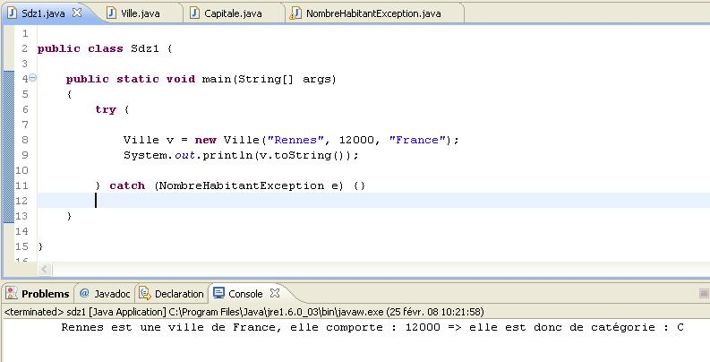

<h3>La gestion de plusieurs exceptions</h3>
<p>Supposons que nous voulons lever une exception si le nom de la ville fait moins de 3 caractères.</p>

<pre class="code-block"><code data-claire-semantic="java" data-code="{&quot;language&quot;:&quot;java&quot;,&quot;source&quot;:&quot;public class NomVilleException extends Exception { \n  public NomVilleException(String message){\n    super(message);\n  }        \n}&quot;}" class="ace" data-widget="codeBlock"><div class="ace-openclassrooms"><div class="ace_static_highlight ace_show_gutter" style="counter-reset:ace_line 0"><div class="ace_line"><span class="ace_gutter ace_gutter-cell" unselectable="on"></span><span class="ace_keyword">public</span> <span class="ace_keyword">class</span> <span class="ace_identifier">NomVilleException</span> <span class="ace_keyword">extends</span> <span class="ace_support ace_function">Exception</span> { 
</div><div class="ace_line"><span class="ace_gutter ace_gutter-cell" unselectable="on"></span>  <span class="ace_keyword">public</span> <span class="ace_identifier">NomVilleException</span>(<span class="ace_support ace_function">String</span> <span class="ace_identifier">message</span>){
</div><div class="ace_line"><span class="ace_gutter ace_gutter-cell" unselectable="on"></span>    <span class="ace_keyword">super</span>(<span class="ace_identifier">message</span>);
</div><div class="ace_line"><span class="ace_gutter ace_gutter-cell" unselectable="on"></span>  }        
</div><div class="ace_line"><span class="ace_gutter ace_gutter-cell" unselectable="on"></span>}
</div></div></div></code></pre>

<p>Dans le code suivant, nous ajoutons une condition dans le constructeur Ville :</p>

<pre class="code-block"><code data-claire-semantic="java" data-code="{&quot;language&quot;:&quot;java&quot;,&quot;source&quot;:&quot;public Ville(String pNom, int pNbre, String pPays) throws  NombreHabitantException, NomVilleException\n{  \n  if(pNbre &amp;#x3C; 0)\n    throw new NombreHabitantException(pNbre);\n          \n  if(pNom.length() &amp;#x3C; 3)\n    throw new NomVilleException(&amp;#x22;le nom de la ville est inf&amp;#xE9;rieur &amp;#xE0; 3 caract&amp;#xE8;res ! nom = &amp;#x22; + pNom);\n  else\n  {\n    nbreInstance++;  \n    nbreInstanceBis++;\n\n    nomVille = pNom;\n    nomPays = pPays;\n    nbreHabitant = pNbre;\n    this.setCategorie();\n  }          \n}&quot;}" class="ace" data-widget="codeBlock"><div class="ace-openclassrooms"><div class="ace_static_highlight ace_show_gutter" style="counter-reset:ace_line 0"><div class="ace_line"><span class="ace_gutter ace_gutter-cell" unselectable="on"></span><span class="ace_keyword">public</span> <span class="ace_identifier">Ville</span>(<span class="ace_support ace_function">String</span> <span class="ace_identifier">pNom</span>, <span class="ace_keyword">int</span> <span class="ace_identifier">pNbre</span>, <span class="ace_support ace_function">String</span> <span class="ace_identifier">pPays</span>) <span class="ace_keyword">throws</span>  <span class="ace_identifier">NombreHabitantException</span>, <span class="ace_identifier">NomVilleException</span>
</div><div class="ace_line"><span class="ace_gutter ace_gutter-cell" unselectable="on"></span>{  
</div><div class="ace_line"><span class="ace_gutter ace_gutter-cell" unselectable="on"></span>  <span class="ace_keyword">if</span>(<span class="ace_identifier">pNbre</span> <span class="ace_keyword ace_operator">&lt;</span> <span class="ace_constant ace_numeric">0</span>)
</div><div class="ace_line"><span class="ace_gutter ace_gutter-cell" unselectable="on"></span>    <span class="ace_keyword">throw</span> <span class="ace_keyword">new</span> <span class="ace_identifier">NombreHabitantException</span>(<span class="ace_identifier">pNbre</span>);
</div><div class="ace_line"><span class="ace_gutter ace_gutter-cell" unselectable="on"></span><span class="ace_indent-guide">    </span><span class="ace_indent-guide">    </span>  
</div><div class="ace_line"><span class="ace_gutter ace_gutter-cell" unselectable="on"></span>  <span class="ace_keyword">if</span>(<span class="ace_identifier">pNom</span>.<span class="ace_identifier">length</span>() <span class="ace_keyword ace_operator">&lt;</span> <span class="ace_constant ace_numeric">3</span>)
</div><div class="ace_line"><span class="ace_gutter ace_gutter-cell" unselectable="on"></span>    <span class="ace_keyword">throw</span> <span class="ace_keyword">new</span> <span class="ace_identifier">NomVilleException</span>(<span class="ace_string">"le nom de la ville est inférieur à 3 caractères ! nom = "</span> <span class="ace_keyword ace_operator">+</span> <span class="ace_identifier">pNom</span>);
</div><div class="ace_line"><span class="ace_gutter ace_gutter-cell" unselectable="on"></span>  <span class="ace_keyword">else</span>
</div><div class="ace_line"><span class="ace_gutter ace_gutter-cell" unselectable="on"></span>  {
</div><div class="ace_line"><span class="ace_gutter ace_gutter-cell" unselectable="on"></span>    <span class="ace_identifier">nbreInstance</span><span class="ace_keyword ace_operator">++</span>;  
</div><div class="ace_line"><span class="ace_gutter ace_gutter-cell" unselectable="on"></span>    <span class="ace_identifier">nbreInstanceBis</span><span class="ace_keyword ace_operator">++</span>;
</div><div class="ace_line"><span class="ace_gutter ace_gutter-cell" unselectable="on"></span>
</div><div class="ace_line"><span class="ace_gutter ace_gutter-cell" unselectable="on"></span>    <span class="ace_identifier">nomVille</span> <span class="ace_keyword ace_operator">=</span> <span class="ace_identifier">pNom</span>;
</div><div class="ace_line"><span class="ace_gutter ace_gutter-cell" unselectable="on"></span>    <span class="ace_identifier">nomPays</span> <span class="ace_keyword ace_operator">=</span> <span class="ace_identifier">pPays</span>;
</div><div class="ace_line"><span class="ace_gutter ace_gutter-cell" unselectable="on"></span>    <span class="ace_identifier">nbreHabitant</span> <span class="ace_keyword ace_operator">=</span> <span class="ace_identifier">pNbre</span>;
</div><div class="ace_line"><span class="ace_gutter ace_gutter-cell" unselectable="on"></span>    <span class="ace_keyword">this</span>.<span class="ace_identifier">setCategorie</span>();
</div><div class="ace_line"><span class="ace_gutter ace_gutter-cell" unselectable="on"></span>  }          
</div><div class="ace_line"><span class="ace_gutter ace_gutter-cell" unselectable="on"></span>}
</div></div></div></code></pre>

<pre class="code-block"><code data-claire-semantic="java" data-code="{&quot;language&quot;:&quot;java&quot;,&quot;source&quot;:&quot;Ville v = null;\n\ntry {\n  v = new Ville(&amp;#x22;Re&amp;#x22;, 12000, &amp;#x22;France&amp;#x22;);\n}\n\n//Gestion de l&amp;#x27;exception sur le nombre d&amp;#x27;habitants\ncatch (NombreHabitantException e) {\n  e.printStackTrace();\n}\n\n//Gestion de l&amp;#x27;exception sur le nom de la ville\ncatch(NomVilleException e2){\n  System.out.println(e2.getMessage());\n}\nfinally{\n  if(v == null)\n    v = new Ville();\n}\n      \nSystem.out.println(v.toString());&quot;}" class="ace" data-widget="codeBlock"><div class="ace-openclassrooms"><div class="ace_static_highlight ace_show_gutter" style="counter-reset:ace_line 0"><div class="ace_line"><span class="ace_gutter ace_gutter-cell" unselectable="on"></span><span class="ace_identifier">Ville</span> <span class="ace_identifier">v</span> <span class="ace_keyword ace_operator">=</span> <span class="ace_constant ace_language">null</span>;
</div><div class="ace_line"><span class="ace_gutter ace_gutter-cell" unselectable="on"></span>
</div><div class="ace_line"><span class="ace_gutter ace_gutter-cell" unselectable="on"></span><span class="ace_keyword">try</span> {
</div><div class="ace_line"><span class="ace_gutter ace_gutter-cell" unselectable="on"></span>  <span class="ace_identifier">v</span> <span class="ace_keyword ace_operator">=</span> <span class="ace_keyword">new</span> <span class="ace_identifier">Ville</span>(<span class="ace_string">"Re"</span>, <span class="ace_constant ace_numeric">12000</span>, <span class="ace_string">"France"</span>);
</div><div class="ace_line"><span class="ace_gutter ace_gutter-cell" unselectable="on"></span>}
</div><div class="ace_line"><span class="ace_gutter ace_gutter-cell" unselectable="on"></span>
</div><div class="ace_line"><span class="ace_gutter ace_gutter-cell" unselectable="on"></span><span class="ace_comment">//Gestion de l'exception sur le nombre d'habitants</span>
</div><div class="ace_line"><span class="ace_gutter ace_gutter-cell" unselectable="on"></span><span class="ace_keyword">catch</span> (<span class="ace_identifier">NombreHabitantException</span> <span class="ace_identifier">e</span>) {
</div><div class="ace_line"><span class="ace_gutter ace_gutter-cell" unselectable="on"></span>  <span class="ace_identifier">e</span>.<span class="ace_identifier">printStackTrace</span>();
</div><div class="ace_line"><span class="ace_gutter ace_gutter-cell" unselectable="on"></span>}
</div><div class="ace_line"><span class="ace_gutter ace_gutter-cell" unselectable="on"></span>
</div><div class="ace_line"><span class="ace_gutter ace_gutter-cell" unselectable="on"></span><span class="ace_comment">//Gestion de l'exception sur le nom de la ville</span>
</div><div class="ace_line"><span class="ace_gutter ace_gutter-cell" unselectable="on"></span><span class="ace_keyword">catch</span>(<span class="ace_identifier">NomVilleException</span> <span class="ace_identifier">e2</span>){
</div><div class="ace_line"><span class="ace_gutter ace_gutter-cell" unselectable="on"></span>  <span class="ace_support ace_function">System</span>.<span class="ace_identifier">out</span>.<span class="ace_identifier">println</span>(<span class="ace_identifier">e2</span>.<span class="ace_identifier">getMessage</span>());
</div><div class="ace_line"><span class="ace_gutter ace_gutter-cell" unselectable="on"></span>}
</div><div class="ace_line"><span class="ace_gutter ace_gutter-cell" unselectable="on"></span><span class="ace_keyword">finally</span>{
</div><div class="ace_line"><span class="ace_gutter ace_gutter-cell" unselectable="on"></span>  <span class="ace_keyword">if</span>(<span class="ace_identifier">v</span> <span class="ace_keyword ace_operator">==</span> <span class="ace_constant ace_language">null</span>)
</div><div class="ace_line"><span class="ace_gutter ace_gutter-cell" unselectable="on"></span>    <span class="ace_identifier">v</span> <span class="ace_keyword ace_operator">=</span> <span class="ace_keyword">new</span> <span class="ace_identifier">Ville</span>();
</div><div class="ace_line"><span class="ace_gutter ace_gutter-cell" unselectable="on"></span>}
</div><div class="ace_line"><span class="ace_gutter ace_gutter-cell" unselectable="on"></span><span class="ace_indent-guide">    </span>  
</div><div class="ace_line"><span class="ace_gutter ace_gutter-cell" unselectable="on"></span><span class="ace_support ace_function">System</span>.<span class="ace_identifier">out</span>.<span class="ace_identifier">println</span>(<span class="ace_identifier">v</span>.<span class="ace_identifier">toString</span>());
</div></div></div></code></pre>

<h3><a name="collections">Les collections d'objets</a></h3>
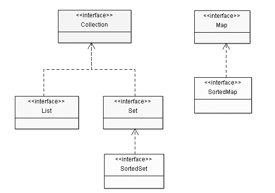
<h3>Les objets List</h3>
<p>Les objets appartenant à la catégorie List sont des tableaux extensibles à volonté. On y trouve les objets <strong>Vector</strong>, <strong>LinkedList</strong> et <strong>ArrayList</strong>. Vous pouvez y insérer autant d'éléments que vous le souhaitez sans craindre de dépasser la taille de votre tableau.</p>
<h4>L'objet LinkedList</h4>
<p>Une liste chaînée est une liste dont chaque élément est lié aux éléments adjacents par une référence à ces derniers. Chaque élément contient une référence à l'élément précédent et à l'élément suivant, exceptés le premier, dont l'élément précédent vaut null, et le dernier, dont l'élément suivant vaut également null.</p>
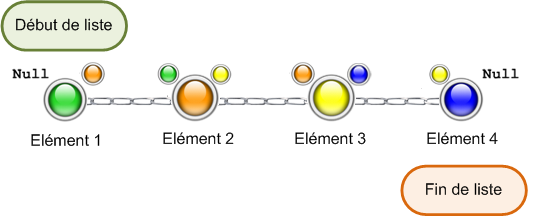

<pre class="code-block"><code data-claire-semantic="java" data-code="{&quot;language&quot;:&quot;java&quot;,&quot;source&quot;:&quot;import java.util.LinkedList;\nimport java.util.List;\nimport java.util.ListIterator;\n \npublic class Test {\n \n  public static void main(String[] args) {\n    List l = new LinkedList();\n    l.add(12);\n    l.add(&amp;#x22;toto ! !&amp;#x22;);\n    l.add(12.20f);\n\n    for(int i = 0; i &amp;#x3C; l.size(); i++)\n      System.out.println(&amp;#x22;&amp;#xC9;l&amp;#xE9;ment &amp;#xE0; l&amp;#x27;index &amp;#x22; + i + &amp;#x22; = &amp;#x22; + l.get(i));\n\n      System.out.println(&amp;#x22;\\n \\tParcours avec un it&amp;#xE9;rateur &amp;#x22;);\n      System.out.println(&amp;#x22;-----------------------------------&amp;#x22;);\n      ListIterator li = l.listIterator();\n\n      while(li.hasNext())\n        System.out.println(li.next());\n  }\n}&quot;}" class="ace" data-widget="codeBlock"><div class="ace-openclassrooms"><div class="ace_static_highlight ace_show_gutter" style="counter-reset:ace_line 0"><div class="ace_line"><span class="ace_gutter ace_gutter-cell" unselectable="on"></span><span class="ace_keyword">import</span> <span class="ace_identifier">java</span>.<span class="ace_identifier">util</span>.<span class="ace_identifier">LinkedList</span>;
</div><div class="ace_line"><span class="ace_gutter ace_gutter-cell" unselectable="on"></span><span class="ace_keyword">import</span> <span class="ace_identifier">java</span>.<span class="ace_identifier">util</span>.<span class="ace_identifier">List</span>;
</div><div class="ace_line"><span class="ace_gutter ace_gutter-cell" unselectable="on"></span><span class="ace_keyword">import</span> <span class="ace_identifier">java</span>.<span class="ace_identifier">util</span>.<span class="ace_identifier">ListIterator</span>;
</div><div class="ace_line"><span class="ace_gutter ace_gutter-cell" unselectable="on"></span> 
</div><div class="ace_line"><span class="ace_gutter ace_gutter-cell" unselectable="on"></span><span class="ace_keyword">public</span> <span class="ace_keyword">class</span> <span class="ace_identifier">Test</span> {
</div><div class="ace_line"><span class="ace_gutter ace_gutter-cell" unselectable="on"></span> 
</div><div class="ace_line"><span class="ace_gutter ace_gutter-cell" unselectable="on"></span>  <span class="ace_keyword">public</span> <span class="ace_keyword">static</span> <span class="ace_keyword">void</span> <span class="ace_identifier">main</span>(<span class="ace_support ace_function">String</span>[] <span class="ace_identifier">args</span>) {
</div><div class="ace_line"><span class="ace_gutter ace_gutter-cell" unselectable="on"></span>    <span class="ace_identifier">List</span> <span class="ace_identifier">l</span> <span class="ace_keyword ace_operator">=</span> <span class="ace_keyword">new</span> <span class="ace_identifier">LinkedList</span>();
</div><div class="ace_line"><span class="ace_gutter ace_gutter-cell" unselectable="on"></span>    <span class="ace_identifier">l</span>.<span class="ace_identifier">add</span>(<span class="ace_constant ace_numeric">12</span>);
</div><div class="ace_line"><span class="ace_gutter ace_gutter-cell" unselectable="on"></span>    <span class="ace_identifier">l</span>.<span class="ace_identifier">add</span>(<span class="ace_string">"toto ! !"</span>);
</div><div class="ace_line"><span class="ace_gutter ace_gutter-cell" unselectable="on"></span>    <span class="ace_identifier">l</span>.<span class="ace_identifier">add</span>(<span class="ace_constant ace_numeric">12.20f</span>);
</div><div class="ace_line"><span class="ace_gutter ace_gutter-cell" unselectable="on"></span>
</div><div class="ace_line"><span class="ace_gutter ace_gutter-cell" unselectable="on"></span>    <span class="ace_keyword">for</span>(<span class="ace_keyword">int</span> <span class="ace_identifier">i</span> <span class="ace_keyword ace_operator">=</span> <span class="ace_constant ace_numeric">0</span>; <span class="ace_identifier">i</span> <span class="ace_keyword ace_operator">&lt;</span> <span class="ace_identifier">l</span>.<span class="ace_identifier">size</span>(); <span class="ace_identifier">i</span><span class="ace_keyword ace_operator">++</span>)
</div><div class="ace_line"><span class="ace_gutter ace_gutter-cell" unselectable="on"></span><span class="ace_indent-guide">    </span>  <span class="ace_support ace_function">System</span>.<span class="ace_identifier">out</span>.<span class="ace_identifier">println</span>(<span class="ace_string">"Élément à l'index "</span> <span class="ace_keyword ace_operator">+</span> <span class="ace_identifier">i</span> <span class="ace_keyword ace_operator">+</span> <span class="ace_string">" = "</span> <span class="ace_keyword ace_operator">+</span> <span class="ace_identifier">l</span>.<span class="ace_identifier">get</span>(<span class="ace_identifier">i</span>));
</div><div class="ace_line"><span class="ace_gutter ace_gutter-cell" unselectable="on"></span>
</div><div class="ace_line"><span class="ace_gutter ace_gutter-cell" unselectable="on"></span><span class="ace_indent-guide">    </span>  <span class="ace_support ace_function">System</span>.<span class="ace_identifier">out</span>.<span class="ace_identifier">println</span>(<span class="ace_string">"\n \tParcours avec un itérateur "</span>);
</div><div class="ace_line"><span class="ace_gutter ace_gutter-cell" unselectable="on"></span><span class="ace_indent-guide">    </span>  <span class="ace_support ace_function">System</span>.<span class="ace_identifier">out</span>.<span class="ace_identifier">println</span>(<span class="ace_string">"-----------------------------------"</span>);
</div><div class="ace_line"><span class="ace_gutter ace_gutter-cell" unselectable="on"></span><span class="ace_indent-guide">    </span>  <span class="ace_identifier">ListIterator</span> <span class="ace_identifier">li</span> <span class="ace_keyword ace_operator">=</span> <span class="ace_identifier">l</span>.<span class="ace_identifier">listIterator</span>();
</div><div class="ace_line"><span class="ace_gutter ace_gutter-cell" unselectable="on"></span>
</div><div class="ace_line"><span class="ace_gutter ace_gutter-cell" unselectable="on"></span><span class="ace_indent-guide">    </span>  <span class="ace_keyword">while</span>(<span class="ace_identifier">li</span>.<span class="ace_identifier">hasNext</span>())
</div><div class="ace_line"><span class="ace_gutter ace_gutter-cell" unselectable="on"></span><span class="ace_indent-guide">    </span>    <span class="ace_support ace_function">System</span>.<span class="ace_identifier">out</span>.<span class="ace_identifier">println</span>(<span class="ace_identifier">li</span>.<span class="ace_identifier">next</span>());
</div><div class="ace_line"><span class="ace_gutter ace_gutter-cell" unselectable="on"></span>  }
</div><div class="ace_line"><span class="ace_gutter ace_gutter-cell" unselectable="on"></span>}
</div></div></div></code></pre>

<p>Attention : vu que tous les éléments contiennent une référence à l'élément suivant, de telles listes risquent de devenir particulièrement lourdes en grandissant ! Cependant, elles sont adaptées lorsqu'il faut beaucoup manipuler une collection en supprimant ou en ajoutant des objets en milieu de liste.</p>

<h4>L'objet ArrayList</h4>
<p>ArrayList est un objet qui n'a pas de taille limite et qui accepte n'importe quel type de données, y compris null ! Nous pouvons mettre tout ce que nous voulons dans un ArrayList, voici un morceau de code qui le prouve :</p>

<pre class="code-block"><code data-claire-semantic="java" data-code="{&quot;language&quot;:&quot;java&quot;,&quot;source&quot;:&quot;import java.util.ArrayList;\n \npublic class Test {\n \n  public static void main(String[] args) {\n         \n    ArrayList al = new ArrayList();\n    al.add(12);\n    al.add(&amp;#x22;Une cha&amp;#xEE;ne de caract&amp;#xE8;res !&amp;#x22;);\n    al.add(12.20f);\n    al.add(&amp;#x27;d&amp;#x27;);\n                \n    for(int i = 0; i &amp;#x3C; al.size(); i++)\n    {\n      System.out.println(&amp;#x22;donn&amp;#xE9;e &amp;#xE0; l&amp;#x27;indice &amp;#x22; + i + &amp;#x22; = &amp;#x22; + al.get(i));\n    }               \n  }\n}&quot;}" class="ace" data-widget="codeBlock"><div class="ace-openclassrooms"><div class="ace_static_highlight ace_show_gutter" style="counter-reset:ace_line 0"><div class="ace_line"><span class="ace_gutter ace_gutter-cell" unselectable="on"></span><span class="ace_keyword">import</span> <span class="ace_identifier">java</span>.<span class="ace_identifier">util</span>.<span class="ace_identifier">ArrayList</span>;
</div><div class="ace_line"><span class="ace_gutter ace_gutter-cell" unselectable="on"></span> 
</div><div class="ace_line"><span class="ace_gutter ace_gutter-cell" unselectable="on"></span><span class="ace_keyword">public</span> <span class="ace_keyword">class</span> <span class="ace_identifier">Test</span> {
</div><div class="ace_line"><span class="ace_gutter ace_gutter-cell" unselectable="on"></span> 
</div><div class="ace_line"><span class="ace_gutter ace_gutter-cell" unselectable="on"></span>  <span class="ace_keyword">public</span> <span class="ace_keyword">static</span> <span class="ace_keyword">void</span> <span class="ace_identifier">main</span>(<span class="ace_support ace_function">String</span>[] <span class="ace_identifier">args</span>) {
</div><div class="ace_line"><span class="ace_gutter ace_gutter-cell" unselectable="on"></span><span class="ace_indent-guide">    </span><span class="ace_indent-guide">    </span> 
</div><div class="ace_line"><span class="ace_gutter ace_gutter-cell" unselectable="on"></span>    <span class="ace_identifier">ArrayList</span> <span class="ace_identifier">al</span> <span class="ace_keyword ace_operator">=</span> <span class="ace_keyword">new</span> <span class="ace_identifier">ArrayList</span>();
</div><div class="ace_line"><span class="ace_gutter ace_gutter-cell" unselectable="on"></span>    <span class="ace_identifier">al</span>.<span class="ace_identifier">add</span>(<span class="ace_constant ace_numeric">12</span>);
</div><div class="ace_line"><span class="ace_gutter ace_gutter-cell" unselectable="on"></span>    <span class="ace_identifier">al</span>.<span class="ace_identifier">add</span>(<span class="ace_string">"Une chaîne de caractères !"</span>);
</div><div class="ace_line"><span class="ace_gutter ace_gutter-cell" unselectable="on"></span>    <span class="ace_identifier">al</span>.<span class="ace_identifier">add</span>(<span class="ace_constant ace_numeric">12.20f</span>);
</div><div class="ace_line"><span class="ace_gutter ace_gutter-cell" unselectable="on"></span>    <span class="ace_identifier">al</span>.<span class="ace_identifier">add</span>(<span class="ace_string">'d'</span>);
</div><div class="ace_line"><span class="ace_gutter ace_gutter-cell" unselectable="on"></span><span class="ace_indent-guide">    </span><span class="ace_indent-guide">    </span><span class="ace_indent-guide">    </span>    
</div><div class="ace_line"><span class="ace_gutter ace_gutter-cell" unselectable="on"></span>    <span class="ace_keyword">for</span>(<span class="ace_keyword">int</span> <span class="ace_identifier">i</span> <span class="ace_keyword ace_operator">=</span> <span class="ace_constant ace_numeric">0</span>; <span class="ace_identifier">i</span> <span class="ace_keyword ace_operator">&lt;</span> <span class="ace_identifier">al</span>.<span class="ace_identifier">size</span>(); <span class="ace_identifier">i</span><span class="ace_keyword ace_operator">++</span>)
</div><div class="ace_line"><span class="ace_gutter ace_gutter-cell" unselectable="on"></span>    {
</div><div class="ace_line"><span class="ace_gutter ace_gutter-cell" unselectable="on"></span><span class="ace_indent-guide">    </span>  <span class="ace_support ace_function">System</span>.<span class="ace_identifier">out</span>.<span class="ace_identifier">println</span>(<span class="ace_string">"donnée à l'indice "</span> <span class="ace_keyword ace_operator">+</span> <span class="ace_identifier">i</span> <span class="ace_keyword ace_operator">+</span> <span class="ace_string">" = "</span> <span class="ace_keyword ace_operator">+</span> <span class="ace_identifier">al</span>.<span class="ace_identifier">get</span>(<span class="ace_identifier">i</span>));
</div><div class="ace_line"><span class="ace_gutter ace_gutter-cell" unselectable="on"></span>    }               
</div><div class="ace_line"><span class="ace_gutter ace_gutter-cell" unselectable="on"></span>  }
</div><div class="ace_line"><span class="ace_gutter ace_gutter-cell" unselectable="on"></span>}
</div></div></div></code></pre>

<p>Si vous exécutez ce code, vous obtiendrez la figure suivante.</p>
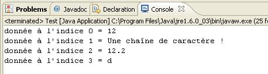
<p>Il existe tout un panel de méthodes fournies avec cet objet :</p>
<ul>
  <li>add() permet d'ajouter un élément ;</li>
  <li>get(int index) retourne l'élément à l'indice demandé ;</li>
  <li>remove(int index) efface l'entrée à l'indice demandé ;</li>
  <li>isEmpty() renvoie « vrai » si l'objet est vide ;</li>
  <li>removeAll() efface tout le contenu de l'objet ;</li>
  <li>contains(Object element) retourne « vrai » si l'élément passé en paramètre est dans l'ArrayList.</li>
</ul>
<p>Contrairement aux LinkedList, les ArrayList sont rapides en lecture, même avec un gros volume d'objets. Elles sont cependant plus lentes si vous devez ajouter ou supprimer des données en milieu de liste. Pour résumer, si vous effectuez beaucoup de lectures sans vous soucier de l'ordre des éléments, optez pour une ArrayList ; en revanche, si vous insérez beaucoup de données au milieu de la liste, optez pour une Linkedlist.</p>

<h3>Les objets Map</h3>
<p>Une collection de type Map est une collection qui fonctionne avec un couple <strong>clé - valeur</strong>. On y trouve les objets <strong>Hashtable, HashMap, TreeMap, WeakHashMap…</strong> La clé, qui sert à identifier une entrée dans notre collection, est unique. La valeur, au contraire, peut être associée à plusieurs clés.</p>
<h4>L'objet Hashtable</h4>

<pre class="code-block"><code data-claire-semantic="java" data-code="{&quot;language&quot;:&quot;java&quot;,&quot;source&quot;:&quot;import java.util.Enumeration;\nimport java.util.Hashtable;\n\npublic class Test {\n\n  public static void main(String[] args) {\n\n    Hashtable ht = new Hashtable();\n    ht.put(1, &amp;#x22;printemps&amp;#x22;);\n    ht.put(10, &amp;#x22;&amp;#xE9;t&amp;#xE9;&amp;#x22;);\n    ht.put(12, &amp;#x22;automne&amp;#x22;);\n    ht.put(45, &amp;#x22;hiver&amp;#x22;);\n\n    Enumeration e = ht.elements();\n\n    while(e.hasMoreElements())\n      System.out.println(e.nextElement());\n\n  }\n}&quot;}" class="ace" data-widget="codeBlock"><div class="ace-openclassrooms"><div class="ace_static_highlight ace_show_gutter" style="counter-reset:ace_line 0"><div class="ace_line"><span class="ace_gutter ace_gutter-cell" unselectable="on"></span><span class="ace_keyword">import</span> <span class="ace_identifier">java</span>.<span class="ace_identifier">util</span>.<span class="ace_identifier">Enumeration</span>;
</div><div class="ace_line"><span class="ace_gutter ace_gutter-cell" unselectable="on"></span><span class="ace_keyword">import</span> <span class="ace_identifier">java</span>.<span class="ace_identifier">util</span>.<span class="ace_identifier">Hashtable</span>;
</div><div class="ace_line"><span class="ace_gutter ace_gutter-cell" unselectable="on"></span>
</div><div class="ace_line"><span class="ace_gutter ace_gutter-cell" unselectable="on"></span><span class="ace_keyword">public</span> <span class="ace_keyword">class</span> <span class="ace_identifier">Test</span> {
</div><div class="ace_line"><span class="ace_gutter ace_gutter-cell" unselectable="on"></span>
</div><div class="ace_line"><span class="ace_gutter ace_gutter-cell" unselectable="on"></span>  <span class="ace_keyword">public</span> <span class="ace_keyword">static</span> <span class="ace_keyword">void</span> <span class="ace_identifier">main</span>(<span class="ace_support ace_function">String</span>[] <span class="ace_identifier">args</span>) {
</div><div class="ace_line"><span class="ace_gutter ace_gutter-cell" unselectable="on"></span>
</div><div class="ace_line"><span class="ace_gutter ace_gutter-cell" unselectable="on"></span>    <span class="ace_identifier">Hashtable</span> <span class="ace_identifier">ht</span> <span class="ace_keyword ace_operator">=</span> <span class="ace_keyword">new</span> <span class="ace_identifier">Hashtable</span>();
</div><div class="ace_line"><span class="ace_gutter ace_gutter-cell" unselectable="on"></span>    <span class="ace_identifier">ht</span>.<span class="ace_identifier">put</span>(<span class="ace_constant ace_numeric">1</span>, <span class="ace_string">"printemps"</span>);
</div><div class="ace_line"><span class="ace_gutter ace_gutter-cell" unselectable="on"></span>    <span class="ace_identifier">ht</span>.<span class="ace_identifier">put</span>(<span class="ace_constant ace_numeric">10</span>, <span class="ace_string">"été"</span>);
</div><div class="ace_line"><span class="ace_gutter ace_gutter-cell" unselectable="on"></span>    <span class="ace_identifier">ht</span>.<span class="ace_identifier">put</span>(<span class="ace_constant ace_numeric">12</span>, <span class="ace_string">"automne"</span>);
</div><div class="ace_line"><span class="ace_gutter ace_gutter-cell" unselectable="on"></span>    <span class="ace_identifier">ht</span>.<span class="ace_identifier">put</span>(<span class="ace_constant ace_numeric">45</span>, <span class="ace_string">"hiver"</span>);
</div><div class="ace_line"><span class="ace_gutter ace_gutter-cell" unselectable="on"></span>
</div><div class="ace_line"><span class="ace_gutter ace_gutter-cell" unselectable="on"></span>    <span class="ace_identifier">Enumeration</span> <span class="ace_identifier">e</span> <span class="ace_keyword ace_operator">=</span> <span class="ace_identifier">ht</span>.<span class="ace_identifier">elements</span>();
</div><div class="ace_line"><span class="ace_gutter ace_gutter-cell" unselectable="on"></span>
</div><div class="ace_line"><span class="ace_gutter ace_gutter-cell" unselectable="on"></span>    <span class="ace_keyword">while</span>(<span class="ace_identifier">e</span>.<span class="ace_identifier">hasMoreElements</span>())
</div><div class="ace_line"><span class="ace_gutter ace_gutter-cell" unselectable="on"></span><span class="ace_indent-guide">    </span>  <span class="ace_support ace_function">System</span>.<span class="ace_identifier">out</span>.<span class="ace_identifier">println</span>(<span class="ace_identifier">e</span>.<span class="ace_identifier">nextElement</span>());
</div><div class="ace_line"><span class="ace_gutter ace_gutter-cell" unselectable="on"></span>
</div><div class="ace_line"><span class="ace_gutter ace_gutter-cell" unselectable="on"></span>  }
</div><div class="ace_line"><span class="ace_gutter ace_gutter-cell" unselectable="on"></span>}
</div></div></div></code></pre>

<h3>Les objets Set</h3>
<p>Un Set est une collection qui n'accepte pas les doublons. Par exemple, elle n'accepte qu'une seule fois null, car deux valeurs null sont considérées comme un doublon. On trouve parmi les Set les objets <strong>HashSet, TreeSet, LinkedHashSet…</strong></p>
<h4>L'objet HashSet</h4>

<pre class="code-block"><code data-claire-semantic="java" data-code="{&quot;language&quot;:&quot;java&quot;,&quot;source&quot;:&quot;import java.util.HashSet;\nimport java.util.Iterator;\n \npublic class Test { \n  public static void main(String[] args) {         \n    HashSet hs = new HashSet();\n    hs.add(&amp;#x22;toto&amp;#x22;);\n    hs.add(12);\n    hs.add(&amp;#x27;d&amp;#x27;);\n\n    Iterator it = hs.iterator();\n    while(it.hasNext())\n      System.out.println(it.next());\n \n    System.out.println(&amp;#x22;\\nParcours avec un tableau d&amp;#x27;objet&amp;#x22;);\n    System.out.println(&amp;#x22;-----------------------------------&amp;#x22;);\n                \n    Object[] obj = hs.toArray();\n    for(Object o : obj)\n      System.out.println(o);                \n  }\n}&quot;}" class="ace" data-widget="codeBlock"><div class="ace-openclassrooms"><div class="ace_static_highlight ace_show_gutter" style="counter-reset:ace_line 0"><div class="ace_line"><span class="ace_gutter ace_gutter-cell" unselectable="on"></span><span class="ace_keyword">import</span> <span class="ace_identifier">java</span>.<span class="ace_identifier">util</span>.<span class="ace_identifier">HashSet</span>;
</div><div class="ace_line"><span class="ace_gutter ace_gutter-cell" unselectable="on"></span><span class="ace_keyword">import</span> <span class="ace_identifier">java</span>.<span class="ace_identifier">util</span>.<span class="ace_identifier">Iterator</span>;
</div><div class="ace_line"><span class="ace_gutter ace_gutter-cell" unselectable="on"></span> 
</div><div class="ace_line"><span class="ace_gutter ace_gutter-cell" unselectable="on"></span><span class="ace_keyword">public</span> <span class="ace_keyword">class</span> <span class="ace_identifier">Test</span> { 
</div><div class="ace_line"><span class="ace_gutter ace_gutter-cell" unselectable="on"></span>  <span class="ace_keyword">public</span> <span class="ace_keyword">static</span> <span class="ace_keyword">void</span> <span class="ace_identifier">main</span>(<span class="ace_support ace_function">String</span>[] <span class="ace_identifier">args</span>) {         
</div><div class="ace_line"><span class="ace_gutter ace_gutter-cell" unselectable="on"></span>    <span class="ace_identifier">HashSet</span> <span class="ace_identifier">hs</span> <span class="ace_keyword ace_operator">=</span> <span class="ace_keyword">new</span> <span class="ace_identifier">HashSet</span>();
</div><div class="ace_line"><span class="ace_gutter ace_gutter-cell" unselectable="on"></span>    <span class="ace_identifier">hs</span>.<span class="ace_identifier">add</span>(<span class="ace_string">"toto"</span>);
</div><div class="ace_line"><span class="ace_gutter ace_gutter-cell" unselectable="on"></span>    <span class="ace_identifier">hs</span>.<span class="ace_identifier">add</span>(<span class="ace_constant ace_numeric">12</span>);
</div><div class="ace_line"><span class="ace_gutter ace_gutter-cell" unselectable="on"></span>    <span class="ace_identifier">hs</span>.<span class="ace_identifier">add</span>(<span class="ace_string">'d'</span>);
</div><div class="ace_line"><span class="ace_gutter ace_gutter-cell" unselectable="on"></span>
</div><div class="ace_line"><span class="ace_gutter ace_gutter-cell" unselectable="on"></span>    <span class="ace_identifier">Iterator</span> <span class="ace_identifier">it</span> <span class="ace_keyword ace_operator">=</span> <span class="ace_identifier">hs</span>.<span class="ace_identifier">iterator</span>();
</div><div class="ace_line"><span class="ace_gutter ace_gutter-cell" unselectable="on"></span>    <span class="ace_keyword">while</span>(<span class="ace_identifier">it</span>.<span class="ace_identifier">hasNext</span>())
</div><div class="ace_line"><span class="ace_gutter ace_gutter-cell" unselectable="on"></span><span class="ace_indent-guide">    </span>  <span class="ace_support ace_function">System</span>.<span class="ace_identifier">out</span>.<span class="ace_identifier">println</span>(<span class="ace_identifier">it</span>.<span class="ace_identifier">next</span>());
</div><div class="ace_line"><span class="ace_gutter ace_gutter-cell" unselectable="on"></span> 
</div><div class="ace_line"><span class="ace_gutter ace_gutter-cell" unselectable="on"></span>    <span class="ace_support ace_function">System</span>.<span class="ace_identifier">out</span>.<span class="ace_identifier">println</span>(<span class="ace_string">"\nParcours avec un tableau d'objet"</span>);
</div><div class="ace_line"><span class="ace_gutter ace_gutter-cell" unselectable="on"></span>    <span class="ace_support ace_function">System</span>.<span class="ace_identifier">out</span>.<span class="ace_identifier">println</span>(<span class="ace_string">"-----------------------------------"</span>);
</div><div class="ace_line"><span class="ace_gutter ace_gutter-cell" unselectable="on"></span><span class="ace_indent-guide">    </span><span class="ace_indent-guide">    </span><span class="ace_indent-guide">    </span>    
</div><div class="ace_line"><span class="ace_gutter ace_gutter-cell" unselectable="on"></span>    <span class="ace_support ace_function">Object</span>[] <span class="ace_identifier">obj</span> <span class="ace_keyword ace_operator">=</span> <span class="ace_identifier">hs</span>.<span class="ace_identifier">toArray</span>();
</div><div class="ace_line"><span class="ace_gutter ace_gutter-cell" unselectable="on"></span>    <span class="ace_keyword">for</span>(<span class="ace_support ace_function">Object</span> <span class="ace_identifier">o</span> : <span class="ace_identifier">obj</span>)
</div><div class="ace_line"><span class="ace_gutter ace_gutter-cell" unselectable="on"></span><span class="ace_indent-guide">    </span>  <span class="ace_support ace_function">System</span>.<span class="ace_identifier">out</span>.<span class="ace_identifier">println</span>(<span class="ace_identifier">o</span>);                
</div><div class="ace_line"><span class="ace_gutter ace_gutter-cell" unselectable="on"></span>  }
</div><div class="ace_line"><span class="ace_gutter ace_gutter-cell" unselectable="on"></span>}
</div></div></div></code></pre>

<h3><a name="flux">Les flux d'entrée/sortie</a></h3>
<h4>L'objet File</h4>
<p>Créez un fichier avec l'extension que vous voulez et enregistrez-le à la racine de votre projet Eclipse.</p>

<pre class="code-block"><code data-claire-semantic="java" data-code="{&quot;language&quot;:&quot;java&quot;,&quot;source&quot;:&quot;Voici une ligne de test.\nVoici une autre ligne de test.\nEt en voici une troisi&amp;#xE8;me !&quot;}" class="ace" data-widget="codeBlock"><div class="ace-openclassrooms"><div class="ace_static_highlight ace_show_gutter" style="counter-reset:ace_line 0"><div class="ace_line"><span class="ace_gutter ace_gutter-cell" unselectable="on"></span><span class="ace_identifier">Voici</span> <span class="ace_identifier">une</span> <span class="ace_identifier">ligne</span> <span class="ace_identifier">de</span> <span class="ace_identifier">test</span>.
</div><div class="ace_line"><span class="ace_gutter ace_gutter-cell" unselectable="on"></span><span class="ace_identifier">Voici</span> <span class="ace_identifier">une</span> <span class="ace_identifier">autre</span> <span class="ace_identifier">ligne</span> <span class="ace_identifier">de</span> <span class="ace_identifier">test</span>.
</div><div class="ace_line"><span class="ace_gutter ace_gutter-cell" unselectable="on"></span><span class="ace_identifier">Et en voici</span> <span class="ace_identifier">une</span> <span class="ace_identifier">troisi</span>è<span class="ace_identifier">me</span> <span class="ace_keyword ace_operator">!</span></div></div></div></code></pre>

<pre class="code-block"><code data-claire-semantic="java" data-code="{&quot;language&quot;:&quot;java&quot;,&quot;source&quot;:&quot;//Package &amp;#xE0; importer afin d&amp;#x27;utiliser l&amp;#x27;objet File\nimport java.io.File;\n\npublic class Main {\n  public static void main(String[] args) {\n    //Cr&amp;#xE9;ation de l&amp;#x27;objet File\n    File f = new File(&amp;#x22;test.txt&amp;#x22;);\n    System.out.println(&amp;#x22;Chemin absolu du fichier : &amp;#x22; + f.getAbsolutePath());\n    System.out.println(&amp;#x22;Nom du fichier : &amp;#x22; + f.getName());\n    System.out.println(&amp;#x22;Est-ce qu&amp;#x27;il existe ? &amp;#x22; + f.exists());\n    System.out.println(&amp;#x22;Est-ce un r&amp;#xE9;pertoire ? &amp;#x22; + f.isDirectory());\n    System.out.println(&amp;#x22;Est-ce un fichier ? &amp;#x22; + f.isFile());\n&amp;#x9;\n    System.out.println(&amp;#x22;Affichage des lecteurs &amp;#xE0; la racine du PC : &amp;#x22;);\n    for(File file : f.listRoots())\n    {\n      System.out.println(file.getAbsolutePath());\n      try {\n        int i = 1;&amp;#x9;\n        //On parcourt la liste des fichiers et r&amp;#xE9;pertoires\n        for(File nom : file.listFiles()){\n          //S&amp;#x27;il s&amp;#x27;agit d&amp;#x27;un dossier, on ajoute un &amp;#x22;/&amp;#x22;\n          System.out.print(&amp;#x22;\\t\\t&amp;#x22; + ((nom.isDirectory()) ? nom.getName()+&amp;#x22;/&amp;#x22; : nom.getName()));\n&amp;#x9;&amp;#x9;&amp;#x9;&amp;#x9;&amp;#x9;\n          if((i%4) == 0){\n            System.out.print(&amp;#x22;\\n&amp;#x22;);\n          }\n          i++;\n        }\n        System.out.println(&amp;#x22;\\n&amp;#x22;);\n      } catch (NullPointerException e) {\n        //L&amp;#x27;instruction peut g&amp;#xE9;n&amp;#xE9;rer une NullPointerException\n        //s&amp;#x27;il n&amp;#x27;y a pas de sous-fichier !\n      }\n    }&amp;#x9;&amp;#x9;\n  }\n}&quot;}" class="ace" data-widget="codeBlock"><div class="ace-openclassrooms"><div class="ace_static_highlight ace_show_gutter" style="counter-reset:ace_line 0"><div class="ace_line"><span class="ace_gutter ace_gutter-cell" unselectable="on"></span><span class="ace_comment">//Package à importer afin d'utiliser l'objet File</span>
</div><div class="ace_line"><span class="ace_gutter ace_gutter-cell" unselectable="on"></span><span class="ace_keyword">import</span> <span class="ace_identifier">java</span>.<span class="ace_identifier">io</span>.<span class="ace_identifier">File</span>;
</div><div class="ace_line"><span class="ace_gutter ace_gutter-cell" unselectable="on"></span>
</div><div class="ace_line"><span class="ace_gutter ace_gutter-cell" unselectable="on"></span><span class="ace_keyword">public</span> <span class="ace_keyword">class</span> <span class="ace_identifier">Main</span> {
</div><div class="ace_line"><span class="ace_gutter ace_gutter-cell" unselectable="on"></span>  <span class="ace_keyword">public</span> <span class="ace_keyword">static</span> <span class="ace_keyword">void</span> <span class="ace_identifier">main</span>(<span class="ace_support ace_function">String</span>[] <span class="ace_identifier">args</span>) {
</div><div class="ace_line"><span class="ace_gutter ace_gutter-cell" unselectable="on"></span>    <span class="ace_comment">//Création de l'objet File</span>
</div><div class="ace_line"><span class="ace_gutter ace_gutter-cell" unselectable="on"></span>    <span class="ace_identifier">File</span> <span class="ace_identifier">f</span> <span class="ace_keyword ace_operator">=</span> <span class="ace_keyword">new</span> <span class="ace_identifier">File</span>(<span class="ace_string">"test.txt"</span>);
</div><div class="ace_line"><span class="ace_gutter ace_gutter-cell" unselectable="on"></span>    <span class="ace_support ace_function">System</span>.<span class="ace_identifier">out</span>.<span class="ace_identifier">println</span>(<span class="ace_string">"Chemin absolu du fichier : "</span> <span class="ace_keyword ace_operator">+</span> <span class="ace_identifier">f</span>.<span class="ace_identifier">getAbsolutePath</span>());
</div><div class="ace_line"><span class="ace_gutter ace_gutter-cell" unselectable="on"></span>    <span class="ace_support ace_function">System</span>.<span class="ace_identifier">out</span>.<span class="ace_identifier">println</span>(<span class="ace_string">"Nom du fichier : "</span> <span class="ace_keyword ace_operator">+</span> <span class="ace_identifier">f</span>.<span class="ace_identifier">getName</span>());
</div><div class="ace_line"><span class="ace_gutter ace_gutter-cell" unselectable="on"></span>    <span class="ace_support ace_function">System</span>.<span class="ace_identifier">out</span>.<span class="ace_identifier">println</span>(<span class="ace_string">"Est-ce qu'il existe ? "</span> <span class="ace_keyword ace_operator">+</span> <span class="ace_identifier">f</span>.<span class="ace_identifier">exists</span>());
</div><div class="ace_line"><span class="ace_gutter ace_gutter-cell" unselectable="on"></span>    <span class="ace_support ace_function">System</span>.<span class="ace_identifier">out</span>.<span class="ace_identifier">println</span>(<span class="ace_string">"Est-ce un répertoire ? "</span> <span class="ace_keyword ace_operator">+</span> <span class="ace_identifier">f</span>.<span class="ace_identifier">isDirectory</span>());
</div><div class="ace_line"><span class="ace_gutter ace_gutter-cell" unselectable="on"></span>    <span class="ace_support ace_function">System</span>.<span class="ace_identifier">out</span>.<span class="ace_identifier">println</span>(<span class="ace_string">"Est-ce un fichier ? "</span> <span class="ace_keyword ace_operator">+</span> <span class="ace_identifier">f</span>.<span class="ace_identifier">isFile</span>());
</div><div class="ace_line"><span class="ace_gutter ace_gutter-cell" unselectable="on"></span>    
</div><div class="ace_line"><span class="ace_gutter ace_gutter-cell" unselectable="on"></span>    <span class="ace_support ace_function">System</span>.<span class="ace_identifier">out</span>.<span class="ace_identifier">println</span>(<span class="ace_string">"Affichage des lecteurs à la racine du PC : "</span>);
</div><div class="ace_line"><span class="ace_gutter ace_gutter-cell" unselectable="on"></span>    <span class="ace_keyword">for</span>(<span class="ace_identifier">File</span> <span class="ace_identifier">file</span> : <span class="ace_identifier">f</span>.<span class="ace_identifier">listRoots</span>())
</div><div class="ace_line"><span class="ace_gutter ace_gutter-cell" unselectable="on"></span>    {
</div><div class="ace_line"><span class="ace_gutter ace_gutter-cell" unselectable="on"></span><span class="ace_indent-guide">    </span>  <span class="ace_support ace_function">System</span>.<span class="ace_identifier">out</span>.<span class="ace_identifier">println</span>(<span class="ace_identifier">file</span>.<span class="ace_identifier">getAbsolutePath</span>());
</div><div class="ace_line"><span class="ace_gutter ace_gutter-cell" unselectable="on"></span><span class="ace_indent-guide">    </span>  <span class="ace_keyword">try</span> {
</div><div class="ace_line"><span class="ace_gutter ace_gutter-cell" unselectable="on"></span><span class="ace_indent-guide">    </span>    <span class="ace_keyword">int</span> <span class="ace_identifier">i</span> <span class="ace_keyword ace_operator">=</span> <span class="ace_constant ace_numeric">1</span>;  
</div><div class="ace_line"><span class="ace_gutter ace_gutter-cell" unselectable="on"></span><span class="ace_indent-guide">    </span>    <span class="ace_comment">//On parcourt la liste des fichiers et répertoires</span>
</div><div class="ace_line"><span class="ace_gutter ace_gutter-cell" unselectable="on"></span><span class="ace_indent-guide">    </span>    <span class="ace_keyword">for</span>(<span class="ace_identifier">File</span> <span class="ace_identifier">nom</span> : <span class="ace_identifier">file</span>.<span class="ace_identifier">listFiles</span>()){
</div><div class="ace_line"><span class="ace_gutter ace_gutter-cell" unselectable="on"></span><span class="ace_indent-guide">    </span><span class="ace_indent-guide">    </span>  <span class="ace_comment">//S'il s'agit d'un dossier, on ajoute un "/"</span>
</div><div class="ace_line"><span class="ace_gutter ace_gutter-cell" unselectable="on"></span><span class="ace_indent-guide">    </span><span class="ace_indent-guide">    </span>  <span class="ace_support ace_function">System</span>.<span class="ace_identifier">out</span>.<span class="ace_identifier">print</span>(<span class="ace_string">"\t\t"</span> <span class="ace_keyword ace_operator">+</span> ((<span class="ace_identifier">nom</span>.<span class="ace_identifier">isDirectory</span>()) ? <span class="ace_identifier">nom</span>.<span class="ace_identifier">getName</span>()<span class="ace_keyword ace_operator">+</span><span class="ace_string">"/"</span> : <span class="ace_identifier">nom</span>.<span class="ace_identifier">getName</span>()));
</div><div class="ace_line"><span class="ace_gutter ace_gutter-cell" unselectable="on"></span><span class="ace_indent-guide">    </span><span class="ace_indent-guide">    </span><span class="ace_indent-guide">    </span><span class="ace_indent-guide">    </span>    
</div><div class="ace_line"><span class="ace_gutter ace_gutter-cell" unselectable="on"></span><span class="ace_indent-guide">    </span><span class="ace_indent-guide">    </span>  <span class="ace_keyword">if</span>((<span class="ace_identifier">i</span><span class="ace_keyword ace_operator">%</span><span class="ace_constant ace_numeric">4</span>) <span class="ace_keyword ace_operator">==</span> <span class="ace_constant ace_numeric">0</span>){
</div><div class="ace_line"><span class="ace_gutter ace_gutter-cell" unselectable="on"></span><span class="ace_indent-guide">    </span><span class="ace_indent-guide">    </span>    <span class="ace_support ace_function">System</span>.<span class="ace_identifier">out</span>.<span class="ace_identifier">print</span>(<span class="ace_string">"\n"</span>);
</div><div class="ace_line"><span class="ace_gutter ace_gutter-cell" unselectable="on"></span><span class="ace_indent-guide">    </span><span class="ace_indent-guide">    </span>  }
</div><div class="ace_line"><span class="ace_gutter ace_gutter-cell" unselectable="on"></span><span class="ace_indent-guide">    </span><span class="ace_indent-guide">    </span>  <span class="ace_identifier">i</span><span class="ace_keyword ace_operator">++</span>;
</div><div class="ace_line"><span class="ace_gutter ace_gutter-cell" unselectable="on"></span><span class="ace_indent-guide">    </span>    }
</div><div class="ace_line"><span class="ace_gutter ace_gutter-cell" unselectable="on"></span><span class="ace_indent-guide">    </span>    <span class="ace_support ace_function">System</span>.<span class="ace_identifier">out</span>.<span class="ace_identifier">println</span>(<span class="ace_string">"\n"</span>);
</div><div class="ace_line"><span class="ace_gutter ace_gutter-cell" unselectable="on"></span><span class="ace_indent-guide">    </span>  } <span class="ace_keyword">catch</span> (<span class="ace_support ace_function">NullPointerException</span> <span class="ace_identifier">e</span>) {
</div><div class="ace_line"><span class="ace_gutter ace_gutter-cell" unselectable="on"></span><span class="ace_indent-guide">    </span>    <span class="ace_comment">//L'instruction peut générer une NullPointerException</span>
</div><div class="ace_line"><span class="ace_gutter ace_gutter-cell" unselectable="on"></span><span class="ace_indent-guide">    </span>    <span class="ace_comment">//s'il n'y a pas de sous-fichier !</span>
</div><div class="ace_line"><span class="ace_gutter ace_gutter-cell" unselectable="on"></span><span class="ace_indent-guide">    </span>  }
</div><div class="ace_line"><span class="ace_gutter ace_gutter-cell" unselectable="on"></span>    }       
</div><div class="ace_line"><span class="ace_gutter ace_gutter-cell" unselectable="on"></span>  }
</div><div class="ace_line"><span class="ace_gutter ace_gutter-cell" unselectable="on"></span>}
</div></div></div></code></pre>


<h4>Les objets FileInputStream et FileOutputStream</h4>

<pre class="code-block"><code data-claire-semantic="java" data-code="{&quot;language&quot;:&quot;java&quot;,&quot;source&quot;:&quot;//Packages &amp;#xE0; importer afin d&amp;#x27;utiliser les objets\nimport java.io.File;\nimport java.io.FileInputStream;\nimport java.io.FileNotFoundException;\nimport java.io.FileOutputStream;\nimport java.io.IOException;\n\npublic class Main {\n   public static void main(String[] args) {\n      // Nous d&amp;#xE9;clarons nos objets en dehors du bloc try/catch\n      FileInputStream fis = null;\n      FileOutputStream fos = null;\n\n      try {\n         // On instancie nos objets :\n         // fis va lire le fichier\n         // fos va &amp;#xE9;crire dans le nouveau !\n         fis = new FileInputStream(new File(&amp;#x22;test.txt&amp;#x22;));\n         fos = new FileOutputStream(new File(&amp;#x22;test2.txt&amp;#x22;));\n\n         // On cr&amp;#xE9;e un tableau de byte pour indiquer le nombre de bytes lus &amp;#xE0;\n         // chaque tour de boucle\n         byte[] buf = new byte[8];\n\n         // On cr&amp;#xE9;e une variable de type int pour y affecter le r&amp;#xE9;sultat de\n         // la lecture\n         // Vaut -1 quand c&amp;#x27;est fini\n         int n = 0;\n\n         // Tant que l&amp;#x27;affectation dans la variable est possible, on boucle\n         // Lorsque la lecture du fichier est termin&amp;#xE9;e l&amp;#x27;affectation n&amp;#x27;est\n         // plus possible !\n         // On sort donc de la boucle\n         while ((n = fis.read(buf)) &amp;#x3E;= 0) {\n            // On &amp;#xE9;crit dans notre deuxi&amp;#xE8;me fichier avec l&amp;#x27;objet ad&amp;#xE9;quat\n            fos.write(buf);\n            // On affiche ce qu&amp;#x27;a lu notre boucle au format byte et au\n            // format char\n            for (byte bit : buf) {\n               System.out.print(&amp;#x22;\\t&amp;#x22; + bit + &amp;#x22;(&amp;#x22; + (char) bit + &amp;#x22;)&amp;#x22;);\n            }\n            System.out.println(&amp;#x22;&amp;#x22;);\n            //Nous r&amp;#xE9;initialisons le buffer &amp;#xE0; vide\n            //au cas o&amp;#xF9; les derniers byte lus ne soient pas un multiple de 8\n            //Ceci permet d&amp;#x27;avoir un buffer vierge &amp;#xE0; chaque lecture et ne pas avoir de doublon en fin de fichier\n            buf = new byte[8];\n\n         }\n         System.out.println(&amp;#x22;Copie termin&amp;#xE9;e !&amp;#x22;);\n\n      } catch (FileNotFoundException e) {\n         // Cette exception est lev&amp;#xE9;e si l&amp;#x27;objet FileInputStream ne trouve\n         // aucun fichier\n         e.printStackTrace();\n      } catch (IOException e) {\n         // Celle-ci se produit lors d&amp;#x27;une erreur d&amp;#x27;&amp;#xE9;criture ou de lecture\n         e.printStackTrace();\n      } finally {\n         // On ferme nos flux de donn&amp;#xE9;es dans un bloc finally pour s&amp;#x27;assurer\n         // que ces instructions seront ex&amp;#xE9;cut&amp;#xE9;es dans tous les cas m&amp;#xEA;me si\n         // une exception est lev&amp;#xE9;e !\n         try {\n            if (fis != null)\n               fis.close();\n         } catch (IOException e) {\n            e.printStackTrace();\n         }\n\n         try {\n            if (fos != null)\n               fos.close();\n         } catch (IOException e) {\n            e.printStackTrace();\n         }\n      }\n   }\n}&quot;}" class="ace" data-widget="codeBlock"><div class="ace-openclassrooms"><div class="ace_static_highlight ace_show_gutter" style="counter-reset:ace_line 0"><div class="ace_line"><span class="ace_gutter ace_gutter-cell" unselectable="on"></span><span class="ace_comment">//Packages à importer afin d'utiliser les objets</span>
</div><div class="ace_line"><span class="ace_gutter ace_gutter-cell" unselectable="on"></span><span class="ace_keyword">import</span> <span class="ace_identifier">java</span>.<span class="ace_identifier">io</span>.<span class="ace_identifier">File</span>;
</div><div class="ace_line"><span class="ace_gutter ace_gutter-cell" unselectable="on"></span><span class="ace_keyword">import</span> <span class="ace_identifier">java</span>.<span class="ace_identifier">io</span>.<span class="ace_identifier">FileInputStream</span>;
</div><div class="ace_line"><span class="ace_gutter ace_gutter-cell" unselectable="on"></span><span class="ace_keyword">import</span> <span class="ace_identifier">java</span>.<span class="ace_identifier">io</span>.<span class="ace_identifier">FileNotFoundException</span>;
</div><div class="ace_line"><span class="ace_gutter ace_gutter-cell" unselectable="on"></span><span class="ace_keyword">import</span> <span class="ace_identifier">java</span>.<span class="ace_identifier">io</span>.<span class="ace_identifier">FileOutputStream</span>;
</div><div class="ace_line"><span class="ace_gutter ace_gutter-cell" unselectable="on"></span><span class="ace_keyword">import</span> <span class="ace_identifier">java</span>.<span class="ace_identifier">io</span>.<span class="ace_identifier">IOException</span>;
</div><div class="ace_line"><span class="ace_gutter ace_gutter-cell" unselectable="on"></span>
</div><div class="ace_line"><span class="ace_gutter ace_gutter-cell" unselectable="on"></span><span class="ace_keyword">public</span> <span class="ace_keyword">class</span> <span class="ace_identifier">Main</span> {
</div><div class="ace_line"><span class="ace_gutter ace_gutter-cell" unselectable="on"></span>   <span class="ace_keyword">public</span> <span class="ace_keyword">static</span> <span class="ace_keyword">void</span> <span class="ace_identifier">main</span>(<span class="ace_support ace_function">String</span>[] <span class="ace_identifier">args</span>) {
</div><div class="ace_line"><span class="ace_gutter ace_gutter-cell" unselectable="on"></span><span class="ace_indent-guide">    </span>  <span class="ace_comment">// Nous déclarons nos objets en dehors du bloc try/catch</span>
</div><div class="ace_line"><span class="ace_gutter ace_gutter-cell" unselectable="on"></span><span class="ace_indent-guide">    </span>  <span class="ace_identifier">FileInputStream</span> <span class="ace_identifier">fis</span> <span class="ace_keyword ace_operator">=</span> <span class="ace_constant ace_language">null</span>;
</div><div class="ace_line"><span class="ace_gutter ace_gutter-cell" unselectable="on"></span><span class="ace_indent-guide">    </span>  <span class="ace_identifier">FileOutputStream</span> <span class="ace_identifier">fos</span> <span class="ace_keyword ace_operator">=</span> <span class="ace_constant ace_language">null</span>;
</div><div class="ace_line"><span class="ace_gutter ace_gutter-cell" unselectable="on"></span>
</div><div class="ace_line"><span class="ace_gutter ace_gutter-cell" unselectable="on"></span><span class="ace_indent-guide">    </span>  <span class="ace_keyword">try</span> {
</div><div class="ace_line"><span class="ace_gutter ace_gutter-cell" unselectable="on"></span><span class="ace_indent-guide">    </span><span class="ace_indent-guide">    </span> <span class="ace_comment">// On instancie nos objets :</span>
</div><div class="ace_line"><span class="ace_gutter ace_gutter-cell" unselectable="on"></span><span class="ace_indent-guide">    </span><span class="ace_indent-guide">    </span> <span class="ace_comment">// fis va lire le fichier</span>
</div><div class="ace_line"><span class="ace_gutter ace_gutter-cell" unselectable="on"></span><span class="ace_indent-guide">    </span><span class="ace_indent-guide">    </span> <span class="ace_comment">// fos va écrire dans le nouveau !</span>
</div><div class="ace_line"><span class="ace_gutter ace_gutter-cell" unselectable="on"></span><span class="ace_indent-guide">    </span><span class="ace_indent-guide">    </span> <span class="ace_identifier">fis</span> <span class="ace_keyword ace_operator">=</span> <span class="ace_keyword">new</span> <span class="ace_identifier">FileInputStream</span>(<span class="ace_keyword">new</span> <span class="ace_identifier">File</span>(<span class="ace_string">"test.txt"</span>));
</div><div class="ace_line"><span class="ace_gutter ace_gutter-cell" unselectable="on"></span><span class="ace_indent-guide">    </span><span class="ace_indent-guide">    </span> <span class="ace_identifier">fos</span> <span class="ace_keyword ace_operator">=</span> <span class="ace_keyword">new</span> <span class="ace_identifier">FileOutputStream</span>(<span class="ace_keyword">new</span> <span class="ace_identifier">File</span>(<span class="ace_string">"test2.txt"</span>));
</div><div class="ace_line"><span class="ace_gutter ace_gutter-cell" unselectable="on"></span>
</div><div class="ace_line"><span class="ace_gutter ace_gutter-cell" unselectable="on"></span><span class="ace_indent-guide">    </span><span class="ace_indent-guide">    </span> <span class="ace_comment">// On crée un tableau de byte pour indiquer le nombre de bytes lus à</span>
</div><div class="ace_line"><span class="ace_gutter ace_gutter-cell" unselectable="on"></span><span class="ace_indent-guide">    </span><span class="ace_indent-guide">    </span> <span class="ace_comment">// chaque tour de boucle</span>
</div><div class="ace_line"><span class="ace_gutter ace_gutter-cell" unselectable="on"></span><span class="ace_indent-guide">    </span><span class="ace_indent-guide">    </span> <span class="ace_keyword">byte</span>[] <span class="ace_identifier">buf</span> <span class="ace_keyword ace_operator">=</span> <span class="ace_keyword">new</span> <span class="ace_keyword">byte</span>[<span class="ace_constant ace_numeric">8</span>];
</div><div class="ace_line"><span class="ace_gutter ace_gutter-cell" unselectable="on"></span>
</div><div class="ace_line"><span class="ace_gutter ace_gutter-cell" unselectable="on"></span><span class="ace_indent-guide">    </span><span class="ace_indent-guide">    </span> <span class="ace_comment">// On crée une variable de type int pour y affecter le résultat de</span>
</div><div class="ace_line"><span class="ace_gutter ace_gutter-cell" unselectable="on"></span><span class="ace_indent-guide">    </span><span class="ace_indent-guide">    </span> <span class="ace_comment">// la lecture</span>
</div><div class="ace_line"><span class="ace_gutter ace_gutter-cell" unselectable="on"></span><span class="ace_indent-guide">    </span><span class="ace_indent-guide">    </span> <span class="ace_comment">// Vaut -1 quand c'est fini</span>
</div><div class="ace_line"><span class="ace_gutter ace_gutter-cell" unselectable="on"></span><span class="ace_indent-guide">    </span><span class="ace_indent-guide">    </span> <span class="ace_keyword">int</span> <span class="ace_identifier">n</span> <span class="ace_keyword ace_operator">=</span> <span class="ace_constant ace_numeric">0</span>;
</div><div class="ace_line"><span class="ace_gutter ace_gutter-cell" unselectable="on"></span>
</div><div class="ace_line"><span class="ace_gutter ace_gutter-cell" unselectable="on"></span><span class="ace_indent-guide">    </span><span class="ace_indent-guide">    </span> <span class="ace_comment">// Tant que l'affectation dans la variable est possible, on boucle</span>
</div><div class="ace_line"><span class="ace_gutter ace_gutter-cell" unselectable="on"></span><span class="ace_indent-guide">    </span><span class="ace_indent-guide">    </span> <span class="ace_comment">// Lorsque la lecture du fichier est terminée l'affectation n'est</span>
</div><div class="ace_line"><span class="ace_gutter ace_gutter-cell" unselectable="on"></span><span class="ace_indent-guide">    </span><span class="ace_indent-guide">    </span> <span class="ace_comment">// plus possible !</span>
</div><div class="ace_line"><span class="ace_gutter ace_gutter-cell" unselectable="on"></span><span class="ace_indent-guide">    </span><span class="ace_indent-guide">    </span> <span class="ace_comment">// On sort donc de la boucle</span>
</div><div class="ace_line"><span class="ace_gutter ace_gutter-cell" unselectable="on"></span><span class="ace_indent-guide">    </span><span class="ace_indent-guide">    </span> <span class="ace_keyword">while</span> ((<span class="ace_identifier">n</span> <span class="ace_keyword ace_operator">=</span> <span class="ace_identifier">fis</span>.<span class="ace_identifier">read</span>(<span class="ace_identifier">buf</span>)) <span class="ace_keyword ace_operator">&gt;=</span> <span class="ace_constant ace_numeric">0</span>) {
</div><div class="ace_line"><span class="ace_gutter ace_gutter-cell" unselectable="on"></span><span class="ace_indent-guide">    </span><span class="ace_indent-guide">    </span>    <span class="ace_comment">// On écrit dans notre deuxième fichier avec l'objet adéquat</span>
</div><div class="ace_line"><span class="ace_gutter ace_gutter-cell" unselectable="on"></span><span class="ace_indent-guide">    </span><span class="ace_indent-guide">    </span>    <span class="ace_identifier">fos</span>.<span class="ace_identifier">write</span>(<span class="ace_identifier">buf</span>);
</div><div class="ace_line"><span class="ace_gutter ace_gutter-cell" unselectable="on"></span><span class="ace_indent-guide">    </span><span class="ace_indent-guide">    </span>    <span class="ace_comment">// On affiche ce qu'a lu notre boucle au format byte et au</span>
</div><div class="ace_line"><span class="ace_gutter ace_gutter-cell" unselectable="on"></span><span class="ace_indent-guide">    </span><span class="ace_indent-guide">    </span>    <span class="ace_comment">// format char</span>
</div><div class="ace_line"><span class="ace_gutter ace_gutter-cell" unselectable="on"></span><span class="ace_indent-guide">    </span><span class="ace_indent-guide">    </span>    <span class="ace_keyword">for</span> (<span class="ace_keyword">byte</span> <span class="ace_identifier">bit</span> : <span class="ace_identifier">buf</span>) {
</div><div class="ace_line"><span class="ace_gutter ace_gutter-cell" unselectable="on"></span><span class="ace_indent-guide">    </span><span class="ace_indent-guide">    </span><span class="ace_indent-guide">    </span>   <span class="ace_support ace_function">System</span>.<span class="ace_identifier">out</span>.<span class="ace_identifier">print</span>(<span class="ace_string">"\t"</span> <span class="ace_keyword ace_operator">+</span> <span class="ace_identifier">bit</span> <span class="ace_keyword ace_operator">+</span> <span class="ace_string">"("</span> <span class="ace_keyword ace_operator">+</span> (<span class="ace_keyword">char</span>) <span class="ace_identifier">bit</span> <span class="ace_keyword ace_operator">+</span> <span class="ace_string">")"</span>);
</div><div class="ace_line"><span class="ace_gutter ace_gutter-cell" unselectable="on"></span><span class="ace_indent-guide">    </span><span class="ace_indent-guide">    </span>    }
</div><div class="ace_line"><span class="ace_gutter ace_gutter-cell" unselectable="on"></span><span class="ace_indent-guide">    </span><span class="ace_indent-guide">    </span>    <span class="ace_support ace_function">System</span>.<span class="ace_identifier">out</span>.<span class="ace_identifier">println</span>(<span class="ace_string">""</span>);
</div><div class="ace_line"><span class="ace_gutter ace_gutter-cell" unselectable="on"></span><span class="ace_indent-guide">    </span><span class="ace_indent-guide">    </span>    <span class="ace_comment">//Nous réinitialisons le buffer à vide</span>
</div><div class="ace_line"><span class="ace_gutter ace_gutter-cell" unselectable="on"></span><span class="ace_indent-guide">    </span><span class="ace_indent-guide">    </span>    <span class="ace_comment">//au cas où les derniers byte lus ne soient pas un multiple de 8</span>
</div><div class="ace_line"><span class="ace_gutter ace_gutter-cell" unselectable="on"></span><span class="ace_indent-guide">    </span><span class="ace_indent-guide">    </span>    <span class="ace_comment">//Ceci permet d'avoir un buffer vierge à chaque lecture et ne pas avoir de doublon en fin de fichier</span>
</div><div class="ace_line"><span class="ace_gutter ace_gutter-cell" unselectable="on"></span><span class="ace_indent-guide">    </span><span class="ace_indent-guide">    </span>    <span class="ace_identifier">buf</span> <span class="ace_keyword ace_operator">=</span> <span class="ace_keyword">new</span> <span class="ace_keyword">byte</span>[<span class="ace_constant ace_numeric">8</span>];
</div><div class="ace_line"><span class="ace_gutter ace_gutter-cell" unselectable="on"></span>
</div><div class="ace_line"><span class="ace_gutter ace_gutter-cell" unselectable="on"></span><span class="ace_indent-guide">    </span><span class="ace_indent-guide">    </span> }
</div><div class="ace_line"><span class="ace_gutter ace_gutter-cell" unselectable="on"></span><span class="ace_indent-guide">    </span><span class="ace_indent-guide">    </span> <span class="ace_support ace_function">System</span>.<span class="ace_identifier">out</span>.<span class="ace_identifier">println</span>(<span class="ace_string">"Copie terminée !"</span>);
</div><div class="ace_line"><span class="ace_gutter ace_gutter-cell" unselectable="on"></span>
</div><div class="ace_line"><span class="ace_gutter ace_gutter-cell" unselectable="on"></span><span class="ace_indent-guide">    </span>  } <span class="ace_keyword">catch</span> (<span class="ace_identifier">FileNotFoundException</span> <span class="ace_identifier">e</span>) {
</div><div class="ace_line"><span class="ace_gutter ace_gutter-cell" unselectable="on"></span><span class="ace_indent-guide">    </span><span class="ace_indent-guide">    </span> <span class="ace_comment">// Cette exception est levée si l'objet FileInputStream ne trouve</span>
</div><div class="ace_line"><span class="ace_gutter ace_gutter-cell" unselectable="on"></span><span class="ace_indent-guide">    </span><span class="ace_indent-guide">    </span> <span class="ace_comment">// aucun fichier</span>
</div><div class="ace_line"><span class="ace_gutter ace_gutter-cell" unselectable="on"></span><span class="ace_indent-guide">    </span><span class="ace_indent-guide">    </span> <span class="ace_identifier">e</span>.<span class="ace_identifier">printStackTrace</span>();
</div><div class="ace_line"><span class="ace_gutter ace_gutter-cell" unselectable="on"></span><span class="ace_indent-guide">    </span>  } <span class="ace_keyword">catch</span> (<span class="ace_identifier">IOException</span> <span class="ace_identifier">e</span>) {
</div><div class="ace_line"><span class="ace_gutter ace_gutter-cell" unselectable="on"></span><span class="ace_indent-guide">    </span><span class="ace_indent-guide">    </span> <span class="ace_comment">// Celle-ci se produit lors d'une erreur d'écriture ou de lecture</span>
</div><div class="ace_line"><span class="ace_gutter ace_gutter-cell" unselectable="on"></span><span class="ace_indent-guide">    </span><span class="ace_indent-guide">    </span> <span class="ace_identifier">e</span>.<span class="ace_identifier">printStackTrace</span>();
</div><div class="ace_line"><span class="ace_gutter ace_gutter-cell" unselectable="on"></span><span class="ace_indent-guide">    </span>  } <span class="ace_keyword">finally</span> {
</div><div class="ace_line"><span class="ace_gutter ace_gutter-cell" unselectable="on"></span><span class="ace_indent-guide">    </span><span class="ace_indent-guide">    </span> <span class="ace_comment">// On ferme nos flux de données dans un bloc finally pour s'assurer</span>
</div><div class="ace_line"><span class="ace_gutter ace_gutter-cell" unselectable="on"></span><span class="ace_indent-guide">    </span><span class="ace_indent-guide">    </span> <span class="ace_comment">// que ces instructions seront exécutées dans tous les cas même si</span>
</div><div class="ace_line"><span class="ace_gutter ace_gutter-cell" unselectable="on"></span><span class="ace_indent-guide">    </span><span class="ace_indent-guide">    </span> <span class="ace_comment">// une exception est levée !</span>
</div><div class="ace_line"><span class="ace_gutter ace_gutter-cell" unselectable="on"></span><span class="ace_indent-guide">    </span><span class="ace_indent-guide">    </span> <span class="ace_keyword">try</span> {
</div><div class="ace_line"><span class="ace_gutter ace_gutter-cell" unselectable="on"></span><span class="ace_indent-guide">    </span><span class="ace_indent-guide">    </span>    <span class="ace_keyword">if</span> (<span class="ace_identifier">fis</span> <span class="ace_keyword ace_operator">!=</span> <span class="ace_constant ace_language">null</span>)
</div><div class="ace_line"><span class="ace_gutter ace_gutter-cell" unselectable="on"></span><span class="ace_indent-guide">    </span><span class="ace_indent-guide">    </span><span class="ace_indent-guide">    </span>   <span class="ace_identifier">fis</span>.<span class="ace_identifier">close</span>();
</div><div class="ace_line"><span class="ace_gutter ace_gutter-cell" unselectable="on"></span><span class="ace_indent-guide">    </span><span class="ace_indent-guide">    </span> } <span class="ace_keyword">catch</span> (<span class="ace_identifier">IOException</span> <span class="ace_identifier">e</span>) {
</div><div class="ace_line"><span class="ace_gutter ace_gutter-cell" unselectable="on"></span><span class="ace_indent-guide">    </span><span class="ace_indent-guide">    </span>    <span class="ace_identifier">e</span>.<span class="ace_identifier">printStackTrace</span>();
</div><div class="ace_line"><span class="ace_gutter ace_gutter-cell" unselectable="on"></span><span class="ace_indent-guide">    </span><span class="ace_indent-guide">    </span> }
</div><div class="ace_line"><span class="ace_gutter ace_gutter-cell" unselectable="on"></span>
</div><div class="ace_line"><span class="ace_gutter ace_gutter-cell" unselectable="on"></span><span class="ace_indent-guide">    </span><span class="ace_indent-guide">    </span> <span class="ace_keyword">try</span> {
</div><div class="ace_line"><span class="ace_gutter ace_gutter-cell" unselectable="on"></span><span class="ace_indent-guide">    </span><span class="ace_indent-guide">    </span>    <span class="ace_keyword">if</span> (<span class="ace_identifier">fos</span> <span class="ace_keyword ace_operator">!=</span> <span class="ace_constant ace_language">null</span>)
</div><div class="ace_line"><span class="ace_gutter ace_gutter-cell" unselectable="on"></span><span class="ace_indent-guide">    </span><span class="ace_indent-guide">    </span><span class="ace_indent-guide">    </span>   <span class="ace_identifier">fos</span>.<span class="ace_identifier">close</span>();
</div><div class="ace_line"><span class="ace_gutter ace_gutter-cell" unselectable="on"></span><span class="ace_indent-guide">    </span><span class="ace_indent-guide">    </span> } <span class="ace_keyword">catch</span> (<span class="ace_identifier">IOException</span> <span class="ace_identifier">e</span>) {
</div><div class="ace_line"><span class="ace_gutter ace_gutter-cell" unselectable="on"></span><span class="ace_indent-guide">    </span><span class="ace_indent-guide">    </span>    <span class="ace_identifier">e</span>.<span class="ace_identifier">printStackTrace</span>();
</div><div class="ace_line"><span class="ace_gutter ace_gutter-cell" unselectable="on"></span><span class="ace_indent-guide">    </span><span class="ace_indent-guide">    </span> }
</div><div class="ace_line"><span class="ace_gutter ace_gutter-cell" unselectable="on"></span><span class="ace_indent-guide">    </span>  }
</div><div class="ace_line"><span class="ace_gutter ace_gutter-cell" unselectable="on"></span>   }
</div><div class="ace_line"><span class="ace_gutter ace_gutter-cell" unselectable="on"></span>}
</div></div></div></code></pre>

<p>La figure suivante représente le résultat de ce code.</p>
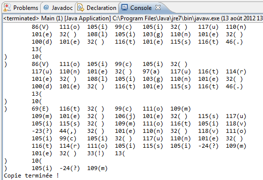
<p>Le bloc <strong>finally</strong> permet de s'assurer que nos objets ont bien fermé leurs liens avec leurs fichiers respectifs, ceci afin de permette à Java de détruire ces objets pour ainsi libérer de la mémoire.</p>

<h4>Les objets FilterInputStream et FilterOutputStream</h4>
<p>Ces deux classes sont des classes abstraites. Elles définissent un comportement global pour leurs classes filles qui, elles, permettent d'ajouter des fonctionnalités aux flux d'entrée/sortie.</p>
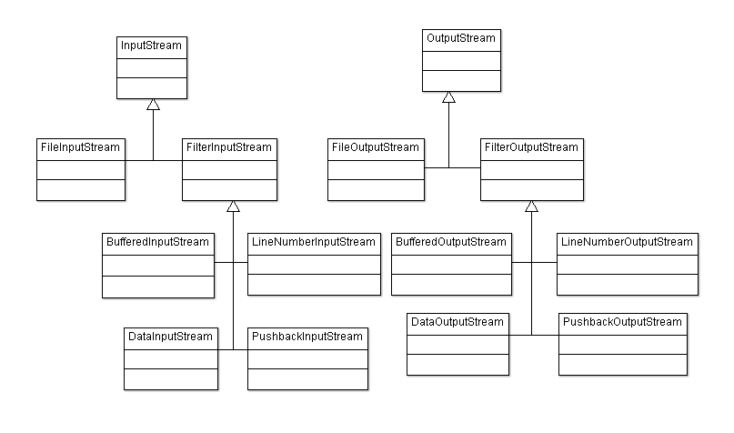
<p>Afin de montrer les améliorations apportées par ces classes, nous allons lire un énorme fichier texte (3,6 Mo) de façon conventionnelle avec l'objet vu précédemment, puis grâce à un buffer.</p>
<p>Voici un code qui permet de tester le temps d'exécution de la lecture :</p>

<pre class="code-block"><code data-claire-semantic="java" data-code="{&quot;language&quot;:&quot;java&quot;,&quot;source&quot;:&quot;//Packages &amp;#xE0; importer afin d&amp;#x27;utiliser l&amp;#x27;objet File\nimport java.io.BufferedInputStream;\nimport java.io.DataInputStream;\nimport java.io.File;\nimport java.io.FileInputStream;\nimport java.io.FileNotFoundException;\nimport java.io.FileOutputStream;\nimport java.io.IOException;\n\npublic class Main {\n  public static void main(String[] args) {\n    //Nous d&amp;#xE9;clarons nos objets en dehors du bloc try/catch\n    FileInputStream fis;\n    BufferedInputStream bis;        \n    try {\n      fis = new FileInputStream(new File(&amp;#x22;test.txt&amp;#x22;));\n      bis = new BufferedInputStream(new FileInputStream(new File(&amp;#x22;test.txt&amp;#x22;)));\n      byte[] buf = new byte[8];\n\n      //On r&amp;#xE9;cup&amp;#xE8;re le temps du syst&amp;#xE8;me\n      long startTime = System.currentTimeMillis();\n      //Inutile d&amp;#x27;effectuer des traitements dans notre boucle\n      while(fis.read(buf) != -1);\n      //On affiche le temps d&amp;#x27;ex&amp;#xE9;cution\n      System.out.println(&amp;#x22;Temps de lecture avec FileInputStream : &amp;#x22; + (System.currentTimeMillis() - startTime));\n                \n      //On r&amp;#xE9;initialise                \n      startTime = System.currentTimeMillis();\n      //Inutile d&amp;#x27;effectuer des traitements dans notre boucle\n      while(bis.read(buf) != -1);\n      //On r&amp;#xE9;affiche\n      System.out.println(&amp;#x22;Temps de lecture avec BufferedInputStream : &amp;#x22; + System.currentTimeMillis() - startTime));\n                \n      //On ferme nos flux de donn&amp;#xE9;es\n      fis.close();\n      bis.close();\n                \n    } catch (FileNotFoundException e) {\n      e.printStackTrace();\n    } catch (IOException e) {\n      e.printStackTrace();\n    }     &amp;#x9;\n  }\n}&quot;}" class="ace" data-widget="codeBlock"><div class="ace-openclassrooms"><div class="ace_static_highlight ace_show_gutter" style="counter-reset:ace_line 0"><div class="ace_line"><span class="ace_gutter ace_gutter-cell" unselectable="on"></span><span class="ace_comment">//Packages à importer afin d'utiliser l'objet File</span>
</div><div class="ace_line"><span class="ace_gutter ace_gutter-cell" unselectable="on"></span><span class="ace_keyword">import</span> <span class="ace_identifier">java</span>.<span class="ace_identifier">io</span>.<span class="ace_identifier">BufferedInputStream</span>;
</div><div class="ace_line"><span class="ace_gutter ace_gutter-cell" unselectable="on"></span><span class="ace_keyword">import</span> <span class="ace_identifier">java</span>.<span class="ace_identifier">io</span>.<span class="ace_identifier">DataInputStream</span>;
</div><div class="ace_line"><span class="ace_gutter ace_gutter-cell" unselectable="on"></span><span class="ace_keyword">import</span> <span class="ace_identifier">java</span>.<span class="ace_identifier">io</span>.<span class="ace_identifier">File</span>;
</div><div class="ace_line"><span class="ace_gutter ace_gutter-cell" unselectable="on"></span><span class="ace_keyword">import</span> <span class="ace_identifier">java</span>.<span class="ace_identifier">io</span>.<span class="ace_identifier">FileInputStream</span>;
</div><div class="ace_line"><span class="ace_gutter ace_gutter-cell" unselectable="on"></span><span class="ace_keyword">import</span> <span class="ace_identifier">java</span>.<span class="ace_identifier">io</span>.<span class="ace_identifier">FileNotFoundException</span>;
</div><div class="ace_line"><span class="ace_gutter ace_gutter-cell" unselectable="on"></span><span class="ace_keyword">import</span> <span class="ace_identifier">java</span>.<span class="ace_identifier">io</span>.<span class="ace_identifier">FileOutputStream</span>;
</div><div class="ace_line"><span class="ace_gutter ace_gutter-cell" unselectable="on"></span><span class="ace_keyword">import</span> <span class="ace_identifier">java</span>.<span class="ace_identifier">io</span>.<span class="ace_identifier">IOException</span>;
</div><div class="ace_line"><span class="ace_gutter ace_gutter-cell" unselectable="on"></span>
</div><div class="ace_line"><span class="ace_gutter ace_gutter-cell" unselectable="on"></span><span class="ace_keyword">public</span> <span class="ace_keyword">class</span> <span class="ace_identifier">Main</span> {
</div><div class="ace_line"><span class="ace_gutter ace_gutter-cell" unselectable="on"></span>  <span class="ace_keyword">public</span> <span class="ace_keyword">static</span> <span class="ace_keyword">void</span> <span class="ace_identifier">main</span>(<span class="ace_support ace_function">String</span>[] <span class="ace_identifier">args</span>) {
</div><div class="ace_line"><span class="ace_gutter ace_gutter-cell" unselectable="on"></span>    <span class="ace_comment">//Nous déclarons nos objets en dehors du bloc try/catch</span>
</div><div class="ace_line"><span class="ace_gutter ace_gutter-cell" unselectable="on"></span>    <span class="ace_identifier">FileInputStream</span> <span class="ace_identifier">fis</span>;
</div><div class="ace_line"><span class="ace_gutter ace_gutter-cell" unselectable="on"></span>    <span class="ace_identifier">BufferedInputStream</span> <span class="ace_identifier">bis</span>;        
</div><div class="ace_line"><span class="ace_gutter ace_gutter-cell" unselectable="on"></span>    <span class="ace_keyword">try</span> {
</div><div class="ace_line"><span class="ace_gutter ace_gutter-cell" unselectable="on"></span><span class="ace_indent-guide">    </span>  <span class="ace_identifier">fis</span> <span class="ace_keyword ace_operator">=</span> <span class="ace_keyword">new</span> <span class="ace_identifier">FileInputStream</span>(<span class="ace_keyword">new</span> <span class="ace_identifier">File</span>(<span class="ace_string">"test.txt"</span>));
</div><div class="ace_line"><span class="ace_gutter ace_gutter-cell" unselectable="on"></span><span class="ace_indent-guide">    </span>  <span class="ace_identifier">bis</span> <span class="ace_keyword ace_operator">=</span> <span class="ace_keyword">new</span> <span class="ace_identifier">BufferedInputStream</span>(<span class="ace_keyword">new</span> <span class="ace_identifier">FileInputStream</span>(<span class="ace_keyword">new</span> <span class="ace_identifier">File</span>(<span class="ace_string">"test.txt"</span>)));
</div><div class="ace_line"><span class="ace_gutter ace_gutter-cell" unselectable="on"></span><span class="ace_indent-guide">    </span>  <span class="ace_keyword">byte</span>[] <span class="ace_identifier">buf</span> <span class="ace_keyword ace_operator">=</span> <span class="ace_keyword">new</span> <span class="ace_keyword">byte</span>[<span class="ace_constant ace_numeric">8</span>];
</div><div class="ace_line"><span class="ace_gutter ace_gutter-cell" unselectable="on"></span>
</div><div class="ace_line"><span class="ace_gutter ace_gutter-cell" unselectable="on"></span><span class="ace_indent-guide">    </span>  <span class="ace_comment">//On récupère le temps du système</span>
</div><div class="ace_line"><span class="ace_gutter ace_gutter-cell" unselectable="on"></span><span class="ace_indent-guide">    </span>  <span class="ace_keyword">long</span> <span class="ace_identifier">startTime</span> <span class="ace_keyword ace_operator">=</span> <span class="ace_support ace_function">System</span>.<span class="ace_identifier">currentTimeMillis</span>();
</div><div class="ace_line"><span class="ace_gutter ace_gutter-cell" unselectable="on"></span><span class="ace_indent-guide">    </span>  <span class="ace_comment">//Inutile d'effectuer des traitements dans notre boucle</span>
</div><div class="ace_line"><span class="ace_gutter ace_gutter-cell" unselectable="on"></span><span class="ace_indent-guide">    </span>  <span class="ace_keyword">while</span>(<span class="ace_identifier">fis</span>.<span class="ace_identifier">read</span>(<span class="ace_identifier">buf</span>) <span class="ace_keyword ace_operator">!=</span> <span class="ace_constant ace_numeric">-1</span>);
</div><div class="ace_line"><span class="ace_gutter ace_gutter-cell" unselectable="on"></span><span class="ace_indent-guide">    </span>  <span class="ace_comment">//On affiche le temps d'exécution</span>
</div><div class="ace_line"><span class="ace_gutter ace_gutter-cell" unselectable="on"></span><span class="ace_indent-guide">    </span>  <span class="ace_support ace_function">System</span>.<span class="ace_identifier">out</span>.<span class="ace_identifier">println</span>(<span class="ace_string">"Temps de lecture avec FileInputStream : "</span> <span class="ace_keyword ace_operator">+</span> (<span class="ace_support ace_function">System</span>.<span class="ace_identifier">currentTimeMillis</span>() <span class="ace_keyword ace_operator">-</span> <span class="ace_identifier">startTime</span>));
</div><div class="ace_line"><span class="ace_gutter ace_gutter-cell" unselectable="on"></span><span class="ace_indent-guide">    </span><span class="ace_indent-guide">    </span><span class="ace_indent-guide">    </span>    
</div><div class="ace_line"><span class="ace_gutter ace_gutter-cell" unselectable="on"></span><span class="ace_indent-guide">    </span>  <span class="ace_comment">//On réinitialise                </span>
</div><div class="ace_line"><span class="ace_gutter ace_gutter-cell" unselectable="on"></span><span class="ace_indent-guide">    </span>  <span class="ace_identifier">startTime</span> <span class="ace_keyword ace_operator">=</span> <span class="ace_support ace_function">System</span>.<span class="ace_identifier">currentTimeMillis</span>();
</div><div class="ace_line"><span class="ace_gutter ace_gutter-cell" unselectable="on"></span><span class="ace_indent-guide">    </span>  <span class="ace_comment">//Inutile d'effectuer des traitements dans notre boucle</span>
</div><div class="ace_line"><span class="ace_gutter ace_gutter-cell" unselectable="on"></span><span class="ace_indent-guide">    </span>  <span class="ace_keyword">while</span>(<span class="ace_identifier">bis</span>.<span class="ace_identifier">read</span>(<span class="ace_identifier">buf</span>) <span class="ace_keyword ace_operator">!=</span> <span class="ace_constant ace_numeric">-1</span>);
</div><div class="ace_line"><span class="ace_gutter ace_gutter-cell" unselectable="on"></span><span class="ace_indent-guide">    </span>  <span class="ace_comment">//On réaffiche</span>
</div><div class="ace_line"><span class="ace_gutter ace_gutter-cell" unselectable="on"></span><span class="ace_indent-guide">    </span>  <span class="ace_support ace_function">System</span>.<span class="ace_identifier">out</span>.<span class="ace_identifier">println</span>(<span class="ace_string">"Temps de lecture avec BufferedInputStream : "</span> <span class="ace_keyword ace_operator">+</span> <span class="ace_support ace_function">System</span>.<span class="ace_identifier">currentTimeMillis</span>() <span class="ace_keyword ace_operator">-</span> <span class="ace_identifier">startTime</span>));
</div><div class="ace_line"><span class="ace_gutter ace_gutter-cell" unselectable="on"></span><span class="ace_indent-guide">    </span><span class="ace_indent-guide">    </span><span class="ace_indent-guide">    </span>    
</div><div class="ace_line"><span class="ace_gutter ace_gutter-cell" unselectable="on"></span><span class="ace_indent-guide">    </span>  <span class="ace_comment">//On ferme nos flux de données</span>
</div><div class="ace_line"><span class="ace_gutter ace_gutter-cell" unselectable="on"></span><span class="ace_indent-guide">    </span>  <span class="ace_identifier">fis</span>.<span class="ace_identifier">close</span>();
</div><div class="ace_line"><span class="ace_gutter ace_gutter-cell" unselectable="on"></span><span class="ace_indent-guide">    </span>  <span class="ace_identifier">bis</span>.<span class="ace_identifier">close</span>();
</div><div class="ace_line"><span class="ace_gutter ace_gutter-cell" unselectable="on"></span><span class="ace_indent-guide">    </span><span class="ace_indent-guide">    </span><span class="ace_indent-guide">    </span>    
</div><div class="ace_line"><span class="ace_gutter ace_gutter-cell" unselectable="on"></span>    } <span class="ace_keyword">catch</span> (<span class="ace_identifier">FileNotFoundException</span> <span class="ace_identifier">e</span>) {
</div><div class="ace_line"><span class="ace_gutter ace_gutter-cell" unselectable="on"></span><span class="ace_indent-guide">    </span>  <span class="ace_identifier">e</span>.<span class="ace_identifier">printStackTrace</span>();
</div><div class="ace_line"><span class="ace_gutter ace_gutter-cell" unselectable="on"></span>    } <span class="ace_keyword">catch</span> (<span class="ace_identifier">IOException</span> <span class="ace_identifier">e</span>) {
</div><div class="ace_line"><span class="ace_gutter ace_gutter-cell" unselectable="on"></span><span class="ace_indent-guide">    </span>  <span class="ace_identifier">e</span>.<span class="ace_identifier">printStackTrace</span>();
</div><div class="ace_line"><span class="ace_gutter ace_gutter-cell" unselectable="on"></span>    }       
</div><div class="ace_line"><span class="ace_gutter ace_gutter-cell" unselectable="on"></span>  }
</div><div class="ace_line"><span class="ace_gutter ace_gutter-cell" unselectable="on"></span>}
</div></div></div></code></pre>

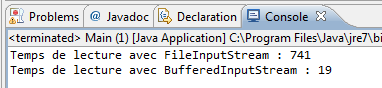

<p>Et voici le test avec l’écriture :</p>

<pre class="code-block"><code data-claire-semantic="java" data-code="{&quot;language&quot;:&quot;java&quot;,&quot;source&quot;:&quot;//Packages &amp;#xE0; importer afin d&amp;#x27;utiliser l&amp;#x27;objet File\nimport java.io.BufferedInputStream;\nimport java.io.BufferedOutputStream;\nimport java.io.File;\nimport java.io.FileInputStream;\nimport java.io.FileNotFoundException;\nimport java.io.FileOutputStream;\nimport java.io.IOException;\n \npublic class Main {\n  public static void main(String[] args) {\n    //Nous d&amp;#xE9;clarons nos objets en dehors du bloc try/catch\n    FileInputStream fis;\n    FileOutputStream fos;\n    BufferedInputStream bis;\n    BufferedOutputStream bos; \n        \n    try {\n      fis = new FileInputStream(new File(&amp;#x22;test.txt&amp;#x22;));\n      fos = new FileOutputStream(new File(&amp;#x22;test2.txt&amp;#x22;));\n      bis = new BufferedInputStream(new FileInputStream(new File(&amp;#x22;test.txt&amp;#x22;)));\n      bos = new BufferedOutputStream(new FileOutputStream(new File(&amp;#x22;test3.txt&amp;#x22;)));\n      byte[] buf = new byte[8];\n \n      //On r&amp;#xE9;cup&amp;#xE8;re le temps du syst&amp;#xE8;me\n      long startTime = System.currentTimeMillis();\n                \n      while(fis.read(buf) != -1){\n        fos.write(buf);\n      }\n      //On affiche le temps d&amp;#x27;ex&amp;#xE9;cution\n      System.out.println(&amp;#x22;Temps de lecture + &amp;#xE9;criture avec FileInputStream et FileOutputStream : &amp;#x22; + (System.currentTimeMillis() - startTime));\n                \n      //On r&amp;#xE9;initialise                \n      startTime = System.currentTimeMillis();\n \n      while(bis.read(buf) != -1){\n        bos.write(buf);\n      }\n      //On r&amp;#xE9;affiche\n      System.out.println(&amp;#x22;Temps de lecture + &amp;#xE9;criture avec BufferedInputStream et BufferedOutputStream : &amp;#x22; + (System.currentTimeMillis() - startTime));\n                \n      //On ferme nos flux de donn&amp;#xE9;es\n      fis.close();\n      bis.close();\n      fos.close();\n      bos.close();\n                \n    } catch (FileNotFoundException e) {\n      e.printStackTrace();\n    } catch (IOException e) {\n      e.printStackTrace();\n    }     &amp;#x9;\n  }\n}&quot;}" class="ace" data-widget="codeBlock"><div class="ace-openclassrooms"><div class="ace_static_highlight ace_show_gutter" style="counter-reset:ace_line 0"><div class="ace_line"><span class="ace_gutter ace_gutter-cell" unselectable="on"></span><span class="ace_comment">//Packages à importer afin d'utiliser l'objet File</span>
</div><div class="ace_line"><span class="ace_gutter ace_gutter-cell" unselectable="on"></span><span class="ace_keyword">import</span> <span class="ace_identifier">java</span>.<span class="ace_identifier">io</span>.<span class="ace_identifier">BufferedInputStream</span>;
</div><div class="ace_line"><span class="ace_gutter ace_gutter-cell" unselectable="on"></span><span class="ace_keyword">import</span> <span class="ace_identifier">java</span>.<span class="ace_identifier">io</span>.<span class="ace_identifier">BufferedOutputStream</span>;
</div><div class="ace_line"><span class="ace_gutter ace_gutter-cell" unselectable="on"></span><span class="ace_keyword">import</span> <span class="ace_identifier">java</span>.<span class="ace_identifier">io</span>.<span class="ace_identifier">File</span>;
</div><div class="ace_line"><span class="ace_gutter ace_gutter-cell" unselectable="on"></span><span class="ace_keyword">import</span> <span class="ace_identifier">java</span>.<span class="ace_identifier">io</span>.<span class="ace_identifier">FileInputStream</span>;
</div><div class="ace_line"><span class="ace_gutter ace_gutter-cell" unselectable="on"></span><span class="ace_keyword">import</span> <span class="ace_identifier">java</span>.<span class="ace_identifier">io</span>.<span class="ace_identifier">FileNotFoundException</span>;
</div><div class="ace_line"><span class="ace_gutter ace_gutter-cell" unselectable="on"></span><span class="ace_keyword">import</span> <span class="ace_identifier">java</span>.<span class="ace_identifier">io</span>.<span class="ace_identifier">FileOutputStream</span>;
</div><div class="ace_line"><span class="ace_gutter ace_gutter-cell" unselectable="on"></span><span class="ace_keyword">import</span> <span class="ace_identifier">java</span>.<span class="ace_identifier">io</span>.<span class="ace_identifier">IOException</span>;
</div><div class="ace_line"><span class="ace_gutter ace_gutter-cell" unselectable="on"></span> 
</div><div class="ace_line"><span class="ace_gutter ace_gutter-cell" unselectable="on"></span><span class="ace_keyword">public</span> <span class="ace_keyword">class</span> <span class="ace_identifier">Main</span> {
</div><div class="ace_line"><span class="ace_gutter ace_gutter-cell" unselectable="on"></span>  <span class="ace_keyword">public</span> <span class="ace_keyword">static</span> <span class="ace_keyword">void</span> <span class="ace_identifier">main</span>(<span class="ace_support ace_function">String</span>[] <span class="ace_identifier">args</span>) {
</div><div class="ace_line"><span class="ace_gutter ace_gutter-cell" unselectable="on"></span>    <span class="ace_comment">//Nous déclarons nos objets en dehors du bloc try/catch</span>
</div><div class="ace_line"><span class="ace_gutter ace_gutter-cell" unselectable="on"></span>    <span class="ace_identifier">FileInputStream</span> <span class="ace_identifier">fis</span>;
</div><div class="ace_line"><span class="ace_gutter ace_gutter-cell" unselectable="on"></span>    <span class="ace_identifier">FileOutputStream</span> <span class="ace_identifier">fos</span>;
</div><div class="ace_line"><span class="ace_gutter ace_gutter-cell" unselectable="on"></span>    <span class="ace_identifier">BufferedInputStream</span> <span class="ace_identifier">bis</span>;
</div><div class="ace_line"><span class="ace_gutter ace_gutter-cell" unselectable="on"></span>    <span class="ace_identifier">BufferedOutputStream</span> <span class="ace_identifier">bos</span>; 
</div><div class="ace_line"><span class="ace_gutter ace_gutter-cell" unselectable="on"></span><span class="ace_indent-guide">    </span>    
</div><div class="ace_line"><span class="ace_gutter ace_gutter-cell" unselectable="on"></span>    <span class="ace_keyword">try</span> {
</div><div class="ace_line"><span class="ace_gutter ace_gutter-cell" unselectable="on"></span><span class="ace_indent-guide">    </span>  <span class="ace_identifier">fis</span> <span class="ace_keyword ace_operator">=</span> <span class="ace_keyword">new</span> <span class="ace_identifier">FileInputStream</span>(<span class="ace_keyword">new</span> <span class="ace_identifier">File</span>(<span class="ace_string">"test.txt"</span>));
</div><div class="ace_line"><span class="ace_gutter ace_gutter-cell" unselectable="on"></span><span class="ace_indent-guide">    </span>  <span class="ace_identifier">fos</span> <span class="ace_keyword ace_operator">=</span> <span class="ace_keyword">new</span> <span class="ace_identifier">FileOutputStream</span>(<span class="ace_keyword">new</span> <span class="ace_identifier">File</span>(<span class="ace_string">"test2.txt"</span>));
</div><div class="ace_line"><span class="ace_gutter ace_gutter-cell" unselectable="on"></span><span class="ace_indent-guide">    </span>  <span class="ace_identifier">bis</span> <span class="ace_keyword ace_operator">=</span> <span class="ace_keyword">new</span> <span class="ace_identifier">BufferedInputStream</span>(<span class="ace_keyword">new</span> <span class="ace_identifier">FileInputStream</span>(<span class="ace_keyword">new</span> <span class="ace_identifier">File</span>(<span class="ace_string">"test.txt"</span>)));
</div><div class="ace_line"><span class="ace_gutter ace_gutter-cell" unselectable="on"></span><span class="ace_indent-guide">    </span>  <span class="ace_identifier">bos</span> <span class="ace_keyword ace_operator">=</span> <span class="ace_keyword">new</span> <span class="ace_identifier">BufferedOutputStream</span>(<span class="ace_keyword">new</span> <span class="ace_identifier">FileOutputStream</span>(<span class="ace_keyword">new</span> <span class="ace_identifier">File</span>(<span class="ace_string">"test3.txt"</span>)));
</div><div class="ace_line"><span class="ace_gutter ace_gutter-cell" unselectable="on"></span><span class="ace_indent-guide">    </span>  <span class="ace_keyword">byte</span>[] <span class="ace_identifier">buf</span> <span class="ace_keyword ace_operator">=</span> <span class="ace_keyword">new</span> <span class="ace_keyword">byte</span>[<span class="ace_constant ace_numeric">8</span>];
</div><div class="ace_line"><span class="ace_gutter ace_gutter-cell" unselectable="on"></span> 
</div><div class="ace_line"><span class="ace_gutter ace_gutter-cell" unselectable="on"></span><span class="ace_indent-guide">    </span>  <span class="ace_comment">//On récupère le temps du système</span>
</div><div class="ace_line"><span class="ace_gutter ace_gutter-cell" unselectable="on"></span><span class="ace_indent-guide">    </span>  <span class="ace_keyword">long</span> <span class="ace_identifier">startTime</span> <span class="ace_keyword ace_operator">=</span> <span class="ace_support ace_function">System</span>.<span class="ace_identifier">currentTimeMillis</span>();
</div><div class="ace_line"><span class="ace_gutter ace_gutter-cell" unselectable="on"></span><span class="ace_indent-guide">    </span><span class="ace_indent-guide">    </span><span class="ace_indent-guide">    </span>    
</div><div class="ace_line"><span class="ace_gutter ace_gutter-cell" unselectable="on"></span><span class="ace_indent-guide">    </span>  <span class="ace_keyword">while</span>(<span class="ace_identifier">fis</span>.<span class="ace_identifier">read</span>(<span class="ace_identifier">buf</span>) <span class="ace_keyword ace_operator">!=</span> <span class="ace_constant ace_numeric">-1</span>){
</div><div class="ace_line"><span class="ace_gutter ace_gutter-cell" unselectable="on"></span><span class="ace_indent-guide">    </span>    <span class="ace_identifier">fos</span>.<span class="ace_identifier">write</span>(<span class="ace_identifier">buf</span>);
</div><div class="ace_line"><span class="ace_gutter ace_gutter-cell" unselectable="on"></span><span class="ace_indent-guide">    </span>  }
</div><div class="ace_line"><span class="ace_gutter ace_gutter-cell" unselectable="on"></span><span class="ace_indent-guide">    </span>  <span class="ace_comment">//On affiche le temps d'exécution</span>
</div><div class="ace_line"><span class="ace_gutter ace_gutter-cell" unselectable="on"></span><span class="ace_indent-guide">    </span>  <span class="ace_support ace_function">System</span>.<span class="ace_identifier">out</span>.<span class="ace_identifier">println</span>(<span class="ace_string">"Temps de lecture + écriture avec FileInputStream et FileOutputStream : "</span> <span class="ace_keyword ace_operator">+</span> (<span class="ace_support ace_function">System</span>.<span class="ace_identifier">currentTimeMillis</span>() <span class="ace_keyword ace_operator">-</span> <span class="ace_identifier">startTime</span>));
</div><div class="ace_line"><span class="ace_gutter ace_gutter-cell" unselectable="on"></span><span class="ace_indent-guide">    </span><span class="ace_indent-guide">    </span><span class="ace_indent-guide">    </span>    
</div><div class="ace_line"><span class="ace_gutter ace_gutter-cell" unselectable="on"></span><span class="ace_indent-guide">    </span>  <span class="ace_comment">//On réinitialise                </span>
</div><div class="ace_line"><span class="ace_gutter ace_gutter-cell" unselectable="on"></span><span class="ace_indent-guide">    </span>  <span class="ace_identifier">startTime</span> <span class="ace_keyword ace_operator">=</span> <span class="ace_support ace_function">System</span>.<span class="ace_identifier">currentTimeMillis</span>();
</div><div class="ace_line"><span class="ace_gutter ace_gutter-cell" unselectable="on"></span> 
</div><div class="ace_line"><span class="ace_gutter ace_gutter-cell" unselectable="on"></span><span class="ace_indent-guide">    </span>  <span class="ace_keyword">while</span>(<span class="ace_identifier">bis</span>.<span class="ace_identifier">read</span>(<span class="ace_identifier">buf</span>) <span class="ace_keyword ace_operator">!=</span> <span class="ace_constant ace_numeric">-1</span>){
</div><div class="ace_line"><span class="ace_gutter ace_gutter-cell" unselectable="on"></span><span class="ace_indent-guide">    </span>    <span class="ace_identifier">bos</span>.<span class="ace_identifier">write</span>(<span class="ace_identifier">buf</span>);
</div><div class="ace_line"><span class="ace_gutter ace_gutter-cell" unselectable="on"></span><span class="ace_indent-guide">    </span>  }
</div><div class="ace_line"><span class="ace_gutter ace_gutter-cell" unselectable="on"></span><span class="ace_indent-guide">    </span>  <span class="ace_comment">//On réaffiche</span>
</div><div class="ace_line"><span class="ace_gutter ace_gutter-cell" unselectable="on"></span><span class="ace_indent-guide">    </span>  <span class="ace_support ace_function">System</span>.<span class="ace_identifier">out</span>.<span class="ace_identifier">println</span>(<span class="ace_string">"Temps de lecture + écriture avec BufferedInputStream et BufferedOutputStream : "</span> <span class="ace_keyword ace_operator">+</span> (<span class="ace_support ace_function">System</span>.<span class="ace_identifier">currentTimeMillis</span>() <span class="ace_keyword ace_operator">-</span> <span class="ace_identifier">startTime</span>));
</div><div class="ace_line"><span class="ace_gutter ace_gutter-cell" unselectable="on"></span><span class="ace_indent-guide">    </span><span class="ace_indent-guide">    </span><span class="ace_indent-guide">    </span>    
</div><div class="ace_line"><span class="ace_gutter ace_gutter-cell" unselectable="on"></span><span class="ace_indent-guide">    </span>  <span class="ace_comment">//On ferme nos flux de données</span>
</div><div class="ace_line"><span class="ace_gutter ace_gutter-cell" unselectable="on"></span><span class="ace_indent-guide">    </span>  <span class="ace_identifier">fis</span>.<span class="ace_identifier">close</span>();
</div><div class="ace_line"><span class="ace_gutter ace_gutter-cell" unselectable="on"></span><span class="ace_indent-guide">    </span>  <span class="ace_identifier">bis</span>.<span class="ace_identifier">close</span>();
</div><div class="ace_line"><span class="ace_gutter ace_gutter-cell" unselectable="on"></span><span class="ace_indent-guide">    </span>  <span class="ace_identifier">fos</span>.<span class="ace_identifier">close</span>();
</div><div class="ace_line"><span class="ace_gutter ace_gutter-cell" unselectable="on"></span><span class="ace_indent-guide">    </span>  <span class="ace_identifier">bos</span>.<span class="ace_identifier">close</span>();
</div><div class="ace_line"><span class="ace_gutter ace_gutter-cell" unselectable="on"></span><span class="ace_indent-guide">    </span><span class="ace_indent-guide">    </span><span class="ace_indent-guide">    </span>    
</div><div class="ace_line"><span class="ace_gutter ace_gutter-cell" unselectable="on"></span>    } <span class="ace_keyword">catch</span> (<span class="ace_identifier">FileNotFoundException</span> <span class="ace_identifier">e</span>) {
</div><div class="ace_line"><span class="ace_gutter ace_gutter-cell" unselectable="on"></span><span class="ace_indent-guide">    </span>  <span class="ace_identifier">e</span>.<span class="ace_identifier">printStackTrace</span>();
</div><div class="ace_line"><span class="ace_gutter ace_gutter-cell" unselectable="on"></span>    } <span class="ace_keyword">catch</span> (<span class="ace_identifier">IOException</span> <span class="ace_identifier">e</span>) {
</div><div class="ace_line"><span class="ace_gutter ace_gutter-cell" unselectable="on"></span><span class="ace_indent-guide">    </span>  <span class="ace_identifier">e</span>.<span class="ace_identifier">printStackTrace</span>();
</div><div class="ace_line"><span class="ace_gutter ace_gutter-cell" unselectable="on"></span>    }       
</div><div class="ace_line"><span class="ace_gutter ace_gutter-cell" unselectable="on"></span>  }
</div><div class="ace_line"><span class="ace_gutter ace_gutter-cell" unselectable="on"></span>}
</div></div></div></code></pre>

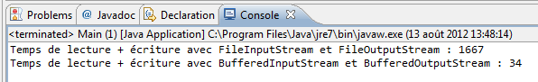

<h4>Les objets ObjectInputStream et ObjectOutputStream</h4>
<p>Lorsqu'on veut écrire des objets dans des fichiers, on appelle ça la « sérialisation » : c'est le nom que porte l'action de sauvegarder des objets.</p>

<pre class="code-block"><code data-claire-semantic="java" data-code="{&quot;language&quot;:&quot;java&quot;,&quot;source&quot;:&quot;//Package &amp;#xE0; importer\nimport java.io.Serializable;\n\npublic class Game implements Serializable{\n  private String nom, style;\n  private double prix;\n&amp;#x9;\n  public Game(String nom, String style, double prix) {\n    this.nom = nom;\n    this.style = style;\n    this.prix = prix;\n  }\n&amp;#x9;\n  public String toString(){\n    return &amp;#x22;Nom du jeu : &amp;#x22; + this.nom + &amp;#x22;\\n\n            Style de jeu : &amp;#x22; + this.style + &amp;#x22;\\n\n            Prix du jeu : &amp;#x22; + this.prix + &amp;#x22;\\n&amp;#x22;;\n  }&amp;#x9;\n}&quot;}" class="ace" data-widget="codeBlock"><div class="ace-openclassrooms"><div class="ace_static_highlight ace_show_gutter" style="counter-reset:ace_line 0"><div class="ace_line"><span class="ace_gutter ace_gutter-cell" unselectable="on"></span><span class="ace_comment">//Package à importer</span>
</div><div class="ace_line"><span class="ace_gutter ace_gutter-cell" unselectable="on"></span><span class="ace_keyword">import</span> <span class="ace_identifier">java</span>.<span class="ace_identifier">io</span>.<span class="ace_identifier">Serializable</span>;
</div><div class="ace_line"><span class="ace_gutter ace_gutter-cell" unselectable="on"></span>
</div><div class="ace_line"><span class="ace_gutter ace_gutter-cell" unselectable="on"></span><span class="ace_keyword">public</span> <span class="ace_keyword">class</span> <span class="ace_identifier">Game</span> <span class="ace_keyword">implements</span> <span class="ace_identifier">Serializable</span>{
</div><div class="ace_line"><span class="ace_gutter ace_gutter-cell" unselectable="on"></span>  <span class="ace_keyword">private</span> <span class="ace_support ace_function">String</span> <span class="ace_identifier">nom</span>, <span class="ace_identifier">style</span>;
</div><div class="ace_line"><span class="ace_gutter ace_gutter-cell" unselectable="on"></span>  <span class="ace_keyword">private</span> <span class="ace_keyword">double</span> <span class="ace_identifier">prix</span>;
</div><div class="ace_line"><span class="ace_gutter ace_gutter-cell" unselectable="on"></span>    
</div><div class="ace_line"><span class="ace_gutter ace_gutter-cell" unselectable="on"></span>  <span class="ace_keyword">public</span> <span class="ace_identifier">Game</span>(<span class="ace_support ace_function">String</span> <span class="ace_identifier">nom</span>, <span class="ace_support ace_function">String</span> <span class="ace_identifier">style</span>, <span class="ace_keyword">double</span> <span class="ace_identifier">prix</span>) {
</div><div class="ace_line"><span class="ace_gutter ace_gutter-cell" unselectable="on"></span>    <span class="ace_keyword">this</span>.<span class="ace_identifier">nom</span> <span class="ace_keyword ace_operator">=</span> <span class="ace_identifier">nom</span>;
</div><div class="ace_line"><span class="ace_gutter ace_gutter-cell" unselectable="on"></span>    <span class="ace_keyword">this</span>.<span class="ace_identifier">style</span> <span class="ace_keyword ace_operator">=</span> <span class="ace_identifier">style</span>;
</div><div class="ace_line"><span class="ace_gutter ace_gutter-cell" unselectable="on"></span>    <span class="ace_keyword">this</span>.<span class="ace_identifier">prix</span> <span class="ace_keyword ace_operator">=</span> <span class="ace_identifier">prix</span>;
</div><div class="ace_line"><span class="ace_gutter ace_gutter-cell" unselectable="on"></span>  }
</div><div class="ace_line"><span class="ace_gutter ace_gutter-cell" unselectable="on"></span>    
</div><div class="ace_line"><span class="ace_gutter ace_gutter-cell" unselectable="on"></span>  <span class="ace_keyword">public</span> <span class="ace_support ace_function">String</span> <span class="ace_identifier">toString</span>(){
</div><div class="ace_line"><span class="ace_gutter ace_gutter-cell" unselectable="on"></span>    <span class="ace_keyword">return</span> <span class="ace_string">"Nom du jeu : "</span> <span class="ace_keyword ace_operator">+</span> <span class="ace_keyword">this</span>.<span class="ace_identifier">nom</span> <span class="ace_keyword ace_operator">+</span> "\<span class="ace_identifier">n</span>
</div><div class="ace_line"><span class="ace_gutter ace_gutter-cell" unselectable="on"></span><span class="ace_indent-guide">    </span><span class="ace_indent-guide">    </span>    <span class="ace_identifier">Style</span> <span class="ace_identifier">de</span> <span class="ace_identifier">jeu</span> : <span class="ace_string">" + this.style + "</span>\<span class="ace_identifier">n</span>
</div><div class="ace_line"><span class="ace_gutter ace_gutter-cell" unselectable="on"></span><span class="ace_indent-guide">    </span><span class="ace_indent-guide">    </span>    <span class="ace_identifier">Prix</span> <span class="ace_identifier">du</span> <span class="ace_identifier">jeu</span> : <span class="ace_string">" + this.prix + "</span>\<span class="ace_identifier">n</span>";
</div><div class="ace_line"><span class="ace_gutter ace_gutter-cell" unselectable="on"></span>  } 
</div><div class="ace_line"><span class="ace_gutter ace_gutter-cell" unselectable="on"></span>}
</div></div></div></code></pre>

<ul>
  <li>Nous allons créer deux ou trois objetsGame;</li>
  <li>Nous allons les sérialiser dans un fichier de notre choix ;</li>
  <li>Nous allons ensuite les désérialiser afin de pouvoir les réutiliser.</li>
</ul>

<pre class="code-block"><code data-claire-semantic="java" data-code="{&quot;language&quot;:&quot;java&quot;,&quot;source&quot;:&quot;//Packages &amp;#xE0; importer afin d&amp;#x27;utiliser l&amp;#x27;objet File\nimport java.io.BufferedInputStream;\nimport java.io.BufferedOutputStream;\nimport java.io.DataInputStream;\nimport java.io.DataOutputStream;\nimport java.io.File;\nimport java.io.FileInputStream;\nimport java.io.FileNotFoundException;\nimport java.io.FileOutputStream;\nimport java.io.IOException;\nimport java.io.ObjectInputStream;\nimport java.io.ObjectOutputStream;\n\npublic class Main {\n  public static void main(String[] args) {\n    //Nous d&amp;#xE9;clarons nos objets en dehors du bloc try/catch\n    ObjectInputStream ois;\n    ObjectOutputStream oos;\n    try {\n      oos = new ObjectOutputStream(\n              new BufferedOutputStream(\n                new FileOutputStream(\n                  new File(&amp;#x22;game.txt&amp;#x22;))));\n        &amp;#x9;\n      //Nous allons &amp;#xE9;crire chaque objet Game dans le fichier\n      oos.writeObject(new Game(&amp;#x22;Assassin Creed&amp;#x22;, &amp;#x22;Aventure&amp;#x22;, 45.69));\n      oos.writeObject(new Game(&amp;#x22;Tomb Raider&amp;#x22;, &amp;#x22;Plateforme&amp;#x22;, 23.45));\n      oos.writeObject(new Game(&amp;#x22;Tetris&amp;#x22;, &amp;#x22;Strat&amp;#xE9;gie&amp;#x22;, 2.50));\n      //Ne pas oublier de fermer le flux !\n      oos.close();\n        &amp;#x9;\n      //On r&amp;#xE9;cup&amp;#xE8;re maintenant les donn&amp;#xE9;es !\n      ois = new ObjectInputStream(\n              new BufferedInputStream(\n                new FileInputStream(\n                  new File(&amp;#x22;game.txt&amp;#x22;))));\n            \n      try {\n        System.out.println(&amp;#x22;Affichage des jeux :&amp;#x22;);\n        System.out.println(&amp;#x22;*************************\\n&amp;#x22;);\n        System.out.println(((Game)ois.readObject()).toString());\n        System.out.println(((Game)ois.readObject()).toString());\n        System.out.println(((Game)ois.readObject()).toString());\n      } catch (ClassNotFoundException e) {\n        e.printStackTrace();\n      }\n&amp;#x9;\n      ois.close();\n        &amp;#x9;\n    } catch (FileNotFoundException e) {\n      e.printStackTrace();\n    } catch (IOException e) {\n      e.printStackTrace();\n    }     &amp;#x9;\n  }\n}&quot;}" class="ace" data-widget="codeBlock"><div class="ace-openclassrooms"><div class="ace_static_highlight ace_show_gutter" style="counter-reset:ace_line 0"><div class="ace_line"><span class="ace_gutter ace_gutter-cell" unselectable="on"></span><span class="ace_comment">//Packages à importer afin d'utiliser l'objet File</span>
</div><div class="ace_line"><span class="ace_gutter ace_gutter-cell" unselectable="on"></span><span class="ace_keyword">import</span> <span class="ace_identifier">java</span>.<span class="ace_identifier">io</span>.<span class="ace_identifier">BufferedInputStream</span>;
</div><div class="ace_line"><span class="ace_gutter ace_gutter-cell" unselectable="on"></span><span class="ace_keyword">import</span> <span class="ace_identifier">java</span>.<span class="ace_identifier">io</span>.<span class="ace_identifier">BufferedOutputStream</span>;
</div><div class="ace_line"><span class="ace_gutter ace_gutter-cell" unselectable="on"></span><span class="ace_keyword">import</span> <span class="ace_identifier">java</span>.<span class="ace_identifier">io</span>.<span class="ace_identifier">DataInputStream</span>;
</div><div class="ace_line"><span class="ace_gutter ace_gutter-cell" unselectable="on"></span><span class="ace_keyword">import</span> <span class="ace_identifier">java</span>.<span class="ace_identifier">io</span>.<span class="ace_identifier">DataOutputStream</span>;
</div><div class="ace_line"><span class="ace_gutter ace_gutter-cell" unselectable="on"></span><span class="ace_keyword">import</span> <span class="ace_identifier">java</span>.<span class="ace_identifier">io</span>.<span class="ace_identifier">File</span>;
</div><div class="ace_line"><span class="ace_gutter ace_gutter-cell" unselectable="on"></span><span class="ace_keyword">import</span> <span class="ace_identifier">java</span>.<span class="ace_identifier">io</span>.<span class="ace_identifier">FileInputStream</span>;
</div><div class="ace_line"><span class="ace_gutter ace_gutter-cell" unselectable="on"></span><span class="ace_keyword">import</span> <span class="ace_identifier">java</span>.<span class="ace_identifier">io</span>.<span class="ace_identifier">FileNotFoundException</span>;
</div><div class="ace_line"><span class="ace_gutter ace_gutter-cell" unselectable="on"></span><span class="ace_keyword">import</span> <span class="ace_identifier">java</span>.<span class="ace_identifier">io</span>.<span class="ace_identifier">FileOutputStream</span>;
</div><div class="ace_line"><span class="ace_gutter ace_gutter-cell" unselectable="on"></span><span class="ace_keyword">import</span> <span class="ace_identifier">java</span>.<span class="ace_identifier">io</span>.<span class="ace_identifier">IOException</span>;
</div><div class="ace_line"><span class="ace_gutter ace_gutter-cell" unselectable="on"></span><span class="ace_keyword">import</span> <span class="ace_identifier">java</span>.<span class="ace_identifier">io</span>.<span class="ace_identifier">ObjectInputStream</span>;
</div><div class="ace_line"><span class="ace_gutter ace_gutter-cell" unselectable="on"></span><span class="ace_keyword">import</span> <span class="ace_identifier">java</span>.<span class="ace_identifier">io</span>.<span class="ace_identifier">ObjectOutputStream</span>;
</div><div class="ace_line"><span class="ace_gutter ace_gutter-cell" unselectable="on"></span>
</div><div class="ace_line"><span class="ace_gutter ace_gutter-cell" unselectable="on"></span><span class="ace_keyword">public</span> <span class="ace_keyword">class</span> <span class="ace_identifier">Main</span> {
</div><div class="ace_line"><span class="ace_gutter ace_gutter-cell" unselectable="on"></span>  <span class="ace_keyword">public</span> <span class="ace_keyword">static</span> <span class="ace_keyword">void</span> <span class="ace_identifier">main</span>(<span class="ace_support ace_function">String</span>[] <span class="ace_identifier">args</span>) {
</div><div class="ace_line"><span class="ace_gutter ace_gutter-cell" unselectable="on"></span>    <span class="ace_comment">//Nous déclarons nos objets en dehors du bloc try/catch</span>
</div><div class="ace_line"><span class="ace_gutter ace_gutter-cell" unselectable="on"></span>    <span class="ace_identifier">ObjectInputStream</span> <span class="ace_identifier">ois</span>;
</div><div class="ace_line"><span class="ace_gutter ace_gutter-cell" unselectable="on"></span>    <span class="ace_identifier">ObjectOutputStream</span> <span class="ace_identifier">oos</span>;
</div><div class="ace_line"><span class="ace_gutter ace_gutter-cell" unselectable="on"></span>    <span class="ace_keyword">try</span> {
</div><div class="ace_line"><span class="ace_gutter ace_gutter-cell" unselectable="on"></span><span class="ace_indent-guide">    </span>  <span class="ace_identifier">oos</span> <span class="ace_keyword ace_operator">=</span> <span class="ace_keyword">new</span> <span class="ace_identifier">ObjectOutputStream</span>(
</div><div class="ace_line"><span class="ace_gutter ace_gutter-cell" unselectable="on"></span><span class="ace_indent-guide">    </span><span class="ace_indent-guide">    </span><span class="ace_indent-guide">    </span>  <span class="ace_keyword">new</span> <span class="ace_identifier">BufferedOutputStream</span>(
</div><div class="ace_line"><span class="ace_gutter ace_gutter-cell" unselectable="on"></span><span class="ace_indent-guide">    </span><span class="ace_indent-guide">    </span><span class="ace_indent-guide">    </span>    <span class="ace_keyword">new</span> <span class="ace_identifier">FileOutputStream</span>(
</div><div class="ace_line"><span class="ace_gutter ace_gutter-cell" unselectable="on"></span><span class="ace_indent-guide">    </span><span class="ace_indent-guide">    </span><span class="ace_indent-guide">    </span><span class="ace_indent-guide">    </span>  <span class="ace_keyword">new</span> <span class="ace_identifier">File</span>(<span class="ace_string">"game.txt"</span>))));
</div><div class="ace_line"><span class="ace_gutter ace_gutter-cell" unselectable="on"></span><span class="ace_indent-guide">    </span>        
</div><div class="ace_line"><span class="ace_gutter ace_gutter-cell" unselectable="on"></span><span class="ace_indent-guide">    </span>  <span class="ace_comment">//Nous allons écrire chaque objet Game dans le fichier</span>
</div><div class="ace_line"><span class="ace_gutter ace_gutter-cell" unselectable="on"></span><span class="ace_indent-guide">    </span>  <span class="ace_identifier">oos</span>.<span class="ace_identifier">writeObject</span>(<span class="ace_keyword">new</span> <span class="ace_identifier">Game</span>(<span class="ace_string">"Assassin Creed"</span>, <span class="ace_string">"Aventure"</span>, <span class="ace_constant ace_numeric">45.69</span>));
</div><div class="ace_line"><span class="ace_gutter ace_gutter-cell" unselectable="on"></span><span class="ace_indent-guide">    </span>  <span class="ace_identifier">oos</span>.<span class="ace_identifier">writeObject</span>(<span class="ace_keyword">new</span> <span class="ace_identifier">Game</span>(<span class="ace_string">"Tomb Raider"</span>, <span class="ace_string">"Plateforme"</span>, <span class="ace_constant ace_numeric">23.45</span>));
</div><div class="ace_line"><span class="ace_gutter ace_gutter-cell" unselectable="on"></span><span class="ace_indent-guide">    </span>  <span class="ace_identifier">oos</span>.<span class="ace_identifier">writeObject</span>(<span class="ace_keyword">new</span> <span class="ace_identifier">Game</span>(<span class="ace_string">"Tetris"</span>, <span class="ace_string">"Stratégie"</span>, <span class="ace_constant ace_numeric">2.50</span>));
</div><div class="ace_line"><span class="ace_gutter ace_gutter-cell" unselectable="on"></span><span class="ace_indent-guide">    </span>  <span class="ace_comment">//Ne pas oublier de fermer le flux !</span>
</div><div class="ace_line"><span class="ace_gutter ace_gutter-cell" unselectable="on"></span><span class="ace_indent-guide">    </span>  <span class="ace_identifier">oos</span>.<span class="ace_identifier">close</span>();
</div><div class="ace_line"><span class="ace_gutter ace_gutter-cell" unselectable="on"></span><span class="ace_indent-guide">    </span>        
</div><div class="ace_line"><span class="ace_gutter ace_gutter-cell" unselectable="on"></span><span class="ace_indent-guide">    </span>  <span class="ace_comment">//On récupère maintenant les données !</span>
</div><div class="ace_line"><span class="ace_gutter ace_gutter-cell" unselectable="on"></span><span class="ace_indent-guide">    </span>  <span class="ace_identifier">ois</span> <span class="ace_keyword ace_operator">=</span> <span class="ace_keyword">new</span> <span class="ace_identifier">ObjectInputStream</span>(
</div><div class="ace_line"><span class="ace_gutter ace_gutter-cell" unselectable="on"></span><span class="ace_indent-guide">    </span><span class="ace_indent-guide">    </span><span class="ace_indent-guide">    </span>  <span class="ace_keyword">new</span> <span class="ace_identifier">BufferedInputStream</span>(
</div><div class="ace_line"><span class="ace_gutter ace_gutter-cell" unselectable="on"></span><span class="ace_indent-guide">    </span><span class="ace_indent-guide">    </span><span class="ace_indent-guide">    </span>    <span class="ace_keyword">new</span> <span class="ace_identifier">FileInputStream</span>(
</div><div class="ace_line"><span class="ace_gutter ace_gutter-cell" unselectable="on"></span><span class="ace_indent-guide">    </span><span class="ace_indent-guide">    </span><span class="ace_indent-guide">    </span><span class="ace_indent-guide">    </span>  <span class="ace_keyword">new</span> <span class="ace_identifier">File</span>(<span class="ace_string">"game.txt"</span>))));
</div><div class="ace_line"><span class="ace_gutter ace_gutter-cell" unselectable="on"></span><span class="ace_indent-guide">    </span><span class="ace_indent-guide">    </span>    
</div><div class="ace_line"><span class="ace_gutter ace_gutter-cell" unselectable="on"></span><span class="ace_indent-guide">    </span>  <span class="ace_keyword">try</span> {
</div><div class="ace_line"><span class="ace_gutter ace_gutter-cell" unselectable="on"></span><span class="ace_indent-guide">    </span>    <span class="ace_support ace_function">System</span>.<span class="ace_identifier">out</span>.<span class="ace_identifier">println</span>(<span class="ace_string">"Affichage des jeux :"</span>);
</div><div class="ace_line"><span class="ace_gutter ace_gutter-cell" unselectable="on"></span><span class="ace_indent-guide">    </span>    <span class="ace_support ace_function">System</span>.<span class="ace_identifier">out</span>.<span class="ace_identifier">println</span>(<span class="ace_string">"*************************\n"</span>);
</div><div class="ace_line"><span class="ace_gutter ace_gutter-cell" unselectable="on"></span><span class="ace_indent-guide">    </span>    <span class="ace_support ace_function">System</span>.<span class="ace_identifier">out</span>.<span class="ace_identifier">println</span>(((<span class="ace_identifier">Game</span>)<span class="ace_identifier">ois</span>.<span class="ace_identifier">readObject</span>()).<span class="ace_identifier">toString</span>());
</div><div class="ace_line"><span class="ace_gutter ace_gutter-cell" unselectable="on"></span><span class="ace_indent-guide">    </span>    <span class="ace_support ace_function">System</span>.<span class="ace_identifier">out</span>.<span class="ace_identifier">println</span>(((<span class="ace_identifier">Game</span>)<span class="ace_identifier">ois</span>.<span class="ace_identifier">readObject</span>()).<span class="ace_identifier">toString</span>());
</div><div class="ace_line"><span class="ace_gutter ace_gutter-cell" unselectable="on"></span><span class="ace_indent-guide">    </span>    <span class="ace_support ace_function">System</span>.<span class="ace_identifier">out</span>.<span class="ace_identifier">println</span>(((<span class="ace_identifier">Game</span>)<span class="ace_identifier">ois</span>.<span class="ace_identifier">readObject</span>()).<span class="ace_identifier">toString</span>());
</div><div class="ace_line"><span class="ace_gutter ace_gutter-cell" unselectable="on"></span><span class="ace_indent-guide">    </span>  } <span class="ace_keyword">catch</span> (<span class="ace_support ace_function">ClassNotFoundException</span> <span class="ace_identifier">e</span>) {
</div><div class="ace_line"><span class="ace_gutter ace_gutter-cell" unselectable="on"></span><span class="ace_indent-guide">    </span>    <span class="ace_identifier">e</span>.<span class="ace_identifier">printStackTrace</span>();
</div><div class="ace_line"><span class="ace_gutter ace_gutter-cell" unselectable="on"></span><span class="ace_indent-guide">    </span>  }
</div><div class="ace_line"><span class="ace_gutter ace_gutter-cell" unselectable="on"></span>    
</div><div class="ace_line"><span class="ace_gutter ace_gutter-cell" unselectable="on"></span><span class="ace_indent-guide">    </span>  <span class="ace_identifier">ois</span>.<span class="ace_identifier">close</span>();
</div><div class="ace_line"><span class="ace_gutter ace_gutter-cell" unselectable="on"></span><span class="ace_indent-guide">    </span>        
</div><div class="ace_line"><span class="ace_gutter ace_gutter-cell" unselectable="on"></span>    } <span class="ace_keyword">catch</span> (<span class="ace_identifier">FileNotFoundException</span> <span class="ace_identifier">e</span>) {
</div><div class="ace_line"><span class="ace_gutter ace_gutter-cell" unselectable="on"></span><span class="ace_indent-guide">    </span>  <span class="ace_identifier">e</span>.<span class="ace_identifier">printStackTrace</span>();
</div><div class="ace_line"><span class="ace_gutter ace_gutter-cell" unselectable="on"></span>    } <span class="ace_keyword">catch</span> (<span class="ace_identifier">IOException</span> <span class="ace_identifier">e</span>) {
</div><div class="ace_line"><span class="ace_gutter ace_gutter-cell" unselectable="on"></span><span class="ace_indent-guide">    </span>  <span class="ace_identifier">e</span>.<span class="ace_identifier">printStackTrace</span>();
</div><div class="ace_line"><span class="ace_gutter ace_gutter-cell" unselectable="on"></span>    }       
</div><div class="ace_line"><span class="ace_gutter ace_gutter-cell" unselectable="on"></span>  }
</div><div class="ace_line"><span class="ace_gutter ace_gutter-cell" unselectable="on"></span>}
</div></div></div></code></pre>

<p>Et voci le résultat en figure suivante.</p>
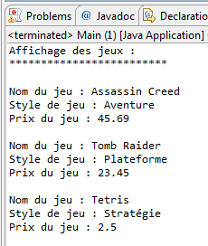

<h3><a name="jframe">L'objet JFrame</a></h3>

<pre class="code-block"><code data-claire-semantic="java" data-code="{&quot;language&quot;:&quot;java&quot;,&quot;source&quot;:&quot;import javax.swing.JFrame;\n \npublic class Fenetre extends JFrame {\n  public Fenetre(){\n    this.setTitle(&amp;#x22;Ma premi&amp;#xE8;re fen&amp;#xEA;tre Java&amp;#x22;);\n    this.setSize(400, 500);\n    this.setLocationRelativeTo(null);\n    this.setDefaultCloseOperation(JFrame.EXIT_ON_CLOSE);             \n    this.setVisible(true);\n  }\n}&quot;}" class="ace" data-widget="codeBlock"><div class="ace-openclassrooms"><div class="ace_static_highlight ace_show_gutter" style="counter-reset:ace_line 0"><div class="ace_line"><span class="ace_gutter ace_gutter-cell" unselectable="on"></span><span class="ace_keyword">import</span> <span class="ace_identifier">javax</span>.<span class="ace_identifier">swing</span>.<span class="ace_identifier">JFrame</span>;
</div><div class="ace_line"><span class="ace_gutter ace_gutter-cell" unselectable="on"></span> 
</div><div class="ace_line"><span class="ace_gutter ace_gutter-cell" unselectable="on"></span><span class="ace_keyword">public</span> <span class="ace_keyword">class</span> <span class="ace_identifier">Fenetre</span> <span class="ace_keyword">extends</span> <span class="ace_identifier">JFrame</span> {
</div><div class="ace_line"><span class="ace_gutter ace_gutter-cell" unselectable="on"></span>  <span class="ace_keyword">public</span> <span class="ace_identifier">Fenetre</span>(){
</div><div class="ace_line"><span class="ace_gutter ace_gutter-cell" unselectable="on"></span>    <span class="ace_keyword">this</span>.<span class="ace_identifier">setTitle</span>(<span class="ace_string">"Ma première fenêtre Java"</span>);
</div><div class="ace_line"><span class="ace_gutter ace_gutter-cell" unselectable="on"></span>    <span class="ace_keyword">this</span>.<span class="ace_identifier">setSize</span>(<span class="ace_constant ace_numeric">400</span>, <span class="ace_constant ace_numeric">500</span>);
</div><div class="ace_line"><span class="ace_gutter ace_gutter-cell" unselectable="on"></span>    <span class="ace_keyword">this</span>.<span class="ace_identifier">setLocationRelativeTo</span>(<span class="ace_constant ace_language">null</span>);
</div><div class="ace_line"><span class="ace_gutter ace_gutter-cell" unselectable="on"></span>    <span class="ace_keyword">this</span>.<span class="ace_identifier">setDefaultCloseOperation</span>(<span class="ace_identifier">JFrame</span>.<span class="ace_identifier">EXIT_ON_CLOSE</span>);             
</div><div class="ace_line"><span class="ace_gutter ace_gutter-cell" unselectable="on"></span>    <span class="ace_keyword">this</span>.<span class="ace_identifier">setVisible</span>(<span class="ace_constant ace_language ace_boolean">true</span>);
</div><div class="ace_line"><span class="ace_gutter ace_gutter-cell" unselectable="on"></span>  }
</div><div class="ace_line"><span class="ace_gutter ace_gutter-cell" unselectable="on"></span>}
</div></div></div></code></pre>

<pre class="code-block"><code data-claire-semantic="java" data-code="{&quot;language&quot;:&quot;java&quot;,&quot;source&quot;:&quot;Fenetre fen = new Fenetre();&quot;}" class="ace" data-widget="codeBlock"><div class="ace-openclassrooms"><div class="ace_static_highlight ace_show_gutter" style="counter-reset:ace_line 0"><div class="ace_line"><span class="ace_gutter ace_gutter-cell" unselectable="on"></span><span class="ace_identifier">Fenetre</span> <span class="ace_identifier">fen</span> <span class="ace_keyword ace_operator">=</span> <span class="ace_keyword">new</span> <span class="ace_identifier">Fenetre</span>();</div></div></div></code></pre>

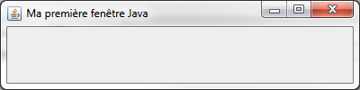
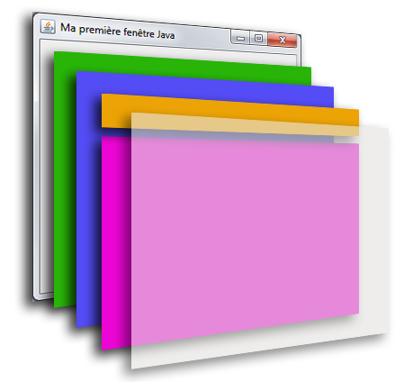

<p>Un JFrame est composé, dans l'ordre, de :</p>
<ul>
  <li>le RootPane(en vert), le conteneur principal qui contient les autres composants ;</li>
  <li>le LayeredPane(en violet), qui forme juste un panneau composé du conteneur global et de la barre de menu (MenuBar) ;</li>
  <li>la MenuBar(en orange), la barre de menu, quand il y en a une ;</li>
  <li>le Content Pane (en rose) : c'est dans celui-ci que nous placerons nos composants ;</li>
  <li>le GlassPane (en transparence), couche utilisée pour intercepter les actions de l'utilisateur avant qu'elles ne parviennent aux composants.</li>
</ul>

<h3>L'objet JPanel</h3>

<pre class="code-block"><code data-claire-semantic="java" data-code="{&quot;language&quot;:&quot;java&quot;,&quot;source&quot;:&quot;import java.awt.Color; \nimport javax.swing.JFrame;\nimport javax.swing.JPanel;\n \npublic class Fenetre extends JFrame {\n  public Fenetre(){             \n    this.setTitle(&amp;#x22;Ma premi&amp;#xE8;re fen&amp;#xEA;tre Java&amp;#x22;);\n    this.setSize(400, 100);\n    this.setLocationRelativeTo(null);               \n \n    //Instanciation d&amp;#x27;un objet JPanel\n    JPanel pan = new JPanel();\n    //D&amp;#xE9;finition de sa couleur de fond\n    pan.setBackground(Color.ORANGE);        \n    //On pr&amp;#xE9;vient notre JFrame que notre JPanel sera son content pane\n    this.setContentPane(pan);               \n    this.setVisible(true);\n  }       \n}&quot;}" class="ace" data-widget="codeBlock"><div class="ace-openclassrooms"><div class="ace_static_highlight ace_show_gutter" style="counter-reset:ace_line 0"><div class="ace_line"><span class="ace_gutter ace_gutter-cell" unselectable="on"></span><span class="ace_keyword">import</span> <span class="ace_identifier">java</span>.<span class="ace_identifier">awt</span>.<span class="ace_identifier">Color</span>; 
</div><div class="ace_line"><span class="ace_gutter ace_gutter-cell" unselectable="on"></span><span class="ace_keyword">import</span> <span class="ace_identifier">javax</span>.<span class="ace_identifier">swing</span>.<span class="ace_identifier">JFrame</span>;
</div><div class="ace_line"><span class="ace_gutter ace_gutter-cell" unselectable="on"></span><span class="ace_keyword">import</span> <span class="ace_identifier">javax</span>.<span class="ace_identifier">swing</span>.<span class="ace_identifier">JPanel</span>;
</div><div class="ace_line"><span class="ace_gutter ace_gutter-cell" unselectable="on"></span> 
</div><div class="ace_line"><span class="ace_gutter ace_gutter-cell" unselectable="on"></span><span class="ace_keyword">public</span> <span class="ace_keyword">class</span> <span class="ace_identifier">Fenetre</span> <span class="ace_keyword">extends</span> <span class="ace_identifier">JFrame</span> {
</div><div class="ace_line"><span class="ace_gutter ace_gutter-cell" unselectable="on"></span>  <span class="ace_keyword">public</span> <span class="ace_identifier">Fenetre</span>(){             
</div><div class="ace_line"><span class="ace_gutter ace_gutter-cell" unselectable="on"></span>    <span class="ace_keyword">this</span>.<span class="ace_identifier">setTitle</span>(<span class="ace_string">"Ma première fenêtre Java"</span>);
</div><div class="ace_line"><span class="ace_gutter ace_gutter-cell" unselectable="on"></span>    <span class="ace_keyword">this</span>.<span class="ace_identifier">setSize</span>(<span class="ace_constant ace_numeric">400</span>, <span class="ace_constant ace_numeric">100</span>);
</div><div class="ace_line"><span class="ace_gutter ace_gutter-cell" unselectable="on"></span>    <span class="ace_keyword">this</span>.<span class="ace_identifier">setLocationRelativeTo</span>(<span class="ace_constant ace_language">null</span>);               
</div><div class="ace_line"><span class="ace_gutter ace_gutter-cell" unselectable="on"></span> 
</div><div class="ace_line"><span class="ace_gutter ace_gutter-cell" unselectable="on"></span>    <span class="ace_comment">//Instanciation d'un objet JPanel</span>
</div><div class="ace_line"><span class="ace_gutter ace_gutter-cell" unselectable="on"></span>    <span class="ace_identifier">JPanel</span> <span class="ace_identifier">pan</span> <span class="ace_keyword ace_operator">=</span> <span class="ace_keyword">new</span> <span class="ace_identifier">JPanel</span>();
</div><div class="ace_line"><span class="ace_gutter ace_gutter-cell" unselectable="on"></span>    <span class="ace_comment">//Définition de sa couleur de fond</span>
</div><div class="ace_line"><span class="ace_gutter ace_gutter-cell" unselectable="on"></span>    <span class="ace_identifier">pan</span>.<span class="ace_identifier">setBackground</span>(<span class="ace_identifier">Color</span>.<span class="ace_identifier">ORANGE</span>);        
</div><div class="ace_line"><span class="ace_gutter ace_gutter-cell" unselectable="on"></span>    <span class="ace_comment">//On prévient notre JFrame que notre JPanel sera son content pane</span>
</div><div class="ace_line"><span class="ace_gutter ace_gutter-cell" unselectable="on"></span>    <span class="ace_keyword">this</span>.<span class="ace_identifier">setContentPane</span>(<span class="ace_identifier">pan</span>);               
</div><div class="ace_line"><span class="ace_gutter ace_gutter-cell" unselectable="on"></span>    <span class="ace_keyword">this</span>.<span class="ace_identifier">setVisible</span>(<span class="ace_constant ace_language ace_boolean">true</span>);
</div><div class="ace_line"><span class="ace_gutter ace_gutter-cell" unselectable="on"></span>  }       
</div><div class="ace_line"><span class="ace_gutter ace_gutter-cell" unselectable="on"></span>}
</div></div></div></code></pre>


<h3>L'objet Graphics</h3>

<pre class="code-block"><code data-claire-semantic="java" data-code="{&quot;language&quot;:&quot;java&quot;,&quot;source&quot;:&quot;import java.awt.Graphics;\nimport javax.swing.JPanel;\n \npublic class Panneau extends JPanel { \n  public void paintComponent(Graphics g){\n    //Vous verrez cette phrase chaque fois que la m&amp;#xE9;thode sera invoqu&amp;#xE9;e\n    System.out.println(&amp;#x22;Je suis ex&amp;#xE9;cut&amp;#xE9;e !&amp;#x22;); \n    g.fillOval(20, 20, 75, 75);\n  }               \n}&quot;}" class="ace" data-widget="codeBlock"><div class="ace-openclassrooms"><div class="ace_static_highlight ace_show_gutter" style="counter-reset:ace_line 0"><div class="ace_line"><span class="ace_gutter ace_gutter-cell" unselectable="on"></span><span class="ace_keyword">import</span> <span class="ace_identifier">java</span>.<span class="ace_identifier">awt</span>.<span class="ace_identifier">Graphics</span>;
</div><div class="ace_line"><span class="ace_gutter ace_gutter-cell" unselectable="on"></span><span class="ace_keyword">import</span> <span class="ace_identifier">javax</span>.<span class="ace_identifier">swing</span>.<span class="ace_identifier">JPanel</span>;
</div><div class="ace_line"><span class="ace_gutter ace_gutter-cell" unselectable="on"></span> 
</div><div class="ace_line"><span class="ace_gutter ace_gutter-cell" unselectable="on"></span><span class="ace_keyword">public</span> <span class="ace_keyword">class</span> <span class="ace_identifier">Panneau</span> <span class="ace_keyword">extends</span> <span class="ace_identifier">JPanel</span> { 
</div><div class="ace_line"><span class="ace_gutter ace_gutter-cell" unselectable="on"></span>  <span class="ace_keyword">public</span> <span class="ace_keyword">void</span> <span class="ace_identifier">paintComponent</span>(<span class="ace_identifier">Graphics</span> <span class="ace_identifier">g</span>){
</div><div class="ace_line"><span class="ace_gutter ace_gutter-cell" unselectable="on"></span>    <span class="ace_comment">//Vous verrez cette phrase chaque fois que la méthode sera invoquée</span>
</div><div class="ace_line"><span class="ace_gutter ace_gutter-cell" unselectable="on"></span>    <span class="ace_support ace_function">System</span>.<span class="ace_identifier">out</span>.<span class="ace_identifier">println</span>(<span class="ace_string">"Je suis exécutée !"</span>); 
</div><div class="ace_line"><span class="ace_gutter ace_gutter-cell" unselectable="on"></span>    <span class="ace_identifier">g</span>.<span class="ace_identifier">fillOval</span>(<span class="ace_constant ace_numeric">20</span>, <span class="ace_constant ace_numeric">20</span>, <span class="ace_constant ace_numeric">75</span>, <span class="ace_constant ace_numeric">75</span>);
</div><div class="ace_line"><span class="ace_gutter ace_gutter-cell" unselectable="on"></span>  }               
</div><div class="ace_line"><span class="ace_gutter ace_gutter-cell" unselectable="on"></span>}
</div></div></div></code></pre>

<pre class="code-block"><code data-claire-semantic="java" data-code="{&quot;language&quot;:&quot;java&quot;,&quot;source&quot;:&quot;import javax.swing.JFrame;\n \npublic class Fenetre extends JFrame {\n  public Fenetre(){                \n    this.setTitle(&amp;#x22;Ma premi&amp;#xE8;re fen&amp;#xEA;tre Java&amp;#x22;);\n    this.setSize(100, 150);\n    this.setLocationRelativeTo(null);               \n    this.setDefaultCloseOperation(JFrame.EXIT_ON_CLOSE);\n    this.setContentPane(new Panneau());\n\n    this.setVisible(true);\n  }     \n}&quot;}" class="ace" data-widget="codeBlock"><div class="ace-openclassrooms"><div class="ace_static_highlight ace_show_gutter" style="counter-reset:ace_line 0"><div class="ace_line"><span class="ace_gutter ace_gutter-cell" unselectable="on"></span><span class="ace_keyword">import</span> <span class="ace_identifier">javax</span>.<span class="ace_identifier">swing</span>.<span class="ace_identifier">JFrame</span>;
</div><div class="ace_line"><span class="ace_gutter ace_gutter-cell" unselectable="on"></span> 
</div><div class="ace_line"><span class="ace_gutter ace_gutter-cell" unselectable="on"></span><span class="ace_keyword">public</span> <span class="ace_keyword">class</span> <span class="ace_identifier">Fenetre</span> <span class="ace_keyword">extends</span> <span class="ace_identifier">JFrame</span> {
</div><div class="ace_line"><span class="ace_gutter ace_gutter-cell" unselectable="on"></span>  <span class="ace_keyword">public</span> <span class="ace_identifier">Fenetre</span>(){                
</div><div class="ace_line"><span class="ace_gutter ace_gutter-cell" unselectable="on"></span>    <span class="ace_keyword">this</span>.<span class="ace_identifier">setTitle</span>(<span class="ace_string">"Ma première fenêtre Java"</span>);
</div><div class="ace_line"><span class="ace_gutter ace_gutter-cell" unselectable="on"></span>    <span class="ace_keyword">this</span>.<span class="ace_identifier">setSize</span>(<span class="ace_constant ace_numeric">100</span>, <span class="ace_constant ace_numeric">150</span>);
</div><div class="ace_line"><span class="ace_gutter ace_gutter-cell" unselectable="on"></span>    <span class="ace_keyword">this</span>.<span class="ace_identifier">setLocationRelativeTo</span>(<span class="ace_constant ace_language">null</span>);               
</div><div class="ace_line"><span class="ace_gutter ace_gutter-cell" unselectable="on"></span>    <span class="ace_keyword">this</span>.<span class="ace_identifier">setDefaultCloseOperation</span>(<span class="ace_identifier">JFrame</span>.<span class="ace_identifier">EXIT_ON_CLOSE</span>);
</div><div class="ace_line"><span class="ace_gutter ace_gutter-cell" unselectable="on"></span>    <span class="ace_keyword">this</span>.<span class="ace_identifier">setContentPane</span>(<span class="ace_keyword">new</span> <span class="ace_identifier">Panneau</span>());
</div><div class="ace_line"><span class="ace_gutter ace_gutter-cell" unselectable="on"></span>
</div><div class="ace_line"><span class="ace_gutter ace_gutter-cell" unselectable="on"></span>    <span class="ace_keyword">this</span>.<span class="ace_identifier">setVisible</span>(<span class="ace_constant ace_language ace_boolean">true</span>);
</div><div class="ace_line"><span class="ace_gutter ace_gutter-cell" unselectable="on"></span>  }     
</div><div class="ace_line"><span class="ace_gutter ace_gutter-cell" unselectable="on"></span>}
</div></div></div></code></pre>


<h4>La méthode drawOval()</h4>

<pre class="code-block"><code data-claire-semantic="java" data-code="{&quot;language&quot;:&quot;java&quot;,&quot;source&quot;:&quot;import java.awt.Graphics;\nimport javax.swing.JPanel;\n \npublic class Panneau extends JPanel {\n  public void paintComponent(Graphics g){                \n    int x1 = this.getWidth()/4;\n    int y1 = this.getHeight()/4;\n    g.drawOval(x1, y1, this.getWidth()/2, this.getHeight()/2);\n  }               \n}&quot;}" class="ace" data-widget="codeBlock"><div class="ace-openclassrooms"><div class="ace_static_highlight ace_show_gutter" style="counter-reset:ace_line 0"><div class="ace_line"><span class="ace_gutter ace_gutter-cell" unselectable="on"></span><span class="ace_keyword">import</span> <span class="ace_identifier">java</span>.<span class="ace_identifier">awt</span>.<span class="ace_identifier">Graphics</span>;
</div><div class="ace_line"><span class="ace_gutter ace_gutter-cell" unselectable="on"></span><span class="ace_keyword">import</span> <span class="ace_identifier">javax</span>.<span class="ace_identifier">swing</span>.<span class="ace_identifier">JPanel</span>;
</div><div class="ace_line"><span class="ace_gutter ace_gutter-cell" unselectable="on"></span> 
</div><div class="ace_line"><span class="ace_gutter ace_gutter-cell" unselectable="on"></span><span class="ace_keyword">public</span> <span class="ace_keyword">class</span> <span class="ace_identifier">Panneau</span> <span class="ace_keyword">extends</span> <span class="ace_identifier">JPanel</span> {
</div><div class="ace_line"><span class="ace_gutter ace_gutter-cell" unselectable="on"></span>  <span class="ace_keyword">public</span> <span class="ace_keyword">void</span> <span class="ace_identifier">paintComponent</span>(<span class="ace_identifier">Graphics</span> <span class="ace_identifier">g</span>){                
</div><div class="ace_line"><span class="ace_gutter ace_gutter-cell" unselectable="on"></span>    <span class="ace_keyword">int</span> <span class="ace_identifier">x1</span> <span class="ace_keyword ace_operator">=</span> <span class="ace_keyword">this</span>.<span class="ace_identifier">getWidth</span>()/<span class="ace_constant ace_numeric">4</span>;
</div><div class="ace_line"><span class="ace_gutter ace_gutter-cell" unselectable="on"></span>    <span class="ace_keyword">int</span> <span class="ace_identifier">y1</span> <span class="ace_keyword ace_operator">=</span> <span class="ace_keyword">this</span>.<span class="ace_identifier">getHeight</span>()/<span class="ace_constant ace_numeric">4</span>;
</div><div class="ace_line"><span class="ace_gutter ace_gutter-cell" unselectable="on"></span>    <span class="ace_identifier">g</span>.<span class="ace_identifier">drawOval</span>(<span class="ace_identifier">x1</span>, <span class="ace_identifier">y1</span>, <span class="ace_keyword">this</span>.<span class="ace_identifier">getWidth</span>()/<span class="ace_constant ace_numeric">2</span>, <span class="ace_keyword">this</span>.<span class="ace_identifier">getHeight</span>()/<span class="ace_constant ace_numeric">2</span>);
</div><div class="ace_line"><span class="ace_gutter ace_gutter-cell" unselectable="on"></span>  }               
</div><div class="ace_line"><span class="ace_gutter ace_gutter-cell" unselectable="on"></span>}
</div></div></div></code></pre>

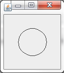

<h4>La méthode drawRect()</h4>

<pre class="code-block"><code data-claire-semantic="java" data-code="{&quot;language&quot;:&quot;java&quot;,&quot;source&quot;:&quot;import java.awt.Graphics;\nimport javax.swing.JPanel;\n \npublic class Panneau extends JPanel {\n  public void paintComponent(Graphics g){\n    //x1, y1, width, height\n    g.drawRect(10, 10, 50, 60);\n    g.fillRect(65, 65, 30, 40);\n  }               \n}&quot;}" class="ace" data-widget="codeBlock"><div class="ace-openclassrooms"><div class="ace_static_highlight ace_show_gutter" style="counter-reset:ace_line 0"><div class="ace_line"><span class="ace_gutter ace_gutter-cell" unselectable="on"></span><span class="ace_keyword">import</span> <span class="ace_identifier">java</span>.<span class="ace_identifier">awt</span>.<span class="ace_identifier">Graphics</span>;
</div><div class="ace_line"><span class="ace_gutter ace_gutter-cell" unselectable="on"></span><span class="ace_keyword">import</span> <span class="ace_identifier">javax</span>.<span class="ace_identifier">swing</span>.<span class="ace_identifier">JPanel</span>;
</div><div class="ace_line"><span class="ace_gutter ace_gutter-cell" unselectable="on"></span> 
</div><div class="ace_line"><span class="ace_gutter ace_gutter-cell" unselectable="on"></span><span class="ace_keyword">public</span> <span class="ace_keyword">class</span> <span class="ace_identifier">Panneau</span> <span class="ace_keyword">extends</span> <span class="ace_identifier">JPanel</span> {
</div><div class="ace_line"><span class="ace_gutter ace_gutter-cell" unselectable="on"></span>  <span class="ace_keyword">public</span> <span class="ace_keyword">void</span> <span class="ace_identifier">paintComponent</span>(<span class="ace_identifier">Graphics</span> <span class="ace_identifier">g</span>){
</div><div class="ace_line"><span class="ace_gutter ace_gutter-cell" unselectable="on"></span>    <span class="ace_comment">//x1, y1, width, height</span>
</div><div class="ace_line"><span class="ace_gutter ace_gutter-cell" unselectable="on"></span>    <span class="ace_identifier">g</span>.<span class="ace_identifier">drawRect</span>(<span class="ace_constant ace_numeric">10</span>, <span class="ace_constant ace_numeric">10</span>, <span class="ace_constant ace_numeric">50</span>, <span class="ace_constant ace_numeric">60</span>);
</div><div class="ace_line"><span class="ace_gutter ace_gutter-cell" unselectable="on"></span>    <span class="ace_identifier">g</span>.<span class="ace_identifier">fillRect</span>(<span class="ace_constant ace_numeric">65</span>, <span class="ace_constant ace_numeric">65</span>, <span class="ace_constant ace_numeric">30</span>, <span class="ace_constant ace_numeric">40</span>);
</div><div class="ace_line"><span class="ace_gutter ace_gutter-cell" unselectable="on"></span>  }               
</div><div class="ace_line"><span class="ace_gutter ace_gutter-cell" unselectable="on"></span>}
</div></div></div></code></pre>

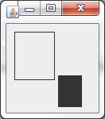

<h4>La méthode drawString()</h4>

<pre class="code-block"><code data-claire-semantic="java" data-code="{&quot;language&quot;:&quot;java&quot;,&quot;source&quot;:&quot;import java.awt.Color;\nimport java.awt.Font;\nimport java.awt.Graphics;\n \nimport javax.swing.JPanel;\n \npublic class Panneau extends JPanel {\n  public void paintComponent(Graphics g){                \n    Font font = new Font(&amp;#x22;Courier&amp;#x22;, Font.BOLD, 20);\n    g.setFont(font);\n    g.setColor(Color.red);          \n    g.drawString(&amp;#x22;Bonjour tout le monde !&amp;#x22;, 10, 20);                \n  }               \n}&quot;}" class="ace" data-widget="codeBlock"><div class="ace-openclassrooms"><div class="ace_static_highlight ace_show_gutter" style="counter-reset:ace_line 0"><div class="ace_line"><span class="ace_gutter ace_gutter-cell" unselectable="on"></span><span class="ace_keyword">import</span> <span class="ace_identifier">java</span>.<span class="ace_identifier">awt</span>.<span class="ace_identifier">Color</span>;
</div><div class="ace_line"><span class="ace_gutter ace_gutter-cell" unselectable="on"></span><span class="ace_keyword">import</span> <span class="ace_identifier">java</span>.<span class="ace_identifier">awt</span>.<span class="ace_identifier">Font</span>;
</div><div class="ace_line"><span class="ace_gutter ace_gutter-cell" unselectable="on"></span><span class="ace_keyword">import</span> <span class="ace_identifier">java</span>.<span class="ace_identifier">awt</span>.<span class="ace_identifier">Graphics</span>;
</div><div class="ace_line"><span class="ace_gutter ace_gutter-cell" unselectable="on"></span> 
</div><div class="ace_line"><span class="ace_gutter ace_gutter-cell" unselectable="on"></span><span class="ace_keyword">import</span> <span class="ace_identifier">javax</span>.<span class="ace_identifier">swing</span>.<span class="ace_identifier">JPanel</span>;
</div><div class="ace_line"><span class="ace_gutter ace_gutter-cell" unselectable="on"></span> 
</div><div class="ace_line"><span class="ace_gutter ace_gutter-cell" unselectable="on"></span><span class="ace_keyword">public</span> <span class="ace_keyword">class</span> <span class="ace_identifier">Panneau</span> <span class="ace_keyword">extends</span> <span class="ace_identifier">JPanel</span> {
</div><div class="ace_line"><span class="ace_gutter ace_gutter-cell" unselectable="on"></span>  <span class="ace_keyword">public</span> <span class="ace_keyword">void</span> <span class="ace_identifier">paintComponent</span>(<span class="ace_identifier">Graphics</span> <span class="ace_identifier">g</span>){                
</div><div class="ace_line"><span class="ace_gutter ace_gutter-cell" unselectable="on"></span>    <span class="ace_identifier">Font</span> <span class="ace_identifier">font</span> <span class="ace_keyword ace_operator">=</span> <span class="ace_keyword">new</span> <span class="ace_identifier">Font</span>(<span class="ace_string">"Courier"</span>, <span class="ace_identifier">Font</span>.<span class="ace_identifier">BOLD</span>, <span class="ace_constant ace_numeric">20</span>);
</div><div class="ace_line"><span class="ace_gutter ace_gutter-cell" unselectable="on"></span>    <span class="ace_identifier">g</span>.<span class="ace_identifier">setFont</span>(<span class="ace_identifier">font</span>);
</div><div class="ace_line"><span class="ace_gutter ace_gutter-cell" unselectable="on"></span>    <span class="ace_identifier">g</span>.<span class="ace_identifier">setColor</span>(<span class="ace_identifier">Color</span>.<span class="ace_identifier">red</span>);          
</div><div class="ace_line"><span class="ace_gutter ace_gutter-cell" unselectable="on"></span>    <span class="ace_identifier">g</span>.<span class="ace_identifier">drawString</span>(<span class="ace_string">"Bonjour tout le monde !"</span>, <span class="ace_constant ace_numeric">10</span>, <span class="ace_constant ace_numeric">20</span>);                
</div><div class="ace_line"><span class="ace_gutter ace_gutter-cell" unselectable="on"></span>  }               
</div><div class="ace_line"><span class="ace_gutter ace_gutter-cell" unselectable="on"></span>}
</div></div></div></code></pre>

<h4>La méthode drawImage()</h4>

<pre class="code-block"><code data-claire-semantic="java" data-code="{&quot;language&quot;:&quot;java&quot;,&quot;source&quot;:&quot;import java.awt.Graphics;\nimport java.awt.Image;\nimport java.io.File;\nimport java.io.IOException;\nimport javax.imageio.ImageIO;\nimport javax.swing.JPanel;\n \npublic class Panneau extends JPanel {\n  public void paintComponent(Graphics g){\n    try {\n      Image img = ImageIO.read(new File(&amp;#x22;images.jpg&amp;#x22;));\n      g.drawImage(img, 0, 0, this);\n      //Pour une image de fond\n      //g.drawImage(img, 0, 0, this.getWidth(), this.getHeight(), this);\n    } catch (IOException e) {\n      e.printStackTrace();\n    }                \n  }               \n}&quot;}" class="ace" data-widget="codeBlock"><div class="ace-openclassrooms"><div class="ace_static_highlight ace_show_gutter" style="counter-reset:ace_line 0"><div class="ace_line"><span class="ace_gutter ace_gutter-cell" unselectable="on"></span><span class="ace_keyword">import</span> <span class="ace_identifier">java</span>.<span class="ace_identifier">awt</span>.<span class="ace_identifier">Graphics</span>;
</div><div class="ace_line"><span class="ace_gutter ace_gutter-cell" unselectable="on"></span><span class="ace_keyword">import</span> <span class="ace_identifier">java</span>.<span class="ace_identifier">awt</span>.<span class="ace_identifier">Image</span>;
</div><div class="ace_line"><span class="ace_gutter ace_gutter-cell" unselectable="on"></span><span class="ace_keyword">import</span> <span class="ace_identifier">java</span>.<span class="ace_identifier">io</span>.<span class="ace_identifier">File</span>;
</div><div class="ace_line"><span class="ace_gutter ace_gutter-cell" unselectable="on"></span><span class="ace_keyword">import</span> <span class="ace_identifier">java</span>.<span class="ace_identifier">io</span>.<span class="ace_identifier">IOException</span>;
</div><div class="ace_line"><span class="ace_gutter ace_gutter-cell" unselectable="on"></span><span class="ace_keyword">import</span> <span class="ace_identifier">javax</span>.<span class="ace_identifier">imageio</span>.<span class="ace_identifier">ImageIO</span>;
</div><div class="ace_line"><span class="ace_gutter ace_gutter-cell" unselectable="on"></span><span class="ace_keyword">import</span> <span class="ace_identifier">javax</span>.<span class="ace_identifier">swing</span>.<span class="ace_identifier">JPanel</span>;
</div><div class="ace_line"><span class="ace_gutter ace_gutter-cell" unselectable="on"></span> 
</div><div class="ace_line"><span class="ace_gutter ace_gutter-cell" unselectable="on"></span><span class="ace_keyword">public</span> <span class="ace_keyword">class</span> <span class="ace_identifier">Panneau</span> <span class="ace_keyword">extends</span> <span class="ace_identifier">JPanel</span> {
</div><div class="ace_line"><span class="ace_gutter ace_gutter-cell" unselectable="on"></span>  <span class="ace_keyword">public</span> <span class="ace_keyword">void</span> <span class="ace_identifier">paintComponent</span>(<span class="ace_identifier">Graphics</span> <span class="ace_identifier">g</span>){
</div><div class="ace_line"><span class="ace_gutter ace_gutter-cell" unselectable="on"></span>    <span class="ace_keyword">try</span> {
</div><div class="ace_line"><span class="ace_gutter ace_gutter-cell" unselectable="on"></span><span class="ace_indent-guide">    </span>  <span class="ace_identifier">Image</span> <span class="ace_identifier">img</span> <span class="ace_keyword ace_operator">=</span> <span class="ace_identifier">ImageIO</span>.<span class="ace_identifier">read</span>(<span class="ace_keyword">new</span> <span class="ace_identifier">File</span>(<span class="ace_string">"images.jpg"</span>));
</div><div class="ace_line"><span class="ace_gutter ace_gutter-cell" unselectable="on"></span><span class="ace_indent-guide">    </span>  <span class="ace_identifier">g</span>.<span class="ace_identifier">drawImage</span>(<span class="ace_identifier">img</span>, <span class="ace_constant ace_numeric">0</span>, <span class="ace_constant ace_numeric">0</span>, <span class="ace_keyword">this</span>);
</div><div class="ace_line"><span class="ace_gutter ace_gutter-cell" unselectable="on"></span><span class="ace_indent-guide">    </span>  <span class="ace_comment">//Pour une image de fond</span>
</div><div class="ace_line"><span class="ace_gutter ace_gutter-cell" unselectable="on"></span><span class="ace_indent-guide">    </span>  <span class="ace_comment">//g.drawImage(img, 0, 0, this.getWidth(), this.getHeight(), this);</span>
</div><div class="ace_line"><span class="ace_gutter ace_gutter-cell" unselectable="on"></span>    } <span class="ace_keyword">catch</span> (<span class="ace_identifier">IOException</span> <span class="ace_identifier">e</span>) {
</div><div class="ace_line"><span class="ace_gutter ace_gutter-cell" unselectable="on"></span><span class="ace_indent-guide">    </span>  <span class="ace_identifier">e</span>.<span class="ace_identifier">printStackTrace</span>();
</div><div class="ace_line"><span class="ace_gutter ace_gutter-cell" unselectable="on"></span>    }                
</div><div class="ace_line"><span class="ace_gutter ace_gutter-cell" unselectable="on"></span>  }               
</div><div class="ace_line"><span class="ace_gutter ace_gutter-cell" unselectable="on"></span>}
</div></div></div></code></pre>


<h3>L'objet Graphics2D</h3>

<pre class="code-block"><code data-claire-semantic="java" data-code="{&quot;language&quot;:&quot;java&quot;,&quot;source&quot;:&quot;import java.awt.Color;\nimport java.awt.Font;\nimport java.awt.GradientPaint;\nimport java.awt.Graphics;\nimport java.awt.Graphics2D;\nimport java.awt.Image;\nimport java.io.File;\nimport java.io.IOException;\n \nimport javax.imageio.ImageIO;\nimport javax.swing.JPanel;\n \npublic class Panneau extends JPanel {\n  public void paintComponent(Graphics g){\n    Graphics2D g2d = (Graphics2D)g;         \n    GradientPaint gp = new GradientPaint(0, 0, Color.RED, 30, 30, Color.cyan, true);                \n    g2d.setPaint(gp);\n    g2d.fillRect(0, 0, this.getWidth(), this.getHeight());                \n  }               \n}&quot;}" class="ace" data-widget="codeBlock"><div class="ace-openclassrooms"><div class="ace_static_highlight ace_show_gutter" style="counter-reset:ace_line 0"><div class="ace_line"><span class="ace_gutter ace_gutter-cell" unselectable="on"></span><span class="ace_keyword">import</span> <span class="ace_identifier">java</span>.<span class="ace_identifier">awt</span>.<span class="ace_identifier">Color</span>;
</div><div class="ace_line"><span class="ace_gutter ace_gutter-cell" unselectable="on"></span><span class="ace_keyword">import</span> <span class="ace_identifier">java</span>.<span class="ace_identifier">awt</span>.<span class="ace_identifier">Font</span>;
</div><div class="ace_line"><span class="ace_gutter ace_gutter-cell" unselectable="on"></span><span class="ace_keyword">import</span> <span class="ace_identifier">java</span>.<span class="ace_identifier">awt</span>.<span class="ace_identifier">GradientPaint</span>;
</div><div class="ace_line"><span class="ace_gutter ace_gutter-cell" unselectable="on"></span><span class="ace_keyword">import</span> <span class="ace_identifier">java</span>.<span class="ace_identifier">awt</span>.<span class="ace_identifier">Graphics</span>;
</div><div class="ace_line"><span class="ace_gutter ace_gutter-cell" unselectable="on"></span><span class="ace_keyword">import</span> <span class="ace_identifier">java</span>.<span class="ace_identifier">awt</span>.<span class="ace_identifier">Graphics2D</span>;
</div><div class="ace_line"><span class="ace_gutter ace_gutter-cell" unselectable="on"></span><span class="ace_keyword">import</span> <span class="ace_identifier">java</span>.<span class="ace_identifier">awt</span>.<span class="ace_identifier">Image</span>;
</div><div class="ace_line"><span class="ace_gutter ace_gutter-cell" unselectable="on"></span><span class="ace_keyword">import</span> <span class="ace_identifier">java</span>.<span class="ace_identifier">io</span>.<span class="ace_identifier">File</span>;
</div><div class="ace_line"><span class="ace_gutter ace_gutter-cell" unselectable="on"></span><span class="ace_keyword">import</span> <span class="ace_identifier">java</span>.<span class="ace_identifier">io</span>.<span class="ace_identifier">IOException</span>;
</div><div class="ace_line"><span class="ace_gutter ace_gutter-cell" unselectable="on"></span> 
</div><div class="ace_line"><span class="ace_gutter ace_gutter-cell" unselectable="on"></span><span class="ace_keyword">import</span> <span class="ace_identifier">javax</span>.<span class="ace_identifier">imageio</span>.<span class="ace_identifier">ImageIO</span>;
</div><div class="ace_line"><span class="ace_gutter ace_gutter-cell" unselectable="on"></span><span class="ace_keyword">import</span> <span class="ace_identifier">javax</span>.<span class="ace_identifier">swing</span>.<span class="ace_identifier">JPanel</span>;
</div><div class="ace_line"><span class="ace_gutter ace_gutter-cell" unselectable="on"></span> 
</div><div class="ace_line"><span class="ace_gutter ace_gutter-cell" unselectable="on"></span><span class="ace_keyword">public</span> <span class="ace_keyword">class</span> <span class="ace_identifier">Panneau</span> <span class="ace_keyword">extends</span> <span class="ace_identifier">JPanel</span> {
</div><div class="ace_line"><span class="ace_gutter ace_gutter-cell" unselectable="on"></span>  <span class="ace_keyword">public</span> <span class="ace_keyword">void</span> <span class="ace_identifier">paintComponent</span>(<span class="ace_identifier">Graphics</span> <span class="ace_identifier">g</span>){
</div><div class="ace_line"><span class="ace_gutter ace_gutter-cell" unselectable="on"></span>    <span class="ace_identifier">Graphics2D</span> <span class="ace_identifier">g2d</span> <span class="ace_keyword ace_operator">=</span> (<span class="ace_identifier">Graphics2D</span>)<span class="ace_identifier">g</span>;         
</div><div class="ace_line"><span class="ace_gutter ace_gutter-cell" unselectable="on"></span>    <span class="ace_identifier">GradientPaint</span> <span class="ace_identifier">gp</span> <span class="ace_keyword ace_operator">=</span> <span class="ace_keyword">new</span> <span class="ace_identifier">GradientPaint</span>(<span class="ace_constant ace_numeric">0</span>, <span class="ace_constant ace_numeric">0</span>, <span class="ace_identifier">Color</span>.<span class="ace_identifier">RED</span>, <span class="ace_constant ace_numeric">30</span>, <span class="ace_constant ace_numeric">30</span>, <span class="ace_identifier">Color</span>.<span class="ace_identifier">cyan</span>, <span class="ace_constant ace_language ace_boolean">true</span>);                
</div><div class="ace_line"><span class="ace_gutter ace_gutter-cell" unselectable="on"></span>    <span class="ace_identifier">g2d</span>.<span class="ace_identifier">setPaint</span>(<span class="ace_identifier">gp</span>);
</div><div class="ace_line"><span class="ace_gutter ace_gutter-cell" unselectable="on"></span>    <span class="ace_identifier">g2d</span>.<span class="ace_identifier">fillRect</span>(<span class="ace_constant ace_numeric">0</span>, <span class="ace_constant ace_numeric">0</span>, <span class="ace_keyword">this</span>.<span class="ace_identifier">getWidth</span>(), <span class="ace_keyword">this</span>.<span class="ace_identifier">getHeight</span>());                
</div><div class="ace_line"><span class="ace_gutter ace_gutter-cell" unselectable="on"></span>  }               
</div><div class="ace_line"><span class="ace_gutter ace_gutter-cell" unselectable="on"></span>}
</div></div></div></code></pre>

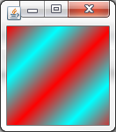

### Création d'une animation

```java
import java.awt.Color;
import java.awt.Graphics;
import javax.swing.JPanel;

public class Panneau extends JPanel {
  private int posX = -50;
  private int posY = -50;

  public void paintComponent(Graphics g){
    g.setColor(Color.red);
    g.fillOval(posX, posY, 50, 50);
  }

  public int getPosX() {
    return posX;
  }

  public void setPosX(int posX) {
    this.posX = posX;
  }

  public int getPosY() {
    return posY;
  }

  public void setPosY(int posY) {
    this.posY = posY;
  }        
}
```

```java
import java.awt.Dimension; 
import javax.swing.JFrame;
 
public class Fenetre extends JFrame{
  private Panneau pan = new Panneau();

  public Fenetre(){        
    this.setTitle("Animation");
    this.setSize(300, 300);
    this.setDefaultCloseOperation(JFrame.EXIT_ON_CLOSE);
    this.setLocationRelativeTo(null);
    this.setContentPane(pan);
    this.setVisible(true);
    go();
  }

  private void go(){
    for(int i = -50; i < pan.getWidth(); i++){
      int x = pan.getPosX(), y = pan.getPosY();
      x++;
      y++;
      pan.setPosX(x);
      pan.setPosY(y);
      pan.repaint();  
      try {
        Thread.sleep(10);
      } catch (InterruptedException e) {
        e.printStackTrace();
      }
    }
  }       
}
```


```java
import java.awt.Color;
import java.awt.Graphics;
import javax.swing.JPanel;
 
public class Panneau extends JPanel {
  private int posX = -50;
  private int posY = -50;

  public void paintComponent(Graphics g){
    //On choisit une couleur de fond pour le rectangle
    g.setColor(Color.white);
    //On le dessine de sorte qu'il occupe toute la surface
    g.fillRect(0, 0, this.getWidth(), this.getHeight());
    //On redéfinit une couleur pour le rond
    g.setColor(Color.red);
    //On le dessine aux coordonnées souhaitées
    g.fillOval(posX, posY, 50, 50);
  }

  public int getPosX() {
    return posX;
  }

  public void setPosX(int posX) {
    this.posX = posX;
  }

  public int getPosY() {
    return posY;
  }

  public void setPosY(int posY) {
    this.posY = posY;
  }
}
```

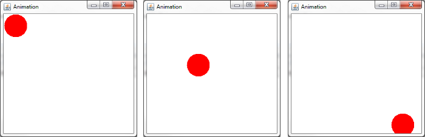

#### Améliorations

```java
private void go(){
  for(;;){
    int x = pan.getPosX(), y = pan.getPosY();
    x++;
    y++;
    pan.setPosX(x);
    pan.setPosY(y);
    pan.repaint();  
    try {
      Thread.sleep(10);
    } catch (InterruptedException e) {
      e.printStackTrace();
    }
    //Si nos coordonnées arrivent au bord de notre composant
    //On réinitialise
    if(x == pan.getWidth() || y == pan.getHeight()){
      pan.setPosX(-50);
      pan.setPosY(-50);
    }
  }
}
```

#### Détection des bords

```java
private void go(){
  //Les coordonnées de départ de notre rond
  int x = pan.getPosX(), y = pan.getPosY();
  //Le booléen pour savoir si l'on recule ou non sur l'axe x
  boolean backX = false;
  //Le booléen pour savoir si l'on recule ou non sur l'axe y
  boolean backY = false;

  //Dans cet exemple, j'utilise une boucle while
  //Vous verrez qu'elle fonctionne très bien
  while(true){
    //Si la coordonnée x est inférieure à 1, on avance
    if(x < 1)
      backX = false;

    //Si la coordonnée x est supérieure à la taille du Panneau moins la taille du rond, on recule
    if(x > pan.getWidth()-50)
      backX = true;

    //Idem pour l'axe y
    if(y < 1)
      backY = false;
    if(y > pan.getHeight()-50)
      backY = true;

    //Si on avance, on incrémente la coordonnée
    //backX est un booléen, donc !backX revient à écrire
    //if (backX == false)
    if(!backX)
      pan.setPosX(++x);

    //Sinon, on décrémente
    else
      pan.setPosX(--x);

    //Idem pour l'axe Y
    if(!backY)
      pan.setPosY(++y);
    else
      pan.setPosY(--y);

    //On redessine notre Panneau
    pan.repaint();

    //Comme on dit : la pause s'impose ! Ici, trois millièmes de seconde
    try {
      Thread.sleep(3);
    } catch (InterruptedException e) {
      e.printStackTrace();
    }
  }
}
```


