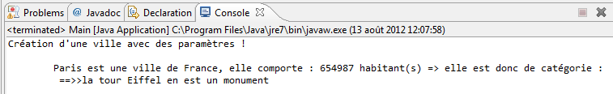
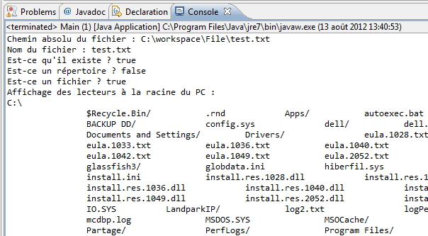

# Programmation JAVA
Présenté par : Mourad DHAMBRI

### Sommaire

* [Présentation](#presentation)
* [Les certifications Java](#certif)
* [Les outils de développement](#outils)
* [Votre premier programme](#hello)
* [Récupérer ce que vous tapez](#scanner)
* [Les conditions](#conditions)
* [Les boucles](#boucles)
* [Votre première classe](#classe)
* [L'héritage](#heritage)
* [Le polymorphisme](#polymorphisme)
* [Modéliser ses objets grâce à UML](#uml)
* [Les classes abstraites](#abstraites)
* [Les interfaces](#interfaces)
* [Les exceptions](#exceptions)
* [Les collections d'objets](#collections)
* [Les flux d'entrée/sortie](#flux)
* [L'objet JFrame](#jframe)

### Références

* Livres
    - Programmer en Java, 7e Edition, Claude Delannoy, Eyrolles, 2011
    - The Java Tutorial : A Short Course on the Basics, 4th Edition, Collectif, Prentice Hall, 2006
    - Effective Java, 2nd Edition, Joshua Bloch, Prendice Hall, 2008
* Site web
    - Site officiel Java, http://www.oracle.com/technetwork/java/index.html
    - Tutoriels Java, http://docs.oracle.com/javase/tutorial/
    - Le site Java World, http://javaworld.com
    - Le site https://openclassrooms.com

### <a name="presentation">Présentation</a>

Développé par Sun Microsystems, présenté officiellement le 23 mai 1995.
La société Sun a été ensuite rachetée en 2009 par la société Oracle qui détient et maintient désormais Java.
Une de ses plus grandes forces est son excellente portabilité : une fois votre programme créé, il fonctionnera automatiquement sous Windows, Mac, Linux, etc.

Il permet de développer :

* des applications, sous forme de fenêtre ou de console.
* des applets, qui sont des programmes Java incorporés à des pages web.
* des applications pour appareils mobiles.
* et bien d'autres ! J2EE pour les applications d'entreprise, JMF pour le traitement vidéo, J3D pour la 3D...

Java est un langage interprété, ce qui signifie qu’un programme compilé n’est pas directement exécutable par le système d’exploitation mais il doit être interprété par un autre programme, qu’on appelle interpréteur.


Un programmeur Java écrit son code source, sous la forme de classes, dans des fichiers dont l’extension est `.java`. Ce code source est alors compilé par le compilateur `javac` en un langage appelé `bytecode` et enregistre le résultat dans un fichier dont l’extension est `.class`. Le bytecode ainsi obtenu n’est pas directement utilisable. Il doit être interprété par la machine virtuelle de Java (un interpréteur qui exécute des programmes compilés sous forme de bytecode Java) qui transforme alors le code compilé en code machine compréhensible par le système d’exploitation.
C’est la raison pour laquelle Java est un langage portable : le bytecode reste le même quelque soit l’environnement d’exécution.

### <a name="certif">Les certifications Java</a>
Pour être certifié Java SE 7, vous devez passer ces 2 examens :

* 1Z0-803 Oracle Certified Associate, Java SE 7 Programmer I.
* 1Z0-804 Oracle Certified Professional , Java SE 7 Programmer II.

### Les certifications J2ee


### Comparatif Java / Python

Java | Python
------------ | -------------
En Java, tous les noms de variables doivent être explicitement déclarés. | En Python, vous ne déclarez jamais rien. Une affectation lie un nom à un objet et l'objet peut être de n'importe quel type.

#### Java
```java
int myCounter = 0;
String myString = String.valueOf(myCounter);
if (myString.equals("0")) ...
```

#### Python
```Python
myCounter = 0
myString = str(myCounter)
if myString == "0": ...
```

Java | Python
------------ | -------------
Abondant en mots | Concis. Exprime beaucoup en peu de mots.

#### Java
```java
public class HelloWorld
{
    public static void main (String[] args)
    {
        System.out.println("Hello world!");
    }
}
```

#### Python
```Python
print "Hello, world!"
```

#### Java
```java
// print the integers from 1 to 9
for (int i = 1; i < 10; i++)
{
   System.out.println(i);
}
```

#### Python
```Python
 print the integers from 1 to 9
for i in range(1,10):
    print i
```

### <a name="outils">Les outils de développement</a>
Pour commencer à utiliser Java, il suffit d'installer le JDK (Java Development Kit) disponible à l'adresse suivante : [www.oracle.com/technetwork/java/javase/downloads](http://www.oracle.com/technetwork/java/javase/downloads/index.html)


Cochez la case : « Accept License Agreement » puis cliquez sur le lien correspondant à votre système d'exploitation (x86 pour un système 32 bits et x64 pour un système 64 bits).


### Compilation en ligne de commande

* Mettre à jour la variable d’environnement « PATH ». C'est grâce à elle que Windows trouve des exécutables sans  qu'il soit nécessaire de lui spécifier le chemin d'accès complet.
* Allez dans le répertoire de votre premier programme et effacez le « .class ». Ensuite, faites « Démarrer > Exécuter » (ou encore touche « Windows + R » et tapez « cmd ».
* Maintenant, vous pouvez créer votre fichier « .class » en exécutant la commande suivante :

```java
javac <nomDeFichier.java>
```

* Vous pouvez lancer votre programme Java en faisant ce qui suit :

```java
java <nomFichierClassSansExtension>
```

### Eclipse IDE
Eclipse IDE est un environnement de développement libre permettant de créer des programmes dans de nombreux langages de programmation (Java, C++, PHP…). C'est l'outil que nous allons utiliser pour programmer. Eclipse IDE est disponible en téléchargement à l'adresse suivante : [http://www.eclipse.org/downloads/eclipse-packages](http://www.eclipse.org/downloads/eclipse-packages/)


### Créer un nouveau projet Java.


Vous devriez avoir un nouveau projet dans la fenêtre de gauche, comme à la figure suivante.


Ajoutons une nouvelle classe dans ce projet.


Cochez la case : « public static void main(String[] args) ».


### <a name="hello">Votre premier programme</a>
Tous les programmes Java sont composés d'au moins une classe. Elle doit contenir une méthode appelée « main »: ce sera le point de démarrage de notre programme.


### Les commentaires

```java
public static void main(String[] args){
  //Un commentaire
  //Un autre
  //Encore un autre

  /*
  Un commentaire
  Un autre
  Encore un autre
  */

  Ceci n'est pas un commentaire !
}
```

### Hello World

```java
public static void main(String[] args){
  System.out.print("Hello World !");
}
```

Une fois que vous avez saisi cette ligne de code dans votre méthode main, il vous faut lancer le programme.


Prenons le code suivant :

```java
  System.out.print("Hello World !");
  System.out.print("My name is");
  System.out.print("Cysboy");
```

Résultat:

> Hello World !My name isCysboy

```java
  System.out.print("Hello World ! \n");
  System.out.println("My name is");
  System.out.println("\nCysboy");
```

Avec pour résultat :

> Hello World !

> My name is


> Cysboy

### Les variables et les opérateurs
En Java, nous avons deux types de variables :

* des variables de type simple ou « primitif » ;
* des variables de type complexe ou des « objets ».

### Les variables de type numérique
Le type byte (1 octet) peut contenir les entiers entre -128 et +127.

```java
  byte temperature;
  temperature = 64;
```

Le type short (2 octets) contient les entiers compris entre -32768 et +32767.

```java
  short vitesseMax;
  vitesseMax = 32000;
```

Le type int (4 octets) va de -2*10<sup>9</sup> à 2*10<sup>9</sup>.

```java
  int temperatureSoleil;
  temperatureSoleil = 15600000; //La température est exprimée en kelvins
```

Le type long (8 octets) peut aller de −9×10<sup>18</sup>  à 9×10<sup>18</sup>.

```java
  long anneeLumiere;
  anneeLumiere = 9460700000000000L;
```

Le type float (4 octets) est utilisé pour les nombres avec une virgule flottante.

```java
  float pi;
  pi = 3.141592653f;
```

Le type double (8 octets) est identique à float, si ce n'est qu'il contient plus de chiffres derrière la virgule.

```java
  double division;
  division = 0.333333333333333333333333333333333333333333334d;
```

### Des variables stockant un caractère
Le type « char » contient un caractère stocké entre apostrophes (« ' ' »), comme ceci :

```java
  char caractere;
  caractere = 'A';
```

### Des variables de type booléen
Le type « boolean » ne peut contenir que deux valeurs : true (vrai) ou false (faux).

```java
  boolean question;
  question = true;
```

### Le type String
Le type « String » permet de gérer les chaînes de caractères, c'est-à-dire le stockage de texte. Il s'agit d'une variable d'un type plus complexe que l'on appelle <b>« objet »</b>.

```java
//Première méthode de déclaration
String phrase;
phrase = "Titi et Grosminet";

//Deuxième méthode de déclaration
String str = new String();
str = "Une autre chaîne de caractères";

//Troisième méthode de déclaration
String string = "Une autre chaîne";

//Quatrième méthode de déclaration
String chaine = new String("Et une de plus !");
```

### Conventions de nommage
Tous vos noms de classes doivent commencer par une majuscule ;
Tous vos noms de variables doivent commencer par une minuscule ;
Si le nom d'une variable est composé de plusieurs mots, le premier commence par une minuscule, le ou les autres par une majuscule, et ce, sans séparation ;
Tout ceci sans accentuation !
On peut très bien compacter les phases de déclaration et d'initialisation en une seule phase ! Comme ceci :

```java
int entier = 32;
float pi = 3.1416f;
char carac = 'z';
String mot = new String("Bonjour tout le monde !");
```

Et lorsque nous avons plusieurs variables d'un même type, nous pouvons résumer tout ceci à une déclaration :

```java
int nbre1 = 2, nbre2 = 3, nbre3 = 0;
```

### Les opérateurs arithmétiques :
* « + » : permet d'additionner deux variables numériques (mais aussi de concaténer des chaînes de caractères).
* « - » : permet de soustraire deux variables numériques.
* « * » : permet de multiplier deux variables numériques.
* « / » : permet de diviser deux variables.
* « % » : permet de renvoyer le reste de la division entière de deux variables de type numérique ; cet opérateur s'appelle le modulo.

### Quelques exemples de calcul

```java
int nbre1, nbre2, nbre3;  //Déclaration des variables
 
nbre1 = 1 + 3;            //nbre1 vaut 4
nbre2 = 2 * 6;            //nbre2 vaut 12
nbre3 = nbre2 / nbre1;    //nbre3 vaut 3
nbre1 = 5 % 2;            //nbre1 vaut 1, car 5 = 2 * 2 + 1
nbre2 = 99 % 8;           //nbre2 vaut 3, car 99 = 8 * 12 + 3
nbre3 = 6 % 3;            //là, nbre3 vaut 0, car il n'y a pas de reste
```

```java
int nbre1, nbre2, nbre3;    //Déclaration des variables
nbre1 = nbre2 = nbre3 = 0;  //Initialisation
 
nbre1 = nbre1 + 1;     //nbre1 = lui-même, donc 0 + 1 => nbre1 = 1
nbre1 = nbre1 + 1;     //nbre1 = 1 (cf. ci-dessus), maintenant, nbre1 = 1 + 1 = 2
nbre2 = nbre1;         //nbre2 = nbre1 = 2
nbre2 = nbre2 * 2;     //nbre2 = 2 => nbre2 = 2 * 2 = 4
nbre3 = nbre2;         //nbre3 = nbre2 = 4
nbre3 = nbre3 / nbre3; //nbre3 = 4 / 4 = 1
nbre1 = nbre3;         //nbre1 = nbre3 = 1
nbre1 = nbre1 - 1;     //nbre1 = 1 - 1 = 0
```

```java
nbre1 = nbre1 + 1;
nbre1 += 1;
nbre1++;
++nbre1;
```

```java
nbre1 = nbre1 - 1;
nbre1 -= 1;
nbre1--;
--nbre1;
```

```java
nbre1 = nbre1 * 2;
nbre1 *= 2;
nbre1 = nbre1 / 2;
nbre1 /= 2;
```

L'opérateur « + » sert aussi d'opérateur de concaténation, c'est-à-dire qu'il permet de mélanger du texte brut et des variables. Voici un exemple d'affichage avec une perte de précision :

```java
double nbre1 = 10, nbre2 = 3;
int resultat = (int)(nbre1 / nbre2);
System.out.println("Le résultat est = " + resultat);
```

### Les conversions, ou « cast »
D'un type « int » en type « float ».

```java
int i = 123;
float j = (float)i;
```

D'un type « int » en « double ».

```java
int i = 123;
double j = (double)i;
```

Et inversement :

```java
double i = 1.23;
double j = 2.9999999;
int k = (int)i;        //k vaut 1
k = (int)j;            //k vaut 2
```

### <a name="scanner">Récupérer ce que vous tapez</a>


### <a name="conditions">La structure If… else…</a>

```java
int i = 0;
if (i < 0)
  System.out.println("Ce nombre est négatif !");      
  
else if(i > 0)
  System.out.println("Ce nombre est positif !");           
 
else  
  System.out.println("Ce nombre est nul !");
```

### Les conditions multiples
```java
int i = 58;
if(i < 100 && i > 50) 
  System.out.println("Le nombre est bien dans l'intervalle.");
else
  System.out.println("Le nombre n'est pas dans l'intervalle.");
```

### La structure « switch »
```java
int note = 10; //On imagine que la note maximale est 20

switch (note)
{
  case 0:
    System.out.println("Ouch !");
    break;
  case 10:
    System.out.println("Vous avez juste la moyenne.");
    break;
  case 20:
    System.out.println("Parfait !");
    break;
  default:
    System.out.println("Il faut davantage travailler.");
}
```

```java
String chaine = "Bonjour";

switch(chaine) {
  case "Bonjour":
    System.out.println("Bonjour monsieur !");
    break;
  case "Bonsoir":
    System.out.println("Bonsoir monsieur !");
    break;
  default:
    System.out.println("Au revoir !");
}
```

### La condition ternaire
```java
int x = 10, y = 20;
int max = (x < y) ? y : x ; //Maintenant, max vaut 20
```

```java
int x = 10, y = 20;

int max = (x < y) ? (y < 10) ? y % 10 : y * 2 : x ; //Max vaut 40

//Pas très facile à lire…
//Vous pouvez entourer votre deuxième instruction ternaire par des parenthèses pour mieux voir :

max = (x < y) ? ((y < 10) ? y % 10 : y * 2) : x ; //Max vaut 40
```

### <a name="boucles">La boucle « while »</a>

```java
//Une variable vide
String prenom;
//On initialise celle-ci à O pour oui
char reponse = 'O';
//Notre objet Scanner, n'oubliez pas l'import de java.util.Scanner !
Scanner sc = new Scanner(System.in);
//Tant que la réponse donnée est égale à oui…
while (reponse == 'O')
{
  //On affiche une instruction
  System.out.println("Donnez un prénom : ");
  //On récupère le prénom saisi
  prenom = sc.nextLine();
  //On affiche notre phrase avec le prénom
  System.out.println("Bonjour " +prenom+ ", comment vas-tu ?");
  //On demande si la personne veut faire un autre essai
  System.out.println("Voulez-vous réessayer ? (O/N)");
  //On récupère la réponse de l'utilisateur
  reponse = sc.nextLine().charAt(0);
}
 
System.out.println("Au revoir…");
//Fin de la boucle
```

```java
String prenom;
char reponse = 'O';
Scanner sc = new Scanner(System.in);
while (reponse == 'O')
{
  System.out.println("Donnez un prénom : ");
  prenom = sc.nextLine();
  System.out.println("Bonjour " +prenom+ ", comment vas-tu ?");                        
  //Sans ça, nous n'entrerions pas dans la deuxième boucle
  reponse = ' ';
                        
  //Tant que la réponse n'est pas O ou N, on repose la question
  while(reponse != 'O' && reponse != 'N')
  {
    //On demande si la personne veut faire un autre essai
    System.out.println("Voulez-vous réessayer ? (O/N)");
    reponse = sc.nextLine().charAt(0);
  }
}
System.out.println("Au revoir…");
```


```java
int a = 1, b = 15;
while (a < b)
{
  System.out.println("bonjour " +a+ " fois !!");
}
```

```java
int a = 1, b = 15;
while (a < b)
{
  System.out.println("bonjour " +a+ " fois !!");
  a++;
}
```

```java
int a = 1, b = 15;
while (a++ < b)
   System.out.println("bonjour " +a+ " fois !!");
```

```java
int a = 1, b = 15;
while (++a < b)
  System.out.println("bonjour " +a+ " fois !!");
```

### La boucle « do… while »
Syntaxe
```java
do{
  //Instructions
}while(a < b);
```

#### Première différence
La boucle « do… while » s'exécutera au moins une fois, contrairement à la boucle « while ». C'est-à-dire que la phase de test de la condition se fait à la fin, car la condition se met après le while.

#### Deuxième différence
C'est une différence de syntaxe, qui se situe après la condition du while. Il y a un «;» après le while. C'est tout ! Ne l'oubliez cependant pas, sinon le programme ne compilera pas.

```java
String prenom = new String();
//Pas besoin d'initialiser : on entre au moins une fois dans la boucle !
char reponse = ' ';
 
Scanner sc = new Scanner(System.in);
 
do{
  System.out.println("Donnez un prénom : ");
  prenom = sc.nextLine();
  System.out.println("Bonjour " +prenom+ ", comment vas-tu ?");
       
  do{
    System.out.println("Voulez-vous réessayer ? (O/N)");
    reponse = sc.nextLine().charAt(0);
  }while(reponse != 'O' && reponse != 'N');
        
}while (reponse == 'O');
 
System.out.println("Au revoir…");
```

### La boucle « for »
```java
for(int i = 1; i <= 10; i++)
{
  System.out.println("Voici la ligne "+i);
}
```


```java
for(int i = 10; i >= 0; i--)
  System.out.println("Il reste "+i+" ligne(s) à écrire");
```


```java
for(int i = 0, j = 2; (i < 10 && j < 6); i++, j+=2){
  System.out.println("i = " + i + ", j = " + j);
}
```

### TP : conversion Celsius - Fahrenheit
Voici les caractéristiques du programme que nous allons devoir réaliser:
* Le programme demande quelle conversion nous souhaitons effectuer, Celsius vers Fahrenheit ou l'inverse ;
* On n'autorise que les modes de conversion définis dans le programme (un simple contrôle sur la saisie fera l'affaire) ;
* Enfin, on demande à la fin à l'utilisateur s'il veut faire une nouvelle conversion, ce qui signifie que l'on doit pouvoir revenir au début du programme !

Voici la formule de conversion pour passer des degrés Celsius en degrés Fahrenheit :
```				
    F=(9/5)×C+32
```
Pour l'opération inverse, c'est comme ceci :
```				
    C=(F−32)×5/9
```
La figure suivante est un aperçu de ce que je vous demande.


### <a name="tableaux">Tableaux à une dimension</a>

```java
int tableauEntier[] = {0,1,2,3,4,5,6,7,8,9};
double tableauDouble[] = {0.0,1.0,2.0,3.0,4.0,5.0,6.0,7.0,8.0,9.0};
char tableauCaractere[] = {'a','b','c','d','e','f','g'};
String tableauChaine[] = {"chaine1", "chaine2", "chaine3" , "chaine4"};
```

Vous pouvez aussi déclarer un tableau vide, mais celui-ci devra impérativement contenir un nombre de cases bien défini. Par exemple, si vous voulez un tableau vide de six entiers :

```java
int tableauEntier[] = new int[6];
//Ou encore
int[] tableauEntier2 = new int[6];
```

### Tableaux multidimensionnels

```java
int premiersNombres[][] = { {0,2,4,6,8},{1,3,5,7,9} };
```


### Utiliser et rechercher dans un tableau

```java
char tableauCaractere[] = {'a', 'b', 'c', 'd', 'e', 'f', 'g'};
int i = 0;
char reponse = ' ',carac = ' ';
Scanner sc = new Scanner(System.in);
         
do {//Boucle principale
  do {//On répète cette boucle tant que l'utilisateur n'a pas rentré une lettre figurant dans le tableau
    i = 0;
    System.out.println("Rentrez une lettre en minuscule, SVP ");
                
    carac = sc.nextLine().charAt(0);
    //Boucle de recherche dans le tableau
    while(i < tableauCaractere.length && carac != tableauCaractere[i])
      i++;
         
    //Si i < 7 c'est que la boucle n'a pas dépassé le nombre de cases du tableau 
    if (i < tableauCaractere.length)
      System.out.println(" La lettre " +carac+ " se trouve bien dans le tableau !");
    else //Sinon
      System.out.println(" La lettre " +carac+ " ne se trouve pas dans le tableau !");
         
  }while(i >= tableauCaractere.length);

  //Tant que la lettre de l'utilisateur ne correspond pas à une lettre du tableau    
  do{
    System.out.println("Voulez-vous essayer à nouveau ? (O/N)");
    reponse = sc.nextLine().charAt(0);
  }while(reponse != 'N' && reponse != 'O');      
}while (reponse == 'O');
                
System.out.println("Au revoir !");
```

Le résultat de ce code se trouve à la figure suivante.


### Parcourir un tableau multidimensionnel

```java
int premiersNombres[][] = { {0,2,4,6,8},{1,3,5,7,9} }, i = 0, j = 0;
 
while (i < 2)
{
  j = 0;
  while(j < 5)
  {
    System.out.print(premiersNombres[i][j]);
    j++;
  }
  System.out.println("");
  i++;
}
```

```java
int premiersNombres[][] = { {0,2,4,6,8},{1,3,5,7,9} };
 
for(int i = 0; i < 2; i++)
{    
  for(int j = 0; j < 5; j++)
  {
    System.out.print(premiersNombres[i][j]);       
  }
  System.out.println("");     
}
```

```java
String tab[][]={{"a", "b", "c", "d", "e"}, {"1", "2", "3", "4"}};
int i = 0, j = 0;
 
for(String sousTab[] : tab)
{
  i = 0;
  for(String str : sousTab)
  {     
    System.out.println("La valeur de la nouvelle boucle est  : " + str);
    System.out.println("La valeur du tableau à l'indice ["+j+"]["+i+"] est : " + tab[j][i]);
    i++;
  }
  j++;
}
```

### Classe Arrays

#### Méthodes pour copier des tableaux

```java
import java.util;

class ArrayCopyOfDemo {

    public static void main(String[] args) {
        char[] copyFrom = {'h','e','l','l','o','j','a','v','a'} ;
        char[] copyTo = Arrays.copyOfRange(copyFrom, 2, 6);     // lloj
        char[] copyTo2 = Arrays.copyOf(copyFrom,3);             // hel
        System.out.println(new String(copyTo));
    }
}
```

#### Autres méthodes :
* binarySearch: recherche un élément et retourne l’index associé.
* equals : compare deux tableaux
* sort : tri d’un tableau d’une manière séquentielle
* paralllelSort : tri d’un tableau d’une manière parallèle dans des machines multi-processeur (plus rapide que sort), existe depuis Java 1.8

### Des méthodes concernant les chaînes de caractères

```java
String chaine = new String("BONJOUR TOUT LE MONDE !"), chaine2 = new String();
chaine2 = chaine.toLowerCase();   //Donne "bonjour tout le monde !"
```

```java
String chaine = new String("bonjour bonjour"), chaine2 = new String();
chaine2 = chaine.toUpperCase();   //Donne "BONJOUR BONJOUR"
```

```java
String chaine = new String("bonjour ! "); 
int longueur = 0;
longueur = chaine.length();   //Renvoie 9
```

```java
String str1 = new String("bonjour"), str2 = new String("bonsoir");
 
if (str1.equals(str2))
  System.out.println("Les deux chaînes sont identiques !");
else
  System.out.println("Les deux chaînes sont différentes !");
```

```java
String nbre = new String("1234567");
char carac = nbre.charAt(4);   //Renverra ici le caractère 5
```

```java
String chaine = new String("la paix niche"), chaine2 = new String();
chaine2 = chaine.substring(3,13);   //Permet d'extraire "paix niche"
```

```java
String mot = new String("anticonstitutionnellement");
int n = 0;
 
n = mot.indexOf('t');           //n vaut 2
n = mot.lastIndexOf('t');       //n vaut 24
n = mot.indexOf("ti");          //n vaut 2
n = mot.lastIndexOf("ti");      //n vaut 12
n = mot.indexOf('x');           //n vaut -1
```

### La classe java.lang.Math

```java
double X = 0.0;
X = Math.random();
//Retourne un nombre aléatoire 
//compris entre 0 et 1, comme 0.0001385746329371058

double sin = Math.sin(120);     //La fonction sinus
double cos = Math.cos(120);     //La fonction cosinus
double tan = Math.tan(120);     //La fonction tangente
double abs = Math.abs(-120.25); //La fonction valeur absolue (retourne le nombre sans le signe)
double d = 2;
double exp = Math.pow(d, 2);    //La fonction exposant
//Ici, on initialise la variable exp avec la valeur de d élevée au carré
//La méthode pow() prend donc une valeur en premier paramètre, et un exposant en second
```

### La surcharge de méthode

```java
public class Test1
{
  public static void main(String[] args)
  {
    String[] tab = {"a", "b", "c", "d"};
    parcourirTableau(tab); 
  }
 
  static void parcourirTableau(String[] tabBis)
  {
    for(String str : tabBis)
      System.out.println(str);
  }
}
```

La surcharge de méthode consiste à garder le nom d'une méthode et à changer la liste ou le type de ses paramètres. Dans le cas qui nous intéresse, nous voulons que notre méthode <strong>parcourirTableau</strong> puisse parcourir n'importe quel type de tableau. Nous allons donc surcharger notre méthode afin qu'elle puisse aussi travailler avec des int, comme le montre cet exemple :

```java
static void parcourirTableau(String[] tab)
{
  for(String str : tab)
    System.out.println(str);
}
        
static void parcourirTableau(int[] tab)
{
  for(int str : tab)
    System.out.println(str);
}
```

Avec ces méthodes, vous pourrez parcourir de la même manière :
* Les tableaux d'entiers ;
* Les tableaux de chaînes de caractères.

```java
static void parcourirTableau(String[][] tab)
{
  for(String tab2[] : tab)
  {
    for(String str : tab2)
      System.out.println(str);
  }
}
```

```java
String[] tabStr = {"a", "b", "c"};
int[] tabInt = {1, 2, 3, 4};
String[][] tabStr2 = {{"1", "2", "3", "4"}, {"a", "b", "c"}};

//La méthode avec un tableau de String sera invoquée
parcourirTableau(tabStr);
//La méthode avec un tableau d'int sera invoquée
parcourirTableau(tabInt);
//La méthode avec un tableau de String à deux dimensions sera invoquée
parcourirTableau(tabStr2);
```

### Classes

#### Définition :
Une classe est un modèle de définition pour des objets ayant le même ensemble d'attributs, et le même ensemble d'opérations. A partir d'une classe on peut créer un ou plusieurs objets par instanciation ; chaque objet est une instance d'une seule classe.

#### Une classe est définie par :
* Son nom
* Des champs
    - Attributs
    - Méthodes

#### Syntaxe :

```
[<Modificateur de visibilité>] class <nom classe>
{
    //Déclaration des attributs

    //Déclaration des méthodes
}
```

<Modificateur de visibilité> = « public » ou « private »

### <a name="classe">Votre première classe</a>
Créons une classe « Ville ». Allez dans File > New > Class.


### Les constructeurs
L'objectif est de construire un objet <strong><i>Ville</i></strong>, Un objet <strong><i>Ville</i></strong> possède :
* un nom, sous la forme d'une chaîne de caractères ;
* un nombre d'habitants, sous la forme d'un entier ;
* un pays apparenté, sous la forme d'une chaîne de caractères.

```java
public class Ville{
  String nomVille;
  String nomPays;
  int nbreHabitants; 
}
```

Un constructeur est une méthode d'instance qui va se charger de créer un objet et, le cas échéant, d'initialiser ses variables de classe ! Cette méthode a pour rôle de signaler à la JVM (Java Virtual Machine) qu'il faut réserver de la mémoire pour notre futur objet et donc, par extension, d'en réserver pour toutes ses variables.

```java
public class Ville{   
  //Stocke le nom de notre ville
  String nomVille;
  //Stocke le nom du pays de notre ville
  String nomPays;
  //Stocke le nombre d'habitants de notre ville
  int nbreHabitants;
     
  //Constructeur par défaut
  public Ville(){
    System.out.println("Création d'une ville !");      
    nomVille = "Inconnu";
    nomPays = "Inconnu";
    nbreHabitants = 0;
  } 
}
```

Allons dans notre classe contenant la méthode <strong><i>main</i></strong> et instancions un objet <strong><i>Ville</i></strong>.

```java
public class Test1{ 
  public static void main(String[] args){   
    Ville ville = new Ville(); 
  } 
}
```

Exécutez ce code, vous devriez avoir l'équivalent de la figure suivante.


```java
public class Ville {
 
  //Stocke le nom de notre ville
  String nomVille;
  //Stocke le nom du pays de notre ville
  String nomPays;
  //Stocke le nombre d'habitants de notre ville
  int nbreHabitants;
 
  //Constructeur par défaut
  public Ville(){
    System.out.println("Création d'une ville !");          
    nomVille = "Inconnu";
    nomPays = "Inconnu";
    nbreHabitants = 0;
  }
 
  //Constructeur avec paramètres
  //J'ai ajouté un « p » en première lettre des paramètres.
  //Ce n'est pas une convention, mais ça peut être un bon moyen de les repérer.
  public Ville(String pNom, int pNbre, String pPays)
  {
    System.out.println("Création d'une ville avec des paramètres !");
    nomVille = pNom;
    nomPays = pPays;
    nbreHabitants = pNbre;
  }        
}
```

```java
//L'ordre est respecté -> aucun souci
Ville ville1 = new Ville("Marseille", 123456789, "France");
//Erreur dans l'ordre des paramètres -> erreur de compilation au final
Ville ville2 = new Ville(12456, "France", "Lille");
```

Dans la majorité des cas, nous allons contrôler les modifications des variables de classe, de manière à ce qu'un code extérieur ne fasse pas n'importe quoi avec nos objets. C'est pour cela que nous protégeons nos variables d'instance en les déclarant <strong><i>private</i></strong>, comme ceci :

```java
public class Ville {

  private String nomVille;
  private String nomPays;
  private int nbreHabitants;
   
  //…     
}
```

### Les getters et les setters
Un accesseur (getter) est une méthode qui va nous permettre d'accéder aux variables de nos objets en lecture, et un mutateur (setter) nous permettra d'en faire de même en écriture ! Grâce aux accesseurs, vous pourrez afficher les variables de vos objets, et grâce aux mutateurs, vous pourrez les modifier.


```java
public class Ville {

  //Les variables et les constructeurs n'ont pas changé…
  
  private String nomVille;
  private String nomPays;
  private int nbreHabitants;
  
  public Ville() {
    System.out.println("Création d'une ville !");          
    nomVille = "Inconnu";
    nomPays = "Inconnu";
    nbreHabitants = 0;
  }
  
  public Ville(String pNom, int pNbre, String pPays) {
    System.out.println("Création d'une ville avec des paramètres !");
    nomVille = pNom;
    nomPays = pPays;
    nbreHabitants = pNbre;
  }   
          
  //*************   ACCESSEURS *************
    
  //Retourne le nom de la ville
  public String getNom()  {  
    return nomVille;
  }

  //Retourne le nom du pays
  public String getNomPays()
  {
    return nomPays;
  }

  // Retourne le nombre d'habitants
  public int getNombreHabitants()
  {
    return nbreHabitants;
  } 
 
  //*************   MUTATEURS   *************

  //Définit le nom de la ville
  public void setNom(String pNom)
  {
    nomVille = pNom;
  }

  //Définit le nom du pays
  public void setNomPays(String pPays)
  {
    nomPays = pPays;
  }

  //Définit le nombre d'habitants
  public void setNombreHabitants(int nbre)
  {
    nbreHabitants = nbre;
  }  
  
}
```

À présent, essayez ce code dans votre méthode <strong><i>main</i></strong> :

```java
Ville v = new Ville();
Ville v1 = new Ville("Marseille", 123456, "France");       
Ville v2 = new Ville("Rio", 321654, "Brésil");

System.out.println("\n v = "+v.getNom()+" ville de "+v.getNombreHabitants()+ " habitants se situant en "+v.getNomPays());
System.out.println(" v1 = "+v1.getNom()+" ville de "+v1.getNombreHabitants()+ " habitants se situant en "+v1.getNomPays());
System.out.println(" v2 = "+v2.getNom()+" ville de "+v2.getNombreHabitants()+ " habitants se situant en "+v2.getNomPays()+"\n\n");
        
// Nous allons interchanger les Villes v1 et v2 tout ça par l'intermédiaire d'un autre objet Ville.        
     
Ville temp = new Ville();
temp = v1;
v1 = v2;
v2 = temp;
       
System.out.println(" v1 = "+v1.getNom()+" ville de  "+v1.getNombreHabitants()+ " habitants se situant en "+v1.getNomPays());
System.out.println(" v2 = "+v2.getNom()+" ville de  "+v2.getNombreHabitants()+ " habitants se situant en "+v2.getNomPays()+"\n\n");

     
// Nous allons maintenant interchanger leurs noms cette fois par le biais de leurs mutateurs.
  
v1.setNom("Hong Kong");
v2.setNom("Djibouti");
      
System.out.println(" v1 = "+v1.getNom()+" ville de  "+v1.getNombreHabitants()+ " habitants se situant en "+v1.getNomPays());
System.out.println(" v2 = "+v2.getNom()+" ville de  "+v2.getNombreHabitants()+ " habitants se situant en "+v2.getNomPays()+"\n\n");
```

À la compilation, vous devriez obtenir la figure suivante.


Avec nos objets Ville, nous voulons :
* faire un système de catégories de villes par rapport à leur nombre d'habitants ( <1000 -> A, <10 000 -> B…) ;
* faire une méthode de description de notre objet Ville ;
* une méthode pour comparer deux objets par rapport à leur nombre d'habitants.

```java
public class Ville {
 
  private String nomVille;
  private String nomPays;
  private int nbreHabitants;
  private char categorie;
   
  public Ville() {
    System.out.println("Création d'une ville !");          
    nomVille = "Inconnu";
    nomPays = "Inconnu";
    nbreHabitants = 0;
    this.setCategorie();
  }
 
  public Ville(String pNom, int pNbre, String pPays) {
    System.out.println("Création d'une ville avec des paramètres !");
    nomVille = pNom;
    nomPays = pPays;
    nbreHabitants = pNbre;
    this.setCategorie();
  }  
    
  //Retourne le nom de la ville
  public String getNom()  {  
    return nomVille;
  }

  //Retourne le nom du pays
  public String getNomPays()
  {
    return nomPays;
  }

  // Retourne le nombre d'habitants
  public int getNombreHabitants()
  {
    return nbreHabitants;
  } 

  //Retourne la catégorie de la ville
  public char getCategorie()
  {
    return categorie;
  } 
 
  //Définit le nom de la ville
  public void setNom(String pNom)
  {
    nomVille = pNom;
  }

  //Définit le nom du pays
  public void setNomPays(String pPays)
  {
    nomPays = pPays;
  }

  //Définit le nombre d'habitants
  public void setNombreHabitants(int nbre)
  {
    nbreHabitants = nbre;
    this.setCategorie();
  }  
 
  //Définit la catégorie de la ville
  private void setCategorie() {
 
    int bornesSuperieures[] = {0, 1000, 10000, 100000, 500000, 1000000, 5000000, 10000000};
    char categories[] = {'?', 'A', 'B', 'C', 'D', 'E', 'F', 'G', 'H'};

    int i = 0;
    while (i < bornesSuperieures.length && this.nbreHabitants > bornesSuperieures[i])
      i++;

    this.categorie = categories[i];
  }

  //Retourne la description de la ville
  public String decrisToi(){
    return "\t"+this.nomVille+" est une ville de "+this.nomPays+ ", elle comporte : "+this.nbreHabitants+" habitant(s) => elle est donc de catégorie : "+this.categorie;
  }

  //Retourne une chaîne de caractères selon le résultat de la comparaison
  public String comparer(Ville v1){
    String str = new String();

    if (v1.getNombreHabitants() > this.nbreHabitants)
      str = v1.getNom()+" est une ville plus peuplée que "+this.nomVille;
     
    else
      str = this.nomVille+" est une ville plus peuplée que "+v1.getNom();
     
    return str;
  }
}
```

Le mot <strong><i>this</i></strong> fait référence à l'objet courant. À l'intérieur d'un objet, ce mot clé permet de désigner une de ses variables ou une de ses méthodes.

```java
Ville v = new Ville();
Ville v1 = new Ville("Marseille", 1236, "France");       
Ville v2 = new Ville("Rio", 321654, "Brésil");
        
System.out.println("\n\n"+v1.decrisToi());
System.out.println(v.decrisToi());
System.out.println(v2.decrisToi()+"\n\n");
System.out.println(v1.comparer(v2));
```

Ce qui devrait donner le résultat de la figure suivante.


### Les variables de classe
La particularité de ce type de variables, c'est qu'elles seront communes à toutes les instances de la classe. Afin qu'une variable soit une variable de classe, elle doit être précédée du mot clé <strong><i>static</i></strong>. Cela donnerait dans notre classe Ville:

```java
public class Ville {
   
  //Variables publiques qui comptent les instances
  public static int nbreInstances = 0;

  //Variable privée qui comptera aussi les instances
  private static int nbreInstancesBis = 0;        
  
  //Les autres variables n'ont pas changé

  public Ville(){
    //On incrémente nos variables à chaque appel aux constructeurs
    nbreInstances++;
    nbreInstancesBis++;          
    //Le reste ne change pas.
  }

  public Ville(String pNom, int pNbre, String pPays)
  {  
    //On incrémente nos variables à chaque appel aux constructeurs
    nbreInstances++;
    nbreInstancesBis++;          
    //Le reste ne change pas
  }
  public static int getNombreInstancesBis()
  {
    return nbreInstancesBis;
  }  
  
  //Le reste du code est le même qu'avant
  
}
```

À présent, testez le code suivant :

```java
Ville v = new Ville();                
System.out.println("Le nombre d'instances de la classe Ville est : " + Ville.nbreInstances);
System.out.println("Le nombre d'instances de la classe Ville est : " + Ville.getNombreInstancesBis());
                            
Ville v1 = new Ville("Marseille", 1236, "France");        
System.out.println("Le nombre d'instances de la classe Ville est : " + Ville.nbreInstances);
System.out.println("Le nombre d'instances de la classe Ville est : " + Ville.getNombreInstancesBis());
                
Ville v2 = new Ville("Rio", 321654, "Brésil");        
System.out.println("Le nombre d'instances de la classe Ville est : " + Ville.nbreInstances);
System.out.println("Le nombre d'instances de la classe Ville est : " + Ville.getNombreInstancesBis());
```

Le résultat, visible à la figure suivante, montre que le nombre augmente à chaque instanciation.


### Le principe d’encapsulation
Vous venez de créer un objet dont les variables sont protégées de l'extérieur. En effet, depuis l'extérieur de la classe, elles ne sont accessibles que via les accesseurs et mutateurs que nous avons défini. C'est le principe d'encapsulation !

En fait, lorsqu'on procède de la sorte, on s'assure que le fonctionnement interne à l'objet est intègre, car toute modification d'une donnée de l'objet est maîtrisée. Nous avons développé des méthodes qui s'assurent qu'on ne modifie pas n'importe comment les variables.

### <a name="heritage">L'héritage</a>
Nous allons créer une nouvelle classe, nommée « Capitale », héritée de « Ville ». Les objets « Capitale » auront tous les attributs et toutes les méthodes associés aux objets « Ville » !

```java
class Capitale extends Ville {

}
```

```java
Capitale cap = new Capitale();
System.out.println(cap.decrisToi());
```


Notre classe « Capitale » hérite de la classe « Ville », par conséquent, le constructeur de notre objet appelle, de façon tacite, le constructeur de la classe mère. C'est pour cela que les variables d'instance ont pu être initialisées ! Par contre, essayez ceci dans votre classe :

```java
public class Capitale extends Ville{ 
  public Capitale(){
    this.nomVille = "Tunis";
  } 
}
```

Vous allez avoir une erreur de compilation ! Dans notre classe <strong>« Capitale »</strong>, nous ne pouvons pas utiliser directement les attributs de la classe <strong>« Ville »</strong> qui sont déclarées <strong>« private »</strong>. C'est ici que le nouveau mot clé <strong>« protected »</strong> fait son entrée. Seules les méthodes et les variables déclarées <strong>« public »</strong> ou <strong>« protected »</strong> peuvent être utilisées dans une classe héritée.

```java
public class Ville {
 
  public static int nbreInstances = 0;
  protected static int nbreInstancesBis = 0;
  protected String nomVille;
  protected String nomPays;
  protected int nbreHabitants;
  protected char categorie;
  
  //Tout le reste est identique. 
}
```

Ce qui va différencier nos objets <strong><i>Capitale</i></strong> de nos objets <strong><i>Ville</i></strong> sera la présence d'un nouveau champ : le nom d'un monument. Cela implique que nous devons créer un constructeur par défaut et un constructeur d'initialisation pour notre objet <strong><i>Capitale</i></strong>.

```java
public class Capitale extends Ville {
     
  private String monument;
    
  //Constructeur par défaut
  public Capitale(){
    //Ce mot clé appelle le constructeur de la classe mère
    super();
    monument = "aucun";
  }    
      
  //Constructeur d'initialisation de capitale
  public Capitale(String nom, int hab, String pays, String monument){
    super(nom, hab, pays);
    this.monument = monument;
  }    
     
  /**
    * Description d'une capitale
    * @return String retourne la description de l'objet
  */
  public String decrisToi(){
    String str = super.decrisToi() + "\n \t ==>>" + this.monument + "en est un monument";

    return str;
    } 

  /**
    * @return le nom du monument
  */
  public String getMonument() {
    return monument;
  } 

  //Définit le nom du monument
  public void setMonument(String monument) {
    this.monument = monument;
  }   
}
```

Testez le code ci-dessous, il aura pour résultat la figure suivante.

```java
Capitale cap = new Capitale("Paris", 654987, "France", "la tour Eiffel");
System.out.println("\n"+cap.decrisToi());
```



### <a name="polymorphisme">Le polymorphisme</a>
Ce concept complète parfaitement celui de l'héritage. Nous pouvons le définir en disant qu'il permet de manipuler des objets sans vraiment connaître leur type.

Dans notre exemple, vous avez vu qu'il suffisait d'utiliser la méthode <strong><i>« decrisToi() »</i></strong> sur un objet <strong><i>« Ville »</i></strong> ou sur un objet <strong><i>« Capitale »</i></strong>. On pourrait construire un tableau d'objets et appeler <strong><i>« decrisToi() »</i></strong> sans se soucier de son contenu : villes, capitales, ou les deux.

```java
//Définition d'un tableau de villes null
Ville[] tableau = new Ville[6];
        
//Définition d'un tableau de noms de villes et un autre de nombres d'habitants
String[] tab = {"Marseille", "lille", "caen", "lyon", "paris", "nantes"};
int[] tab2 = {123456, 78456, 654987, 75832165, 1594, 213};
         
//Les trois premiers éléments du tableau seront des villes,
//et le reste, des capitales
for(int i = 0; i < 6; i++){
  if (i <3){
    Ville V = new Ville(tab[i], tab2[i], "france");
    tableau[i] = V;
  }
         
  else{
    Capitale C = new Capitale(tab[i], tab2[i], "france", "la tour Eiffel");
    tableau[i] = C;
  }
}
                 
//Il ne nous reste plus qu'à décrire tout notre tableau !
for(Ville V : tableau){
  System.out.println(V.decrisToi()+"\n");
}
```

La figure suivante vous montre le résultat.


Je n'ai utilisé que des objets <strong>Ville</strong> dans ma boucle : on appelle ceci la <strong>covariance des variables !</strong> Cela signifie qu'une variable objet peut contenir un objet qui hérite du type de cette variable. Dans notre cas, un objet de type <strong>Ville</strong> peut contenir un objet de type <strong>Capitale</strong>. Dans ce cas, on dit que Ville est la superclasse de Capitale. La covariance est efficace dans le cas où la classe héritant redéfinit certaines méthodes de sa superclasse.

Lorsque vous créez une classe (Ville, par exemple), celle-ci hérite, de façon tacite, de la classe <strong>« Object »</strong> présente dans Java.

La méthode de la classe <strong>« Object »</strong> la plus souvent redéfinie est <strong><i>toString()</i></strong> : elle retourne un String décrivant l'objet en question. Nous allons donc copier la procédure de la méthode <strong><i>decrisToi()</i></strong> dans une nouvelle méthode de la classe Ville : <strong><i>toString()</i></strong>. Voici son code :

```java
public String toString(){
  return "\t"+this.nomVille+" est une ville de "+this.nomPays+", elle comporte : "+this.nbreHabitants+" => elle est donc de catégorie : "+this.categorie;
}
```

Nous faisons de même dans la classe Capitale:

```java
public String toString(){
  String str = super.toString() + "\n \t ==>>" + this.monument + " en est un monument";
  return str;
}
```

Maintenant, testez ce code :

```java
//Définition d'un tableau de villes null
Ville[] tableau = new Ville[6];
        
//Définition d'un tableau de noms de Villes et un autre de nombres d'habitants
String[] tab = {"Marseille", "lille", "caen", "lyon", "paris", "nantes"};
int[] tab2 = {123456, 78456, 654987, 75832165, 1594, 213};
         
//Les trois premiers éléments du tableau seront des Villes
//et le reste des capitales
for(int i = 0; i < 6; i++){
  if (i <3){
    Ville V = new Ville(tab[i], tab2[i], "france");
    tableau[i] = V;
  }
         
  else{
    Capitale C = new Capitale(tab[i], tab2[i], "france", "la tour Eiffel");
    tableau[i] = C;
  }
}
                 
//Il ne nous reste plus qu'à décrire tout notre tableau !
for(Object obj : tableau){
  System.out.println(obj.toString()+"\n");
}
```

**Attention :** si vous ne redéfinissez pas ou ne «&nbsp;polymorphez&nbsp;» pas la méthode d'une classe mère dans une classe fille (exemple de<code data-claire-semantic="text">toString()</code>), à l'appel de celle-ci avec un objet fille, c'est la méthode de la classe mère qui sera invoquée !

Il existe encore un type de méthodes : le type **« final »**. Une méthode signée **final** est figée, vous ne pourrez jamais la redéfinir (la méthode **getClass()** de la classe **Object** est un exemple de ce type de méthode : vous ne pourrez pas la redéfinir).

```java
public final int maMethode(){
  //Méthode ne pouvant pas être redéfinie
}
```

Il existe aussi des classes déclarées <strong>final</strong>. Ces classes sont immuables, et vous ne pouvez donc pas faire hériter un objet d'une classe déclarée <strong>final</strong>.

### <a name="uml">Modéliser ses objets grâce à UML</a>
Avec UML, vous pouvez modéliser toutes les étapes du développement d'une application informatique, de sa conception à la mise en route, grâce à des diagrammes.

Il existe plusieurs outils de modélisation pour créer de tels diagrammes (PowerDesigner, ArgoUML, ...).

Avec ces outils, vous pouvez réaliser les différents diagrammes qu'UML vous propose :

* Le diagramme de use case (cas d'utilisation) permet de déterminer les différents cas d'utilisation d'un programme informatique ;
* Le diagramme de classes ; c'est de celui-là que nous allons nous servir. Il permet de modéliser des classes ainsi que les interactions entre elles ;
* Les diagrammes de séquences, eux, permettent de visualiser le déroulement d'une application dans un contexte donné ;</li>
  <li>et d'autres encore…

Voici un exemple de diagramme de use case décrivant le fonctionnement d'un guichet automatique de banque :


Ainsi que son diagramme de séquences :


Voici une classe nommée <strong>ObjetA</strong> qui a comme attributs :
* numero de type int ;
* nom de type String ;
* bool de type boolean.

Ses méthodes sont :

* getNom() qui retourne une chaîne de caractères ;
* setNom() qui ne renvoie rien ;
* afficher() qui renvoie également une chaîne de caractères.


### Modéliser les liens entre les objets
Sur le diagramme représenté à la figure suivante, vous remarquez un deuxième objet qui dispose, lui aussi, de paramètres. <strong>ObjetB</strong> possède également les attributs et les méthodes de la classe <strong>ObjetA</strong>. C'est parce que la flèche qui relie nos deux objets signifie « extends ». En gros, vous pouvez lire ce diagramme comme suit : l'ObjetB hérite de l'ObjetA.


Dans l'exemple suivant, nous avons toujours notre héritage entre un objet A et un objet B, mais dans ce cas, l'ObjetA (et donc l'ObjetB) possède une variable de classe de type <strong>ObjetC</strong>, ainsi qu'une méthode dont le type de retour est <strong>ObjetC</strong>. Vous pouvez lire ce diagramme comme suit : l'ObjetA a un ObjetC.


Voici le code Java correspondant à ce diagramme.

```java
public class ObjetA{
  protected ObjetC obj = new ObjetC();
   
  public ObjetC getObject(){      
    return obj;    
  }
}
```

```java
public class ObjetB extends ObjetA{ 

}
```

```java
public class ObjetC{ 

}
```


Ce diagramme est identique au précédent, à l'exception de l'ObjetD. Nous devons le lire comme ceci : l'ObjetA est composé de plusieurs instances d'ObjetD. Vous pouvez d'ailleurs remarquer que la variable d'instance correspondante est de type tableau.

Voici le code Java correspondant :

```java
public class ObjetA{
  protected ObjetC obj = new ObjetC();
  protected ObjetD[] objD = new ObjetD[10];
 
  public ObjetC getObject(){
    return obj;
  } 
  public ObjetD[] getObjectD(){
    return objD;
  }
}
```

```java
public class ObjetB extends ObjetA{

}
```

```java
public class ObjetC{

}
```

```java
public class ObjetD{

}
```

Les packages
Ce sont des dossiers permettant de ranger nos classes. Charger un package nous permet d'utiliser les classes qu'il contient. Pour créer un nouveau package, cliquez simplement sur cette icône comme à la figure suivante (vous pouvez aussi effectuer un clic droit puis <strong><i>New > Package</i></strong>).


### <a name="abstraites">Les classes abstraites</a>
Une classe abstraite est une classe que vous ne pouvez pas instancier. Imaginons que nous ayons une classe A déclarée abstraite. Voici un code qui ne compilera pas :

```java
public class Test{
  public static void main(String[] args){
    A obj = new A(); //Erreur de compilation !  
  }
}
```

#### Exemple
Imaginez que vous êtes en train de réaliser un programme qui gère différents types d'animaux.


Ce type de classe permet de définir des méthodes abstraites qui présentent une particularité : elle n'ont pas de corps ! En voici un exemple :

```java
abstract class Animal{
  abstract void manger(); //Une méthode abstraite
}
```

Une méthode abstraite ne peut exister que dans une classe abstraite. Si, dans une classe, vous avez une méthode déclarée abstraite, vous devez déclarer cette classe comme étant abstraite.

```java
public class Test{
  public static void main(String args[]){
    Animal loup = new Loup();
    Animal chien = new Chien();
    loup.manger();
    chien.crier(); 
  }
}
```

Nous allons ajouter des morceaux de code à nos classes.

* Nos objets seront tous de couleur et de poids différents. Nos classes auront donc le droit de modifier ceux-ci.
* Nous partons du principe que tous nos animaux mangent de la viande. La méthode manger() sera donc définie dans la classe Animal.
* Idem pour la méthode boire(). Ils boiront tous de l'eau.
* Ils ne crieront pas et ne se déplaceront pas de la même manière. Nous emploierons donc des méthodes polymorphes et déclarerons les méthodes deplacement() et crier() abstraites dans la classe Animal.


##### Animal.java

```java
abstract class Animal {
  protected String couleur;
  protected int poids;

  protected void manger(){
    System.out.println("Je mange de la viande.");
  }
        
  protected void boire(){
    System.out.println("Je bois de l'eau !");
  }
        
  abstract void deplacement();
        
  abstract void crier();
        
  public String toString(){
    String str = "Je suis un objet de la " + this.getClass() + ", je suis " + this.couleur + ", je pèse " + this.poids;
    return str;
  }  
}
```

##### Felin.java

```java
public abstract class Felin extends Animal {
  void deplacement() {
    System.out.println("Je me déplace seul !");
  } 
}
```

##### Canin.java

```java
public abstract class Canin extends Animal {
  void deplacement() {
    System.out.println("Je me déplace en meute !");
  }
}
```

##### Chien.java

```java
public class Chien extends Canin {
  public Chien(){

  }

  public Chien(String couleur, int poids){
    this.couleur = couleur;
    this.poids = poids;
  }       

  void crier() {
    System.out.println("J'aboie sans raison !");
  } 
}
```

##### Loup.java

```java
public class Loup extends Canin {
  public Loup(){
                
  }

  public Loup(String couleur, int poids){
    this.couleur = couleur;
    this.poids = poids;
  }       
 
  void crier() {
    System.out.println("Je hurle à la Lune !"); 
  }
}
```

##### Lion.java

```java
public class Lion extends Felin {
  public Lion(){

  }

  public Lion(String couleur, int poids){
    this.couleur = couleur;
    this.poids = poids;
  }       
 
  void crier() {
    System.out.println("Je rugis dans la savane !");
  }  
}
```

##### Tigre.java

```java
public class Tigre extends Felin {
  public Tigre(){

  }
  public Tigre(String couleur, int poids){
    this.couleur = couleur;
    this.poids = poids;
  }
        
  void crier() {
    System.out.println("Je grogne très fort !");
  } 
}
```

##### Chat.java

```java
public class Chat extends Felin {
  public Chat(){

  }
  public Chat(String couleur, int poids){
    this.couleur = couleur;
    this.poids = poids;
  }
        
  void crier() {
    System.out.println("Je miaule sur les toits !");
  } 
}
```

Et voici le code pour tester nos classes :

```java
public class Test { 
  public static void main(String[] args) {
    Loup l = new Loup("Gris bleuté", 20);
    l.boire();
    l.manger();
    l.deplacement();
    l.crier();
    System.out.println(l.toString());
  } 
}
```


Dans cet exemple, nous avons un objet Loup :
* À l'appel de la méthode boire() : l'objet appelle la méthode de la classe Animal.
* À l'appel de la méthode manger() : idem.
* À l'appel de la méthode toString() : idem.
* À l'appel de la méthode deplacement() : c'est la méthode de la classe Canin qui est invoquée ici.
* À l'appel de la méthode crier() : c'est la méthode de la classe Loup qui est appelée.

### <a name="interfaces">Les interfaces</a>

L'héritage multiple étant interdit en Java, pour y remédier nous faisons appel aux interfaces. Ces dernières permettent de créer un nouveau supertype ; on peut même en ajouter autant que l'on le veut dans une seule classe. Une interface n'est rien d'autre qu'une classe 100 % abstraite.

```java
public interface I{ 
  public void A();
  public String B(); 
}
```

```java
public interface I2{ 
  public void C();
  public String D(); 
}
```

```java
public class X implements I{
  public void A(){
    //…
  } 
  public String B(){
    //…
  }
}
```

```java
public class X implements I, I2{
  public void A(){
    //…
  } 
  public String B(){
    //…
  } 
  public void C(){
    //…
  } 
  public String D(){
    //…
  }
}
```

Le polymorphisme vous permet de faire ceci :

```java
public static void main(String[] args){
  //Avec cette référence, vous pouvez utiliser les méthodes de l'interface I
  I var = new X();
  //Avec cette référence, vous pouvez utiliser les méthodes de l'interface I2
  I2 var2 = new X();
  var.A();
  var2.C();   
}
```

Implémentation de l'interface ChienDresse

* Nous voulons que nos chiens puissent être amicaux ;
* Nous voulons définir un supertype pour utiliser le polymorphisme ;
* Nous voulons pouvoir continuer à utiliser nos objets comme avant.

Nous allons donc créer l'interface SuperChien pour ensuite l'implémenter dans notre objet Chien.

```java
public interface ChienDresse {
  public void saluer();
  public void sauter();
  public void faireLeBeau();
}
```

```java
public class Chien extends Canin implements ChienDresse {
  public Chien(){

  }
  
  public Chien(String couleur, int poids){
    this.couleur = couleur;
    this.poids = poids;
  }                

  void crier() {
    System.out.println("J'aboie sans raison !");
  }        

  public void saluer() {
    System.out.println("Je salue comme un homme !");               
  }

  public void faireLeBeau() {
    System.out.println("Je fais le beau !");
  }

  public void sauter() {
    System.out.println("Je peux sauter tres haut !");
  } 
}
```

Voici un code que vous pouvez utiliser pour tester le polymorphisme de notre implémentation :

```java
public class Test {
 
  public static void main(String[] args) {
    //Les méthodes d'un chien 
    Chien c = new Chien("Gris bleuté", 20);
    c.boire();
    c.manger();
    c.deplacement();
    c.crier();
    System.out.println(c.toString());
            
    System.out.println("--------------------------------------------");
    //Les méthodes de l'interface
    c.saluer();
    c.faireLeBeau();
    c.sauter();
        
    System.out.println("--------------------------------------------");
    //Utilisons le polymorphisme de notre interface
    ChienDresse r = new Chien();
    r.faireLeBeau();
    r.saluer();
    r.sauter();
  } 
  
}
```

<!--

### <a name="exceptions">Les exceptions</a>

Java contient une classe nommée <stromg><i>Exception</i></strong> dans laquelle sont répertoriés différents cas d'erreur. La division par zéro en fait partie ! Si vous créez un nouveau projet avec seulement la classe main et y mettez le code suivant :

<pre class="code-block"><code data-claire-semantic="java" data-code="{&quot;language&quot;:&quot;java&quot;,&quot;source&quot;:&quot;int j = 20, i = 0;\nSystem.out.println(j/i);\nSystem.out.println(&amp;#x22;bonjour tout le monde !&amp;#x22;);&quot;}" class="ace" data-widget="codeBlock"><div class="ace-openclassrooms"><div class="ace_static_highlight ace_show_gutter" style="counter-reset:ace_line 0"><div class="ace_line"><span class="ace_gutter ace_gutter-cell" unselectable="on"></span><span class="ace_keyword">int</span> <span class="ace_identifier">j</span> <span class="ace_keyword ace_operator">=</span> <span class="ace_constant ace_numeric">20</span>, <span class="ace_identifier">i</span> <span class="ace_keyword ace_operator">=</span> <span class="ace_constant ace_numeric">0</span>;
</div><div class="ace_line"><span class="ace_gutter ace_gutter-cell" unselectable="on"></span><span class="ace_support ace_function">System</span>.<span class="ace_identifier">out</span>.<span class="ace_identifier">println</span>(<span class="ace_identifier">j</span>/<span class="ace_identifier">i</span>);
</div><div class="ace_line"><span class="ace_gutter ace_gutter-cell" unselectable="on"></span><span class="ace_support ace_function">System</span>.<span class="ace_identifier">out</span>.<span class="ace_identifier">println</span>(<span class="ace_string">"bonjour tout le monde !"</span>);</div></div></div></code></pre>

<p>Vous verrez apparaître un message d'erreur Java comme celui de la figure suivante.</p>

<p>Nous savons donc maintenant qu'une division par zéro est une ArithmeticException. Nous allons pouvoir la capturer, avec un bloc <stromg><i>try{…}catch{…}</i></stromg>, puis réaliser un traitement en conséquence.</p>

<pre class="code-block"><code data-claire-semantic="java" data-code="{&quot;language&quot;:&quot;java&quot;,&quot;source&quot;:&quot;public static void main(String[] args) {\n                \n  int j = 20, i = 0;\n  try {\n    System.out.println(j/i);\n  } catch (ArithmeticException e) {\n    System.out.println(&amp;#x22;Division par z&amp;#xE9;ro !&amp;#x22;);\n  }\n  System.out.println(&amp;#x22;bonjour tout le monde !&amp;#x22;);\n}&quot;}" class="ace" data-widget="codeBlock"><div class="ace-openclassrooms"><div class="ace_static_highlight ace_show_gutter" style="counter-reset:ace_line 0"><div class="ace_line"><span class="ace_gutter ace_gutter-cell" unselectable="on"></span><span class="ace_keyword">public</span> <span class="ace_keyword">static</span> <span class="ace_keyword">void</span> <span class="ace_identifier">main</span>(<span class="ace_support ace_function">String</span>[] <span class="ace_identifier">args</span>) {
</div><div class="ace_line"><span class="ace_gutter ace_gutter-cell" unselectable="on"></span><span class="ace_indent-guide">    </span><span class="ace_indent-guide">    </span><span class="ace_indent-guide">    </span>    
</div><div class="ace_line"><span class="ace_gutter ace_gutter-cell" unselectable="on"></span>  <span class="ace_keyword">int</span> <span class="ace_identifier">j</span> <span class="ace_keyword ace_operator">=</span> <span class="ace_constant ace_numeric">20</span>, <span class="ace_identifier">i</span> <span class="ace_keyword ace_operator">=</span> <span class="ace_constant ace_numeric">0</span>;
</div><div class="ace_line"><span class="ace_gutter ace_gutter-cell" unselectable="on"></span>  <span class="ace_keyword">try</span> {
</div><div class="ace_line"><span class="ace_gutter ace_gutter-cell" unselectable="on"></span>    <span class="ace_support ace_function">System</span>.<span class="ace_identifier">out</span>.<span class="ace_identifier">println</span>(<span class="ace_identifier">j</span>/<span class="ace_identifier">i</span>);
</div><div class="ace_line"><span class="ace_gutter ace_gutter-cell" unselectable="on"></span>  } <span class="ace_keyword">catch</span> (<span class="ace_support ace_function">ArithmeticException</span> <span class="ace_identifier">e</span>) {
</div><div class="ace_line"><span class="ace_gutter ace_gutter-cell" unselectable="on"></span>    <span class="ace_support ace_function">System</span>.<span class="ace_identifier">out</span>.<span class="ace_identifier">println</span>(<span class="ace_string">"Division par zéro !"</span>);
</div><div class="ace_line"><span class="ace_gutter ace_gutter-cell" unselectable="on"></span>  }
</div><div class="ace_line"><span class="ace_gutter ace_gutter-cell" unselectable="on"></span>  <span class="ace_support ace_function">System</span>.<span class="ace_identifier">out</span>.<span class="ace_identifier">println</span>(<span class="ace_string">"bonjour tout le monde !"</span>);
</div><div class="ace_line"><span class="ace_gutter ace_gutter-cell" unselectable="on"></span>}
</div></div></div></code></pre>

<h3>Les exceptions personnalisées</h3>
<p>Nous allons perfectionner un peu la gestion de nos objets Ville et Capitale. On se propose de mettre en œuvre une exception personnalisée afin d'interdire l'instanciation d'un objet Ville ou Capitale présentant un nombre négatif d'habitants.</p>

<pre class="code-block"><code data-claire-semantic="java" data-code="{&quot;language&quot;:&quot;java&quot;,&quot;source&quot;:&quot;class NombreHabitantException extends Exception{ \n  public NombreHabitantException(){\n    System.out.println(&amp;#x22;Vous essayez d&amp;#x27;instancier une classe Ville avec un nombre d&amp;#x27;habitants n&amp;#xE9;gatif !&amp;#x22;);\n  }  \n}&quot;}" class="ace" data-widget="codeBlock"><div class="ace-openclassrooms"><div class="ace_static_highlight ace_show_gutter" style="counter-reset:ace_line 0"><div class="ace_line"><span class="ace_gutter ace_gutter-cell" unselectable="on"></span><span class="ace_keyword">class</span> <span class="ace_identifier">NombreHabitantException</span> <span class="ace_keyword">extends</span> <span class="ace_support ace_function">Exception</span>{ 
</div><div class="ace_line"><span class="ace_gutter ace_gutter-cell" unselectable="on"></span>  <span class="ace_keyword">public</span> <span class="ace_identifier">NombreHabitantException</span>(){
</div><div class="ace_line"><span class="ace_gutter ace_gutter-cell" unselectable="on"></span>    <span class="ace_support ace_function">System</span>.<span class="ace_identifier">out</span>.<span class="ace_identifier">println</span>(<span class="ace_string">"Vous essayez d'instancier une classe Ville avec un nombre d'habitants négatif !"</span>);
</div><div class="ace_line"><span class="ace_gutter ace_gutter-cell" unselectable="on"></span>  }  
</div><div class="ace_line"><span class="ace_gutter ace_gutter-cell" unselectable="on"></span>}
</div></div></div></code></pre>

<pre class="code-block"><code data-claire-semantic="java" data-code="{&quot;language&quot;:&quot;java&quot;,&quot;source&quot;:&quot;public Ville(String pNom, int pNbre, String pPays) \n  throws  NombreHabitantException\n  {  \n    if(pNbre &amp;#x3C; 0)\n      throw new NombreHabitantException();\n    else\n    {\n      nbreInstance++;  \n      nbreInstanceBis++;\n\n      nomVille = pNom;\n      nomPays = pPays;\n      nbreHabitant = pNbre;\n      this.setCategorie();\n    }\n  }&quot;}" class="ace" data-widget="codeBlock"><div class="ace-openclassrooms"><div class="ace_static_highlight ace_show_gutter" style="counter-reset:ace_line 0"><div class="ace_line"><span class="ace_gutter ace_gutter-cell" unselectable="on"></span><span class="ace_keyword">public</span> <span class="ace_identifier">Ville</span>(<span class="ace_support ace_function">String</span> <span class="ace_identifier">pNom</span>, <span class="ace_keyword">int</span> <span class="ace_identifier">pNbre</span>, <span class="ace_support ace_function">String</span> <span class="ace_identifier">pPays</span>) 
</div><div class="ace_line"><span class="ace_gutter ace_gutter-cell" unselectable="on"></span>  <span class="ace_keyword">throws</span>  <span class="ace_identifier">NombreHabitantException</span>
</div><div class="ace_line"><span class="ace_gutter ace_gutter-cell" unselectable="on"></span>  {  
</div><div class="ace_line"><span class="ace_gutter ace_gutter-cell" unselectable="on"></span>    <span class="ace_keyword">if</span>(<span class="ace_identifier">pNbre</span> <span class="ace_keyword ace_operator">&lt;</span> <span class="ace_constant ace_numeric">0</span>)
</div><div class="ace_line"><span class="ace_gutter ace_gutter-cell" unselectable="on"></span><span class="ace_indent-guide">    </span>  <span class="ace_keyword">throw</span> <span class="ace_keyword">new</span> <span class="ace_identifier">NombreHabitantException</span>();
</div><div class="ace_line"><span class="ace_gutter ace_gutter-cell" unselectable="on"></span>    <span class="ace_keyword">else</span>
</div><div class="ace_line"><span class="ace_gutter ace_gutter-cell" unselectable="on"></span>    {
</div><div class="ace_line"><span class="ace_gutter ace_gutter-cell" unselectable="on"></span><span class="ace_indent-guide">    </span>  <span class="ace_identifier">nbreInstance</span><span class="ace_keyword ace_operator">++</span>;  
</div><div class="ace_line"><span class="ace_gutter ace_gutter-cell" unselectable="on"></span><span class="ace_indent-guide">    </span>  <span class="ace_identifier">nbreInstanceBis</span><span class="ace_keyword ace_operator">++</span>;
</div><div class="ace_line"><span class="ace_gutter ace_gutter-cell" unselectable="on"></span>
</div><div class="ace_line"><span class="ace_gutter ace_gutter-cell" unselectable="on"></span><span class="ace_indent-guide">    </span>  <span class="ace_identifier">nomVille</span> <span class="ace_keyword ace_operator">=</span> <span class="ace_identifier">pNom</span>;
</div><div class="ace_line"><span class="ace_gutter ace_gutter-cell" unselectable="on"></span><span class="ace_indent-guide">    </span>  <span class="ace_identifier">nomPays</span> <span class="ace_keyword ace_operator">=</span> <span class="ace_identifier">pPays</span>;
</div><div class="ace_line"><span class="ace_gutter ace_gutter-cell" unselectable="on"></span><span class="ace_indent-guide">    </span>  <span class="ace_identifier">nbreHabitant</span> <span class="ace_keyword ace_operator">=</span> <span class="ace_identifier">pNbre</span>;
</div><div class="ace_line"><span class="ace_gutter ace_gutter-cell" unselectable="on"></span><span class="ace_indent-guide">    </span>  <span class="ace_keyword">this</span>.<span class="ace_identifier">setCategorie</span>();
</div><div class="ace_line"><span class="ace_gutter ace_gutter-cell" unselectable="on"></span>    }
</div><div class="ace_line"><span class="ace_gutter ace_gutter-cell" unselectable="on"></span>  }
</div></div></div></code></pre>


<h3>La gestion de plusieurs exceptions</h3>
<p>Supposons que nous voulons lever une exception si le nom de la ville fait moins de 3 caractères.</p>

<pre class="code-block"><code data-claire-semantic="java" data-code="{&quot;language&quot;:&quot;java&quot;,&quot;source&quot;:&quot;public class NomVilleException extends Exception { \n  public NomVilleException(String message){\n    super(message);\n  }        \n}&quot;}" class="ace" data-widget="codeBlock"><div class="ace-openclassrooms"><div class="ace_static_highlight ace_show_gutter" style="counter-reset:ace_line 0"><div class="ace_line"><span class="ace_gutter ace_gutter-cell" unselectable="on"></span><span class="ace_keyword">public</span> <span class="ace_keyword">class</span> <span class="ace_identifier">NomVilleException</span> <span class="ace_keyword">extends</span> <span class="ace_support ace_function">Exception</span> { 
</div><div class="ace_line"><span class="ace_gutter ace_gutter-cell" unselectable="on"></span>  <span class="ace_keyword">public</span> <span class="ace_identifier">NomVilleException</span>(<span class="ace_support ace_function">String</span> <span class="ace_identifier">message</span>){
</div><div class="ace_line"><span class="ace_gutter ace_gutter-cell" unselectable="on"></span>    <span class="ace_keyword">super</span>(<span class="ace_identifier">message</span>);
</div><div class="ace_line"><span class="ace_gutter ace_gutter-cell" unselectable="on"></span>  }        
</div><div class="ace_line"><span class="ace_gutter ace_gutter-cell" unselectable="on"></span>}
</div></div></div></code></pre>

<p>Dans le code suivant, nous ajoutons une condition dans le constructeur Ville :</p>

<pre class="code-block"><code data-claire-semantic="java" data-code="{&quot;language&quot;:&quot;java&quot;,&quot;source&quot;:&quot;public Ville(String pNom, int pNbre, String pPays) throws  NombreHabitantException, NomVilleException\n{  \n  if(pNbre &amp;#x3C; 0)\n    throw new NombreHabitantException(pNbre);\n          \n  if(pNom.length() &amp;#x3C; 3)\n    throw new NomVilleException(&amp;#x22;le nom de la ville est inf&amp;#xE9;rieur &amp;#xE0; 3 caract&amp;#xE8;res ! nom = &amp;#x22; + pNom);\n  else\n  {\n    nbreInstance++;  \n    nbreInstanceBis++;\n\n    nomVille = pNom;\n    nomPays = pPays;\n    nbreHabitant = pNbre;\n    this.setCategorie();\n  }          \n}&quot;}" class="ace" data-widget="codeBlock"><div class="ace-openclassrooms"><div class="ace_static_highlight ace_show_gutter" style="counter-reset:ace_line 0"><div class="ace_line"><span class="ace_gutter ace_gutter-cell" unselectable="on"></span><span class="ace_keyword">public</span> <span class="ace_identifier">Ville</span>(<span class="ace_support ace_function">String</span> <span class="ace_identifier">pNom</span>, <span class="ace_keyword">int</span> <span class="ace_identifier">pNbre</span>, <span class="ace_support ace_function">String</span> <span class="ace_identifier">pPays</span>) <span class="ace_keyword">throws</span>  <span class="ace_identifier">NombreHabitantException</span>, <span class="ace_identifier">NomVilleException</span>
</div><div class="ace_line"><span class="ace_gutter ace_gutter-cell" unselectable="on"></span>{  
</div><div class="ace_line"><span class="ace_gutter ace_gutter-cell" unselectable="on"></span>  <span class="ace_keyword">if</span>(<span class="ace_identifier">pNbre</span> <span class="ace_keyword ace_operator">&lt;</span> <span class="ace_constant ace_numeric">0</span>)
</div><div class="ace_line"><span class="ace_gutter ace_gutter-cell" unselectable="on"></span>    <span class="ace_keyword">throw</span> <span class="ace_keyword">new</span> <span class="ace_identifier">NombreHabitantException</span>(<span class="ace_identifier">pNbre</span>);
</div><div class="ace_line"><span class="ace_gutter ace_gutter-cell" unselectable="on"></span><span class="ace_indent-guide">    </span><span class="ace_indent-guide">    </span>  
</div><div class="ace_line"><span class="ace_gutter ace_gutter-cell" unselectable="on"></span>  <span class="ace_keyword">if</span>(<span class="ace_identifier">pNom</span>.<span class="ace_identifier">length</span>() <span class="ace_keyword ace_operator">&lt;</span> <span class="ace_constant ace_numeric">3</span>)
</div><div class="ace_line"><span class="ace_gutter ace_gutter-cell" unselectable="on"></span>    <span class="ace_keyword">throw</span> <span class="ace_keyword">new</span> <span class="ace_identifier">NomVilleException</span>(<span class="ace_string">"le nom de la ville est inférieur à 3 caractères ! nom = "</span> <span class="ace_keyword ace_operator">+</span> <span class="ace_identifier">pNom</span>);
</div><div class="ace_line"><span class="ace_gutter ace_gutter-cell" unselectable="on"></span>  <span class="ace_keyword">else</span>
</div><div class="ace_line"><span class="ace_gutter ace_gutter-cell" unselectable="on"></span>  {
</div><div class="ace_line"><span class="ace_gutter ace_gutter-cell" unselectable="on"></span>    <span class="ace_identifier">nbreInstance</span><span class="ace_keyword ace_operator">++</span>;  
</div><div class="ace_line"><span class="ace_gutter ace_gutter-cell" unselectable="on"></span>    <span class="ace_identifier">nbreInstanceBis</span><span class="ace_keyword ace_operator">++</span>;
</div><div class="ace_line"><span class="ace_gutter ace_gutter-cell" unselectable="on"></span>
</div><div class="ace_line"><span class="ace_gutter ace_gutter-cell" unselectable="on"></span>    <span class="ace_identifier">nomVille</span> <span class="ace_keyword ace_operator">=</span> <span class="ace_identifier">pNom</span>;
</div><div class="ace_line"><span class="ace_gutter ace_gutter-cell" unselectable="on"></span>    <span class="ace_identifier">nomPays</span> <span class="ace_keyword ace_operator">=</span> <span class="ace_identifier">pPays</span>;
</div><div class="ace_line"><span class="ace_gutter ace_gutter-cell" unselectable="on"></span>    <span class="ace_identifier">nbreHabitant</span> <span class="ace_keyword ace_operator">=</span> <span class="ace_identifier">pNbre</span>;
</div><div class="ace_line"><span class="ace_gutter ace_gutter-cell" unselectable="on"></span>    <span class="ace_keyword">this</span>.<span class="ace_identifier">setCategorie</span>();
</div><div class="ace_line"><span class="ace_gutter ace_gutter-cell" unselectable="on"></span>  }          
</div><div class="ace_line"><span class="ace_gutter ace_gutter-cell" unselectable="on"></span>}
</div></div></div></code></pre>

<pre class="code-block"><code data-claire-semantic="java" data-code="{&quot;language&quot;:&quot;java&quot;,&quot;source&quot;:&quot;Ville v = null;\n\ntry {\n  v = new Ville(&amp;#x22;Re&amp;#x22;, 12000, &amp;#x22;France&amp;#x22;);\n}\n\n//Gestion de l&amp;#x27;exception sur le nombre d&amp;#x27;habitants\ncatch (NombreHabitantException e) {\n  e.printStackTrace();\n}\n\n//Gestion de l&amp;#x27;exception sur le nom de la ville\ncatch(NomVilleException e2){\n  System.out.println(e2.getMessage());\n}\nfinally{\n  if(v == null)\n    v = new Ville();\n}\n      \nSystem.out.println(v.toString());&quot;}" class="ace" data-widget="codeBlock"><div class="ace-openclassrooms"><div class="ace_static_highlight ace_show_gutter" style="counter-reset:ace_line 0"><div class="ace_line"><span class="ace_gutter ace_gutter-cell" unselectable="on"></span><span class="ace_identifier">Ville</span> <span class="ace_identifier">v</span> <span class="ace_keyword ace_operator">=</span> <span class="ace_constant ace_language">null</span>;
</div><div class="ace_line"><span class="ace_gutter ace_gutter-cell" unselectable="on"></span>
</div><div class="ace_line"><span class="ace_gutter ace_gutter-cell" unselectable="on"></span><span class="ace_keyword">try</span> {
</div><div class="ace_line"><span class="ace_gutter ace_gutter-cell" unselectable="on"></span>  <span class="ace_identifier">v</span> <span class="ace_keyword ace_operator">=</span> <span class="ace_keyword">new</span> <span class="ace_identifier">Ville</span>(<span class="ace_string">"Re"</span>, <span class="ace_constant ace_numeric">12000</span>, <span class="ace_string">"France"</span>);
</div><div class="ace_line"><span class="ace_gutter ace_gutter-cell" unselectable="on"></span>}
</div><div class="ace_line"><span class="ace_gutter ace_gutter-cell" unselectable="on"></span>
</div><div class="ace_line"><span class="ace_gutter ace_gutter-cell" unselectable="on"></span><span class="ace_comment">//Gestion de l'exception sur le nombre d'habitants</span>
</div><div class="ace_line"><span class="ace_gutter ace_gutter-cell" unselectable="on"></span><span class="ace_keyword">catch</span> (<span class="ace_identifier">NombreHabitantException</span> <span class="ace_identifier">e</span>) {
</div><div class="ace_line"><span class="ace_gutter ace_gutter-cell" unselectable="on"></span>  <span class="ace_identifier">e</span>.<span class="ace_identifier">printStackTrace</span>();
</div><div class="ace_line"><span class="ace_gutter ace_gutter-cell" unselectable="on"></span>}
</div><div class="ace_line"><span class="ace_gutter ace_gutter-cell" unselectable="on"></span>
</div><div class="ace_line"><span class="ace_gutter ace_gutter-cell" unselectable="on"></span><span class="ace_comment">//Gestion de l'exception sur le nom de la ville</span>
</div><div class="ace_line"><span class="ace_gutter ace_gutter-cell" unselectable="on"></span><span class="ace_keyword">catch</span>(<span class="ace_identifier">NomVilleException</span> <span class="ace_identifier">e2</span>){
</div><div class="ace_line"><span class="ace_gutter ace_gutter-cell" unselectable="on"></span>  <span class="ace_support ace_function">System</span>.<span class="ace_identifier">out</span>.<span class="ace_identifier">println</span>(<span class="ace_identifier">e2</span>.<span class="ace_identifier">getMessage</span>());
</div><div class="ace_line"><span class="ace_gutter ace_gutter-cell" unselectable="on"></span>}
</div><div class="ace_line"><span class="ace_gutter ace_gutter-cell" unselectable="on"></span><span class="ace_keyword">finally</span>{
</div><div class="ace_line"><span class="ace_gutter ace_gutter-cell" unselectable="on"></span>  <span class="ace_keyword">if</span>(<span class="ace_identifier">v</span> <span class="ace_keyword ace_operator">==</span> <span class="ace_constant ace_language">null</span>)
</div><div class="ace_line"><span class="ace_gutter ace_gutter-cell" unselectable="on"></span>    <span class="ace_identifier">v</span> <span class="ace_keyword ace_operator">=</span> <span class="ace_keyword">new</span> <span class="ace_identifier">Ville</span>();
</div><div class="ace_line"><span class="ace_gutter ace_gutter-cell" unselectable="on"></span>}
</div><div class="ace_line"><span class="ace_gutter ace_gutter-cell" unselectable="on"></span><span class="ace_indent-guide">    </span>  
</div><div class="ace_line"><span class="ace_gutter ace_gutter-cell" unselectable="on"></span><span class="ace_support ace_function">System</span>.<span class="ace_identifier">out</span>.<span class="ace_identifier">println</span>(<span class="ace_identifier">v</span>.<span class="ace_identifier">toString</span>());
</div></div></div></code></pre>

<h3><a name="collections">Les collections d'objets</a></h3>

<h3>Les objets List</h3>
<p>Les objets appartenant à la catégorie List sont des tableaux extensibles à volonté. On y trouve les objets <strong>Vector</strong>, <strong>LinkedList</strong> et <strong>ArrayList</strong>. Vous pouvez y insérer autant d'éléments que vous le souhaitez sans craindre de dépasser la taille de votre tableau.</p>
<h4>L'objet LinkedList</h4>
<p>Une liste chaînée est une liste dont chaque élément est lié aux éléments adjacents par une référence à ces derniers. Chaque élément contient une référence à l'élément précédent et à l'élément suivant, exceptés le premier, dont l'élément précédent vaut null, et le dernier, dont l'élément suivant vaut également null.</p>


<pre class="code-block"><code data-claire-semantic="java" data-code="{&quot;language&quot;:&quot;java&quot;,&quot;source&quot;:&quot;import java.util.LinkedList;\nimport java.util.List;\nimport java.util.ListIterator;\n \npublic class Test {\n \n  public static void main(String[] args) {\n    List l = new LinkedList();\n    l.add(12);\n    l.add(&amp;#x22;toto ! !&amp;#x22;);\n    l.add(12.20f);\n\n    for(int i = 0; i &amp;#x3C; l.size(); i++)\n      System.out.println(&amp;#x22;&amp;#xC9;l&amp;#xE9;ment &amp;#xE0; l&amp;#x27;index &amp;#x22; + i + &amp;#x22; = &amp;#x22; + l.get(i));\n\n      System.out.println(&amp;#x22;\\n \\tParcours avec un it&amp;#xE9;rateur &amp;#x22;);\n      System.out.println(&amp;#x22;-----------------------------------&amp;#x22;);\n      ListIterator li = l.listIterator();\n\n      while(li.hasNext())\n        System.out.println(li.next());\n  }\n}&quot;}" class="ace" data-widget="codeBlock"><div class="ace-openclassrooms"><div class="ace_static_highlight ace_show_gutter" style="counter-reset:ace_line 0"><div class="ace_line"><span class="ace_gutter ace_gutter-cell" unselectable="on"></span><span class="ace_keyword">import</span> <span class="ace_identifier">java</span>.<span class="ace_identifier">util</span>.<span class="ace_identifier">LinkedList</span>;
</div><div class="ace_line"><span class="ace_gutter ace_gutter-cell" unselectable="on"></span><span class="ace_keyword">import</span> <span class="ace_identifier">java</span>.<span class="ace_identifier">util</span>.<span class="ace_identifier">List</span>;
</div><div class="ace_line"><span class="ace_gutter ace_gutter-cell" unselectable="on"></span><span class="ace_keyword">import</span> <span class="ace_identifier">java</span>.<span class="ace_identifier">util</span>.<span class="ace_identifier">ListIterator</span>;
</div><div class="ace_line"><span class="ace_gutter ace_gutter-cell" unselectable="on"></span> 
</div><div class="ace_line"><span class="ace_gutter ace_gutter-cell" unselectable="on"></span><span class="ace_keyword">public</span> <span class="ace_keyword">class</span> <span class="ace_identifier">Test</span> {
</div><div class="ace_line"><span class="ace_gutter ace_gutter-cell" unselectable="on"></span> 
</div><div class="ace_line"><span class="ace_gutter ace_gutter-cell" unselectable="on"></span>  <span class="ace_keyword">public</span> <span class="ace_keyword">static</span> <span class="ace_keyword">void</span> <span class="ace_identifier">main</span>(<span class="ace_support ace_function">String</span>[] <span class="ace_identifier">args</span>) {
</div><div class="ace_line"><span class="ace_gutter ace_gutter-cell" unselectable="on"></span>    <span class="ace_identifier">List</span> <span class="ace_identifier">l</span> <span class="ace_keyword ace_operator">=</span> <span class="ace_keyword">new</span> <span class="ace_identifier">LinkedList</span>();
</div><div class="ace_line"><span class="ace_gutter ace_gutter-cell" unselectable="on"></span>    <span class="ace_identifier">l</span>.<span class="ace_identifier">add</span>(<span class="ace_constant ace_numeric">12</span>);
</div><div class="ace_line"><span class="ace_gutter ace_gutter-cell" unselectable="on"></span>    <span class="ace_identifier">l</span>.<span class="ace_identifier">add</span>(<span class="ace_string">"toto ! !"</span>);
</div><div class="ace_line"><span class="ace_gutter ace_gutter-cell" unselectable="on"></span>    <span class="ace_identifier">l</span>.<span class="ace_identifier">add</span>(<span class="ace_constant ace_numeric">12.20f</span>);
</div><div class="ace_line"><span class="ace_gutter ace_gutter-cell" unselectable="on"></span>
</div><div class="ace_line"><span class="ace_gutter ace_gutter-cell" unselectable="on"></span>    <span class="ace_keyword">for</span>(<span class="ace_keyword">int</span> <span class="ace_identifier">i</span> <span class="ace_keyword ace_operator">=</span> <span class="ace_constant ace_numeric">0</span>; <span class="ace_identifier">i</span> <span class="ace_keyword ace_operator">&lt;</span> <span class="ace_identifier">l</span>.<span class="ace_identifier">size</span>(); <span class="ace_identifier">i</span><span class="ace_keyword ace_operator">++</span>)
</div><div class="ace_line"><span class="ace_gutter ace_gutter-cell" unselectable="on"></span><span class="ace_indent-guide">    </span>  <span class="ace_support ace_function">System</span>.<span class="ace_identifier">out</span>.<span class="ace_identifier">println</span>(<span class="ace_string">"Élément à l'index "</span> <span class="ace_keyword ace_operator">+</span> <span class="ace_identifier">i</span> <span class="ace_keyword ace_operator">+</span> <span class="ace_string">" = "</span> <span class="ace_keyword ace_operator">+</span> <span class="ace_identifier">l</span>.<span class="ace_identifier">get</span>(<span class="ace_identifier">i</span>));
</div><div class="ace_line"><span class="ace_gutter ace_gutter-cell" unselectable="on"></span>
</div><div class="ace_line"><span class="ace_gutter ace_gutter-cell" unselectable="on"></span><span class="ace_indent-guide">    </span>  <span class="ace_support ace_function">System</span>.<span class="ace_identifier">out</span>.<span class="ace_identifier">println</span>(<span class="ace_string">"\n \tParcours avec un itérateur "</span>);
</div><div class="ace_line"><span class="ace_gutter ace_gutter-cell" unselectable="on"></span><span class="ace_indent-guide">    </span>  <span class="ace_support ace_function">System</span>.<span class="ace_identifier">out</span>.<span class="ace_identifier">println</span>(<span class="ace_string">"-----------------------------------"</span>);
</div><div class="ace_line"><span class="ace_gutter ace_gutter-cell" unselectable="on"></span><span class="ace_indent-guide">    </span>  <span class="ace_identifier">ListIterator</span> <span class="ace_identifier">li</span> <span class="ace_keyword ace_operator">=</span> <span class="ace_identifier">l</span>.<span class="ace_identifier">listIterator</span>();
</div><div class="ace_line"><span class="ace_gutter ace_gutter-cell" unselectable="on"></span>
</div><div class="ace_line"><span class="ace_gutter ace_gutter-cell" unselectable="on"></span><span class="ace_indent-guide">    </span>  <span class="ace_keyword">while</span>(<span class="ace_identifier">li</span>.<span class="ace_identifier">hasNext</span>())
</div><div class="ace_line"><span class="ace_gutter ace_gutter-cell" unselectable="on"></span><span class="ace_indent-guide">    </span>    <span class="ace_support ace_function">System</span>.<span class="ace_identifier">out</span>.<span class="ace_identifier">println</span>(<span class="ace_identifier">li</span>.<span class="ace_identifier">next</span>());
</div><div class="ace_line"><span class="ace_gutter ace_gutter-cell" unselectable="on"></span>  }
</div><div class="ace_line"><span class="ace_gutter ace_gutter-cell" unselectable="on"></span>}
</div></div></div></code></pre>

<p>Attention : vu que tous les éléments contiennent une référence à l'élément suivant, de telles listes risquent de devenir particulièrement lourdes en grandissant ! Cependant, elles sont adaptées lorsqu'il faut beaucoup manipuler une collection en supprimant ou en ajoutant des objets en milieu de liste.</p>

<h4>L'objet ArrayList</h4>
<p>ArrayList est un objet qui n'a pas de taille limite et qui accepte n'importe quel type de données, y compris null ! Nous pouvons mettre tout ce que nous voulons dans un ArrayList, voici un morceau de code qui le prouve :</p>

<pre class="code-block"><code data-claire-semantic="java" data-code="{&quot;language&quot;:&quot;java&quot;,&quot;source&quot;:&quot;import java.util.ArrayList;\n \npublic class Test {\n \n  public static void main(String[] args) {\n         \n    ArrayList al = new ArrayList();\n    al.add(12);\n    al.add(&amp;#x22;Une cha&amp;#xEE;ne de caract&amp;#xE8;res !&amp;#x22;);\n    al.add(12.20f);\n    al.add(&amp;#x27;d&amp;#x27;);\n                \n    for(int i = 0; i &amp;#x3C; al.size(); i++)\n    {\n      System.out.println(&amp;#x22;donn&amp;#xE9;e &amp;#xE0; l&amp;#x27;indice &amp;#x22; + i + &amp;#x22; = &amp;#x22; + al.get(i));\n    }               \n  }\n}&quot;}" class="ace" data-widget="codeBlock"><div class="ace-openclassrooms"><div class="ace_static_highlight ace_show_gutter" style="counter-reset:ace_line 0"><div class="ace_line"><span class="ace_gutter ace_gutter-cell" unselectable="on"></span><span class="ace_keyword">import</span> <span class="ace_identifier">java</span>.<span class="ace_identifier">util</span>.<span class="ace_identifier">ArrayList</span>;
</div><div class="ace_line"><span class="ace_gutter ace_gutter-cell" unselectable="on"></span> 
</div><div class="ace_line"><span class="ace_gutter ace_gutter-cell" unselectable="on"></span><span class="ace_keyword">public</span> <span class="ace_keyword">class</span> <span class="ace_identifier">Test</span> {
</div><div class="ace_line"><span class="ace_gutter ace_gutter-cell" unselectable="on"></span> 
</div><div class="ace_line"><span class="ace_gutter ace_gutter-cell" unselectable="on"></span>  <span class="ace_keyword">public</span> <span class="ace_keyword">static</span> <span class="ace_keyword">void</span> <span class="ace_identifier">main</span>(<span class="ace_support ace_function">String</span>[] <span class="ace_identifier">args</span>) {
</div><div class="ace_line"><span class="ace_gutter ace_gutter-cell" unselectable="on"></span><span class="ace_indent-guide">    </span><span class="ace_indent-guide">    </span> 
</div><div class="ace_line"><span class="ace_gutter ace_gutter-cell" unselectable="on"></span>    <span class="ace_identifier">ArrayList</span> <span class="ace_identifier">al</span> <span class="ace_keyword ace_operator">=</span> <span class="ace_keyword">new</span> <span class="ace_identifier">ArrayList</span>();
</div><div class="ace_line"><span class="ace_gutter ace_gutter-cell" unselectable="on"></span>    <span class="ace_identifier">al</span>.<span class="ace_identifier">add</span>(<span class="ace_constant ace_numeric">12</span>);
</div><div class="ace_line"><span class="ace_gutter ace_gutter-cell" unselectable="on"></span>    <span class="ace_identifier">al</span>.<span class="ace_identifier">add</span>(<span class="ace_string">"Une chaîne de caractères !"</span>);
</div><div class="ace_line"><span class="ace_gutter ace_gutter-cell" unselectable="on"></span>    <span class="ace_identifier">al</span>.<span class="ace_identifier">add</span>(<span class="ace_constant ace_numeric">12.20f</span>);
</div><div class="ace_line"><span class="ace_gutter ace_gutter-cell" unselectable="on"></span>    <span class="ace_identifier">al</span>.<span class="ace_identifier">add</span>(<span class="ace_string">'d'</span>);
</div><div class="ace_line"><span class="ace_gutter ace_gutter-cell" unselectable="on"></span><span class="ace_indent-guide">    </span><span class="ace_indent-guide">    </span><span class="ace_indent-guide">    </span>    
</div><div class="ace_line"><span class="ace_gutter ace_gutter-cell" unselectable="on"></span>    <span class="ace_keyword">for</span>(<span class="ace_keyword">int</span> <span class="ace_identifier">i</span> <span class="ace_keyword ace_operator">=</span> <span class="ace_constant ace_numeric">0</span>; <span class="ace_identifier">i</span> <span class="ace_keyword ace_operator">&lt;</span> <span class="ace_identifier">al</span>.<span class="ace_identifier">size</span>(); <span class="ace_identifier">i</span><span class="ace_keyword ace_operator">++</span>)
</div><div class="ace_line"><span class="ace_gutter ace_gutter-cell" unselectable="on"></span>    {
</div><div class="ace_line"><span class="ace_gutter ace_gutter-cell" unselectable="on"></span><span class="ace_indent-guide">    </span>  <span class="ace_support ace_function">System</span>.<span class="ace_identifier">out</span>.<span class="ace_identifier">println</span>(<span class="ace_string">"donnée à l'indice "</span> <span class="ace_keyword ace_operator">+</span> <span class="ace_identifier">i</span> <span class="ace_keyword ace_operator">+</span> <span class="ace_string">" = "</span> <span class="ace_keyword ace_operator">+</span> <span class="ace_identifier">al</span>.<span class="ace_identifier">get</span>(<span class="ace_identifier">i</span>));
</div><div class="ace_line"><span class="ace_gutter ace_gutter-cell" unselectable="on"></span>    }               
</div><div class="ace_line"><span class="ace_gutter ace_gutter-cell" unselectable="on"></span>  }
</div><div class="ace_line"><span class="ace_gutter ace_gutter-cell" unselectable="on"></span>}
</div></div></div></code></pre>

<p>Si vous exécutez ce code, vous obtiendrez la figure suivante.</p>

<p>Il existe tout un panel de méthodes fournies avec cet objet :</p>
<ul>
  <li>add() permet d'ajouter un élément ;</li>
  <li>get(int index) retourne l'élément à l'indice demandé ;</li>
  <li>remove(int index) efface l'entrée à l'indice demandé ;</li>
  <li>isEmpty() renvoie « vrai » si l'objet est vide ;</li>
  <li>removeAll() efface tout le contenu de l'objet ;</li>
  <li>contains(Object element) retourne « vrai » si l'élément passé en paramètre est dans l'ArrayList.</li>
</ul>
<p>Contrairement aux LinkedList, les ArrayList sont rapides en lecture, même avec un gros volume d'objets. Elles sont cependant plus lentes si vous devez ajouter ou supprimer des données en milieu de liste. Pour résumer, si vous effectuez beaucoup de lectures sans vous soucier de l'ordre des éléments, optez pour une ArrayList ; en revanche, si vous insérez beaucoup de données au milieu de la liste, optez pour une Linkedlist.</p>

<h3>Les objets Map</h3>
<p>Une collection de type Map est une collection qui fonctionne avec un couple <strong>clé - valeur</strong>. On y trouve les objets <strong>Hashtable, HashMap, TreeMap, WeakHashMap…</strong> La clé, qui sert à identifier une entrée dans notre collection, est unique. La valeur, au contraire, peut être associée à plusieurs clés.</p>
<h4>L'objet Hashtable</h4>

<pre class="code-block"><code data-claire-semantic="java" data-code="{&quot;language&quot;:&quot;java&quot;,&quot;source&quot;:&quot;import java.util.Enumeration;\nimport java.util.Hashtable;\n\npublic class Test {\n\n  public static void main(String[] args) {\n\n    Hashtable ht = new Hashtable();\n    ht.put(1, &amp;#x22;printemps&amp;#x22;);\n    ht.put(10, &amp;#x22;&amp;#xE9;t&amp;#xE9;&amp;#x22;);\n    ht.put(12, &amp;#x22;automne&amp;#x22;);\n    ht.put(45, &amp;#x22;hiver&amp;#x22;);\n\n    Enumeration e = ht.elements();\n\n    while(e.hasMoreElements())\n      System.out.println(e.nextElement());\n\n  }\n}&quot;}" class="ace" data-widget="codeBlock"><div class="ace-openclassrooms"><div class="ace_static_highlight ace_show_gutter" style="counter-reset:ace_line 0"><div class="ace_line"><span class="ace_gutter ace_gutter-cell" unselectable="on"></span><span class="ace_keyword">import</span> <span class="ace_identifier">java</span>.<span class="ace_identifier">util</span>.<span class="ace_identifier">Enumeration</span>;
</div><div class="ace_line"><span class="ace_gutter ace_gutter-cell" unselectable="on"></span><span class="ace_keyword">import</span> <span class="ace_identifier">java</span>.<span class="ace_identifier">util</span>.<span class="ace_identifier">Hashtable</span>;
</div><div class="ace_line"><span class="ace_gutter ace_gutter-cell" unselectable="on"></span>
</div><div class="ace_line"><span class="ace_gutter ace_gutter-cell" unselectable="on"></span><span class="ace_keyword">public</span> <span class="ace_keyword">class</span> <span class="ace_identifier">Test</span> {
</div><div class="ace_line"><span class="ace_gutter ace_gutter-cell" unselectable="on"></span>
</div><div class="ace_line"><span class="ace_gutter ace_gutter-cell" unselectable="on"></span>  <span class="ace_keyword">public</span> <span class="ace_keyword">static</span> <span class="ace_keyword">void</span> <span class="ace_identifier">main</span>(<span class="ace_support ace_function">String</span>[] <span class="ace_identifier">args</span>) {
</div><div class="ace_line"><span class="ace_gutter ace_gutter-cell" unselectable="on"></span>
</div><div class="ace_line"><span class="ace_gutter ace_gutter-cell" unselectable="on"></span>    <span class="ace_identifier">Hashtable</span> <span class="ace_identifier">ht</span> <span class="ace_keyword ace_operator">=</span> <span class="ace_keyword">new</span> <span class="ace_identifier">Hashtable</span>();
</div><div class="ace_line"><span class="ace_gutter ace_gutter-cell" unselectable="on"></span>    <span class="ace_identifier">ht</span>.<span class="ace_identifier">put</span>(<span class="ace_constant ace_numeric">1</span>, <span class="ace_string">"printemps"</span>);
</div><div class="ace_line"><span class="ace_gutter ace_gutter-cell" unselectable="on"></span>    <span class="ace_identifier">ht</span>.<span class="ace_identifier">put</span>(<span class="ace_constant ace_numeric">10</span>, <span class="ace_string">"été"</span>);
</div><div class="ace_line"><span class="ace_gutter ace_gutter-cell" unselectable="on"></span>    <span class="ace_identifier">ht</span>.<span class="ace_identifier">put</span>(<span class="ace_constant ace_numeric">12</span>, <span class="ace_string">"automne"</span>);
</div><div class="ace_line"><span class="ace_gutter ace_gutter-cell" unselectable="on"></span>    <span class="ace_identifier">ht</span>.<span class="ace_identifier">put</span>(<span class="ace_constant ace_numeric">45</span>, <span class="ace_string">"hiver"</span>);
</div><div class="ace_line"><span class="ace_gutter ace_gutter-cell" unselectable="on"></span>
</div><div class="ace_line"><span class="ace_gutter ace_gutter-cell" unselectable="on"></span>    <span class="ace_identifier">Enumeration</span> <span class="ace_identifier">e</span> <span class="ace_keyword ace_operator">=</span> <span class="ace_identifier">ht</span>.<span class="ace_identifier">elements</span>();
</div><div class="ace_line"><span class="ace_gutter ace_gutter-cell" unselectable="on"></span>
</div><div class="ace_line"><span class="ace_gutter ace_gutter-cell" unselectable="on"></span>    <span class="ace_keyword">while</span>(<span class="ace_identifier">e</span>.<span class="ace_identifier">hasMoreElements</span>())
</div><div class="ace_line"><span class="ace_gutter ace_gutter-cell" unselectable="on"></span><span class="ace_indent-guide">    </span>  <span class="ace_support ace_function">System</span>.<span class="ace_identifier">out</span>.<span class="ace_identifier">println</span>(<span class="ace_identifier">e</span>.<span class="ace_identifier">nextElement</span>());
</div><div class="ace_line"><span class="ace_gutter ace_gutter-cell" unselectable="on"></span>
</div><div class="ace_line"><span class="ace_gutter ace_gutter-cell" unselectable="on"></span>  }
</div><div class="ace_line"><span class="ace_gutter ace_gutter-cell" unselectable="on"></span>}
</div></div></div></code></pre>

<h3>Les objets Set</h3>
<p>Un Set est une collection qui n'accepte pas les doublons. Par exemple, elle n'accepte qu'une seule fois null, car deux valeurs null sont considérées comme un doublon. On trouve parmi les Set les objets <strong>HashSet, TreeSet, LinkedHashSet…</strong></p>
<h4>L'objet HashSet</h4>

<pre class="code-block"><code data-claire-semantic="java" data-code="{&quot;language&quot;:&quot;java&quot;,&quot;source&quot;:&quot;import java.util.HashSet;\nimport java.util.Iterator;\n \npublic class Test { \n  public static void main(String[] args) {         \n    HashSet hs = new HashSet();\n    hs.add(&amp;#x22;toto&amp;#x22;);\n    hs.add(12);\n    hs.add(&amp;#x27;d&amp;#x27;);\n\n    Iterator it = hs.iterator();\n    while(it.hasNext())\n      System.out.println(it.next());\n \n    System.out.println(&amp;#x22;\\nParcours avec un tableau d&amp;#x27;objet&amp;#x22;);\n    System.out.println(&amp;#x22;-----------------------------------&amp;#x22;);\n                \n    Object[] obj = hs.toArray();\n    for(Object o : obj)\n      System.out.println(o);                \n  }\n}&quot;}" class="ace" data-widget="codeBlock"><div class="ace-openclassrooms"><div class="ace_static_highlight ace_show_gutter" style="counter-reset:ace_line 0"><div class="ace_line"><span class="ace_gutter ace_gutter-cell" unselectable="on"></span><span class="ace_keyword">import</span> <span class="ace_identifier">java</span>.<span class="ace_identifier">util</span>.<span class="ace_identifier">HashSet</span>;
</div><div class="ace_line"><span class="ace_gutter ace_gutter-cell" unselectable="on"></span><span class="ace_keyword">import</span> <span class="ace_identifier">java</span>.<span class="ace_identifier">util</span>.<span class="ace_identifier">Iterator</span>;
</div><div class="ace_line"><span class="ace_gutter ace_gutter-cell" unselectable="on"></span> 
</div><div class="ace_line"><span class="ace_gutter ace_gutter-cell" unselectable="on"></span><span class="ace_keyword">public</span> <span class="ace_keyword">class</span> <span class="ace_identifier">Test</span> { 
</div><div class="ace_line"><span class="ace_gutter ace_gutter-cell" unselectable="on"></span>  <span class="ace_keyword">public</span> <span class="ace_keyword">static</span> <span class="ace_keyword">void</span> <span class="ace_identifier">main</span>(<span class="ace_support ace_function">String</span>[] <span class="ace_identifier">args</span>) {         
</div><div class="ace_line"><span class="ace_gutter ace_gutter-cell" unselectable="on"></span>    <span class="ace_identifier">HashSet</span> <span class="ace_identifier">hs</span> <span class="ace_keyword ace_operator">=</span> <span class="ace_keyword">new</span> <span class="ace_identifier">HashSet</span>();
</div><div class="ace_line"><span class="ace_gutter ace_gutter-cell" unselectable="on"></span>    <span class="ace_identifier">hs</span>.<span class="ace_identifier">add</span>(<span class="ace_string">"toto"</span>);
</div><div class="ace_line"><span class="ace_gutter ace_gutter-cell" unselectable="on"></span>    <span class="ace_identifier">hs</span>.<span class="ace_identifier">add</span>(<span class="ace_constant ace_numeric">12</span>);
</div><div class="ace_line"><span class="ace_gutter ace_gutter-cell" unselectable="on"></span>    <span class="ace_identifier">hs</span>.<span class="ace_identifier">add</span>(<span class="ace_string">'d'</span>);
</div><div class="ace_line"><span class="ace_gutter ace_gutter-cell" unselectable="on"></span>
</div><div class="ace_line"><span class="ace_gutter ace_gutter-cell" unselectable="on"></span>    <span class="ace_identifier">Iterator</span> <span class="ace_identifier">it</span> <span class="ace_keyword ace_operator">=</span> <span class="ace_identifier">hs</span>.<span class="ace_identifier">iterator</span>();
</div><div class="ace_line"><span class="ace_gutter ace_gutter-cell" unselectable="on"></span>    <span class="ace_keyword">while</span>(<span class="ace_identifier">it</span>.<span class="ace_identifier">hasNext</span>())
</div><div class="ace_line"><span class="ace_gutter ace_gutter-cell" unselectable="on"></span><span class="ace_indent-guide">    </span>  <span class="ace_support ace_function">System</span>.<span class="ace_identifier">out</span>.<span class="ace_identifier">println</span>(<span class="ace_identifier">it</span>.<span class="ace_identifier">next</span>());
</div><div class="ace_line"><span class="ace_gutter ace_gutter-cell" unselectable="on"></span> 
</div><div class="ace_line"><span class="ace_gutter ace_gutter-cell" unselectable="on"></span>    <span class="ace_support ace_function">System</span>.<span class="ace_identifier">out</span>.<span class="ace_identifier">println</span>(<span class="ace_string">"\nParcours avec un tableau d'objet"</span>);
</div><div class="ace_line"><span class="ace_gutter ace_gutter-cell" unselectable="on"></span>    <span class="ace_support ace_function">System</span>.<span class="ace_identifier">out</span>.<span class="ace_identifier">println</span>(<span class="ace_string">"-----------------------------------"</span>);
</div><div class="ace_line"><span class="ace_gutter ace_gutter-cell" unselectable="on"></span><span class="ace_indent-guide">    </span><span class="ace_indent-guide">    </span><span class="ace_indent-guide">    </span>    
</div><div class="ace_line"><span class="ace_gutter ace_gutter-cell" unselectable="on"></span>    <span class="ace_support ace_function">Object</span>[] <span class="ace_identifier">obj</span> <span class="ace_keyword ace_operator">=</span> <span class="ace_identifier">hs</span>.<span class="ace_identifier">toArray</span>();
</div><div class="ace_line"><span class="ace_gutter ace_gutter-cell" unselectable="on"></span>    <span class="ace_keyword">for</span>(<span class="ace_support ace_function">Object</span> <span class="ace_identifier">o</span> : <span class="ace_identifier">obj</span>)
</div><div class="ace_line"><span class="ace_gutter ace_gutter-cell" unselectable="on"></span><span class="ace_indent-guide">    </span>  <span class="ace_support ace_function">System</span>.<span class="ace_identifier">out</span>.<span class="ace_identifier">println</span>(<span class="ace_identifier">o</span>);                
</div><div class="ace_line"><span class="ace_gutter ace_gutter-cell" unselectable="on"></span>  }
</div><div class="ace_line"><span class="ace_gutter ace_gutter-cell" unselectable="on"></span>}
</div></div></div></code></pre>

<h3><a name="flux">Les flux d'entrée/sortie</a></h3>
<h4>L'objet File</h4>
<p>Créez un fichier avec l'extension que vous voulez et enregistrez-le à la racine de votre projet Eclipse.</p>

<pre class="code-block"><code data-claire-semantic="java" data-code="{&quot;language&quot;:&quot;java&quot;,&quot;source&quot;:&quot;Voici une ligne de test.\nVoici une autre ligne de test.\nEt en voici une troisi&amp;#xE8;me !&quot;}" class="ace" data-widget="codeBlock"><div class="ace-openclassrooms"><div class="ace_static_highlight ace_show_gutter" style="counter-reset:ace_line 0"><div class="ace_line"><span class="ace_gutter ace_gutter-cell" unselectable="on"></span><span class="ace_identifier">Voici</span> <span class="ace_identifier">une</span> <span class="ace_identifier">ligne</span> <span class="ace_identifier">de</span> <span class="ace_identifier">test</span>.
</div><div class="ace_line"><span class="ace_gutter ace_gutter-cell" unselectable="on"></span><span class="ace_identifier">Voici</span> <span class="ace_identifier">une</span> <span class="ace_identifier">autre</span> <span class="ace_identifier">ligne</span> <span class="ace_identifier">de</span> <span class="ace_identifier">test</span>.
</div><div class="ace_line"><span class="ace_gutter ace_gutter-cell" unselectable="on"></span><span class="ace_identifier">Et en voici</span> <span class="ace_identifier">une</span> <span class="ace_identifier">troisi</span>è<span class="ace_identifier">me</span> <span class="ace_keyword ace_operator">!</span></div></div></div></code></pre>

<pre class="code-block"><code data-claire-semantic="java" data-code="{&quot;language&quot;:&quot;java&quot;,&quot;source&quot;:&quot;//Package &amp;#xE0; importer afin d&amp;#x27;utiliser l&amp;#x27;objet File\nimport java.io.File;\n\npublic class Main {\n  public static void main(String[] args) {\n    //Cr&amp;#xE9;ation de l&amp;#x27;objet File\n    File f = new File(&amp;#x22;test.txt&amp;#x22;);\n    System.out.println(&amp;#x22;Chemin absolu du fichier : &amp;#x22; + f.getAbsolutePath());\n    System.out.println(&amp;#x22;Nom du fichier : &amp;#x22; + f.getName());\n    System.out.println(&amp;#x22;Est-ce qu&amp;#x27;il existe ? &amp;#x22; + f.exists());\n    System.out.println(&amp;#x22;Est-ce un r&amp;#xE9;pertoire ? &amp;#x22; + f.isDirectory());\n    System.out.println(&amp;#x22;Est-ce un fichier ? &amp;#x22; + f.isFile());\n&amp;#x9;\n    System.out.println(&amp;#x22;Affichage des lecteurs &amp;#xE0; la racine du PC : &amp;#x22;);\n    for(File file : f.listRoots())\n    {\n      System.out.println(file.getAbsolutePath());\n      try {\n        int i = 1;&amp;#x9;\n        //On parcourt la liste des fichiers et r&amp;#xE9;pertoires\n        for(File nom : file.listFiles()){\n          //S&amp;#x27;il s&amp;#x27;agit d&amp;#x27;un dossier, on ajoute un &amp;#x22;/&amp;#x22;\n          System.out.print(&amp;#x22;\\t\\t&amp;#x22; + ((nom.isDirectory()) ? nom.getName()+&amp;#x22;/&amp;#x22; : nom.getName()));\n&amp;#x9;&amp;#x9;&amp;#x9;&amp;#x9;&amp;#x9;\n          if((i%4) == 0){\n            System.out.print(&amp;#x22;\\n&amp;#x22;);\n          }\n          i++;\n        }\n        System.out.println(&amp;#x22;\\n&amp;#x22;);\n      } catch (NullPointerException e) {\n        //L&amp;#x27;instruction peut g&amp;#xE9;n&amp;#xE9;rer une NullPointerException\n        //s&amp;#x27;il n&amp;#x27;y a pas de sous-fichier !\n      }\n    }&amp;#x9;&amp;#x9;\n  }\n}&quot;}" class="ace" data-widget="codeBlock"><div class="ace-openclassrooms"><div class="ace_static_highlight ace_show_gutter" style="counter-reset:ace_line 0"><div class="ace_line"><span class="ace_gutter ace_gutter-cell" unselectable="on"></span><span class="ace_comment">//Package à importer afin d'utiliser l'objet File</span>
</div><div class="ace_line"><span class="ace_gutter ace_gutter-cell" unselectable="on"></span><span class="ace_keyword">import</span> <span class="ace_identifier">java</span>.<span class="ace_identifier">io</span>.<span class="ace_identifier">File</span>;
</div><div class="ace_line"><span class="ace_gutter ace_gutter-cell" unselectable="on"></span>
</div><div class="ace_line"><span class="ace_gutter ace_gutter-cell" unselectable="on"></span><span class="ace_keyword">public</span> <span class="ace_keyword">class</span> <span class="ace_identifier">Main</span> {
</div><div class="ace_line"><span class="ace_gutter ace_gutter-cell" unselectable="on"></span>  <span class="ace_keyword">public</span> <span class="ace_keyword">static</span> <span class="ace_keyword">void</span> <span class="ace_identifier">main</span>(<span class="ace_support ace_function">String</span>[] <span class="ace_identifier">args</span>) {
</div><div class="ace_line"><span class="ace_gutter ace_gutter-cell" unselectable="on"></span>    <span class="ace_comment">//Création de l'objet File</span>
</div><div class="ace_line"><span class="ace_gutter ace_gutter-cell" unselectable="on"></span>    <span class="ace_identifier">File</span> <span class="ace_identifier">f</span> <span class="ace_keyword ace_operator">=</span> <span class="ace_keyword">new</span> <span class="ace_identifier">File</span>(<span class="ace_string">"test.txt"</span>);
</div><div class="ace_line"><span class="ace_gutter ace_gutter-cell" unselectable="on"></span>    <span class="ace_support ace_function">System</span>.<span class="ace_identifier">out</span>.<span class="ace_identifier">println</span>(<span class="ace_string">"Chemin absolu du fichier : "</span> <span class="ace_keyword ace_operator">+</span> <span class="ace_identifier">f</span>.<span class="ace_identifier">getAbsolutePath</span>());
</div><div class="ace_line"><span class="ace_gutter ace_gutter-cell" unselectable="on"></span>    <span class="ace_support ace_function">System</span>.<span class="ace_identifier">out</span>.<span class="ace_identifier">println</span>(<span class="ace_string">"Nom du fichier : "</span> <span class="ace_keyword ace_operator">+</span> <span class="ace_identifier">f</span>.<span class="ace_identifier">getName</span>());
</div><div class="ace_line"><span class="ace_gutter ace_gutter-cell" unselectable="on"></span>    <span class="ace_support ace_function">System</span>.<span class="ace_identifier">out</span>.<span class="ace_identifier">println</span>(<span class="ace_string">"Est-ce qu'il existe ? "</span> <span class="ace_keyword ace_operator">+</span> <span class="ace_identifier">f</span>.<span class="ace_identifier">exists</span>());
</div><div class="ace_line"><span class="ace_gutter ace_gutter-cell" unselectable="on"></span>    <span class="ace_support ace_function">System</span>.<span class="ace_identifier">out</span>.<span class="ace_identifier">println</span>(<span class="ace_string">"Est-ce un répertoire ? "</span> <span class="ace_keyword ace_operator">+</span> <span class="ace_identifier">f</span>.<span class="ace_identifier">isDirectory</span>());
</div><div class="ace_line"><span class="ace_gutter ace_gutter-cell" unselectable="on"></span>    <span class="ace_support ace_function">System</span>.<span class="ace_identifier">out</span>.<span class="ace_identifier">println</span>(<span class="ace_string">"Est-ce un fichier ? "</span> <span class="ace_keyword ace_operator">+</span> <span class="ace_identifier">f</span>.<span class="ace_identifier">isFile</span>());
</div><div class="ace_line"><span class="ace_gutter ace_gutter-cell" unselectable="on"></span>    
</div><div class="ace_line"><span class="ace_gutter ace_gutter-cell" unselectable="on"></span>    <span class="ace_support ace_function">System</span>.<span class="ace_identifier">out</span>.<span class="ace_identifier">println</span>(<span class="ace_string">"Affichage des lecteurs à la racine du PC : "</span>);
</div><div class="ace_line"><span class="ace_gutter ace_gutter-cell" unselectable="on"></span>    <span class="ace_keyword">for</span>(<span class="ace_identifier">File</span> <span class="ace_identifier">file</span> : <span class="ace_identifier">f</span>.<span class="ace_identifier">listRoots</span>())
</div><div class="ace_line"><span class="ace_gutter ace_gutter-cell" unselectable="on"></span>    {
</div><div class="ace_line"><span class="ace_gutter ace_gutter-cell" unselectable="on"></span><span class="ace_indent-guide">    </span>  <span class="ace_support ace_function">System</span>.<span class="ace_identifier">out</span>.<span class="ace_identifier">println</span>(<span class="ace_identifier">file</span>.<span class="ace_identifier">getAbsolutePath</span>());
</div><div class="ace_line"><span class="ace_gutter ace_gutter-cell" unselectable="on"></span><span class="ace_indent-guide">    </span>  <span class="ace_keyword">try</span> {
</div><div class="ace_line"><span class="ace_gutter ace_gutter-cell" unselectable="on"></span><span class="ace_indent-guide">    </span>    <span class="ace_keyword">int</span> <span class="ace_identifier">i</span> <span class="ace_keyword ace_operator">=</span> <span class="ace_constant ace_numeric">1</span>;  
</div><div class="ace_line"><span class="ace_gutter ace_gutter-cell" unselectable="on"></span><span class="ace_indent-guide">    </span>    <span class="ace_comment">//On parcourt la liste des fichiers et répertoires</span>
</div><div class="ace_line"><span class="ace_gutter ace_gutter-cell" unselectable="on"></span><span class="ace_indent-guide">    </span>    <span class="ace_keyword">for</span>(<span class="ace_identifier">File</span> <span class="ace_identifier">nom</span> : <span class="ace_identifier">file</span>.<span class="ace_identifier">listFiles</span>()){
</div><div class="ace_line"><span class="ace_gutter ace_gutter-cell" unselectable="on"></span><span class="ace_indent-guide">    </span><span class="ace_indent-guide">    </span>  <span class="ace_comment">//S'il s'agit d'un dossier, on ajoute un "/"</span>
</div><div class="ace_line"><span class="ace_gutter ace_gutter-cell" unselectable="on"></span><span class="ace_indent-guide">    </span><span class="ace_indent-guide">    </span>  <span class="ace_support ace_function">System</span>.<span class="ace_identifier">out</span>.<span class="ace_identifier">print</span>(<span class="ace_string">"\t\t"</span> <span class="ace_keyword ace_operator">+</span> ((<span class="ace_identifier">nom</span>.<span class="ace_identifier">isDirectory</span>()) ? <span class="ace_identifier">nom</span>.<span class="ace_identifier">getName</span>()<span class="ace_keyword ace_operator">+</span><span class="ace_string">"/"</span> : <span class="ace_identifier">nom</span>.<span class="ace_identifier">getName</span>()));
</div><div class="ace_line"><span class="ace_gutter ace_gutter-cell" unselectable="on"></span><span class="ace_indent-guide">    </span><span class="ace_indent-guide">    </span><span class="ace_indent-guide">    </span><span class="ace_indent-guide">    </span>    
</div><div class="ace_line"><span class="ace_gutter ace_gutter-cell" unselectable="on"></span><span class="ace_indent-guide">    </span><span class="ace_indent-guide">    </span>  <span class="ace_keyword">if</span>((<span class="ace_identifier">i</span><span class="ace_keyword ace_operator">%</span><span class="ace_constant ace_numeric">4</span>) <span class="ace_keyword ace_operator">==</span> <span class="ace_constant ace_numeric">0</span>){
</div><div class="ace_line"><span class="ace_gutter ace_gutter-cell" unselectable="on"></span><span class="ace_indent-guide">    </span><span class="ace_indent-guide">    </span>    <span class="ace_support ace_function">System</span>.<span class="ace_identifier">out</span>.<span class="ace_identifier">print</span>(<span class="ace_string">"\n"</span>);
</div><div class="ace_line"><span class="ace_gutter ace_gutter-cell" unselectable="on"></span><span class="ace_indent-guide">    </span><span class="ace_indent-guide">    </span>  }
</div><div class="ace_line"><span class="ace_gutter ace_gutter-cell" unselectable="on"></span><span class="ace_indent-guide">    </span><span class="ace_indent-guide">    </span>  <span class="ace_identifier">i</span><span class="ace_keyword ace_operator">++</span>;
</div><div class="ace_line"><span class="ace_gutter ace_gutter-cell" unselectable="on"></span><span class="ace_indent-guide">    </span>    }
</div><div class="ace_line"><span class="ace_gutter ace_gutter-cell" unselectable="on"></span><span class="ace_indent-guide">    </span>    <span class="ace_support ace_function">System</span>.<span class="ace_identifier">out</span>.<span class="ace_identifier">println</span>(<span class="ace_string">"\n"</span>);
</div><div class="ace_line"><span class="ace_gutter ace_gutter-cell" unselectable="on"></span><span class="ace_indent-guide">    </span>  } <span class="ace_keyword">catch</span> (<span class="ace_support ace_function">NullPointerException</span> <span class="ace_identifier">e</span>) {
</div><div class="ace_line"><span class="ace_gutter ace_gutter-cell" unselectable="on"></span><span class="ace_indent-guide">    </span>    <span class="ace_comment">//L'instruction peut générer une NullPointerException</span>
</div><div class="ace_line"><span class="ace_gutter ace_gutter-cell" unselectable="on"></span><span class="ace_indent-guide">    </span>    <span class="ace_comment">//s'il n'y a pas de sous-fichier !</span>
</div><div class="ace_line"><span class="ace_gutter ace_gutter-cell" unselectable="on"></span><span class="ace_indent-guide">    </span>  }
</div><div class="ace_line"><span class="ace_gutter ace_gutter-cell" unselectable="on"></span>    }       
</div><div class="ace_line"><span class="ace_gutter ace_gutter-cell" unselectable="on"></span>  }
</div><div class="ace_line"><span class="ace_gutter ace_gutter-cell" unselectable="on"></span>}
</div></div></div></code></pre>



<h4>Les objets FileInputStream et FileOutputStream</h4>

<pre class="code-block"><code data-claire-semantic="java" data-code="{&quot;language&quot;:&quot;java&quot;,&quot;source&quot;:&quot;//Packages &amp;#xE0; importer afin d&amp;#x27;utiliser les objets\nimport java.io.File;\nimport java.io.FileInputStream;\nimport java.io.FileNotFoundException;\nimport java.io.FileOutputStream;\nimport java.io.IOException;\n\npublic class Main {\n   public static void main(String[] args) {\n      // Nous d&amp;#xE9;clarons nos objets en dehors du bloc try/catch\n      FileInputStream fis = null;\n      FileOutputStream fos = null;\n\n      try {\n         // On instancie nos objets :\n         // fis va lire le fichier\n         // fos va &amp;#xE9;crire dans le nouveau !\n         fis = new FileInputStream(new File(&amp;#x22;test.txt&amp;#x22;));\n         fos = new FileOutputStream(new File(&amp;#x22;test2.txt&amp;#x22;));\n\n         // On cr&amp;#xE9;e un tableau de byte pour indiquer le nombre de bytes lus &amp;#xE0;\n         // chaque tour de boucle\n         byte[] buf = new byte[8];\n\n         // On cr&amp;#xE9;e une variable de type int pour y affecter le r&amp;#xE9;sultat de\n         // la lecture\n         // Vaut -1 quand c&amp;#x27;est fini\n         int n = 0;\n\n         // Tant que l&amp;#x27;affectation dans la variable est possible, on boucle\n         // Lorsque la lecture du fichier est termin&amp;#xE9;e l&amp;#x27;affectation n&amp;#x27;est\n         // plus possible !\n         // On sort donc de la boucle\n         while ((n = fis.read(buf)) &amp;#x3E;= 0) {\n            // On &amp;#xE9;crit dans notre deuxi&amp;#xE8;me fichier avec l&amp;#x27;objet ad&amp;#xE9;quat\n            fos.write(buf);\n            // On affiche ce qu&amp;#x27;a lu notre boucle au format byte et au\n            // format char\n            for (byte bit : buf) {\n               System.out.print(&amp;#x22;\\t&amp;#x22; + bit + &amp;#x22;(&amp;#x22; + (char) bit + &amp;#x22;)&amp;#x22;);\n            }\n            System.out.println(&amp;#x22;&amp;#x22;);\n            //Nous r&amp;#xE9;initialisons le buffer &amp;#xE0; vide\n            //au cas o&amp;#xF9; les derniers byte lus ne soient pas un multiple de 8\n            //Ceci permet d&amp;#x27;avoir un buffer vierge &amp;#xE0; chaque lecture et ne pas avoir de doublon en fin de fichier\n            buf = new byte[8];\n\n         }\n         System.out.println(&amp;#x22;Copie termin&amp;#xE9;e !&amp;#x22;);\n\n      } catch (FileNotFoundException e) {\n         // Cette exception est lev&amp;#xE9;e si l&amp;#x27;objet FileInputStream ne trouve\n         // aucun fichier\n         e.printStackTrace();\n      } catch (IOException e) {\n         // Celle-ci se produit lors d&amp;#x27;une erreur d&amp;#x27;&amp;#xE9;criture ou de lecture\n         e.printStackTrace();\n      } finally {\n         // On ferme nos flux de donn&amp;#xE9;es dans un bloc finally pour s&amp;#x27;assurer\n         // que ces instructions seront ex&amp;#xE9;cut&amp;#xE9;es dans tous les cas m&amp;#xEA;me si\n         // une exception est lev&amp;#xE9;e !\n         try {\n            if (fis != null)\n               fis.close();\n         } catch (IOException e) {\n            e.printStackTrace();\n         }\n\n         try {\n            if (fos != null)\n               fos.close();\n         } catch (IOException e) {\n            e.printStackTrace();\n         }\n      }\n   }\n}&quot;}" class="ace" data-widget="codeBlock"><div class="ace-openclassrooms"><div class="ace_static_highlight ace_show_gutter" style="counter-reset:ace_line 0"><div class="ace_line"><span class="ace_gutter ace_gutter-cell" unselectable="on"></span><span class="ace_comment">//Packages à importer afin d'utiliser les objets</span>
</div><div class="ace_line"><span class="ace_gutter ace_gutter-cell" unselectable="on"></span><span class="ace_keyword">import</span> <span class="ace_identifier">java</span>.<span class="ace_identifier">io</span>.<span class="ace_identifier">File</span>;
</div><div class="ace_line"><span class="ace_gutter ace_gutter-cell" unselectable="on"></span><span class="ace_keyword">import</span> <span class="ace_identifier">java</span>.<span class="ace_identifier">io</span>.<span class="ace_identifier">FileInputStream</span>;
</div><div class="ace_line"><span class="ace_gutter ace_gutter-cell" unselectable="on"></span><span class="ace_keyword">import</span> <span class="ace_identifier">java</span>.<span class="ace_identifier">io</span>.<span class="ace_identifier">FileNotFoundException</span>;
</div><div class="ace_line"><span class="ace_gutter ace_gutter-cell" unselectable="on"></span><span class="ace_keyword">import</span> <span class="ace_identifier">java</span>.<span class="ace_identifier">io</span>.<span class="ace_identifier">FileOutputStream</span>;
</div><div class="ace_line"><span class="ace_gutter ace_gutter-cell" unselectable="on"></span><span class="ace_keyword">import</span> <span class="ace_identifier">java</span>.<span class="ace_identifier">io</span>.<span class="ace_identifier">IOException</span>;
</div><div class="ace_line"><span class="ace_gutter ace_gutter-cell" unselectable="on"></span>
</div><div class="ace_line"><span class="ace_gutter ace_gutter-cell" unselectable="on"></span><span class="ace_keyword">public</span> <span class="ace_keyword">class</span> <span class="ace_identifier">Main</span> {
</div><div class="ace_line"><span class="ace_gutter ace_gutter-cell" unselectable="on"></span>   <span class="ace_keyword">public</span> <span class="ace_keyword">static</span> <span class="ace_keyword">void</span> <span class="ace_identifier">main</span>(<span class="ace_support ace_function">String</span>[] <span class="ace_identifier">args</span>) {
</div><div class="ace_line"><span class="ace_gutter ace_gutter-cell" unselectable="on"></span><span class="ace_indent-guide">    </span>  <span class="ace_comment">// Nous déclarons nos objets en dehors du bloc try/catch</span>
</div><div class="ace_line"><span class="ace_gutter ace_gutter-cell" unselectable="on"></span><span class="ace_indent-guide">    </span>  <span class="ace_identifier">FileInputStream</span> <span class="ace_identifier">fis</span> <span class="ace_keyword ace_operator">=</span> <span class="ace_constant ace_language">null</span>;
</div><div class="ace_line"><span class="ace_gutter ace_gutter-cell" unselectable="on"></span><span class="ace_indent-guide">    </span>  <span class="ace_identifier">FileOutputStream</span> <span class="ace_identifier">fos</span> <span class="ace_keyword ace_operator">=</span> <span class="ace_constant ace_language">null</span>;
</div><div class="ace_line"><span class="ace_gutter ace_gutter-cell" unselectable="on"></span>
</div><div class="ace_line"><span class="ace_gutter ace_gutter-cell" unselectable="on"></span><span class="ace_indent-guide">    </span>  <span class="ace_keyword">try</span> {
</div><div class="ace_line"><span class="ace_gutter ace_gutter-cell" unselectable="on"></span><span class="ace_indent-guide">    </span><span class="ace_indent-guide">    </span> <span class="ace_comment">// On instancie nos objets :</span>
</div><div class="ace_line"><span class="ace_gutter ace_gutter-cell" unselectable="on"></span><span class="ace_indent-guide">    </span><span class="ace_indent-guide">    </span> <span class="ace_comment">// fis va lire le fichier</span>
</div><div class="ace_line"><span class="ace_gutter ace_gutter-cell" unselectable="on"></span><span class="ace_indent-guide">    </span><span class="ace_indent-guide">    </span> <span class="ace_comment">// fos va écrire dans le nouveau !</span>
</div><div class="ace_line"><span class="ace_gutter ace_gutter-cell" unselectable="on"></span><span class="ace_indent-guide">    </span><span class="ace_indent-guide">    </span> <span class="ace_identifier">fis</span> <span class="ace_keyword ace_operator">=</span> <span class="ace_keyword">new</span> <span class="ace_identifier">FileInputStream</span>(<span class="ace_keyword">new</span> <span class="ace_identifier">File</span>(<span class="ace_string">"test.txt"</span>));
</div><div class="ace_line"><span class="ace_gutter ace_gutter-cell" unselectable="on"></span><span class="ace_indent-guide">    </span><span class="ace_indent-guide">    </span> <span class="ace_identifier">fos</span> <span class="ace_keyword ace_operator">=</span> <span class="ace_keyword">new</span> <span class="ace_identifier">FileOutputStream</span>(<span class="ace_keyword">new</span> <span class="ace_identifier">File</span>(<span class="ace_string">"test2.txt"</span>));
</div><div class="ace_line"><span class="ace_gutter ace_gutter-cell" unselectable="on"></span>
</div><div class="ace_line"><span class="ace_gutter ace_gutter-cell" unselectable="on"></span><span class="ace_indent-guide">    </span><span class="ace_indent-guide">    </span> <span class="ace_comment">// On crée un tableau de byte pour indiquer le nombre de bytes lus à</span>
</div><div class="ace_line"><span class="ace_gutter ace_gutter-cell" unselectable="on"></span><span class="ace_indent-guide">    </span><span class="ace_indent-guide">    </span> <span class="ace_comment">// chaque tour de boucle</span>
</div><div class="ace_line"><span class="ace_gutter ace_gutter-cell" unselectable="on"></span><span class="ace_indent-guide">    </span><span class="ace_indent-guide">    </span> <span class="ace_keyword">byte</span>[] <span class="ace_identifier">buf</span> <span class="ace_keyword ace_operator">=</span> <span class="ace_keyword">new</span> <span class="ace_keyword">byte</span>[<span class="ace_constant ace_numeric">8</span>];
</div><div class="ace_line"><span class="ace_gutter ace_gutter-cell" unselectable="on"></span>
</div><div class="ace_line"><span class="ace_gutter ace_gutter-cell" unselectable="on"></span><span class="ace_indent-guide">    </span><span class="ace_indent-guide">    </span> <span class="ace_comment">// On crée une variable de type int pour y affecter le résultat de</span>
</div><div class="ace_line"><span class="ace_gutter ace_gutter-cell" unselectable="on"></span><span class="ace_indent-guide">    </span><span class="ace_indent-guide">    </span> <span class="ace_comment">// la lecture</span>
</div><div class="ace_line"><span class="ace_gutter ace_gutter-cell" unselectable="on"></span><span class="ace_indent-guide">    </span><span class="ace_indent-guide">    </span> <span class="ace_comment">// Vaut -1 quand c'est fini</span>
</div><div class="ace_line"><span class="ace_gutter ace_gutter-cell" unselectable="on"></span><span class="ace_indent-guide">    </span><span class="ace_indent-guide">    </span> <span class="ace_keyword">int</span> <span class="ace_identifier">n</span> <span class="ace_keyword ace_operator">=</span> <span class="ace_constant ace_numeric">0</span>;
</div><div class="ace_line"><span class="ace_gutter ace_gutter-cell" unselectable="on"></span>
</div><div class="ace_line"><span class="ace_gutter ace_gutter-cell" unselectable="on"></span><span class="ace_indent-guide">    </span><span class="ace_indent-guide">    </span> <span class="ace_comment">// Tant que l'affectation dans la variable est possible, on boucle</span>
</div><div class="ace_line"><span class="ace_gutter ace_gutter-cell" unselectable="on"></span><span class="ace_indent-guide">    </span><span class="ace_indent-guide">    </span> <span class="ace_comment">// Lorsque la lecture du fichier est terminée l'affectation n'est</span>
</div><div class="ace_line"><span class="ace_gutter ace_gutter-cell" unselectable="on"></span><span class="ace_indent-guide">    </span><span class="ace_indent-guide">    </span> <span class="ace_comment">// plus possible !</span>
</div><div class="ace_line"><span class="ace_gutter ace_gutter-cell" unselectable="on"></span><span class="ace_indent-guide">    </span><span class="ace_indent-guide">    </span> <span class="ace_comment">// On sort donc de la boucle</span>
</div><div class="ace_line"><span class="ace_gutter ace_gutter-cell" unselectable="on"></span><span class="ace_indent-guide">    </span><span class="ace_indent-guide">    </span> <span class="ace_keyword">while</span> ((<span class="ace_identifier">n</span> <span class="ace_keyword ace_operator">=</span> <span class="ace_identifier">fis</span>.<span class="ace_identifier">read</span>(<span class="ace_identifier">buf</span>)) <span class="ace_keyword ace_operator">&gt;=</span> <span class="ace_constant ace_numeric">0</span>) {
</div><div class="ace_line"><span class="ace_gutter ace_gutter-cell" unselectable="on"></span><span class="ace_indent-guide">    </span><span class="ace_indent-guide">    </span>    <span class="ace_comment">// On écrit dans notre deuxième fichier avec l'objet adéquat</span>
</div><div class="ace_line"><span class="ace_gutter ace_gutter-cell" unselectable="on"></span><span class="ace_indent-guide">    </span><span class="ace_indent-guide">    </span>    <span class="ace_identifier">fos</span>.<span class="ace_identifier">write</span>(<span class="ace_identifier">buf</span>);
</div><div class="ace_line"><span class="ace_gutter ace_gutter-cell" unselectable="on"></span><span class="ace_indent-guide">    </span><span class="ace_indent-guide">    </span>    <span class="ace_comment">// On affiche ce qu'a lu notre boucle au format byte et au</span>
</div><div class="ace_line"><span class="ace_gutter ace_gutter-cell" unselectable="on"></span><span class="ace_indent-guide">    </span><span class="ace_indent-guide">    </span>    <span class="ace_comment">// format char</span>
</div><div class="ace_line"><span class="ace_gutter ace_gutter-cell" unselectable="on"></span><span class="ace_indent-guide">    </span><span class="ace_indent-guide">    </span>    <span class="ace_keyword">for</span> (<span class="ace_keyword">byte</span> <span class="ace_identifier">bit</span> : <span class="ace_identifier">buf</span>) {
</div><div class="ace_line"><span class="ace_gutter ace_gutter-cell" unselectable="on"></span><span class="ace_indent-guide">    </span><span class="ace_indent-guide">    </span><span class="ace_indent-guide">    </span>   <span class="ace_support ace_function">System</span>.<span class="ace_identifier">out</span>.<span class="ace_identifier">print</span>(<span class="ace_string">"\t"</span> <span class="ace_keyword ace_operator">+</span> <span class="ace_identifier">bit</span> <span class="ace_keyword ace_operator">+</span> <span class="ace_string">"("</span> <span class="ace_keyword ace_operator">+</span> (<span class="ace_keyword">char</span>) <span class="ace_identifier">bit</span> <span class="ace_keyword ace_operator">+</span> <span class="ace_string">")"</span>);
</div><div class="ace_line"><span class="ace_gutter ace_gutter-cell" unselectable="on"></span><span class="ace_indent-guide">    </span><span class="ace_indent-guide">    </span>    }
</div><div class="ace_line"><span class="ace_gutter ace_gutter-cell" unselectable="on"></span><span class="ace_indent-guide">    </span><span class="ace_indent-guide">    </span>    <span class="ace_support ace_function">System</span>.<span class="ace_identifier">out</span>.<span class="ace_identifier">println</span>(<span class="ace_string">""</span>);
</div><div class="ace_line"><span class="ace_gutter ace_gutter-cell" unselectable="on"></span><span class="ace_indent-guide">    </span><span class="ace_indent-guide">    </span>    <span class="ace_comment">//Nous réinitialisons le buffer à vide</span>
</div><div class="ace_line"><span class="ace_gutter ace_gutter-cell" unselectable="on"></span><span class="ace_indent-guide">    </span><span class="ace_indent-guide">    </span>    <span class="ace_comment">//au cas où les derniers byte lus ne soient pas un multiple de 8</span>
</div><div class="ace_line"><span class="ace_gutter ace_gutter-cell" unselectable="on"></span><span class="ace_indent-guide">    </span><span class="ace_indent-guide">    </span>    <span class="ace_comment">//Ceci permet d'avoir un buffer vierge à chaque lecture et ne pas avoir de doublon en fin de fichier</span>
</div><div class="ace_line"><span class="ace_gutter ace_gutter-cell" unselectable="on"></span><span class="ace_indent-guide">    </span><span class="ace_indent-guide">    </span>    <span class="ace_identifier">buf</span> <span class="ace_keyword ace_operator">=</span> <span class="ace_keyword">new</span> <span class="ace_keyword">byte</span>[<span class="ace_constant ace_numeric">8</span>];
</div><div class="ace_line"><span class="ace_gutter ace_gutter-cell" unselectable="on"></span>
</div><div class="ace_line"><span class="ace_gutter ace_gutter-cell" unselectable="on"></span><span class="ace_indent-guide">    </span><span class="ace_indent-guide">    </span> }
</div><div class="ace_line"><span class="ace_gutter ace_gutter-cell" unselectable="on"></span><span class="ace_indent-guide">    </span><span class="ace_indent-guide">    </span> <span class="ace_support ace_function">System</span>.<span class="ace_identifier">out</span>.<span class="ace_identifier">println</span>(<span class="ace_string">"Copie terminée !"</span>);
</div><div class="ace_line"><span class="ace_gutter ace_gutter-cell" unselectable="on"></span>
</div><div class="ace_line"><span class="ace_gutter ace_gutter-cell" unselectable="on"></span><span class="ace_indent-guide">    </span>  } <span class="ace_keyword">catch</span> (<span class="ace_identifier">FileNotFoundException</span> <span class="ace_identifier">e</span>) {
</div><div class="ace_line"><span class="ace_gutter ace_gutter-cell" unselectable="on"></span><span class="ace_indent-guide">    </span><span class="ace_indent-guide">    </span> <span class="ace_comment">// Cette exception est levée si l'objet FileInputStream ne trouve</span>
</div><div class="ace_line"><span class="ace_gutter ace_gutter-cell" unselectable="on"></span><span class="ace_indent-guide">    </span><span class="ace_indent-guide">    </span> <span class="ace_comment">// aucun fichier</span>
</div><div class="ace_line"><span class="ace_gutter ace_gutter-cell" unselectable="on"></span><span class="ace_indent-guide">    </span><span class="ace_indent-guide">    </span> <span class="ace_identifier">e</span>.<span class="ace_identifier">printStackTrace</span>();
</div><div class="ace_line"><span class="ace_gutter ace_gutter-cell" unselectable="on"></span><span class="ace_indent-guide">    </span>  } <span class="ace_keyword">catch</span> (<span class="ace_identifier">IOException</span> <span class="ace_identifier">e</span>) {
</div><div class="ace_line"><span class="ace_gutter ace_gutter-cell" unselectable="on"></span><span class="ace_indent-guide">    </span><span class="ace_indent-guide">    </span> <span class="ace_comment">// Celle-ci se produit lors d'une erreur d'écriture ou de lecture</span>
</div><div class="ace_line"><span class="ace_gutter ace_gutter-cell" unselectable="on"></span><span class="ace_indent-guide">    </span><span class="ace_indent-guide">    </span> <span class="ace_identifier">e</span>.<span class="ace_identifier">printStackTrace</span>();
</div><div class="ace_line"><span class="ace_gutter ace_gutter-cell" unselectable="on"></span><span class="ace_indent-guide">    </span>  } <span class="ace_keyword">finally</span> {
</div><div class="ace_line"><span class="ace_gutter ace_gutter-cell" unselectable="on"></span><span class="ace_indent-guide">    </span><span class="ace_indent-guide">    </span> <span class="ace_comment">// On ferme nos flux de données dans un bloc finally pour s'assurer</span>
</div><div class="ace_line"><span class="ace_gutter ace_gutter-cell" unselectable="on"></span><span class="ace_indent-guide">    </span><span class="ace_indent-guide">    </span> <span class="ace_comment">// que ces instructions seront exécutées dans tous les cas même si</span>
</div><div class="ace_line"><span class="ace_gutter ace_gutter-cell" unselectable="on"></span><span class="ace_indent-guide">    </span><span class="ace_indent-guide">    </span> <span class="ace_comment">// une exception est levée !</span>
</div><div class="ace_line"><span class="ace_gutter ace_gutter-cell" unselectable="on"></span><span class="ace_indent-guide">    </span><span class="ace_indent-guide">    </span> <span class="ace_keyword">try</span> {
</div><div class="ace_line"><span class="ace_gutter ace_gutter-cell" unselectable="on"></span><span class="ace_indent-guide">    </span><span class="ace_indent-guide">    </span>    <span class="ace_keyword">if</span> (<span class="ace_identifier">fis</span> <span class="ace_keyword ace_operator">!=</span> <span class="ace_constant ace_language">null</span>)
</div><div class="ace_line"><span class="ace_gutter ace_gutter-cell" unselectable="on"></span><span class="ace_indent-guide">    </span><span class="ace_indent-guide">    </span><span class="ace_indent-guide">    </span>   <span class="ace_identifier">fis</span>.<span class="ace_identifier">close</span>();
</div><div class="ace_line"><span class="ace_gutter ace_gutter-cell" unselectable="on"></span><span class="ace_indent-guide">    </span><span class="ace_indent-guide">    </span> } <span class="ace_keyword">catch</span> (<span class="ace_identifier">IOException</span> <span class="ace_identifier">e</span>) {
</div><div class="ace_line"><span class="ace_gutter ace_gutter-cell" unselectable="on"></span><span class="ace_indent-guide">    </span><span class="ace_indent-guide">    </span>    <span class="ace_identifier">e</span>.<span class="ace_identifier">printStackTrace</span>();
</div><div class="ace_line"><span class="ace_gutter ace_gutter-cell" unselectable="on"></span><span class="ace_indent-guide">    </span><span class="ace_indent-guide">    </span> }
</div><div class="ace_line"><span class="ace_gutter ace_gutter-cell" unselectable="on"></span>
</div><div class="ace_line"><span class="ace_gutter ace_gutter-cell" unselectable="on"></span><span class="ace_indent-guide">    </span><span class="ace_indent-guide">    </span> <span class="ace_keyword">try</span> {
</div><div class="ace_line"><span class="ace_gutter ace_gutter-cell" unselectable="on"></span><span class="ace_indent-guide">    </span><span class="ace_indent-guide">    </span>    <span class="ace_keyword">if</span> (<span class="ace_identifier">fos</span> <span class="ace_keyword ace_operator">!=</span> <span class="ace_constant ace_language">null</span>)
</div><div class="ace_line"><span class="ace_gutter ace_gutter-cell" unselectable="on"></span><span class="ace_indent-guide">    </span><span class="ace_indent-guide">    </span><span class="ace_indent-guide">    </span>   <span class="ace_identifier">fos</span>.<span class="ace_identifier">close</span>();
</div><div class="ace_line"><span class="ace_gutter ace_gutter-cell" unselectable="on"></span><span class="ace_indent-guide">    </span><span class="ace_indent-guide">    </span> } <span class="ace_keyword">catch</span> (<span class="ace_identifier">IOException</span> <span class="ace_identifier">e</span>) {
</div><div class="ace_line"><span class="ace_gutter ace_gutter-cell" unselectable="on"></span><span class="ace_indent-guide">    </span><span class="ace_indent-guide">    </span>    <span class="ace_identifier">e</span>.<span class="ace_identifier">printStackTrace</span>();
</div><div class="ace_line"><span class="ace_gutter ace_gutter-cell" unselectable="on"></span><span class="ace_indent-guide">    </span><span class="ace_indent-guide">    </span> }
</div><div class="ace_line"><span class="ace_gutter ace_gutter-cell" unselectable="on"></span><span class="ace_indent-guide">    </span>  }
</div><div class="ace_line"><span class="ace_gutter ace_gutter-cell" unselectable="on"></span>   }
</div><div class="ace_line"><span class="ace_gutter ace_gutter-cell" unselectable="on"></span>}
</div></div></div></code></pre>

<p>La figure suivante représente le résultat de ce code.</p>

<p>Le bloc <strong>finally</strong> permet de s'assurer que nos objets ont bien fermé leurs liens avec leurs fichiers respectifs, ceci afin de permette à Java de détruire ces objets pour ainsi libérer de la mémoire.</p>

<h4>Les objets FilterInputStream et FilterOutputStream</h4>
<p>Ces deux classes sont des classes abstraites. Elles définissent un comportement global pour leurs classes filles qui, elles, permettent d'ajouter des fonctionnalités aux flux d'entrée/sortie.</p>

<p>Afin de montrer les améliorations apportées par ces classes, nous allons lire un énorme fichier texte (3,6 Mo) de façon conventionnelle avec l'objet vu précédemment, puis grâce à un buffer.</p>
<p>Voici un code qui permet de tester le temps d'exécution de la lecture :</p>

<pre class="code-block"><code data-claire-semantic="java" data-code="{&quot;language&quot;:&quot;java&quot;,&quot;source&quot;:&quot;//Packages &amp;#xE0; importer afin d&amp;#x27;utiliser l&amp;#x27;objet File\nimport java.io.BufferedInputStream;\nimport java.io.DataInputStream;\nimport java.io.File;\nimport java.io.FileInputStream;\nimport java.io.FileNotFoundException;\nimport java.io.FileOutputStream;\nimport java.io.IOException;\n\npublic class Main {\n  public static void main(String[] args) {\n    //Nous d&amp;#xE9;clarons nos objets en dehors du bloc try/catch\n    FileInputStream fis;\n    BufferedInputStream bis;        \n    try {\n      fis = new FileInputStream(new File(&amp;#x22;test.txt&amp;#x22;));\n      bis = new BufferedInputStream(new FileInputStream(new File(&amp;#x22;test.txt&amp;#x22;)));\n      byte[] buf = new byte[8];\n\n      //On r&amp;#xE9;cup&amp;#xE8;re le temps du syst&amp;#xE8;me\n      long startTime = System.currentTimeMillis();\n      //Inutile d&amp;#x27;effectuer des traitements dans notre boucle\n      while(fis.read(buf) != -1);\n      //On affiche le temps d&amp;#x27;ex&amp;#xE9;cution\n      System.out.println(&amp;#x22;Temps de lecture avec FileInputStream : &amp;#x22; + (System.currentTimeMillis() - startTime));\n                \n      //On r&amp;#xE9;initialise                \n      startTime = System.currentTimeMillis();\n      //Inutile d&amp;#x27;effectuer des traitements dans notre boucle\n      while(bis.read(buf) != -1);\n      //On r&amp;#xE9;affiche\n      System.out.println(&amp;#x22;Temps de lecture avec BufferedInputStream : &amp;#x22; + System.currentTimeMillis() - startTime));\n                \n      //On ferme nos flux de donn&amp;#xE9;es\n      fis.close();\n      bis.close();\n                \n    } catch (FileNotFoundException e) {\n      e.printStackTrace();\n    } catch (IOException e) {\n      e.printStackTrace();\n    }     &amp;#x9;\n  }\n}&quot;}" class="ace" data-widget="codeBlock"><div class="ace-openclassrooms"><div class="ace_static_highlight ace_show_gutter" style="counter-reset:ace_line 0"><div class="ace_line"><span class="ace_gutter ace_gutter-cell" unselectable="on"></span><span class="ace_comment">//Packages à importer afin d'utiliser l'objet File</span>
</div><div class="ace_line"><span class="ace_gutter ace_gutter-cell" unselectable="on"></span><span class="ace_keyword">import</span> <span class="ace_identifier">java</span>.<span class="ace_identifier">io</span>.<span class="ace_identifier">BufferedInputStream</span>;
</div><div class="ace_line"><span class="ace_gutter ace_gutter-cell" unselectable="on"></span><span class="ace_keyword">import</span> <span class="ace_identifier">java</span>.<span class="ace_identifier">io</span>.<span class="ace_identifier">DataInputStream</span>;
</div><div class="ace_line"><span class="ace_gutter ace_gutter-cell" unselectable="on"></span><span class="ace_keyword">import</span> <span class="ace_identifier">java</span>.<span class="ace_identifier">io</span>.<span class="ace_identifier">File</span>;
</div><div class="ace_line"><span class="ace_gutter ace_gutter-cell" unselectable="on"></span><span class="ace_keyword">import</span> <span class="ace_identifier">java</span>.<span class="ace_identifier">io</span>.<span class="ace_identifier">FileInputStream</span>;
</div><div class="ace_line"><span class="ace_gutter ace_gutter-cell" unselectable="on"></span><span class="ace_keyword">import</span> <span class="ace_identifier">java</span>.<span class="ace_identifier">io</span>.<span class="ace_identifier">FileNotFoundException</span>;
</div><div class="ace_line"><span class="ace_gutter ace_gutter-cell" unselectable="on"></span><span class="ace_keyword">import</span> <span class="ace_identifier">java</span>.<span class="ace_identifier">io</span>.<span class="ace_identifier">FileOutputStream</span>;
</div><div class="ace_line"><span class="ace_gutter ace_gutter-cell" unselectable="on"></span><span class="ace_keyword">import</span> <span class="ace_identifier">java</span>.<span class="ace_identifier">io</span>.<span class="ace_identifier">IOException</span>;
</div><div class="ace_line"><span class="ace_gutter ace_gutter-cell" unselectable="on"></span>
</div><div class="ace_line"><span class="ace_gutter ace_gutter-cell" unselectable="on"></span><span class="ace_keyword">public</span> <span class="ace_keyword">class</span> <span class="ace_identifier">Main</span> {
</div><div class="ace_line"><span class="ace_gutter ace_gutter-cell" unselectable="on"></span>  <span class="ace_keyword">public</span> <span class="ace_keyword">static</span> <span class="ace_keyword">void</span> <span class="ace_identifier">main</span>(<span class="ace_support ace_function">String</span>[] <span class="ace_identifier">args</span>) {
</div><div class="ace_line"><span class="ace_gutter ace_gutter-cell" unselectable="on"></span>    <span class="ace_comment">//Nous déclarons nos objets en dehors du bloc try/catch</span>
</div><div class="ace_line"><span class="ace_gutter ace_gutter-cell" unselectable="on"></span>    <span class="ace_identifier">FileInputStream</span> <span class="ace_identifier">fis</span>;
</div><div class="ace_line"><span class="ace_gutter ace_gutter-cell" unselectable="on"></span>    <span class="ace_identifier">BufferedInputStream</span> <span class="ace_identifier">bis</span>;        
</div><div class="ace_line"><span class="ace_gutter ace_gutter-cell" unselectable="on"></span>    <span class="ace_keyword">try</span> {
</div><div class="ace_line"><span class="ace_gutter ace_gutter-cell" unselectable="on"></span><span class="ace_indent-guide">    </span>  <span class="ace_identifier">fis</span> <span class="ace_keyword ace_operator">=</span> <span class="ace_keyword">new</span> <span class="ace_identifier">FileInputStream</span>(<span class="ace_keyword">new</span> <span class="ace_identifier">File</span>(<span class="ace_string">"test.txt"</span>));
</div><div class="ace_line"><span class="ace_gutter ace_gutter-cell" unselectable="on"></span><span class="ace_indent-guide">    </span>  <span class="ace_identifier">bis</span> <span class="ace_keyword ace_operator">=</span> <span class="ace_keyword">new</span> <span class="ace_identifier">BufferedInputStream</span>(<span class="ace_keyword">new</span> <span class="ace_identifier">FileInputStream</span>(<span class="ace_keyword">new</span> <span class="ace_identifier">File</span>(<span class="ace_string">"test.txt"</span>)));
</div><div class="ace_line"><span class="ace_gutter ace_gutter-cell" unselectable="on"></span><span class="ace_indent-guide">    </span>  <span class="ace_keyword">byte</span>[] <span class="ace_identifier">buf</span> <span class="ace_keyword ace_operator">=</span> <span class="ace_keyword">new</span> <span class="ace_keyword">byte</span>[<span class="ace_constant ace_numeric">8</span>];
</div><div class="ace_line"><span class="ace_gutter ace_gutter-cell" unselectable="on"></span>
</div><div class="ace_line"><span class="ace_gutter ace_gutter-cell" unselectable="on"></span><span class="ace_indent-guide">    </span>  <span class="ace_comment">//On récupère le temps du système</span>
</div><div class="ace_line"><span class="ace_gutter ace_gutter-cell" unselectable="on"></span><span class="ace_indent-guide">    </span>  <span class="ace_keyword">long</span> <span class="ace_identifier">startTime</span> <span class="ace_keyword ace_operator">=</span> <span class="ace_support ace_function">System</span>.<span class="ace_identifier">currentTimeMillis</span>();
</div><div class="ace_line"><span class="ace_gutter ace_gutter-cell" unselectable="on"></span><span class="ace_indent-guide">    </span>  <span class="ace_comment">//Inutile d'effectuer des traitements dans notre boucle</span>
</div><div class="ace_line"><span class="ace_gutter ace_gutter-cell" unselectable="on"></span><span class="ace_indent-guide">    </span>  <span class="ace_keyword">while</span>(<span class="ace_identifier">fis</span>.<span class="ace_identifier">read</span>(<span class="ace_identifier">buf</span>) <span class="ace_keyword ace_operator">!=</span> <span class="ace_constant ace_numeric">-1</span>);
</div><div class="ace_line"><span class="ace_gutter ace_gutter-cell" unselectable="on"></span><span class="ace_indent-guide">    </span>  <span class="ace_comment">//On affiche le temps d'exécution</span>
</div><div class="ace_line"><span class="ace_gutter ace_gutter-cell" unselectable="on"></span><span class="ace_indent-guide">    </span>  <span class="ace_support ace_function">System</span>.<span class="ace_identifier">out</span>.<span class="ace_identifier">println</span>(<span class="ace_string">"Temps de lecture avec FileInputStream : "</span> <span class="ace_keyword ace_operator">+</span> (<span class="ace_support ace_function">System</span>.<span class="ace_identifier">currentTimeMillis</span>() <span class="ace_keyword ace_operator">-</span> <span class="ace_identifier">startTime</span>));
</div><div class="ace_line"><span class="ace_gutter ace_gutter-cell" unselectable="on"></span><span class="ace_indent-guide">    </span><span class="ace_indent-guide">    </span><span class="ace_indent-guide">    </span>    
</div><div class="ace_line"><span class="ace_gutter ace_gutter-cell" unselectable="on"></span><span class="ace_indent-guide">    </span>  <span class="ace_comment">//On réinitialise                </span>
</div><div class="ace_line"><span class="ace_gutter ace_gutter-cell" unselectable="on"></span><span class="ace_indent-guide">    </span>  <span class="ace_identifier">startTime</span> <span class="ace_keyword ace_operator">=</span> <span class="ace_support ace_function">System</span>.<span class="ace_identifier">currentTimeMillis</span>();
</div><div class="ace_line"><span class="ace_gutter ace_gutter-cell" unselectable="on"></span><span class="ace_indent-guide">    </span>  <span class="ace_comment">//Inutile d'effectuer des traitements dans notre boucle</span>
</div><div class="ace_line"><span class="ace_gutter ace_gutter-cell" unselectable="on"></span><span class="ace_indent-guide">    </span>  <span class="ace_keyword">while</span>(<span class="ace_identifier">bis</span>.<span class="ace_identifier">read</span>(<span class="ace_identifier">buf</span>) <span class="ace_keyword ace_operator">!=</span> <span class="ace_constant ace_numeric">-1</span>);
</div><div class="ace_line"><span class="ace_gutter ace_gutter-cell" unselectable="on"></span><span class="ace_indent-guide">    </span>  <span class="ace_comment">//On réaffiche</span>
</div><div class="ace_line"><span class="ace_gutter ace_gutter-cell" unselectable="on"></span><span class="ace_indent-guide">    </span>  <span class="ace_support ace_function">System</span>.<span class="ace_identifier">out</span>.<span class="ace_identifier">println</span>(<span class="ace_string">"Temps de lecture avec BufferedInputStream : "</span> <span class="ace_keyword ace_operator">+</span> <span class="ace_support ace_function">System</span>.<span class="ace_identifier">currentTimeMillis</span>() <span class="ace_keyword ace_operator">-</span> <span class="ace_identifier">startTime</span>));
</div><div class="ace_line"><span class="ace_gutter ace_gutter-cell" unselectable="on"></span><span class="ace_indent-guide">    </span><span class="ace_indent-guide">    </span><span class="ace_indent-guide">    </span>    
</div><div class="ace_line"><span class="ace_gutter ace_gutter-cell" unselectable="on"></span><span class="ace_indent-guide">    </span>  <span class="ace_comment">//On ferme nos flux de données</span>
</div><div class="ace_line"><span class="ace_gutter ace_gutter-cell" unselectable="on"></span><span class="ace_indent-guide">    </span>  <span class="ace_identifier">fis</span>.<span class="ace_identifier">close</span>();
</div><div class="ace_line"><span class="ace_gutter ace_gutter-cell" unselectable="on"></span><span class="ace_indent-guide">    </span>  <span class="ace_identifier">bis</span>.<span class="ace_identifier">close</span>();
</div><div class="ace_line"><span class="ace_gutter ace_gutter-cell" unselectable="on"></span><span class="ace_indent-guide">    </span><span class="ace_indent-guide">    </span><span class="ace_indent-guide">    </span>    
</div><div class="ace_line"><span class="ace_gutter ace_gutter-cell" unselectable="on"></span>    } <span class="ace_keyword">catch</span> (<span class="ace_identifier">FileNotFoundException</span> <span class="ace_identifier">e</span>) {
</div><div class="ace_line"><span class="ace_gutter ace_gutter-cell" unselectable="on"></span><span class="ace_indent-guide">    </span>  <span class="ace_identifier">e</span>.<span class="ace_identifier">printStackTrace</span>();
</div><div class="ace_line"><span class="ace_gutter ace_gutter-cell" unselectable="on"></span>    } <span class="ace_keyword">catch</span> (<span class="ace_identifier">IOException</span> <span class="ace_identifier">e</span>) {
</div><div class="ace_line"><span class="ace_gutter ace_gutter-cell" unselectable="on"></span><span class="ace_indent-guide">    </span>  <span class="ace_identifier">e</span>.<span class="ace_identifier">printStackTrace</span>();
</div><div class="ace_line"><span class="ace_gutter ace_gutter-cell" unselectable="on"></span>    }       
</div><div class="ace_line"><span class="ace_gutter ace_gutter-cell" unselectable="on"></span>  }
</div><div class="ace_line"><span class="ace_gutter ace_gutter-cell" unselectable="on"></span>}
</div></div></div></code></pre>


<p>Et voici le test avec l’écriture :</p>

<pre class="code-block"><code data-claire-semantic="java" data-code="{&quot;language&quot;:&quot;java&quot;,&quot;source&quot;:&quot;//Packages &amp;#xE0; importer afin d&amp;#x27;utiliser l&amp;#x27;objet File\nimport java.io.BufferedInputStream;\nimport java.io.BufferedOutputStream;\nimport java.io.File;\nimport java.io.FileInputStream;\nimport java.io.FileNotFoundException;\nimport java.io.FileOutputStream;\nimport java.io.IOException;\n \npublic class Main {\n  public static void main(String[] args) {\n    //Nous d&amp;#xE9;clarons nos objets en dehors du bloc try/catch\n    FileInputStream fis;\n    FileOutputStream fos;\n    BufferedInputStream bis;\n    BufferedOutputStream bos; \n        \n    try {\n      fis = new FileInputStream(new File(&amp;#x22;test.txt&amp;#x22;));\n      fos = new FileOutputStream(new File(&amp;#x22;test2.txt&amp;#x22;));\n      bis = new BufferedInputStream(new FileInputStream(new File(&amp;#x22;test.txt&amp;#x22;)));\n      bos = new BufferedOutputStream(new FileOutputStream(new File(&amp;#x22;test3.txt&amp;#x22;)));\n      byte[] buf = new byte[8];\n \n      //On r&amp;#xE9;cup&amp;#xE8;re le temps du syst&amp;#xE8;me\n      long startTime = System.currentTimeMillis();\n                \n      while(fis.read(buf) != -1){\n        fos.write(buf);\n      }\n      //On affiche le temps d&amp;#x27;ex&amp;#xE9;cution\n      System.out.println(&amp;#x22;Temps de lecture + &amp;#xE9;criture avec FileInputStream et FileOutputStream : &amp;#x22; + (System.currentTimeMillis() - startTime));\n                \n      //On r&amp;#xE9;initialise                \n      startTime = System.currentTimeMillis();\n \n      while(bis.read(buf) != -1){\n        bos.write(buf);\n      }\n      //On r&amp;#xE9;affiche\n      System.out.println(&amp;#x22;Temps de lecture + &amp;#xE9;criture avec BufferedInputStream et BufferedOutputStream : &amp;#x22; + (System.currentTimeMillis() - startTime));\n                \n      //On ferme nos flux de donn&amp;#xE9;es\n      fis.close();\n      bis.close();\n      fos.close();\n      bos.close();\n                \n    } catch (FileNotFoundException e) {\n      e.printStackTrace();\n    } catch (IOException e) {\n      e.printStackTrace();\n    }     &amp;#x9;\n  }\n}&quot;}" class="ace" data-widget="codeBlock"><div class="ace-openclassrooms"><div class="ace_static_highlight ace_show_gutter" style="counter-reset:ace_line 0"><div class="ace_line"><span class="ace_gutter ace_gutter-cell" unselectable="on"></span><span class="ace_comment">//Packages à importer afin d'utiliser l'objet File</span>
</div><div class="ace_line"><span class="ace_gutter ace_gutter-cell" unselectable="on"></span><span class="ace_keyword">import</span> <span class="ace_identifier">java</span>.<span class="ace_identifier">io</span>.<span class="ace_identifier">BufferedInputStream</span>;
</div><div class="ace_line"><span class="ace_gutter ace_gutter-cell" unselectable="on"></span><span class="ace_keyword">import</span> <span class="ace_identifier">java</span>.<span class="ace_identifier">io</span>.<span class="ace_identifier">BufferedOutputStream</span>;
</div><div class="ace_line"><span class="ace_gutter ace_gutter-cell" unselectable="on"></span><span class="ace_keyword">import</span> <span class="ace_identifier">java</span>.<span class="ace_identifier">io</span>.<span class="ace_identifier">File</span>;
</div><div class="ace_line"><span class="ace_gutter ace_gutter-cell" unselectable="on"></span><span class="ace_keyword">import</span> <span class="ace_identifier">java</span>.<span class="ace_identifier">io</span>.<span class="ace_identifier">FileInputStream</span>;
</div><div class="ace_line"><span class="ace_gutter ace_gutter-cell" unselectable="on"></span><span class="ace_keyword">import</span> <span class="ace_identifier">java</span>.<span class="ace_identifier">io</span>.<span class="ace_identifier">FileNotFoundException</span>;
</div><div class="ace_line"><span class="ace_gutter ace_gutter-cell" unselectable="on"></span><span class="ace_keyword">import</span> <span class="ace_identifier">java</span>.<span class="ace_identifier">io</span>.<span class="ace_identifier">FileOutputStream</span>;
</div><div class="ace_line"><span class="ace_gutter ace_gutter-cell" unselectable="on"></span><span class="ace_keyword">import</span> <span class="ace_identifier">java</span>.<span class="ace_identifier">io</span>.<span class="ace_identifier">IOException</span>;
</div><div class="ace_line"><span class="ace_gutter ace_gutter-cell" unselectable="on"></span> 
</div><div class="ace_line"><span class="ace_gutter ace_gutter-cell" unselectable="on"></span><span class="ace_keyword">public</span> <span class="ace_keyword">class</span> <span class="ace_identifier">Main</span> {
</div><div class="ace_line"><span class="ace_gutter ace_gutter-cell" unselectable="on"></span>  <span class="ace_keyword">public</span> <span class="ace_keyword">static</span> <span class="ace_keyword">void</span> <span class="ace_identifier">main</span>(<span class="ace_support ace_function">String</span>[] <span class="ace_identifier">args</span>) {
</div><div class="ace_line"><span class="ace_gutter ace_gutter-cell" unselectable="on"></span>    <span class="ace_comment">//Nous déclarons nos objets en dehors du bloc try/catch</span>
</div><div class="ace_line"><span class="ace_gutter ace_gutter-cell" unselectable="on"></span>    <span class="ace_identifier">FileInputStream</span> <span class="ace_identifier">fis</span>;
</div><div class="ace_line"><span class="ace_gutter ace_gutter-cell" unselectable="on"></span>    <span class="ace_identifier">FileOutputStream</span> <span class="ace_identifier">fos</span>;
</div><div class="ace_line"><span class="ace_gutter ace_gutter-cell" unselectable="on"></span>    <span class="ace_identifier">BufferedInputStream</span> <span class="ace_identifier">bis</span>;
</div><div class="ace_line"><span class="ace_gutter ace_gutter-cell" unselectable="on"></span>    <span class="ace_identifier">BufferedOutputStream</span> <span class="ace_identifier">bos</span>; 
</div><div class="ace_line"><span class="ace_gutter ace_gutter-cell" unselectable="on"></span><span class="ace_indent-guide">    </span>    
</div><div class="ace_line"><span class="ace_gutter ace_gutter-cell" unselectable="on"></span>    <span class="ace_keyword">try</span> {
</div><div class="ace_line"><span class="ace_gutter ace_gutter-cell" unselectable="on"></span><span class="ace_indent-guide">    </span>  <span class="ace_identifier">fis</span> <span class="ace_keyword ace_operator">=</span> <span class="ace_keyword">new</span> <span class="ace_identifier">FileInputStream</span>(<span class="ace_keyword">new</span> <span class="ace_identifier">File</span>(<span class="ace_string">"test.txt"</span>));
</div><div class="ace_line"><span class="ace_gutter ace_gutter-cell" unselectable="on"></span><span class="ace_indent-guide">    </span>  <span class="ace_identifier">fos</span> <span class="ace_keyword ace_operator">=</span> <span class="ace_keyword">new</span> <span class="ace_identifier">FileOutputStream</span>(<span class="ace_keyword">new</span> <span class="ace_identifier">File</span>(<span class="ace_string">"test2.txt"</span>));
</div><div class="ace_line"><span class="ace_gutter ace_gutter-cell" unselectable="on"></span><span class="ace_indent-guide">    </span>  <span class="ace_identifier">bis</span> <span class="ace_keyword ace_operator">=</span> <span class="ace_keyword">new</span> <span class="ace_identifier">BufferedInputStream</span>(<span class="ace_keyword">new</span> <span class="ace_identifier">FileInputStream</span>(<span class="ace_keyword">new</span> <span class="ace_identifier">File</span>(<span class="ace_string">"test.txt"</span>)));
</div><div class="ace_line"><span class="ace_gutter ace_gutter-cell" unselectable="on"></span><span class="ace_indent-guide">    </span>  <span class="ace_identifier">bos</span> <span class="ace_keyword ace_operator">=</span> <span class="ace_keyword">new</span> <span class="ace_identifier">BufferedOutputStream</span>(<span class="ace_keyword">new</span> <span class="ace_identifier">FileOutputStream</span>(<span class="ace_keyword">new</span> <span class="ace_identifier">File</span>(<span class="ace_string">"test3.txt"</span>)));
</div><div class="ace_line"><span class="ace_gutter ace_gutter-cell" unselectable="on"></span><span class="ace_indent-guide">    </span>  <span class="ace_keyword">byte</span>[] <span class="ace_identifier">buf</span> <span class="ace_keyword ace_operator">=</span> <span class="ace_keyword">new</span> <span class="ace_keyword">byte</span>[<span class="ace_constant ace_numeric">8</span>];
</div><div class="ace_line"><span class="ace_gutter ace_gutter-cell" unselectable="on"></span> 
</div><div class="ace_line"><span class="ace_gutter ace_gutter-cell" unselectable="on"></span><span class="ace_indent-guide">    </span>  <span class="ace_comment">//On récupère le temps du système</span>
</div><div class="ace_line"><span class="ace_gutter ace_gutter-cell" unselectable="on"></span><span class="ace_indent-guide">    </span>  <span class="ace_keyword">long</span> <span class="ace_identifier">startTime</span> <span class="ace_keyword ace_operator">=</span> <span class="ace_support ace_function">System</span>.<span class="ace_identifier">currentTimeMillis</span>();
</div><div class="ace_line"><span class="ace_gutter ace_gutter-cell" unselectable="on"></span><span class="ace_indent-guide">    </span><span class="ace_indent-guide">    </span><span class="ace_indent-guide">    </span>    
</div><div class="ace_line"><span class="ace_gutter ace_gutter-cell" unselectable="on"></span><span class="ace_indent-guide">    </span>  <span class="ace_keyword">while</span>(<span class="ace_identifier">fis</span>.<span class="ace_identifier">read</span>(<span class="ace_identifier">buf</span>) <span class="ace_keyword ace_operator">!=</span> <span class="ace_constant ace_numeric">-1</span>){
</div><div class="ace_line"><span class="ace_gutter ace_gutter-cell" unselectable="on"></span><span class="ace_indent-guide">    </span>    <span class="ace_identifier">fos</span>.<span class="ace_identifier">write</span>(<span class="ace_identifier">buf</span>);
</div><div class="ace_line"><span class="ace_gutter ace_gutter-cell" unselectable="on"></span><span class="ace_indent-guide">    </span>  }
</div><div class="ace_line"><span class="ace_gutter ace_gutter-cell" unselectable="on"></span><span class="ace_indent-guide">    </span>  <span class="ace_comment">//On affiche le temps d'exécution</span>
</div><div class="ace_line"><span class="ace_gutter ace_gutter-cell" unselectable="on"></span><span class="ace_indent-guide">    </span>  <span class="ace_support ace_function">System</span>.<span class="ace_identifier">out</span>.<span class="ace_identifier">println</span>(<span class="ace_string">"Temps de lecture + écriture avec FileInputStream et FileOutputStream : "</span> <span class="ace_keyword ace_operator">+</span> (<span class="ace_support ace_function">System</span>.<span class="ace_identifier">currentTimeMillis</span>() <span class="ace_keyword ace_operator">-</span> <span class="ace_identifier">startTime</span>));
</div><div class="ace_line"><span class="ace_gutter ace_gutter-cell" unselectable="on"></span><span class="ace_indent-guide">    </span><span class="ace_indent-guide">    </span><span class="ace_indent-guide">    </span>    
</div><div class="ace_line"><span class="ace_gutter ace_gutter-cell" unselectable="on"></span><span class="ace_indent-guide">    </span>  <span class="ace_comment">//On réinitialise                </span>
</div><div class="ace_line"><span class="ace_gutter ace_gutter-cell" unselectable="on"></span><span class="ace_indent-guide">    </span>  <span class="ace_identifier">startTime</span> <span class="ace_keyword ace_operator">=</span> <span class="ace_support ace_function">System</span>.<span class="ace_identifier">currentTimeMillis</span>();
</div><div class="ace_line"><span class="ace_gutter ace_gutter-cell" unselectable="on"></span> 
</div><div class="ace_line"><span class="ace_gutter ace_gutter-cell" unselectable="on"></span><span class="ace_indent-guide">    </span>  <span class="ace_keyword">while</span>(<span class="ace_identifier">bis</span>.<span class="ace_identifier">read</span>(<span class="ace_identifier">buf</span>) <span class="ace_keyword ace_operator">!=</span> <span class="ace_constant ace_numeric">-1</span>){
</div><div class="ace_line"><span class="ace_gutter ace_gutter-cell" unselectable="on"></span><span class="ace_indent-guide">    </span>    <span class="ace_identifier">bos</span>.<span class="ace_identifier">write</span>(<span class="ace_identifier">buf</span>);
</div><div class="ace_line"><span class="ace_gutter ace_gutter-cell" unselectable="on"></span><span class="ace_indent-guide">    </span>  }
</div><div class="ace_line"><span class="ace_gutter ace_gutter-cell" unselectable="on"></span><span class="ace_indent-guide">    </span>  <span class="ace_comment">//On réaffiche</span>
</div><div class="ace_line"><span class="ace_gutter ace_gutter-cell" unselectable="on"></span><span class="ace_indent-guide">    </span>  <span class="ace_support ace_function">System</span>.<span class="ace_identifier">out</span>.<span class="ace_identifier">println</span>(<span class="ace_string">"Temps de lecture + écriture avec BufferedInputStream et BufferedOutputStream : "</span> <span class="ace_keyword ace_operator">+</span> (<span class="ace_support ace_function">System</span>.<span class="ace_identifier">currentTimeMillis</span>() <span class="ace_keyword ace_operator">-</span> <span class="ace_identifier">startTime</span>));
</div><div class="ace_line"><span class="ace_gutter ace_gutter-cell" unselectable="on"></span><span class="ace_indent-guide">    </span><span class="ace_indent-guide">    </span><span class="ace_indent-guide">    </span>    
</div><div class="ace_line"><span class="ace_gutter ace_gutter-cell" unselectable="on"></span><span class="ace_indent-guide">    </span>  <span class="ace_comment">//On ferme nos flux de données</span>
</div><div class="ace_line"><span class="ace_gutter ace_gutter-cell" unselectable="on"></span><span class="ace_indent-guide">    </span>  <span class="ace_identifier">fis</span>.<span class="ace_identifier">close</span>();
</div><div class="ace_line"><span class="ace_gutter ace_gutter-cell" unselectable="on"></span><span class="ace_indent-guide">    </span>  <span class="ace_identifier">bis</span>.<span class="ace_identifier">close</span>();
</div><div class="ace_line"><span class="ace_gutter ace_gutter-cell" unselectable="on"></span><span class="ace_indent-guide">    </span>  <span class="ace_identifier">fos</span>.<span class="ace_identifier">close</span>();
</div><div class="ace_line"><span class="ace_gutter ace_gutter-cell" unselectable="on"></span><span class="ace_indent-guide">    </span>  <span class="ace_identifier">bos</span>.<span class="ace_identifier">close</span>();
</div><div class="ace_line"><span class="ace_gutter ace_gutter-cell" unselectable="on"></span><span class="ace_indent-guide">    </span><span class="ace_indent-guide">    </span><span class="ace_indent-guide">    </span>    
</div><div class="ace_line"><span class="ace_gutter ace_gutter-cell" unselectable="on"></span>    } <span class="ace_keyword">catch</span> (<span class="ace_identifier">FileNotFoundException</span> <span class="ace_identifier">e</span>) {
</div><div class="ace_line"><span class="ace_gutter ace_gutter-cell" unselectable="on"></span><span class="ace_indent-guide">    </span>  <span class="ace_identifier">e</span>.<span class="ace_identifier">printStackTrace</span>();
</div><div class="ace_line"><span class="ace_gutter ace_gutter-cell" unselectable="on"></span>    } <span class="ace_keyword">catch</span> (<span class="ace_identifier">IOException</span> <span class="ace_identifier">e</span>) {
</div><div class="ace_line"><span class="ace_gutter ace_gutter-cell" unselectable="on"></span><span class="ace_indent-guide">    </span>  <span class="ace_identifier">e</span>.<span class="ace_identifier">printStackTrace</span>();
</div><div class="ace_line"><span class="ace_gutter ace_gutter-cell" unselectable="on"></span>    }       
</div><div class="ace_line"><span class="ace_gutter ace_gutter-cell" unselectable="on"></span>  }
</div><div class="ace_line"><span class="ace_gutter ace_gutter-cell" unselectable="on"></span>}
</div></div></div></code></pre>


<h4>Les objets ObjectInputStream et ObjectOutputStream</h4>
<p>Lorsqu'on veut écrire des objets dans des fichiers, on appelle ça la « sérialisation » : c'est le nom que porte l'action de sauvegarder des objets.</p>

<pre class="code-block"><code data-claire-semantic="java" data-code="{&quot;language&quot;:&quot;java&quot;,&quot;source&quot;:&quot;//Package &amp;#xE0; importer\nimport java.io.Serializable;\n\npublic class Game implements Serializable{\n  private String nom, style;\n  private double prix;\n&amp;#x9;\n  public Game(String nom, String style, double prix) {\n    this.nom = nom;\n    this.style = style;\n    this.prix = prix;\n  }\n&amp;#x9;\n  public String toString(){\n    return &amp;#x22;Nom du jeu : &amp;#x22; + this.nom + &amp;#x22;\\n\n            Style de jeu : &amp;#x22; + this.style + &amp;#x22;\\n\n            Prix du jeu : &amp;#x22; + this.prix + &amp;#x22;\\n&amp;#x22;;\n  }&amp;#x9;\n}&quot;}" class="ace" data-widget="codeBlock"><div class="ace-openclassrooms"><div class="ace_static_highlight ace_show_gutter" style="counter-reset:ace_line 0"><div class="ace_line"><span class="ace_gutter ace_gutter-cell" unselectable="on"></span><span class="ace_comment">//Package à importer</span>
</div><div class="ace_line"><span class="ace_gutter ace_gutter-cell" unselectable="on"></span><span class="ace_keyword">import</span> <span class="ace_identifier">java</span>.<span class="ace_identifier">io</span>.<span class="ace_identifier">Serializable</span>;
</div><div class="ace_line"><span class="ace_gutter ace_gutter-cell" unselectable="on"></span>
</div><div class="ace_line"><span class="ace_gutter ace_gutter-cell" unselectable="on"></span><span class="ace_keyword">public</span> <span class="ace_keyword">class</span> <span class="ace_identifier">Game</span> <span class="ace_keyword">implements</span> <span class="ace_identifier">Serializable</span>{
</div><div class="ace_line"><span class="ace_gutter ace_gutter-cell" unselectable="on"></span>  <span class="ace_keyword">private</span> <span class="ace_support ace_function">String</span> <span class="ace_identifier">nom</span>, <span class="ace_identifier">style</span>;
</div><div class="ace_line"><span class="ace_gutter ace_gutter-cell" unselectable="on"></span>  <span class="ace_keyword">private</span> <span class="ace_keyword">double</span> <span class="ace_identifier">prix</span>;
</div><div class="ace_line"><span class="ace_gutter ace_gutter-cell" unselectable="on"></span>    
</div><div class="ace_line"><span class="ace_gutter ace_gutter-cell" unselectable="on"></span>  <span class="ace_keyword">public</span> <span class="ace_identifier">Game</span>(<span class="ace_support ace_function">String</span> <span class="ace_identifier">nom</span>, <span class="ace_support ace_function">String</span> <span class="ace_identifier">style</span>, <span class="ace_keyword">double</span> <span class="ace_identifier">prix</span>) {
</div><div class="ace_line"><span class="ace_gutter ace_gutter-cell" unselectable="on"></span>    <span class="ace_keyword">this</span>.<span class="ace_identifier">nom</span> <span class="ace_keyword ace_operator">=</span> <span class="ace_identifier">nom</span>;
</div><div class="ace_line"><span class="ace_gutter ace_gutter-cell" unselectable="on"></span>    <span class="ace_keyword">this</span>.<span class="ace_identifier">style</span> <span class="ace_keyword ace_operator">=</span> <span class="ace_identifier">style</span>;
</div><div class="ace_line"><span class="ace_gutter ace_gutter-cell" unselectable="on"></span>    <span class="ace_keyword">this</span>.<span class="ace_identifier">prix</span> <span class="ace_keyword ace_operator">=</span> <span class="ace_identifier">prix</span>;
</div><div class="ace_line"><span class="ace_gutter ace_gutter-cell" unselectable="on"></span>  }
</div><div class="ace_line"><span class="ace_gutter ace_gutter-cell" unselectable="on"></span>    
</div><div class="ace_line"><span class="ace_gutter ace_gutter-cell" unselectable="on"></span>  <span class="ace_keyword">public</span> <span class="ace_support ace_function">String</span> <span class="ace_identifier">toString</span>(){
</div><div class="ace_line"><span class="ace_gutter ace_gutter-cell" unselectable="on"></span>    <span class="ace_keyword">return</span> <span class="ace_string">"Nom du jeu : "</span> <span class="ace_keyword ace_operator">+</span> <span class="ace_keyword">this</span>.<span class="ace_identifier">nom</span> <span class="ace_keyword ace_operator">+</span> "\<span class="ace_identifier">n</span>
</div><div class="ace_line"><span class="ace_gutter ace_gutter-cell" unselectable="on"></span><span class="ace_indent-guide">    </span><span class="ace_indent-guide">    </span>    <span class="ace_identifier">Style</span> <span class="ace_identifier">de</span> <span class="ace_identifier">jeu</span> : <span class="ace_string">" + this.style + "</span>\<span class="ace_identifier">n</span>
</div><div class="ace_line"><span class="ace_gutter ace_gutter-cell" unselectable="on"></span><span class="ace_indent-guide">    </span><span class="ace_indent-guide">    </span>    <span class="ace_identifier">Prix</span> <span class="ace_identifier">du</span> <span class="ace_identifier">jeu</span> : <span class="ace_string">" + this.prix + "</span>\<span class="ace_identifier">n</span>";
</div><div class="ace_line"><span class="ace_gutter ace_gutter-cell" unselectable="on"></span>  } 
</div><div class="ace_line"><span class="ace_gutter ace_gutter-cell" unselectable="on"></span>}
</div></div></div></code></pre>

<ul>
  <li>Nous allons créer deux ou trois objetsGame;</li>
  <li>Nous allons les sérialiser dans un fichier de notre choix ;</li>
  <li>Nous allons ensuite les désérialiser afin de pouvoir les réutiliser.</li>
</ul>

<pre class="code-block"><code data-claire-semantic="java" data-code="{&quot;language&quot;:&quot;java&quot;,&quot;source&quot;:&quot;//Packages &amp;#xE0; importer afin d&amp;#x27;utiliser l&amp;#x27;objet File\nimport java.io.BufferedInputStream;\nimport java.io.BufferedOutputStream;\nimport java.io.DataInputStream;\nimport java.io.DataOutputStream;\nimport java.io.File;\nimport java.io.FileInputStream;\nimport java.io.FileNotFoundException;\nimport java.io.FileOutputStream;\nimport java.io.IOException;\nimport java.io.ObjectInputStream;\nimport java.io.ObjectOutputStream;\n\npublic class Main {\n  public static void main(String[] args) {\n    //Nous d&amp;#xE9;clarons nos objets en dehors du bloc try/catch\n    ObjectInputStream ois;\n    ObjectOutputStream oos;\n    try {\n      oos = new ObjectOutputStream(\n              new BufferedOutputStream(\n                new FileOutputStream(\n                  new File(&amp;#x22;game.txt&amp;#x22;))));\n        &amp;#x9;\n      //Nous allons &amp;#xE9;crire chaque objet Game dans le fichier\n      oos.writeObject(new Game(&amp;#x22;Assassin Creed&amp;#x22;, &amp;#x22;Aventure&amp;#x22;, 45.69));\n      oos.writeObject(new Game(&amp;#x22;Tomb Raider&amp;#x22;, &amp;#x22;Plateforme&amp;#x22;, 23.45));\n      oos.writeObject(new Game(&amp;#x22;Tetris&amp;#x22;, &amp;#x22;Strat&amp;#xE9;gie&amp;#x22;, 2.50));\n      //Ne pas oublier de fermer le flux !\n      oos.close();\n        &amp;#x9;\n      //On r&amp;#xE9;cup&amp;#xE8;re maintenant les donn&amp;#xE9;es !\n      ois = new ObjectInputStream(\n              new BufferedInputStream(\n                new FileInputStream(\n                  new File(&amp;#x22;game.txt&amp;#x22;))));\n            \n      try {\n        System.out.println(&amp;#x22;Affichage des jeux :&amp;#x22;);\n        System.out.println(&amp;#x22;*************************\\n&amp;#x22;);\n        System.out.println(((Game)ois.readObject()).toString());\n        System.out.println(((Game)ois.readObject()).toString());\n        System.out.println(((Game)ois.readObject()).toString());\n      } catch (ClassNotFoundException e) {\n        e.printStackTrace();\n      }\n&amp;#x9;\n      ois.close();\n        &amp;#x9;\n    } catch (FileNotFoundException e) {\n      e.printStackTrace();\n    } catch (IOException e) {\n      e.printStackTrace();\n    }     &amp;#x9;\n  }\n}&quot;}" class="ace" data-widget="codeBlock"><div class="ace-openclassrooms"><div class="ace_static_highlight ace_show_gutter" style="counter-reset:ace_line 0"><div class="ace_line"><span class="ace_gutter ace_gutter-cell" unselectable="on"></span><span class="ace_comment">//Packages à importer afin d'utiliser l'objet File</span>
</div><div class="ace_line"><span class="ace_gutter ace_gutter-cell" unselectable="on"></span><span class="ace_keyword">import</span> <span class="ace_identifier">java</span>.<span class="ace_identifier">io</span>.<span class="ace_identifier">BufferedInputStream</span>;
</div><div class="ace_line"><span class="ace_gutter ace_gutter-cell" unselectable="on"></span><span class="ace_keyword">import</span> <span class="ace_identifier">java</span>.<span class="ace_identifier">io</span>.<span class="ace_identifier">BufferedOutputStream</span>;
</div><div class="ace_line"><span class="ace_gutter ace_gutter-cell" unselectable="on"></span><span class="ace_keyword">import</span> <span class="ace_identifier">java</span>.<span class="ace_identifier">io</span>.<span class="ace_identifier">DataInputStream</span>;
</div><div class="ace_line"><span class="ace_gutter ace_gutter-cell" unselectable="on"></span><span class="ace_keyword">import</span> <span class="ace_identifier">java</span>.<span class="ace_identifier">io</span>.<span class="ace_identifier">DataOutputStream</span>;
</div><div class="ace_line"><span class="ace_gutter ace_gutter-cell" unselectable="on"></span><span class="ace_keyword">import</span> <span class="ace_identifier">java</span>.<span class="ace_identifier">io</span>.<span class="ace_identifier">File</span>;
</div><div class="ace_line"><span class="ace_gutter ace_gutter-cell" unselectable="on"></span><span class="ace_keyword">import</span> <span class="ace_identifier">java</span>.<span class="ace_identifier">io</span>.<span class="ace_identifier">FileInputStream</span>;
</div><div class="ace_line"><span class="ace_gutter ace_gutter-cell" unselectable="on"></span><span class="ace_keyword">import</span> <span class="ace_identifier">java</span>.<span class="ace_identifier">io</span>.<span class="ace_identifier">FileNotFoundException</span>;
</div><div class="ace_line"><span class="ace_gutter ace_gutter-cell" unselectable="on"></span><span class="ace_keyword">import</span> <span class="ace_identifier">java</span>.<span class="ace_identifier">io</span>.<span class="ace_identifier">FileOutputStream</span>;
</div><div class="ace_line"><span class="ace_gutter ace_gutter-cell" unselectable="on"></span><span class="ace_keyword">import</span> <span class="ace_identifier">java</span>.<span class="ace_identifier">io</span>.<span class="ace_identifier">IOException</span>;
</div><div class="ace_line"><span class="ace_gutter ace_gutter-cell" unselectable="on"></span><span class="ace_keyword">import</span> <span class="ace_identifier">java</span>.<span class="ace_identifier">io</span>.<span class="ace_identifier">ObjectInputStream</span>;
</div><div class="ace_line"><span class="ace_gutter ace_gutter-cell" unselectable="on"></span><span class="ace_keyword">import</span> <span class="ace_identifier">java</span>.<span class="ace_identifier">io</span>.<span class="ace_identifier">ObjectOutputStream</span>;
</div><div class="ace_line"><span class="ace_gutter ace_gutter-cell" unselectable="on"></span>
</div><div class="ace_line"><span class="ace_gutter ace_gutter-cell" unselectable="on"></span><span class="ace_keyword">public</span> <span class="ace_keyword">class</span> <span class="ace_identifier">Main</span> {
</div><div class="ace_line"><span class="ace_gutter ace_gutter-cell" unselectable="on"></span>  <span class="ace_keyword">public</span> <span class="ace_keyword">static</span> <span class="ace_keyword">void</span> <span class="ace_identifier">main</span>(<span class="ace_support ace_function">String</span>[] <span class="ace_identifier">args</span>) {
</div><div class="ace_line"><span class="ace_gutter ace_gutter-cell" unselectable="on"></span>    <span class="ace_comment">//Nous déclarons nos objets en dehors du bloc try/catch</span>
</div><div class="ace_line"><span class="ace_gutter ace_gutter-cell" unselectable="on"></span>    <span class="ace_identifier">ObjectInputStream</span> <span class="ace_identifier">ois</span>;
</div><div class="ace_line"><span class="ace_gutter ace_gutter-cell" unselectable="on"></span>    <span class="ace_identifier">ObjectOutputStream</span> <span class="ace_identifier">oos</span>;
</div><div class="ace_line"><span class="ace_gutter ace_gutter-cell" unselectable="on"></span>    <span class="ace_keyword">try</span> {
</div><div class="ace_line"><span class="ace_gutter ace_gutter-cell" unselectable="on"></span><span class="ace_indent-guide">    </span>  <span class="ace_identifier">oos</span> <span class="ace_keyword ace_operator">=</span> <span class="ace_keyword">new</span> <span class="ace_identifier">ObjectOutputStream</span>(
</div><div class="ace_line"><span class="ace_gutter ace_gutter-cell" unselectable="on"></span><span class="ace_indent-guide">    </span><span class="ace_indent-guide">    </span><span class="ace_indent-guide">    </span>  <span class="ace_keyword">new</span> <span class="ace_identifier">BufferedOutputStream</span>(
</div><div class="ace_line"><span class="ace_gutter ace_gutter-cell" unselectable="on"></span><span class="ace_indent-guide">    </span><span class="ace_indent-guide">    </span><span class="ace_indent-guide">    </span>    <span class="ace_keyword">new</span> <span class="ace_identifier">FileOutputStream</span>(
</div><div class="ace_line"><span class="ace_gutter ace_gutter-cell" unselectable="on"></span><span class="ace_indent-guide">    </span><span class="ace_indent-guide">    </span><span class="ace_indent-guide">    </span><span class="ace_indent-guide">    </span>  <span class="ace_keyword">new</span> <span class="ace_identifier">File</span>(<span class="ace_string">"game.txt"</span>))));
</div><div class="ace_line"><span class="ace_gutter ace_gutter-cell" unselectable="on"></span><span class="ace_indent-guide">    </span>        
</div><div class="ace_line"><span class="ace_gutter ace_gutter-cell" unselectable="on"></span><span class="ace_indent-guide">    </span>  <span class="ace_comment">//Nous allons écrire chaque objet Game dans le fichier</span>
</div><div class="ace_line"><span class="ace_gutter ace_gutter-cell" unselectable="on"></span><span class="ace_indent-guide">    </span>  <span class="ace_identifier">oos</span>.<span class="ace_identifier">writeObject</span>(<span class="ace_keyword">new</span> <span class="ace_identifier">Game</span>(<span class="ace_string">"Assassin Creed"</span>, <span class="ace_string">"Aventure"</span>, <span class="ace_constant ace_numeric">45.69</span>));
</div><div class="ace_line"><span class="ace_gutter ace_gutter-cell" unselectable="on"></span><span class="ace_indent-guide">    </span>  <span class="ace_identifier">oos</span>.<span class="ace_identifier">writeObject</span>(<span class="ace_keyword">new</span> <span class="ace_identifier">Game</span>(<span class="ace_string">"Tomb Raider"</span>, <span class="ace_string">"Plateforme"</span>, <span class="ace_constant ace_numeric">23.45</span>));
</div><div class="ace_line"><span class="ace_gutter ace_gutter-cell" unselectable="on"></span><span class="ace_indent-guide">    </span>  <span class="ace_identifier">oos</span>.<span class="ace_identifier">writeObject</span>(<span class="ace_keyword">new</span> <span class="ace_identifier">Game</span>(<span class="ace_string">"Tetris"</span>, <span class="ace_string">"Stratégie"</span>, <span class="ace_constant ace_numeric">2.50</span>));
</div><div class="ace_line"><span class="ace_gutter ace_gutter-cell" unselectable="on"></span><span class="ace_indent-guide">    </span>  <span class="ace_comment">//Ne pas oublier de fermer le flux !</span>
</div><div class="ace_line"><span class="ace_gutter ace_gutter-cell" unselectable="on"></span><span class="ace_indent-guide">    </span>  <span class="ace_identifier">oos</span>.<span class="ace_identifier">close</span>();
</div><div class="ace_line"><span class="ace_gutter ace_gutter-cell" unselectable="on"></span><span class="ace_indent-guide">    </span>        
</div><div class="ace_line"><span class="ace_gutter ace_gutter-cell" unselectable="on"></span><span class="ace_indent-guide">    </span>  <span class="ace_comment">//On récupère maintenant les données !</span>
</div><div class="ace_line"><span class="ace_gutter ace_gutter-cell" unselectable="on"></span><span class="ace_indent-guide">    </span>  <span class="ace_identifier">ois</span> <span class="ace_keyword ace_operator">=</span> <span class="ace_keyword">new</span> <span class="ace_identifier">ObjectInputStream</span>(
</div><div class="ace_line"><span class="ace_gutter ace_gutter-cell" unselectable="on"></span><span class="ace_indent-guide">    </span><span class="ace_indent-guide">    </span><span class="ace_indent-guide">    </span>  <span class="ace_keyword">new</span> <span class="ace_identifier">BufferedInputStream</span>(
</div><div class="ace_line"><span class="ace_gutter ace_gutter-cell" unselectable="on"></span><span class="ace_indent-guide">    </span><span class="ace_indent-guide">    </span><span class="ace_indent-guide">    </span>    <span class="ace_keyword">new</span> <span class="ace_identifier">FileInputStream</span>(
</div><div class="ace_line"><span class="ace_gutter ace_gutter-cell" unselectable="on"></span><span class="ace_indent-guide">    </span><span class="ace_indent-guide">    </span><span class="ace_indent-guide">    </span><span class="ace_indent-guide">    </span>  <span class="ace_keyword">new</span> <span class="ace_identifier">File</span>(<span class="ace_string">"game.txt"</span>))));
</div><div class="ace_line"><span class="ace_gutter ace_gutter-cell" unselectable="on"></span><span class="ace_indent-guide">    </span><span class="ace_indent-guide">    </span>    
</div><div class="ace_line"><span class="ace_gutter ace_gutter-cell" unselectable="on"></span><span class="ace_indent-guide">    </span>  <span class="ace_keyword">try</span> {
</div><div class="ace_line"><span class="ace_gutter ace_gutter-cell" unselectable="on"></span><span class="ace_indent-guide">    </span>    <span class="ace_support ace_function">System</span>.<span class="ace_identifier">out</span>.<span class="ace_identifier">println</span>(<span class="ace_string">"Affichage des jeux :"</span>);
</div><div class="ace_line"><span class="ace_gutter ace_gutter-cell" unselectable="on"></span><span class="ace_indent-guide">    </span>    <span class="ace_support ace_function">System</span>.<span class="ace_identifier">out</span>.<span class="ace_identifier">println</span>(<span class="ace_string">"*************************\n"</span>);
</div><div class="ace_line"><span class="ace_gutter ace_gutter-cell" unselectable="on"></span><span class="ace_indent-guide">    </span>    <span class="ace_support ace_function">System</span>.<span class="ace_identifier">out</span>.<span class="ace_identifier">println</span>(((<span class="ace_identifier">Game</span>)<span class="ace_identifier">ois</span>.<span class="ace_identifier">readObject</span>()).<span class="ace_identifier">toString</span>());
</div><div class="ace_line"><span class="ace_gutter ace_gutter-cell" unselectable="on"></span><span class="ace_indent-guide">    </span>    <span class="ace_support ace_function">System</span>.<span class="ace_identifier">out</span>.<span class="ace_identifier">println</span>(((<span class="ace_identifier">Game</span>)<span class="ace_identifier">ois</span>.<span class="ace_identifier">readObject</span>()).<span class="ace_identifier">toString</span>());
</div><div class="ace_line"><span class="ace_gutter ace_gutter-cell" unselectable="on"></span><span class="ace_indent-guide">    </span>    <span class="ace_support ace_function">System</span>.<span class="ace_identifier">out</span>.<span class="ace_identifier">println</span>(((<span class="ace_identifier">Game</span>)<span class="ace_identifier">ois</span>.<span class="ace_identifier">readObject</span>()).<span class="ace_identifier">toString</span>());
</div><div class="ace_line"><span class="ace_gutter ace_gutter-cell" unselectable="on"></span><span class="ace_indent-guide">    </span>  } <span class="ace_keyword">catch</span> (<span class="ace_support ace_function">ClassNotFoundException</span> <span class="ace_identifier">e</span>) {
</div><div class="ace_line"><span class="ace_gutter ace_gutter-cell" unselectable="on"></span><span class="ace_indent-guide">    </span>    <span class="ace_identifier">e</span>.<span class="ace_identifier">printStackTrace</span>();
</div><div class="ace_line"><span class="ace_gutter ace_gutter-cell" unselectable="on"></span><span class="ace_indent-guide">    </span>  }
</div><div class="ace_line"><span class="ace_gutter ace_gutter-cell" unselectable="on"></span>    
</div><div class="ace_line"><span class="ace_gutter ace_gutter-cell" unselectable="on"></span><span class="ace_indent-guide">    </span>  <span class="ace_identifier">ois</span>.<span class="ace_identifier">close</span>();
</div><div class="ace_line"><span class="ace_gutter ace_gutter-cell" unselectable="on"></span><span class="ace_indent-guide">    </span>        
</div><div class="ace_line"><span class="ace_gutter ace_gutter-cell" unselectable="on"></span>    } <span class="ace_keyword">catch</span> (<span class="ace_identifier">FileNotFoundException</span> <span class="ace_identifier">e</span>) {
</div><div class="ace_line"><span class="ace_gutter ace_gutter-cell" unselectable="on"></span><span class="ace_indent-guide">    </span>  <span class="ace_identifier">e</span>.<span class="ace_identifier">printStackTrace</span>();
</div><div class="ace_line"><span class="ace_gutter ace_gutter-cell" unselectable="on"></span>    } <span class="ace_keyword">catch</span> (<span class="ace_identifier">IOException</span> <span class="ace_identifier">e</span>) {
</div><div class="ace_line"><span class="ace_gutter ace_gutter-cell" unselectable="on"></span><span class="ace_indent-guide">    </span>  <span class="ace_identifier">e</span>.<span class="ace_identifier">printStackTrace</span>();
</div><div class="ace_line"><span class="ace_gutter ace_gutter-cell" unselectable="on"></span>    }       
</div><div class="ace_line"><span class="ace_gutter ace_gutter-cell" unselectable="on"></span>  }
</div><div class="ace_line"><span class="ace_gutter ace_gutter-cell" unselectable="on"></span>}
</div></div></div></code></pre>

<p>Et voci le résultat en figure suivante.</p>


<h3><a name="jframe">L'objet JFrame</a></h3>

<pre class="code-block"><code data-claire-semantic="java" data-code="{&quot;language&quot;:&quot;java&quot;,&quot;source&quot;:&quot;import javax.swing.JFrame;\n \npublic class Fenetre extends JFrame {\n  public Fenetre(){\n    this.setTitle(&amp;#x22;Ma premi&amp;#xE8;re fen&amp;#xEA;tre Java&amp;#x22;);\n    this.setSize(400, 500);\n    this.setLocationRelativeTo(null);\n    this.setDefaultCloseOperation(JFrame.EXIT_ON_CLOSE);             \n    this.setVisible(true);\n  }\n}&quot;}" class="ace" data-widget="codeBlock"><div class="ace-openclassrooms"><div class="ace_static_highlight ace_show_gutter" style="counter-reset:ace_line 0"><div class="ace_line"><span class="ace_gutter ace_gutter-cell" unselectable="on"></span><span class="ace_keyword">import</span> <span class="ace_identifier">javax</span>.<span class="ace_identifier">swing</span>.<span class="ace_identifier">JFrame</span>;
</div><div class="ace_line"><span class="ace_gutter ace_gutter-cell" unselectable="on"></span> 
</div><div class="ace_line"><span class="ace_gutter ace_gutter-cell" unselectable="on"></span><span class="ace_keyword">public</span> <span class="ace_keyword">class</span> <span class="ace_identifier">Fenetre</span> <span class="ace_keyword">extends</span> <span class="ace_identifier">JFrame</span> {
</div><div class="ace_line"><span class="ace_gutter ace_gutter-cell" unselectable="on"></span>  <span class="ace_keyword">public</span> <span class="ace_identifier">Fenetre</span>(){
</div><div class="ace_line"><span class="ace_gutter ace_gutter-cell" unselectable="on"></span>    <span class="ace_keyword">this</span>.<span class="ace_identifier">setTitle</span>(<span class="ace_string">"Ma première fenêtre Java"</span>);
</div><div class="ace_line"><span class="ace_gutter ace_gutter-cell" unselectable="on"></span>    <span class="ace_keyword">this</span>.<span class="ace_identifier">setSize</span>(<span class="ace_constant ace_numeric">400</span>, <span class="ace_constant ace_numeric">500</span>);
</div><div class="ace_line"><span class="ace_gutter ace_gutter-cell" unselectable="on"></span>    <span class="ace_keyword">this</span>.<span class="ace_identifier">setLocationRelativeTo</span>(<span class="ace_constant ace_language">null</span>);
</div><div class="ace_line"><span class="ace_gutter ace_gutter-cell" unselectable="on"></span>    <span class="ace_keyword">this</span>.<span class="ace_identifier">setDefaultCloseOperation</span>(<span class="ace_identifier">JFrame</span>.<span class="ace_identifier">EXIT_ON_CLOSE</span>);             
</div><div class="ace_line"><span class="ace_gutter ace_gutter-cell" unselectable="on"></span>    <span class="ace_keyword">this</span>.<span class="ace_identifier">setVisible</span>(<span class="ace_constant ace_language ace_boolean">true</span>);
</div><div class="ace_line"><span class="ace_gutter ace_gutter-cell" unselectable="on"></span>  }
</div><div class="ace_line"><span class="ace_gutter ace_gutter-cell" unselectable="on"></span>}
</div></div></div></code></pre>

<pre class="code-block"><code data-claire-semantic="java" data-code="{&quot;language&quot;:&quot;java&quot;,&quot;source&quot;:&quot;Fenetre fen = new Fenetre();&quot;}" class="ace" data-widget="codeBlock"><div class="ace-openclassrooms"><div class="ace_static_highlight ace_show_gutter" style="counter-reset:ace_line 0"><div class="ace_line"><span class="ace_gutter ace_gutter-cell" unselectable="on"></span><span class="ace_identifier">Fenetre</span> <span class="ace_identifier">fen</span> <span class="ace_keyword ace_operator">=</span> <span class="ace_keyword">new</span> <span class="ace_identifier">Fenetre</span>();</div></div></div></code></pre>


<p>Un JFrame est composé, dans l'ordre, de :</p>
<ul>
  <li>le RootPane(en vert), le conteneur principal qui contient les autres composants ;</li>
  <li>le LayeredPane(en violet), qui forme juste un panneau composé du conteneur global et de la barre de menu (MenuBar) ;</li>
  <li>la MenuBar(en orange), la barre de menu, quand il y en a une ;</li>
  <li>le Content Pane (en rose) : c'est dans celui-ci que nous placerons nos composants ;</li>
  <li>le GlassPane (en transparence), couche utilisée pour intercepter les actions de l'utilisateur avant qu'elles ne parviennent aux composants.</li>
</ul>

<h3>L'objet JPanel</h3>

<pre class="code-block"><code data-claire-semantic="java" data-code="{&quot;language&quot;:&quot;java&quot;,&quot;source&quot;:&quot;import java.awt.Color; \nimport javax.swing.JFrame;\nimport javax.swing.JPanel;\n \npublic class Fenetre extends JFrame {\n  public Fenetre(){             \n    this.setTitle(&amp;#x22;Ma premi&amp;#xE8;re fen&amp;#xEA;tre Java&amp;#x22;);\n    this.setSize(400, 100);\n    this.setLocationRelativeTo(null);               \n \n    //Instanciation d&amp;#x27;un objet JPanel\n    JPanel pan = new JPanel();\n    //D&amp;#xE9;finition de sa couleur de fond\n    pan.setBackground(Color.ORANGE);        \n    //On pr&amp;#xE9;vient notre JFrame que notre JPanel sera son content pane\n    this.setContentPane(pan);               \n    this.setVisible(true);\n  }       \n}&quot;}" class="ace" data-widget="codeBlock"><div class="ace-openclassrooms"><div class="ace_static_highlight ace_show_gutter" style="counter-reset:ace_line 0"><div class="ace_line"><span class="ace_gutter ace_gutter-cell" unselectable="on"></span><span class="ace_keyword">import</span> <span class="ace_identifier">java</span>.<span class="ace_identifier">awt</span>.<span class="ace_identifier">Color</span>; 
</div><div class="ace_line"><span class="ace_gutter ace_gutter-cell" unselectable="on"></span><span class="ace_keyword">import</span> <span class="ace_identifier">javax</span>.<span class="ace_identifier">swing</span>.<span class="ace_identifier">JFrame</span>;
</div><div class="ace_line"><span class="ace_gutter ace_gutter-cell" unselectable="on"></span><span class="ace_keyword">import</span> <span class="ace_identifier">javax</span>.<span class="ace_identifier">swing</span>.<span class="ace_identifier">JPanel</span>;
</div><div class="ace_line"><span class="ace_gutter ace_gutter-cell" unselectable="on"></span> 
</div><div class="ace_line"><span class="ace_gutter ace_gutter-cell" unselectable="on"></span><span class="ace_keyword">public</span> <span class="ace_keyword">class</span> <span class="ace_identifier">Fenetre</span> <span class="ace_keyword">extends</span> <span class="ace_identifier">JFrame</span> {
</div><div class="ace_line"><span class="ace_gutter ace_gutter-cell" unselectable="on"></span>  <span class="ace_keyword">public</span> <span class="ace_identifier">Fenetre</span>(){             
</div><div class="ace_line"><span class="ace_gutter ace_gutter-cell" unselectable="on"></span>    <span class="ace_keyword">this</span>.<span class="ace_identifier">setTitle</span>(<span class="ace_string">"Ma première fenêtre Java"</span>);
</div><div class="ace_line"><span class="ace_gutter ace_gutter-cell" unselectable="on"></span>    <span class="ace_keyword">this</span>.<span class="ace_identifier">setSize</span>(<span class="ace_constant ace_numeric">400</span>, <span class="ace_constant ace_numeric">100</span>);
</div><div class="ace_line"><span class="ace_gutter ace_gutter-cell" unselectable="on"></span>    <span class="ace_keyword">this</span>.<span class="ace_identifier">setLocationRelativeTo</span>(<span class="ace_constant ace_language">null</span>);               
</div><div class="ace_line"><span class="ace_gutter ace_gutter-cell" unselectable="on"></span> 
</div><div class="ace_line"><span class="ace_gutter ace_gutter-cell" unselectable="on"></span>    <span class="ace_comment">//Instanciation d'un objet JPanel</span>
</div><div class="ace_line"><span class="ace_gutter ace_gutter-cell" unselectable="on"></span>    <span class="ace_identifier">JPanel</span> <span class="ace_identifier">pan</span> <span class="ace_keyword ace_operator">=</span> <span class="ace_keyword">new</span> <span class="ace_identifier">JPanel</span>();
</div><div class="ace_line"><span class="ace_gutter ace_gutter-cell" unselectable="on"></span>    <span class="ace_comment">//Définition de sa couleur de fond</span>
</div><div class="ace_line"><span class="ace_gutter ace_gutter-cell" unselectable="on"></span>    <span class="ace_identifier">pan</span>.<span class="ace_identifier">setBackground</span>(<span class="ace_identifier">Color</span>.<span class="ace_identifier">ORANGE</span>);        
</div><div class="ace_line"><span class="ace_gutter ace_gutter-cell" unselectable="on"></span>    <span class="ace_comment">//On prévient notre JFrame que notre JPanel sera son content pane</span>
</div><div class="ace_line"><span class="ace_gutter ace_gutter-cell" unselectable="on"></span>    <span class="ace_keyword">this</span>.<span class="ace_identifier">setContentPane</span>(<span class="ace_identifier">pan</span>);               
</div><div class="ace_line"><span class="ace_gutter ace_gutter-cell" unselectable="on"></span>    <span class="ace_keyword">this</span>.<span class="ace_identifier">setVisible</span>(<span class="ace_constant ace_language ace_boolean">true</span>);
</div><div class="ace_line"><span class="ace_gutter ace_gutter-cell" unselectable="on"></span>  }       
</div><div class="ace_line"><span class="ace_gutter ace_gutter-cell" unselectable="on"></span>}
</div></div></div></code></pre>


<h3>L'objet Graphics</h3>

<pre class="code-block"><code data-claire-semantic="java" data-code="{&quot;language&quot;:&quot;java&quot;,&quot;source&quot;:&quot;import java.awt.Graphics;\nimport javax.swing.JPanel;\n \npublic class Panneau extends JPanel { \n  public void paintComponent(Graphics g){\n    //Vous verrez cette phrase chaque fois que la m&amp;#xE9;thode sera invoqu&amp;#xE9;e\n    System.out.println(&amp;#x22;Je suis ex&amp;#xE9;cut&amp;#xE9;e !&amp;#x22;); \n    g.fillOval(20, 20, 75, 75);\n  }               \n}&quot;}" class="ace" data-widget="codeBlock"><div class="ace-openclassrooms"><div class="ace_static_highlight ace_show_gutter" style="counter-reset:ace_line 0"><div class="ace_line"><span class="ace_gutter ace_gutter-cell" unselectable="on"></span><span class="ace_keyword">import</span> <span class="ace_identifier">java</span>.<span class="ace_identifier">awt</span>.<span class="ace_identifier">Graphics</span>;
</div><div class="ace_line"><span class="ace_gutter ace_gutter-cell" unselectable="on"></span><span class="ace_keyword">import</span> <span class="ace_identifier">javax</span>.<span class="ace_identifier">swing</span>.<span class="ace_identifier">JPanel</span>;
</div><div class="ace_line"><span class="ace_gutter ace_gutter-cell" unselectable="on"></span> 
</div><div class="ace_line"><span class="ace_gutter ace_gutter-cell" unselectable="on"></span><span class="ace_keyword">public</span> <span class="ace_keyword">class</span> <span class="ace_identifier">Panneau</span> <span class="ace_keyword">extends</span> <span class="ace_identifier">JPanel</span> { 
</div><div class="ace_line"><span class="ace_gutter ace_gutter-cell" unselectable="on"></span>  <span class="ace_keyword">public</span> <span class="ace_keyword">void</span> <span class="ace_identifier">paintComponent</span>(<span class="ace_identifier">Graphics</span> <span class="ace_identifier">g</span>){
</div><div class="ace_line"><span class="ace_gutter ace_gutter-cell" unselectable="on"></span>    <span class="ace_comment">//Vous verrez cette phrase chaque fois que la méthode sera invoquée</span>
</div><div class="ace_line"><span class="ace_gutter ace_gutter-cell" unselectable="on"></span>    <span class="ace_support ace_function">System</span>.<span class="ace_identifier">out</span>.<span class="ace_identifier">println</span>(<span class="ace_string">"Je suis exécutée !"</span>); 
</div><div class="ace_line"><span class="ace_gutter ace_gutter-cell" unselectable="on"></span>    <span class="ace_identifier">g</span>.<span class="ace_identifier">fillOval</span>(<span class="ace_constant ace_numeric">20</span>, <span class="ace_constant ace_numeric">20</span>, <span class="ace_constant ace_numeric">75</span>, <span class="ace_constant ace_numeric">75</span>);
</div><div class="ace_line"><span class="ace_gutter ace_gutter-cell" unselectable="on"></span>  }               
</div><div class="ace_line"><span class="ace_gutter ace_gutter-cell" unselectable="on"></span>}
</div></div></div></code></pre>

<pre class="code-block"><code data-claire-semantic="java" data-code="{&quot;language&quot;:&quot;java&quot;,&quot;source&quot;:&quot;import javax.swing.JFrame;\n \npublic class Fenetre extends JFrame {\n  public Fenetre(){                \n    this.setTitle(&amp;#x22;Ma premi&amp;#xE8;re fen&amp;#xEA;tre Java&amp;#x22;);\n    this.setSize(100, 150);\n    this.setLocationRelativeTo(null);               \n    this.setDefaultCloseOperation(JFrame.EXIT_ON_CLOSE);\n    this.setContentPane(new Panneau());\n\n    this.setVisible(true);\n  }     \n}&quot;}" class="ace" data-widget="codeBlock"><div class="ace-openclassrooms"><div class="ace_static_highlight ace_show_gutter" style="counter-reset:ace_line 0"><div class="ace_line"><span class="ace_gutter ace_gutter-cell" unselectable="on"></span><span class="ace_keyword">import</span> <span class="ace_identifier">javax</span>.<span class="ace_identifier">swing</span>.<span class="ace_identifier">JFrame</span>;
</div><div class="ace_line"><span class="ace_gutter ace_gutter-cell" unselectable="on"></span> 
</div><div class="ace_line"><span class="ace_gutter ace_gutter-cell" unselectable="on"></span><span class="ace_keyword">public</span> <span class="ace_keyword">class</span> <span class="ace_identifier">Fenetre</span> <span class="ace_keyword">extends</span> <span class="ace_identifier">JFrame</span> {
</div><div class="ace_line"><span class="ace_gutter ace_gutter-cell" unselectable="on"></span>  <span class="ace_keyword">public</span> <span class="ace_identifier">Fenetre</span>(){                
</div><div class="ace_line"><span class="ace_gutter ace_gutter-cell" unselectable="on"></span>    <span class="ace_keyword">this</span>.<span class="ace_identifier">setTitle</span>(<span class="ace_string">"Ma première fenêtre Java"</span>);
</div><div class="ace_line"><span class="ace_gutter ace_gutter-cell" unselectable="on"></span>    <span class="ace_keyword">this</span>.<span class="ace_identifier">setSize</span>(<span class="ace_constant ace_numeric">100</span>, <span class="ace_constant ace_numeric">150</span>);
</div><div class="ace_line"><span class="ace_gutter ace_gutter-cell" unselectable="on"></span>    <span class="ace_keyword">this</span>.<span class="ace_identifier">setLocationRelativeTo</span>(<span class="ace_constant ace_language">null</span>);               
</div><div class="ace_line"><span class="ace_gutter ace_gutter-cell" unselectable="on"></span>    <span class="ace_keyword">this</span>.<span class="ace_identifier">setDefaultCloseOperation</span>(<span class="ace_identifier">JFrame</span>.<span class="ace_identifier">EXIT_ON_CLOSE</span>);
</div><div class="ace_line"><span class="ace_gutter ace_gutter-cell" unselectable="on"></span>    <span class="ace_keyword">this</span>.<span class="ace_identifier">setContentPane</span>(<span class="ace_keyword">new</span> <span class="ace_identifier">Panneau</span>());
</div><div class="ace_line"><span class="ace_gutter ace_gutter-cell" unselectable="on"></span>
</div><div class="ace_line"><span class="ace_gutter ace_gutter-cell" unselectable="on"></span>    <span class="ace_keyword">this</span>.<span class="ace_identifier">setVisible</span>(<span class="ace_constant ace_language ace_boolean">true</span>);
</div><div class="ace_line"><span class="ace_gutter ace_gutter-cell" unselectable="on"></span>  }     
</div><div class="ace_line"><span class="ace_gutter ace_gutter-cell" unselectable="on"></span>}
</div></div></div></code></pre>


<h4>La méthode drawOval()</h4>

<pre class="code-block"><code data-claire-semantic="java" data-code="{&quot;language&quot;:&quot;java&quot;,&quot;source&quot;:&quot;import java.awt.Graphics;\nimport javax.swing.JPanel;\n \npublic class Panneau extends JPanel {\n  public void paintComponent(Graphics g){                \n    int x1 = this.getWidth()/4;\n    int y1 = this.getHeight()/4;\n    g.drawOval(x1, y1, this.getWidth()/2, this.getHeight()/2);\n  }               \n}&quot;}" class="ace" data-widget="codeBlock"><div class="ace-openclassrooms"><div class="ace_static_highlight ace_show_gutter" style="counter-reset:ace_line 0"><div class="ace_line"><span class="ace_gutter ace_gutter-cell" unselectable="on"></span><span class="ace_keyword">import</span> <span class="ace_identifier">java</span>.<span class="ace_identifier">awt</span>.<span class="ace_identifier">Graphics</span>;
</div><div class="ace_line"><span class="ace_gutter ace_gutter-cell" unselectable="on"></span><span class="ace_keyword">import</span> <span class="ace_identifier">javax</span>.<span class="ace_identifier">swing</span>.<span class="ace_identifier">JPanel</span>;
</div><div class="ace_line"><span class="ace_gutter ace_gutter-cell" unselectable="on"></span> 
</div><div class="ace_line"><span class="ace_gutter ace_gutter-cell" unselectable="on"></span><span class="ace_keyword">public</span> <span class="ace_keyword">class</span> <span class="ace_identifier">Panneau</span> <span class="ace_keyword">extends</span> <span class="ace_identifier">JPanel</span> {
</div><div class="ace_line"><span class="ace_gutter ace_gutter-cell" unselectable="on"></span>  <span class="ace_keyword">public</span> <span class="ace_keyword">void</span> <span class="ace_identifier">paintComponent</span>(<span class="ace_identifier">Graphics</span> <span class="ace_identifier">g</span>){                
</div><div class="ace_line"><span class="ace_gutter ace_gutter-cell" unselectable="on"></span>    <span class="ace_keyword">int</span> <span class="ace_identifier">x1</span> <span class="ace_keyword ace_operator">=</span> <span class="ace_keyword">this</span>.<span class="ace_identifier">getWidth</span>()/<span class="ace_constant ace_numeric">4</span>;
</div><div class="ace_line"><span class="ace_gutter ace_gutter-cell" unselectable="on"></span>    <span class="ace_keyword">int</span> <span class="ace_identifier">y1</span> <span class="ace_keyword ace_operator">=</span> <span class="ace_keyword">this</span>.<span class="ace_identifier">getHeight</span>()/<span class="ace_constant ace_numeric">4</span>;
</div><div class="ace_line"><span class="ace_gutter ace_gutter-cell" unselectable="on"></span>    <span class="ace_identifier">g</span>.<span class="ace_identifier">drawOval</span>(<span class="ace_identifier">x1</span>, <span class="ace_identifier">y1</span>, <span class="ace_keyword">this</span>.<span class="ace_identifier">getWidth</span>()/<span class="ace_constant ace_numeric">2</span>, <span class="ace_keyword">this</span>.<span class="ace_identifier">getHeight</span>()/<span class="ace_constant ace_numeric">2</span>);
</div><div class="ace_line"><span class="ace_gutter ace_gutter-cell" unselectable="on"></span>  }               
</div><div class="ace_line"><span class="ace_gutter ace_gutter-cell" unselectable="on"></span>}
</div></div></div></code></pre>


<h4>La méthode drawRect()</h4>

<pre class="code-block"><code data-claire-semantic="java" data-code="{&quot;language&quot;:&quot;java&quot;,&quot;source&quot;:&quot;import java.awt.Graphics;\nimport javax.swing.JPanel;\n \npublic class Panneau extends JPanel {\n  public void paintComponent(Graphics g){\n    //x1, y1, width, height\n    g.drawRect(10, 10, 50, 60);\n    g.fillRect(65, 65, 30, 40);\n  }               \n}&quot;}" class="ace" data-widget="codeBlock"><div class="ace-openclassrooms"><div class="ace_static_highlight ace_show_gutter" style="counter-reset:ace_line 0"><div class="ace_line"><span class="ace_gutter ace_gutter-cell" unselectable="on"></span><span class="ace_keyword">import</span> <span class="ace_identifier">java</span>.<span class="ace_identifier">awt</span>.<span class="ace_identifier">Graphics</span>;
</div><div class="ace_line"><span class="ace_gutter ace_gutter-cell" unselectable="on"></span><span class="ace_keyword">import</span> <span class="ace_identifier">javax</span>.<span class="ace_identifier">swing</span>.<span class="ace_identifier">JPanel</span>;
</div><div class="ace_line"><span class="ace_gutter ace_gutter-cell" unselectable="on"></span> 
</div><div class="ace_line"><span class="ace_gutter ace_gutter-cell" unselectable="on"></span><span class="ace_keyword">public</span> <span class="ace_keyword">class</span> <span class="ace_identifier">Panneau</span> <span class="ace_keyword">extends</span> <span class="ace_identifier">JPanel</span> {
</div><div class="ace_line"><span class="ace_gutter ace_gutter-cell" unselectable="on"></span>  <span class="ace_keyword">public</span> <span class="ace_keyword">void</span> <span class="ace_identifier">paintComponent</span>(<span class="ace_identifier">Graphics</span> <span class="ace_identifier">g</span>){
</div><div class="ace_line"><span class="ace_gutter ace_gutter-cell" unselectable="on"></span>    <span class="ace_comment">//x1, y1, width, height</span>
</div><div class="ace_line"><span class="ace_gutter ace_gutter-cell" unselectable="on"></span>    <span class="ace_identifier">g</span>.<span class="ace_identifier">drawRect</span>(<span class="ace_constant ace_numeric">10</span>, <span class="ace_constant ace_numeric">10</span>, <span class="ace_constant ace_numeric">50</span>, <span class="ace_constant ace_numeric">60</span>);
</div><div class="ace_line"><span class="ace_gutter ace_gutter-cell" unselectable="on"></span>    <span class="ace_identifier">g</span>.<span class="ace_identifier">fillRect</span>(<span class="ace_constant ace_numeric">65</span>, <span class="ace_constant ace_numeric">65</span>, <span class="ace_constant ace_numeric">30</span>, <span class="ace_constant ace_numeric">40</span>);
</div><div class="ace_line"><span class="ace_gutter ace_gutter-cell" unselectable="on"></span>  }               
</div><div class="ace_line"><span class="ace_gutter ace_gutter-cell" unselectable="on"></span>}
</div></div></div></code></pre>


<h4>La méthode drawString()</h4>

<pre class="code-block"><code data-claire-semantic="java" data-code="{&quot;language&quot;:&quot;java&quot;,&quot;source&quot;:&quot;import java.awt.Color;\nimport java.awt.Font;\nimport java.awt.Graphics;\n \nimport javax.swing.JPanel;\n \npublic class Panneau extends JPanel {\n  public void paintComponent(Graphics g){                \n    Font font = new Font(&amp;#x22;Courier&amp;#x22;, Font.BOLD, 20);\n    g.setFont(font);\n    g.setColor(Color.red);          \n    g.drawString(&amp;#x22;Bonjour tout le monde !&amp;#x22;, 10, 20);                \n  }               \n}&quot;}" class="ace" data-widget="codeBlock"><div class="ace-openclassrooms"><div class="ace_static_highlight ace_show_gutter" style="counter-reset:ace_line 0"><div class="ace_line"><span class="ace_gutter ace_gutter-cell" unselectable="on"></span><span class="ace_keyword">import</span> <span class="ace_identifier">java</span>.<span class="ace_identifier">awt</span>.<span class="ace_identifier">Color</span>;
</div><div class="ace_line"><span class="ace_gutter ace_gutter-cell" unselectable="on"></span><span class="ace_keyword">import</span> <span class="ace_identifier">java</span>.<span class="ace_identifier">awt</span>.<span class="ace_identifier">Font</span>;
</div><div class="ace_line"><span class="ace_gutter ace_gutter-cell" unselectable="on"></span><span class="ace_keyword">import</span> <span class="ace_identifier">java</span>.<span class="ace_identifier">awt</span>.<span class="ace_identifier">Graphics</span>;
</div><div class="ace_line"><span class="ace_gutter ace_gutter-cell" unselectable="on"></span> 
</div><div class="ace_line"><span class="ace_gutter ace_gutter-cell" unselectable="on"></span><span class="ace_keyword">import</span> <span class="ace_identifier">javax</span>.<span class="ace_identifier">swing</span>.<span class="ace_identifier">JPanel</span>;
</div><div class="ace_line"><span class="ace_gutter ace_gutter-cell" unselectable="on"></span> 
</div><div class="ace_line"><span class="ace_gutter ace_gutter-cell" unselectable="on"></span><span class="ace_keyword">public</span> <span class="ace_keyword">class</span> <span class="ace_identifier">Panneau</span> <span class="ace_keyword">extends</span> <span class="ace_identifier">JPanel</span> {
</div><div class="ace_line"><span class="ace_gutter ace_gutter-cell" unselectable="on"></span>  <span class="ace_keyword">public</span> <span class="ace_keyword">void</span> <span class="ace_identifier">paintComponent</span>(<span class="ace_identifier">Graphics</span> <span class="ace_identifier">g</span>){                
</div><div class="ace_line"><span class="ace_gutter ace_gutter-cell" unselectable="on"></span>    <span class="ace_identifier">Font</span> <span class="ace_identifier">font</span> <span class="ace_keyword ace_operator">=</span> <span class="ace_keyword">new</span> <span class="ace_identifier">Font</span>(<span class="ace_string">"Courier"</span>, <span class="ace_identifier">Font</span>.<span class="ace_identifier">BOLD</span>, <span class="ace_constant ace_numeric">20</span>);
</div><div class="ace_line"><span class="ace_gutter ace_gutter-cell" unselectable="on"></span>    <span class="ace_identifier">g</span>.<span class="ace_identifier">setFont</span>(<span class="ace_identifier">font</span>);
</div><div class="ace_line"><span class="ace_gutter ace_gutter-cell" unselectable="on"></span>    <span class="ace_identifier">g</span>.<span class="ace_identifier">setColor</span>(<span class="ace_identifier">Color</span>.<span class="ace_identifier">red</span>);          
</div><div class="ace_line"><span class="ace_gutter ace_gutter-cell" unselectable="on"></span>    <span class="ace_identifier">g</span>.<span class="ace_identifier">drawString</span>(<span class="ace_string">"Bonjour tout le monde !"</span>, <span class="ace_constant ace_numeric">10</span>, <span class="ace_constant ace_numeric">20</span>);                
</div><div class="ace_line"><span class="ace_gutter ace_gutter-cell" unselectable="on"></span>  }               
</div><div class="ace_line"><span class="ace_gutter ace_gutter-cell" unselectable="on"></span>}
</div></div></div></code></pre>

<h4>La méthode drawImage()</h4>

<pre class="code-block"><code data-claire-semantic="java" data-code="{&quot;language&quot;:&quot;java&quot;,&quot;source&quot;:&quot;import java.awt.Graphics;\nimport java.awt.Image;\nimport java.io.File;\nimport java.io.IOException;\nimport javax.imageio.ImageIO;\nimport javax.swing.JPanel;\n \npublic class Panneau extends JPanel {\n  public void paintComponent(Graphics g){\n    try {\n      Image img = ImageIO.read(new File(&amp;#x22;images.jpg&amp;#x22;));\n      g.drawImage(img, 0, 0, this);\n      //Pour une image de fond\n      //g.drawImage(img, 0, 0, this.getWidth(), this.getHeight(), this);\n    } catch (IOException e) {\n      e.printStackTrace();\n    }                \n  }               \n}&quot;}" class="ace" data-widget="codeBlock"><div class="ace-openclassrooms"><div class="ace_static_highlight ace_show_gutter" style="counter-reset:ace_line 0"><div class="ace_line"><span class="ace_gutter ace_gutter-cell" unselectable="on"></span><span class="ace_keyword">import</span> <span class="ace_identifier">java</span>.<span class="ace_identifier">awt</span>.<span class="ace_identifier">Graphics</span>;
</div><div class="ace_line"><span class="ace_gutter ace_gutter-cell" unselectable="on"></span><span class="ace_keyword">import</span> <span class="ace_identifier">java</span>.<span class="ace_identifier">awt</span>.<span class="ace_identifier">Image</span>;
</div><div class="ace_line"><span class="ace_gutter ace_gutter-cell" unselectable="on"></span><span class="ace_keyword">import</span> <span class="ace_identifier">java</span>.<span class="ace_identifier">io</span>.<span class="ace_identifier">File</span>;
</div><div class="ace_line"><span class="ace_gutter ace_gutter-cell" unselectable="on"></span><span class="ace_keyword">import</span> <span class="ace_identifier">java</span>.<span class="ace_identifier">io</span>.<span class="ace_identifier">IOException</span>;
</div><div class="ace_line"><span class="ace_gutter ace_gutter-cell" unselectable="on"></span><span class="ace_keyword">import</span> <span class="ace_identifier">javax</span>.<span class="ace_identifier">imageio</span>.<span class="ace_identifier">ImageIO</span>;
</div><div class="ace_line"><span class="ace_gutter ace_gutter-cell" unselectable="on"></span><span class="ace_keyword">import</span> <span class="ace_identifier">javax</span>.<span class="ace_identifier">swing</span>.<span class="ace_identifier">JPanel</span>;
</div><div class="ace_line"><span class="ace_gutter ace_gutter-cell" unselectable="on"></span> 
</div><div class="ace_line"><span class="ace_gutter ace_gutter-cell" unselectable="on"></span><span class="ace_keyword">public</span> <span class="ace_keyword">class</span> <span class="ace_identifier">Panneau</span> <span class="ace_keyword">extends</span> <span class="ace_identifier">JPanel</span> {
</div><div class="ace_line"><span class="ace_gutter ace_gutter-cell" unselectable="on"></span>  <span class="ace_keyword">public</span> <span class="ace_keyword">void</span> <span class="ace_identifier">paintComponent</span>(<span class="ace_identifier">Graphics</span> <span class="ace_identifier">g</span>){
</div><div class="ace_line"><span class="ace_gutter ace_gutter-cell" unselectable="on"></span>    <span class="ace_keyword">try</span> {
</div><div class="ace_line"><span class="ace_gutter ace_gutter-cell" unselectable="on"></span><span class="ace_indent-guide">    </span>  <span class="ace_identifier">Image</span> <span class="ace_identifier">img</span> <span class="ace_keyword ace_operator">=</span> <span class="ace_identifier">ImageIO</span>.<span class="ace_identifier">read</span>(<span class="ace_keyword">new</span> <span class="ace_identifier">File</span>(<span class="ace_string">"images.jpg"</span>));
</div><div class="ace_line"><span class="ace_gutter ace_gutter-cell" unselectable="on"></span><span class="ace_indent-guide">    </span>  <span class="ace_identifier">g</span>.<span class="ace_identifier">drawImage</span>(<span class="ace_identifier">img</span>, <span class="ace_constant ace_numeric">0</span>, <span class="ace_constant ace_numeric">0</span>, <span class="ace_keyword">this</span>);
</div><div class="ace_line"><span class="ace_gutter ace_gutter-cell" unselectable="on"></span><span class="ace_indent-guide">    </span>  <span class="ace_comment">//Pour une image de fond</span>
</div><div class="ace_line"><span class="ace_gutter ace_gutter-cell" unselectable="on"></span><span class="ace_indent-guide">    </span>  <span class="ace_comment">//g.drawImage(img, 0, 0, this.getWidth(), this.getHeight(), this);</span>
</div><div class="ace_line"><span class="ace_gutter ace_gutter-cell" unselectable="on"></span>    } <span class="ace_keyword">catch</span> (<span class="ace_identifier">IOException</span> <span class="ace_identifier">e</span>) {
</div><div class="ace_line"><span class="ace_gutter ace_gutter-cell" unselectable="on"></span><span class="ace_indent-guide">    </span>  <span class="ace_identifier">e</span>.<span class="ace_identifier">printStackTrace</span>();
</div><div class="ace_line"><span class="ace_gutter ace_gutter-cell" unselectable="on"></span>    }                
</div><div class="ace_line"><span class="ace_gutter ace_gutter-cell" unselectable="on"></span>  }               
</div><div class="ace_line"><span class="ace_gutter ace_gutter-cell" unselectable="on"></span>}
</div></div></div></code></pre>


<h3>L'objet Graphics2D</h3>

<pre class="code-block"><code data-claire-semantic="java" data-code="{&quot;language&quot;:&quot;java&quot;,&quot;source&quot;:&quot;import java.awt.Color;\nimport java.awt.Font;\nimport java.awt.GradientPaint;\nimport java.awt.Graphics;\nimport java.awt.Graphics2D;\nimport java.awt.Image;\nimport java.io.File;\nimport java.io.IOException;\n \nimport javax.imageio.ImageIO;\nimport javax.swing.JPanel;\n \npublic class Panneau extends JPanel {\n  public void paintComponent(Graphics g){\n    Graphics2D g2d = (Graphics2D)g;         \n    GradientPaint gp = new GradientPaint(0, 0, Color.RED, 30, 30, Color.cyan, true);                \n    g2d.setPaint(gp);\n    g2d.fillRect(0, 0, this.getWidth(), this.getHeight());                \n  }               \n}&quot;}" class="ace" data-widget="codeBlock"><div class="ace-openclassrooms"><div class="ace_static_highlight ace_show_gutter" style="counter-reset:ace_line 0"><div class="ace_line"><span class="ace_gutter ace_gutter-cell" unselectable="on"></span><span class="ace_keyword">import</span> <span class="ace_identifier">java</span>.<span class="ace_identifier">awt</span>.<span class="ace_identifier">Color</span>;
</div><div class="ace_line"><span class="ace_gutter ace_gutter-cell" unselectable="on"></span><span class="ace_keyword">import</span> <span class="ace_identifier">java</span>.<span class="ace_identifier">awt</span>.<span class="ace_identifier">Font</span>;
</div><div class="ace_line"><span class="ace_gutter ace_gutter-cell" unselectable="on"></span><span class="ace_keyword">import</span> <span class="ace_identifier">java</span>.<span class="ace_identifier">awt</span>.<span class="ace_identifier">GradientPaint</span>;
</div><div class="ace_line"><span class="ace_gutter ace_gutter-cell" unselectable="on"></span><span class="ace_keyword">import</span> <span class="ace_identifier">java</span>.<span class="ace_identifier">awt</span>.<span class="ace_identifier">Graphics</span>;
</div><div class="ace_line"><span class="ace_gutter ace_gutter-cell" unselectable="on"></span><span class="ace_keyword">import</span> <span class="ace_identifier">java</span>.<span class="ace_identifier">awt</span>.<span class="ace_identifier">Graphics2D</span>;
</div><div class="ace_line"><span class="ace_gutter ace_gutter-cell" unselectable="on"></span><span class="ace_keyword">import</span> <span class="ace_identifier">java</span>.<span class="ace_identifier">awt</span>.<span class="ace_identifier">Image</span>;
</div><div class="ace_line"><span class="ace_gutter ace_gutter-cell" unselectable="on"></span><span class="ace_keyword">import</span> <span class="ace_identifier">java</span>.<span class="ace_identifier">io</span>.<span class="ace_identifier">File</span>;
</div><div class="ace_line"><span class="ace_gutter ace_gutter-cell" unselectable="on"></span><span class="ace_keyword">import</span> <span class="ace_identifier">java</span>.<span class="ace_identifier">io</span>.<span class="ace_identifier">IOException</span>;
</div><div class="ace_line"><span class="ace_gutter ace_gutter-cell" unselectable="on"></span> 
</div><div class="ace_line"><span class="ace_gutter ace_gutter-cell" unselectable="on"></span><span class="ace_keyword">import</span> <span class="ace_identifier">javax</span>.<span class="ace_identifier">imageio</span>.<span class="ace_identifier">ImageIO</span>;
</div><div class="ace_line"><span class="ace_gutter ace_gutter-cell" unselectable="on"></span><span class="ace_keyword">import</span> <span class="ace_identifier">javax</span>.<span class="ace_identifier">swing</span>.<span class="ace_identifier">JPanel</span>;
</div><div class="ace_line"><span class="ace_gutter ace_gutter-cell" unselectable="on"></span> 
</div><div class="ace_line"><span class="ace_gutter ace_gutter-cell" unselectable="on"></span><span class="ace_keyword">public</span> <span class="ace_keyword">class</span> <span class="ace_identifier">Panneau</span> <span class="ace_keyword">extends</span> <span class="ace_identifier">JPanel</span> {
</div><div class="ace_line"><span class="ace_gutter ace_gutter-cell" unselectable="on"></span>  <span class="ace_keyword">public</span> <span class="ace_keyword">void</span> <span class="ace_identifier">paintComponent</span>(<span class="ace_identifier">Graphics</span> <span class="ace_identifier">g</span>){
</div><div class="ace_line"><span class="ace_gutter ace_gutter-cell" unselectable="on"></span>    <span class="ace_identifier">Graphics2D</span> <span class="ace_identifier">g2d</span> <span class="ace_keyword ace_operator">=</span> (<span class="ace_identifier">Graphics2D</span>)<span class="ace_identifier">g</span>;         
</div><div class="ace_line"><span class="ace_gutter ace_gutter-cell" unselectable="on"></span>    <span class="ace_identifier">GradientPaint</span> <span class="ace_identifier">gp</span> <span class="ace_keyword ace_operator">=</span> <span class="ace_keyword">new</span> <span class="ace_identifier">GradientPaint</span>(<span class="ace_constant ace_numeric">0</span>, <span class="ace_constant ace_numeric">0</span>, <span class="ace_identifier">Color</span>.<span class="ace_identifier">RED</span>, <span class="ace_constant ace_numeric">30</span>, <span class="ace_constant ace_numeric">30</span>, <span class="ace_identifier">Color</span>.<span class="ace_identifier">cyan</span>, <span class="ace_constant ace_language ace_boolean">true</span>);                
</div><div class="ace_line"><span class="ace_gutter ace_gutter-cell" unselectable="on"></span>    <span class="ace_identifier">g2d</span>.<span class="ace_identifier">setPaint</span>(<span class="ace_identifier">gp</span>);
</div><div class="ace_line"><span class="ace_gutter ace_gutter-cell" unselectable="on"></span>    <span class="ace_identifier">g2d</span>.<span class="ace_identifier">fillRect</span>(<span class="ace_constant ace_numeric">0</span>, <span class="ace_constant ace_numeric">0</span>, <span class="ace_keyword">this</span>.<span class="ace_identifier">getWidth</span>(), <span class="ace_keyword">this</span>.<span class="ace_identifier">getHeight</span>());                
</div><div class="ace_line"><span class="ace_gutter ace_gutter-cell" unselectable="on"></span>  }               
</div><div class="ace_line"><span class="ace_gutter ace_gutter-cell" unselectable="on"></span>}
</div></div></div></code></pre>


### Création d'une animation

```java
import java.awt.Color;
import java.awt.Graphics;
import javax.swing.JPanel;

public class Panneau extends JPanel {
  private int posX = -50;
  private int posY = -50;

  public void paintComponent(Graphics g){
    g.setColor(Color.red);
    g.fillOval(posX, posY, 50, 50);
  }

  public int getPosX() {
    return posX;
  }

  public void setPosX(int posX) {
    this.posX = posX;
  }

  public int getPosY() {
    return posY;
  }

  public void setPosY(int posY) {
    this.posY = posY;
  }        
}
```

```java
import java.awt.Dimension; 
import javax.swing.JFrame;
 
public class Fenetre extends JFrame{
  private Panneau pan = new Panneau();

  public Fenetre(){        
    this.setTitle("Animation");
    this.setSize(300, 300);
    this.setDefaultCloseOperation(JFrame.EXIT_ON_CLOSE);
    this.setLocationRelativeTo(null);
    this.setContentPane(pan);
    this.setVisible(true);
    go();
  }

  private void go(){
    for(int i = -50; i < pan.getWidth(); i++){
      int x = pan.getPosX(), y = pan.getPosY();
      x++;
      y++;
      pan.setPosX(x);
      pan.setPosY(y);
      pan.repaint();  
      try {
        Thread.sleep(10);
      } catch (InterruptedException e) {
        e.printStackTrace();
      }
    }
  }       
}
```


```java
import java.awt.Color;
import java.awt.Graphics;
import javax.swing.JPanel;
 
public class Panneau extends JPanel {
  private int posX = -50;
  private int posY = -50;

  public void paintComponent(Graphics g){
    //On choisit une couleur de fond pour le rectangle
    g.setColor(Color.white);
    //On le dessine de sorte qu'il occupe toute la surface
    g.fillRect(0, 0, this.getWidth(), this.getHeight());
    //On redéfinit une couleur pour le rond
    g.setColor(Color.red);
    //On le dessine aux coordonnées souhaitées
    g.fillOval(posX, posY, 50, 50);
  }

  public int getPosX() {
    return posX;
  }

  public void setPosX(int posX) {
    this.posX = posX;
  }

  public int getPosY() {
    return posY;
  }

  public void setPosY(int posY) {
    this.posY = posY;
  }
}
```


#### Améliorations

```java
private void go(){
  for(;;){
    int x = pan.getPosX(), y = pan.getPosY();
    x++;
    y++;
    pan.setPosX(x);
    pan.setPosY(y);
    pan.repaint();  
    try {
      Thread.sleep(10);
    } catch (InterruptedException e) {
      e.printStackTrace();
    }
    //Si nos coordonnées arrivent au bord de notre composant
    //On réinitialise
    if(x == pan.getWidth() || y == pan.getHeight()){
      pan.setPosX(-50);
      pan.setPosY(-50);
    }
  }
}
```

#### Détection des bords

```java
private void go(){
  //Les coordonnées de départ de notre rond
  int x = pan.getPosX(), y = pan.getPosY();
  //Le booléen pour savoir si l'on recule ou non sur l'axe x
  boolean backX = false;
  //Le booléen pour savoir si l'on recule ou non sur l'axe y
  boolean backY = false;

  //Dans cet exemple, j'utilise une boucle while
  //Vous verrez qu'elle fonctionne très bien
  while(true){
    //Si la coordonnée x est inférieure à 1, on avance
    if(x < 1)
      backX = false;

    //Si la coordonnée x est supérieure à la taille du Panneau moins la taille du rond, on recule
    if(x > pan.getWidth()-50)
      backX = true;

    //Idem pour l'axe y
    if(y < 1)
      backY = false;
    if(y > pan.getHeight()-50)
      backY = true;

    //Si on avance, on incrémente la coordonnée
    //backX est un booléen, donc !backX revient à écrire
    //if (backX == false)
    if(!backX)
      pan.setPosX(++x);

    //Sinon, on décrémente
    else
      pan.setPosX(--x);

    //Idem pour l'axe Y
    if(!backY)
      pan.setPosY(++y);
    else
      pan.setPosY(--y);

    //On redessine notre Panneau
    pan.repaint();

    //Comme on dit : la pause s'impose ! Ici, trois millièmes de seconde
    try {
      Thread.sleep(3);
    } catch (InterruptedException e) {
      e.printStackTrace();
    }
  }
}
```

### L'objet BorderLayout


```java
import java.awt.BorderLayout;
import javax.swing.JButton;
import javax.swing.JFrame; 

public class Fenetre extends JFrame{
  public Fenetre(){
    this.setTitle("Bouton");
    this.setSize(300, 300);
    this.setDefaultCloseOperation(JFrame.EXIT_ON_CLOSE);
    this.setLocationRelativeTo(null);

    //On définit le layout à utiliser sur le content pane
    this.setLayout(new BorderLayout());

    //On ajoute le bouton au content pane de la JFrame
    //Au centre
    this.getContentPane().add(new JButton("CENTER"), BorderLayout.CENTER);

    //Au nord
    this.getContentPane().add(new JButton("NORTH"), BorderLayout.NORTH);

    //Au sud
    this.getContentPane().add(new JButton("SOUTH"), BorderLayout.SOUTH);

    //À l'ouest
    this.getContentPane().add(new JButton("WEST"), BorderLayout.WEST);

    //À l'est
    this.getContentPane().add(new JButton("EAST"), BorderLayout.EAST);
    this.setVisible(true);
  }      
}
```

### L'objet GridLayout


```java
import java.awt.GridLayout; 
import javax.swing.JButton;
import javax.swing.JFrame;

public class Fenetre extends JFrame{
  public Fenetre(){
    this.setTitle("Bouton");
    this.setSize(300, 300);
    this.setDefaultCloseOperation(JFrame.EXIT_ON_CLOSE);
    this.setLocationRelativeTo(null);

    //On définit le layout à utiliser sur le content pane
    //Trois lignes sur deux colonnes
    this.setLayout(new GridLayout(3, 2));

    //On ajoute le bouton au content pane de la JFrame
    this.getContentPane().add(new JButton("1"));
    this.getContentPane().add(new JButton("2"));
    this.getContentPane().add(new JButton("3"));
    this.getContentPane().add(new JButton("4"));
    this.getContentPane().add(new JButton("5"));
    this.setVisible(true);
  }      
}
```

### L'objet BoxLayout


```java
import javax.swing.BoxLayout;
import javax.swing.JButton;
import javax.swing.JFrame;
import javax.swing.JPanel;

public class Fenetre extends JFrame{
  public Fenetre(){
    this.setTitle("Box Layout");
    this.setSize(300, 120);
    this.setDefaultCloseOperation(JFrame.EXIT_ON_CLOSE);
    this.setLocationRelativeTo(null);

    JPanel b1 = new JPanel();

    //On définit le layout en lui indiquant qu'il travaillera en ligne
    b1.setLayout(new BoxLayout(b1, BoxLayout.LINE_AXIS));
    b1.add(new JButton("Bouton 1"));
    
    JPanel b2 = new JPanel();

    //Idem pour cette ligne
    b2.setLayout(new BoxLayout(b2, BoxLayout.LINE_AXIS));
    b2.add(new JButton("Bouton 2"));
    b2.add(new JButton("Bouton 3"));

    JPanel b3 = new JPanel();

    //Idem pour cette ligne
    b3.setLayout(new BoxLayout(b3, BoxLayout.LINE_AXIS));
    b3.add(new JButton("Bouton 4"));
    b3.add(new JButton("Bouton 5"));
    b3.add(new JButton("Bouton 6"));

    JPanel b4 = new JPanel();

    //On positionne maintenant ces trois lignes en colonne
    b4.setLayout(new BoxLayout(b4, BoxLayout.PAGE_AXIS));
    b4.add(b1);
    b4.add(b2);
    b4.add(b3);

    this.getContentPane().add(b4);
    this.setVisible(true);
  }
}
```

### L'objet CardLayout


```java
import java.awt.BorderLayout;
import java.awt.CardLayout;
import java.awt.Color;
import java.awt.event.ActionEvent;
import java.awt.event.ActionListener;
import javax.swing.JButton;
import javax.swing.JFrame;
import javax.swing.JPanel;

public class Fenetre extends JFrame{
  CardLayout cl = new CardLayout();
  JPanel content = new JPanel();
  //Liste des noms de nos conteneurs pour la pile de cartes
  String[] listContent = {"CARD_1", "CARD_2", "CARD_3"};
  int indice = 0;

  public Fenetre(){
    this.setTitle("CardLayout");
    this.setSize(300, 120);
    this.setDefaultCloseOperation(JFrame.EXIT_ON_CLOSE);
    this.setLocationRelativeTo(null);

    //On crée trois conteneurs de couleur différente

    JPanel card1 = new JPanel();
    card1.setBackground(Color.blue);        
    JPanel card2 = new JPanel();
    card2.setBackground(Color.red);     
    JPanel card3 = new JPanel();
    card3.setBackground(Color.green);

    JPanel boutonPane = new JPanel();
    JButton bouton = new JButton("Contenu suivant");
    //Définition de l'action du bouton
    bouton.addActionListener(new ActionListener(){
      public void actionPerformed(ActionEvent event){
        //Via cette instruction, on passe au prochain conteneur de la pile
        cl.next(content);
      }
    });

    JButton bouton2 = new JButton("Contenu par indice");
    //Définition de l'action du bouton2
    bouton2.addActionListener(new ActionListener(){
      public void actionPerformed(ActionEvent event){               
        if(++indice > 2)
          indice = 0;

        //Via cette instruction, on passe au conteneur correspondant au nom fourni en paramètre
        cl.show(content, listContent[indice]);
      }
    });

    boutonPane.add(bouton);
    boutonPane.add(bouton2);
    
    //On définit le layout
    content.setLayout(cl);
    
    //On ajoute les cartes à la pile avec un nom pour les retrouver
    content.add(card1, listContent[0]);
    content.add(card2, listContent[1]);
    content.add(card3, listContent[2]);
    
    this.getContentPane().add(boutonPane, BorderLayout.NORTH);
    this.getContentPane().add(content, BorderLayout.CENTER);
    this.setVisible(true);
  } 
}
```


### L'objet FlowLayout


```java
import java.awt.BorderLayout;
import java.awt.Color; 
import javax.swing.JButton;
import javax.swing.JFrame;
import javax.swing.JPanel;

public class Fenetre extends JFrame{
  private Panneau pan = new Panneau();
  private JButton bouton = new JButton("mon bouton");
  private JPanel container = new JPanel();

  public Fenetre(){
    this.setTitle("Animation");
    this.setSize(300, 300);
    this.setDefaultCloseOperation(JFrame.EXIT_ON_CLOSE);
    this.setLocationRelativeTo(null);
    container.setBackground(Color.white);
    container.setLayout(new BorderLayout());
    container.add(pan, BorderLayout.CENTER);
    container.add(bouton, BorderLayout.SOUTH);
    this.setContentPane(container);
    this.setVisible(true);    
    go();
  }
  
  private void go(){  
    //Les coordonnées de départ de notre rond
    int x = pan.getPosX(), y = pan.getPosY();
    //Le booléen pour savoir si l'on recule ou non sur l'axe x
    boolean backX = false;
    //Le booléen pour savoir si l'on recule ou non sur l'axe y
    boolean backY = false;
    
    //Dans cet exemple, j'utilise une boucle while
    //Vous verrez qu'elle fonctionne très bien
    while(true){
      //Si la coordonnée x est inférieure à 1, on avance
      if(x < 1)backX = false;
      //Si la coordonnée x est supérieure à la taille du Panneau moins la taille du rond, on recule
      if(x > pan.getWidth()-50)backX = true;
      //Idem pour l'axe y
      if(y < 1)backY = false;
      if(y > pan.getHeight()-50)backY = true;
      
      //Si on avance, on incrémente la coordonnée
      if(!backX)
        pan.setPosX(++x);

      //Sinon, on décrémente
      else
        pan.setPosX(--x);

      //Idem pour l'axe Y
      if(!backY)
        pan.setPosY(++y);
      else
        pan.setPosY(--y);

      //On redessine notre Panneau
      pan.repaint();
      //Comme on dit : la pause s'impose ! Ici, trois millièmes de seconde
      try {
        Thread.sleep(3);
      } catch (InterruptedException e) {
        e.printStackTrace();
      }
    }    
  }  
}
```

### Une classe Bouton personnalisée


Mettre l'image de fond à la racine de votre projet.


```java
import java.awt.Color;
import java.awt.GradientPaint;
import java.awt.Graphics;
import java.awt.Graphics2D;
import java.awt.Image;
import java.awt.event.MouseEvent;
import java.awt.event.MouseListener;
import java.io.File;
import java.io.IOException;
import javax.imageio.ImageIO;
import javax.swing.JButton;

public class Bouton extends JButton{
  private String name;
  private Image img;
  
  public Bouton(String str){
    super(str);
    this.name = str;
    try {
      img = ImageIO.read(new File("fondBouton.png"));
    } catch (IOException e) {
      e.printStackTrace();
    }
  }

  public void paintComponent(Graphics g){
    Graphics2D g2d = (Graphics2D)g;
    GradientPaint gp = new GradientPaint(0, 0, Color.blue, 0, 20, Color.cyan, true);
    g2d.setPaint(gp);
    g2d.drawImage(img, 0, 0, this.getWidth(), this.getHeight(), this);
    g2d.setColor(Color.black);
    g2d.drawString(this.name, this.getWidth() / 2 - (this.getWidth() / 2 /4), (this.getHeight() / 2) + 5);
  }
}
```

#### Interactions avec la souris : l'interface MouseListener

```java
import java.awt.Color;
import java.awt.GradientPaint;
import java.awt.Graphics;
import java.awt.Graphics2D;
import java.awt.Image;
import java.awt.event.MouseEvent;
import java.awt.event.MouseListener;
import java.io.File;
import java.io.IOException; 
import javax.imageio.ImageIO;
import javax.swing.JButton;

public class Bouton extends JButton implements MouseListener{
  private String name;
  private Image img;

  public Bouton(String str){
    super(str);
    this.name = str;
    try {
      img = ImageIO.read(new File("fondBouton.png"));
    } catch (IOException e) {
      e.printStackTrace();
    }

    //Grâce à cette instruction, notre objet va s'écouter
    //Dès qu'un événement de la souris sera intercepté, il en sera averti
    this.addMouseListener(this);
  }

  public void paintComponent(Graphics g){
    Graphics2D g2d = (Graphics2D)g;
    GradientPaint gp = new GradientPaint(0, 0, Color.blue, 0, 20, Color.cyan, true);
    g2d.setPaint(gp);
    g2d.drawImage(img, 0, 0, this.getWidth(), this.getHeight(), this);
    g2d.setColor(Color.black);
    g2d.drawString(this.name, this.getWidth() / 2 - (this.getWidth() /  2 /4), (this.getHeight() / 2) + 5);
  }

  //Méthode appelée lors du clic de souris
  public void mouseClicked(MouseEvent event) { }

  //Méthode appelée lors du survol de la souris
  public void mouseEntered(MouseEvent event) { }

  //Méthode appelée lorsque la souris sort de la zone du bouton
  public void mouseExited(MouseEvent event) { }

  //Méthode appelée lorsque l'on presse le bouton gauche de la souris
  public void mousePressed(MouseEvent event) { }

  //Méthode appelée lorsque l'on relâche le clic de souris
  public void mouseReleased(MouseEvent event) { }       
}
```

Notre objet comportera les caractéristiques suivantes :
* il aura une teinte jaune au survol de la souris ;
* il aura une teinte orangée lorsque l'on pressera le bouton gauche ;
* il reviendra à la normale si on relâche le clic.

  

```java
import java.awt.Color;
import java.awt.GradientPaint;
import java.awt.Graphics;
import java.awt.Graphics2D;
import java.awt.Image;
import java.awt.event.MouseEvent;
import java.awt.event.MouseListener;
import java.io.File;
import java.io.IOException; 
import javax.imageio.ImageIO;
import javax.swing.JButton;

public class Bouton extends JButton implements MouseListener{
  private String name;
  private Image img;

  public Bouton(String str){
    super(str);
    this.name = str;
    try {
      img = ImageIO.read(new File("fondBouton.png"));
    } catch (IOException e) {
      e.printStackTrace();
    }
    this.addMouseListener(this);
  }

  public void paintComponent(Graphics g){
    Graphics2D g2d = (Graphics2D)g;
    GradientPaint gp = new GradientPaint(0, 0, Color.blue, 0, 20, Color.cyan, true);
    g2d.setPaint(gp);
    g2d.drawImage(img, 0, 0, this.getWidth(), this.getHeight(), this);
    g2d.setColor(Color.black);
    g2d.drawString(this.name, this.getWidth() / 2 - (this.getWidth() / 2 /4), (this.getHeight() / 2) + 5);
  }

  public void mouseClicked(MouseEvent event) {
    //Inutile d'utiliser cette méthode ici                      
  }

  public void mouseEntered(MouseEvent event) {
    //Nous changeons le fond de notre image pour le jaune lors du survol, avec le fichier fondBoutonHover.png
    try {
      img = ImageIO.read(new File("fondBoutonHover.png"));
    } catch (IOException e) {
      e.printStackTrace();
    }
  }

  public void mouseExited(MouseEvent event) {
    //Nous changeons le fond de notre image pour le vert lorsque nous quittons le bouton, avec le fichier fondBouton.png
    try {
      img = ImageIO.read(new File("fondBouton.png"));
    } catch (IOException e) {
      e.printStackTrace();
    }
  }

  public void mousePressed(MouseEvent event) {
    //Nous changeons le fond de notre image pour le jaune lors du clic gauche, avec le fichier fondBoutonClic.png
    try {
      img = ImageIO.read(new File("fondBoutonClic.png"));
    } catch (IOException e) {
      e.printStackTrace();
    }
  }

  public void mouseReleased(MouseEvent event) {
    //Nous changeons le fond de notre image pour le orange lorsque nous relâchons le clic, avec le fichier fondBoutonHover.png
    try {
      img = ImageIO.read(new File("fondBoutonHover.png"));
    } catch (IOException e) {
      e.printStackTrace();
    }               
  }       
}
```

-->


